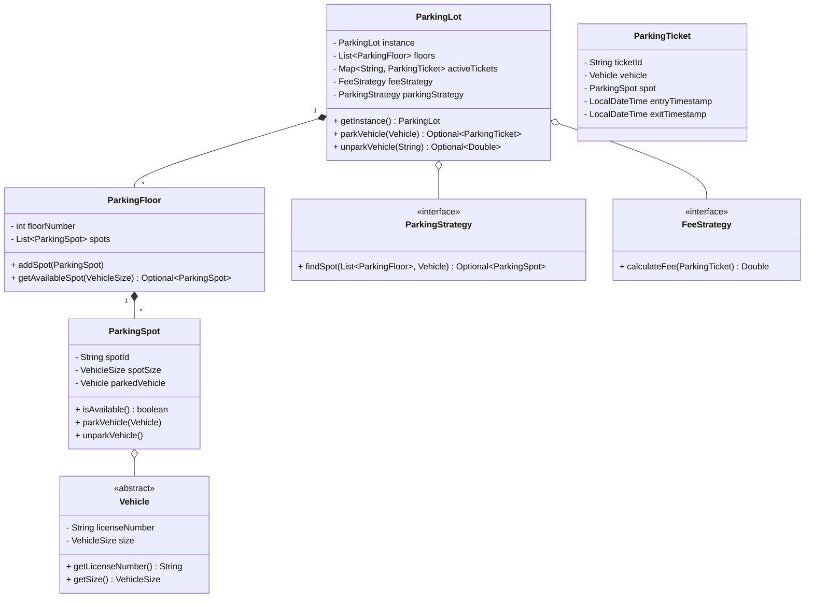
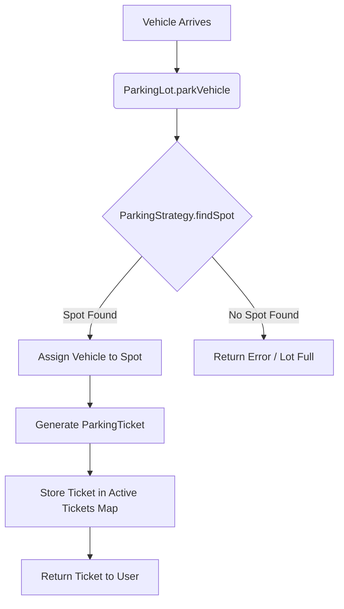
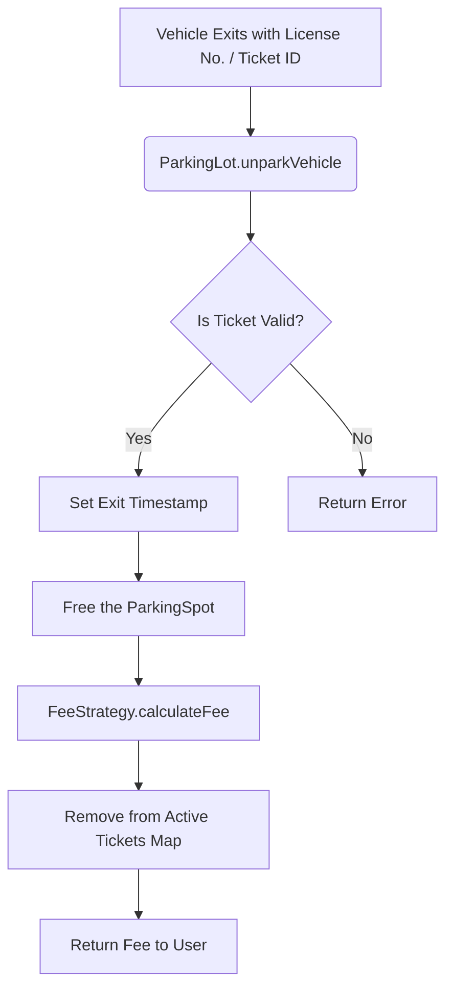

# Parking Lot Low-Level Design (LLD) - Microsoft SDE-2 Interview Guide

## 1. Problem Statement
Design a Parking Lot Management System that can handle the parking and unparking of vehicles. The parking lot consists of multiple floors, each containing various types of parking spots (e.g., Small, Medium, Large). The system should allocate an appropriate parking spot to a vehicle upon entry, issue a parking ticket, and calculate the parking fee upon exit.

---

## 2. Clarifying Requirements (Interview Perspective)
Before jumping into the class design, it is crucial to state your assumptions and clarify the scope with the interviewer:
*   **Scale:** Are there multiple parking lots or just one? *(Assumption: One parking lot for this scope, managed centrally).*
*   **Floors & Spots:** The lot has multiple floors. Each floor has spots categorized by vehicle sizes.
*   **Vehicle Types:** Two-wheelers (Bikes), Four-wheelers (Cars), Heavy vehicles (Trucks).
*   **Spot Allocation Strategy:** How do we assign a spot? Nearest first? Best fit? *(Assumption: We will use a Strategy Pattern to keep this extensible).*
*   **Fee Calculation Strategy:** Is it a flat rate, hourly rate, or based on the vehicle type? *(Assumption: We will use a Strategy Pattern for this as well).*

---

## 3. Core Entities & Attributes
Identifying the primary objects in our system:
*   **ParkingLot:** The central orchestrator. Contains a list of `ParkingFloor`s and manages active tickets.
*   **ParkingFloor:** Represents a single level. Contains a collection of `ParkingSpot`s.
*   **ParkingSpot:** Represents an individual space. Has a `VehicleSize` (Small, Medium, Large) and an availability state.
*   **Vehicle (Abstract):** Base class for vehicles. Extended by `Car`, `Bike`, and `Truck`. Each vehicle has a license plate and a required `VehicleSize`.
*   **ParkingTicket:** Issued on entry. Contains entry timestamp, vehicle details, and the assigned spot.

---

## 4. Design Principles & Patterns Used
For an SDE-2 role, demonstrating the use of SOLID principles and Design Patterns is critical:

*   **Singleton Pattern:** The `ParkingLot` itself is implemented as a Singleton (`getInstance()`). There should only be one central instance managing the state of the entire parking building in a single application run.
*   **Strategy Pattern (Crucial for SDE-2):**
    *   **Parking Strategy (`ParkingStrategy`):** Determines how a spot is found (e.g., `BestFitStrategy`, `NearestFirstStrategy`). The `ParkingLot` delegates the spot-finding logic to this strategy.
    *   **Fee Calculation Strategy (`FeeStrategy`):** Determines how the cost is calculated upon exit (e.g., `FlatRateFeeStrategy`, `VehicleBasedFeeStrategy`).
*   **Single Responsibility Principle (SRP):** Each class has one reason to change. `ParkingFloor` manages spots, `ParkingSpot` manages its own occupancy, and strategies handle specific algorithmic business logic.
*   **Open/Closed Principle (OCP):** The system is open for extension but closed for modification. If we need to add a new pricing model (e.g., dynamic surge pricing), we just create a new class implementing `FeeStrategy` without touching existing core code.

---

## 5. System Architecture & Class Diagram

---

## 6. Workflows (Flowcharts)

### 6.1. Parking a Vehicle (Entry)
When a vehicle arrives, the system needs to find an optimal spot, park the vehicle, and generate a ticket.

### 6.2. Unparking a Vehicle (Exit)
When a vehicle leaves, the system retrieves the ticket, frees the spot, and calculates the fee.

---

## 7. Interview Script: How to drive the conversation
Here is exactly how you should communicate this design to the interviewer:

1.  **Start High-Level:** "I'll start by defining the core entities. We have a `ParkingLot` which acts as the main facade. It contains multiple `ParkingFloor`s, and each floor has multiple `ParkingSpot`s. We also have `Vehicle` and `ParkingTicket`."
2.  **Discuss Extensibility Early (The SDE-2 differentiator):** "Since pricing rules and parking allocation logic can change frequently depending on the business requirements (e.g., adding VIP parking or weekend dynamic pricing), I will decouple these from the main logic using the **Strategy Pattern**. I've defined `ParkingStrategy` and `FeeStrategy` interfaces."
3.  **Walk Through the 'Park' Flow:** "When `parkVehicle()` is called on the `ParkingLot` Singleton, it delegates to the injected `ParkingStrategy` to find a spot. If a spot is found, it marks the `ParkingSpot` as occupied, generates a `ParkingTicket`, and stores it in a `ConcurrentHashMap` for O(1) fast retrieval during exit."
4.  **Walk Through the 'Unpark' Flow:** "During `unparkVehicle()`, we retrieve the ticket using the license plate or ticket ID, mark the underlying spot as free, and pass the ticket to the `FeeStrategy` to compute the final cost based on the entry and exit timestamps."
5.  **Address Concurrency (Bonus Points):** "In a real-world scenario, multiple entry gates might try to park vehicles simultaneously. We can use a `ConcurrentHashMap` for active tickets and ensure thread safety on spot allocation (e.g., using `synchronized` blocks on the floor/spot level or optimistic locking) to prevent double-booking a single spot."
