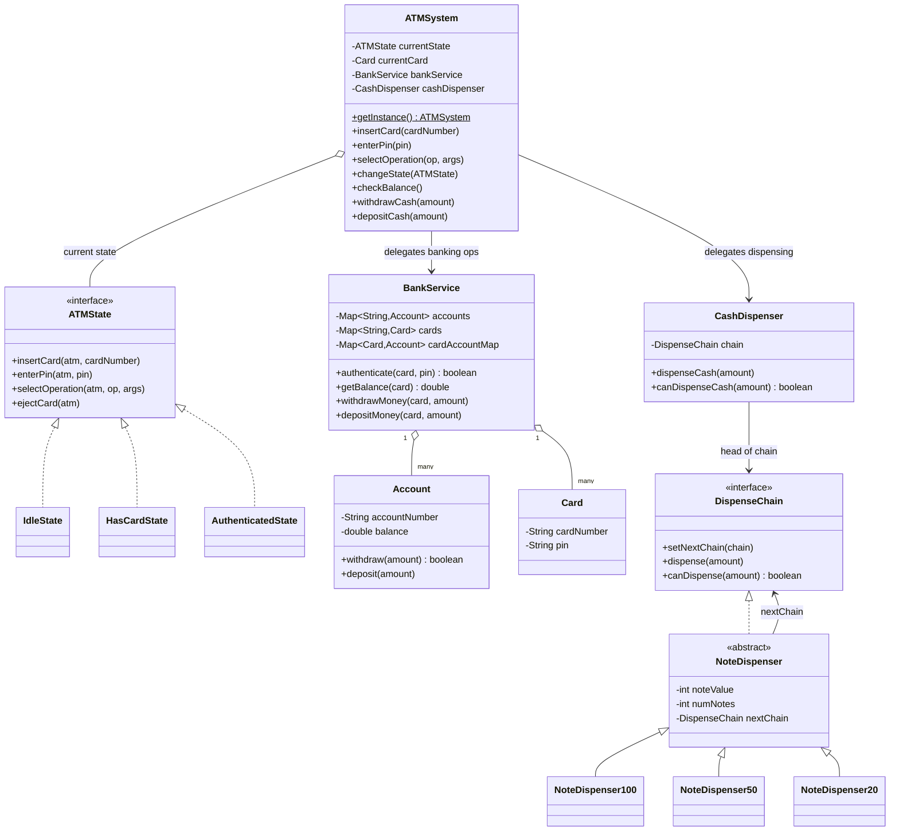
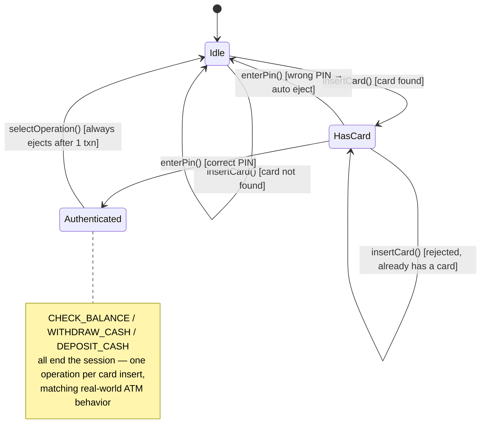
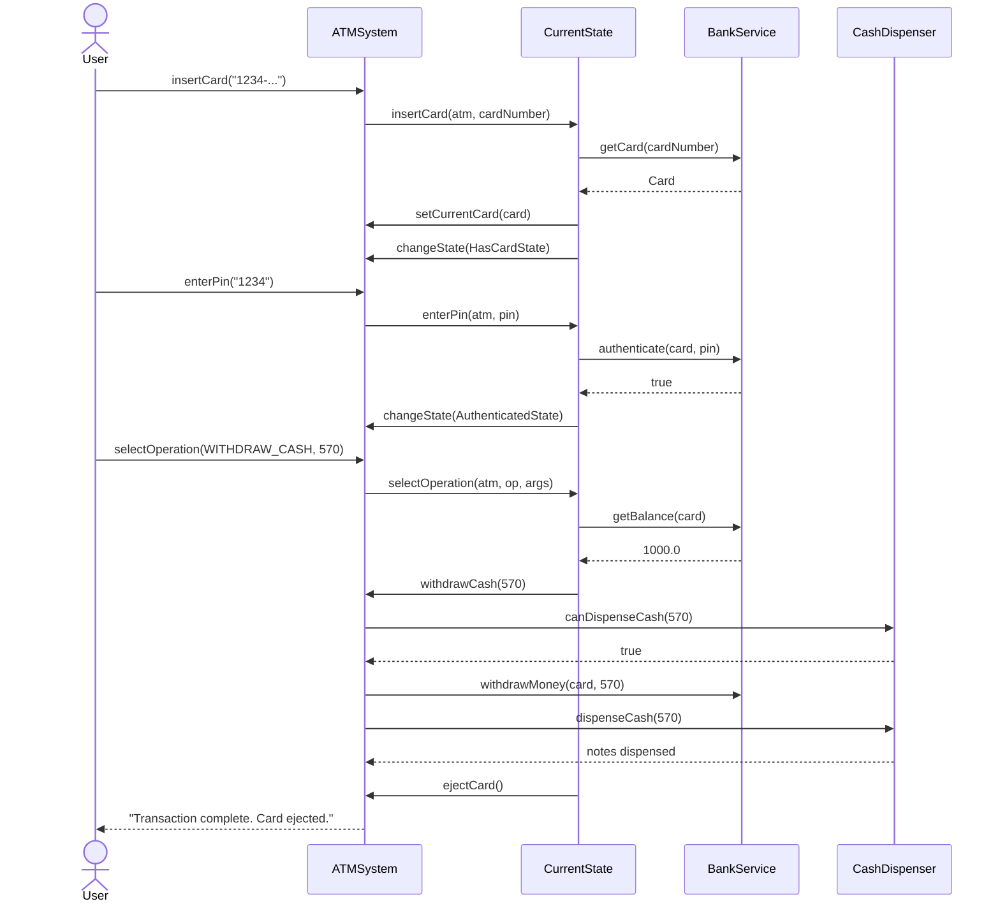
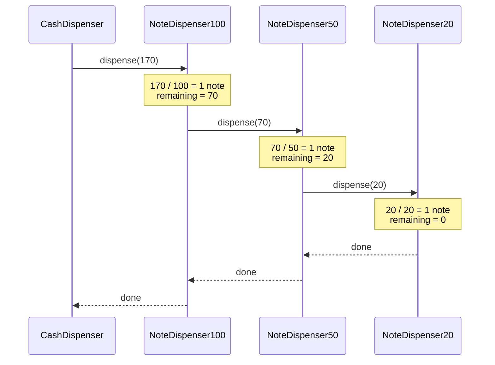
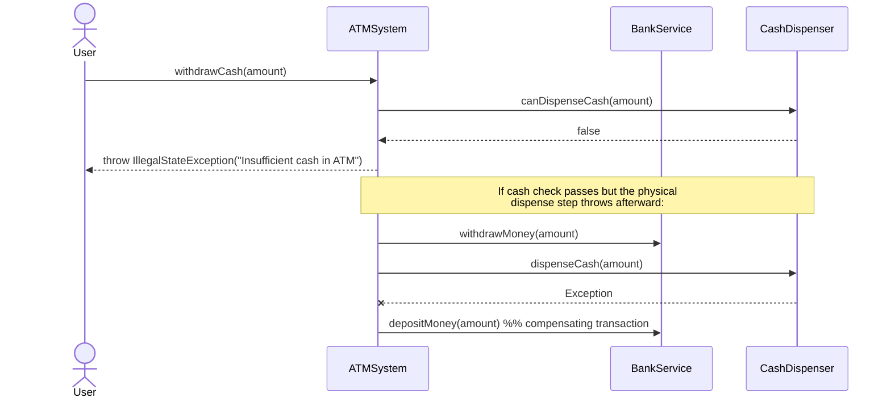

# ATM System — LLD Interview Preparation (Microsoft SDE-2)

> Reference implementation: [`atm/`](.) package — `ATMSystem`, `state/*`, `chainofresponsibility/*`, `entities/*`.

---

## 1. How to Open the Interview

When the interviewer says *"Design an ATM"*, don't start coding immediately. Spend the first 3-4 minutes clarifying scope out loud — this signals structured thinking, which matters more than the code itself at SDE-2 level.

### Questions to ask the interviewer

| Question | Why it matters |
|---|---|
| Is this a single physical ATM or a distributed network of ATMs? | Changes whether Singleton/in-memory state is even valid |
| What operations must it support? | Defines the interface surface (balance, withdraw, deposit, mini-statement...) |
| Does the ATM own the account data, or does it talk to a remote bank server? | Decides if we need a `BankService` abstraction (a "gateway") |
| Should cash be dispensed in specific denominations? | Signals a Chain of Responsibility / Strategy opportunity |
| Do we need to model hardware (card reader, cash slot, printer)? | Keep scope tight — usually interviewers want the **software control flow**, not hardware drivers |
| Is concurrency in scope (multiple withdrawals in parallel on shared cash inventory)? | Signals whether thread-safety discussion is expected |

### State the assumptions you'll design against
- One ATM machine = one `ATMSystem` instance (Singleton is defensible here because it's tied to one physical machine).
- The ATM is **stateful per session**: Idle → Card Inserted → Authenticated → back to Idle after one transaction.
- Cash is stored as a fixed inventory of note denominations ($100, $50, $20) inside the machine.
- A `BankService` acts as the external system of record for accounts/cards (in a real system this would be a remote call; here it's in-memory to keep the exercise focused on LLD).

---

## 2. Problem Statement (what you'd write on the whiteboard)

> Design the core software components of an ATM that allows a user to:
> 1. Insert a card
> 2. Enter a PIN and get authenticated
> 3. Perform exactly one of: **Check Balance**, **Withdraw Cash**, **Deposit Cash**
> 4. Get the card ejected automatically once the transaction finishes (or on error)
>
> The design must handle invalid PINs, insufficient balance, insufficient cash inventory in the machine, and must be easy to extend (new operations, new note denominations, new states) without rewriting existing code.

---

## 3. Functional & Non-Functional Requirements

**Functional**
- Insert card → validate card exists.
- Enter PIN → authenticate against the bank.
- Select operation → only allowed once authenticated.
- Withdraw → validate sufficient account balance **and** sufficient physical cash, then dispense using the fewest/highest-value notes possible.
- Deposit → credit the account.
- Auto-eject the card after a transaction completes or after an authentication failure.

**Non-Functional**
- **Extensibility**: adding a new operation or a new note denomination shouldn't touch existing classes (Open/Closed Principle).
- **Consistency**: never dispense cash without first debiting the account; never leave the account debited if the physical dispense fails (compensating action).
- **Thread-safety**: the shared cash inventory and account balance must not be corrupted under concurrent withdrawals.

---

## 4. High-Level Design — the Talk Track

Say this out loud, roughly in this order, while you sketch boxes on the whiteboard:

> "I'll split this into four responsibilities so each class has a single reason to change:
> 1. **`ATMSystem`** — the orchestrator / facade the client talks to. It doesn't contain business rules itself; it delegates to whichever *state* is currently active.
> 2. **State layer** (`ATMState` + `IdleState`, `HasCardState`, `AuthenticatedState`) — since the ATM's allowed actions change completely depending on where it is in the session lifecycle, I model this explicitly with the **State pattern** instead of a pile of boolean flags and if/else checks.
> 3. **`BankService` + `Account` + `Card`** — the 'bank side' of the world: authentication, balance, debit/credit. This is intentionally decoupled from the ATM so in a real system it could become a network call to a core-banking service without changing the ATM's state logic.
> 4. **Cash dispensing** (`CashDispenser` + `DispenseChain` + `NoteDispenser100/50/20`) — breaking a withdrawal amount into physical notes is a sequential 'try the biggest denomination, pass the remainder down' problem, which maps cleanly onto the **Chain of Responsibility pattern**."

---

## 5. Design Patterns Used (be ready to justify *why*, not just *what*)

### 5.1 State Pattern — session lifecycle
**Problem it solves:** Without this pattern, `ATMSystem` would need something like:
```java
if (state == IDLE) { ... } else if (state == HAS_CARD) { ... } else if (state == AUTHENTICATED) { ... }
```
repeated inside *every* method (`insertCard`, `enterPin`, `selectOperation`) — a combinatorial mess that violates Open/Closed (adding a new state means touching every method) and Single Responsibility (`ATMSystem` would own both orchestration and all state-transition rules).

**How it's implemented here:**
- `ATMState` interface declares `insertCard`, `enterPin`, `selectOperation`, `ejectCard`.
- `ATMSystem.insertCard/enterPin/selectOperation` simply forward to `currentState.xxx(this, ...)` — this is the **delegation** half of the pattern.
- Each concrete state implements *only the transitions valid from that state*, and prints/returns a friendly error for everything else:
  - `IdleState`: only `insertCard` does real work → looks up the card, moves to `HasCardState` (or stays Idle + error if card unknown).
  - `HasCardState`: only `enterPin` does real work → authenticates via `BankService`; success moves to `AuthenticatedState`, failure ejects the card back to `IdleState`.
  - `AuthenticatedState`: only `selectOperation` does real work → runs the requested operation, then **always ejects the card afterwards** (one operation per session, matching real ATMs).
- State transitions are triggered *by the state objects themselves* calling `atmSystem.changeState(new XState())` — this is a valid, common variant of the State pattern (some purists prefer the context to own transition logic, but letting states own their own transitions keeps `ATMSystem` completely free of `if` chains).

**Interview soundbite:** *"Each state class only needs to know about the transitions leading out of itself — this is Open/Closed in action. If I add a new state, say `BlockedState` after 3 failed PIN attempts, I add one new class and change `HasCardState.enterPin` to transition into it — nothing else in the codebase changes."*

### 5.2 Chain of Responsibility — cash dispensing
**Problem it solves:** Dispensing $170 needs to try $100 notes first, then $50, then $20, with each denomination handling what it can and forwarding the remainder — without one giant method that knows about every denomination and their ordering.

**How it's implemented here:**
- `DispenseChain` interface: `dispense(amount)`, `canDispense(amount)`, `setNextChain(...)`.
- Abstract `NoteDispenser` holds the shared logic (compute how many notes of *this* denomination to use, recurse into `nextChain` with the remainder).
- `NoteDispenser100`, `NoteDispenser50`, `NoteDispenser20` just fix the note value via their constructor — pure configuration, zero duplicated logic.
- `ATMSystem` wires the chain once, at construction: `100 → 50 → 20`.
- `CashDispenser` wraps the *head* of the chain and exposes `canDispenseCash` / `dispenseCash` to the rest of the system, so callers never need to know a chain exists at all (a small **Facade** on top of the chain).
- `canDispense` is checked *before* `dispense` is called (a dry-run pass), and it doesn't mutate note counts — this avoids partially dispensing cash and then discovering we can't fulfill the rest.

**Interview soundbite:** *"This is Chain of Responsibility, not Strategy, because multiple handlers can each contribute part of the answer in sequence — it's not 'pick exactly one handler', it's 'each handler does its part and passes along what's left.'"*

### 5.3 Singleton — one ATM, one system instance
- `ATMSystem` has a private constructor and a static `getInstance()`.
- Justified because an ATM maps to **one physical machine** with **one shared cash inventory** — there should never be two competing in-memory instances of "the machine."
- **Be upfront about the weakness if asked**: the current `getInstance()` is lazy but **not thread-safe** (no synchronization, no double-checked locking, no eager `static final` init). In a real interview, proactively say: *"For a single-threaded demo this is fine, but if `getInstance()` could be called concurrently during startup I'd switch to an eager `static final INSTANCE` field, or add double-checked locking with a `volatile` field."* Flagging this yourself shows depth.

### 5.4 Facade (implicit)
`ATMSystem` also acts as a **Facade** in front of `BankService` and `CashDispenser` — the state classes never touch `Account` or `DispenseChain` directly, they only call `atmSystem.withdrawCash(...)`, `atmSystem.checkBalance()`, etc. This keeps the state layer thin and testable.

### 5.5 SOLID Principles Recap (rapid-fire, good for a "which principles did you apply" follow-up)

| Principle | Where it shows up |
|---|---|
| **S**ingle Responsibility | `BankService` only knows banking; `CashDispenser` only knows dispensing; each `ATMState` only knows its own transitions |
| **O**pen/Closed | New note denomination = new `NoteDispenser` subclass, no edits to existing ones. New ATM state = new class implementing `ATMState` |
| **L**iskov Substitution | Any `NoteDispenser` subtype (`100/50/20`) is interchangeable wherever a `DispenseChain` is expected; any `ATMState` is interchangeable wherever `ATMState` is expected |
| **I**nterface Segregation | `ATMState` and `DispenseChain` are small, focused interfaces — no fat "god interface" with unrelated methods |
| **D**ependency Inversion | `ATMSystem` depends on the `ATMState` and `DispenseChain` **abstractions**, never on concrete state/dispenser classes directly (construction/wiring is the only place concrete types appear) |

---

## 6. Class Diagram



---

## 7. State Machine Diagram



---

## 8. Sequence Diagrams

### 8.1 End-to-end: insert card → PIN → withdraw



### 8.2 Chain of Responsibility: dispensing $170



### 8.3 Failure path: insufficient cash / compensating action



---

## 9. Mapping to the Actual Code

| File | Responsibility |
|---|---|
| `ATMSystem.java` | Singleton orchestrator/facade. Owns `currentState`, `currentCard`, `bankService`, `cashDispenser`. Wires the note-dispenser chain in its constructor |
| `state/ATMState.java` | State interface contract |
| `state/IdleState.java` | Only valid action: insert a valid card |
| `state/HasCardState.java` | Only valid action: authenticate with PIN |
| `state/AuthenticatedState.java` | Only valid action: perform exactly one operation, then eject |
| `entities/BankService.java` | In-memory "bank" — owns accounts/cards, authentication, debit/credit |
| `entities/Account.java` | Balance + thread-safe `withdraw`/`deposit` (synchronized methods) |
| `entities/Card.java` | Immutable value object: card number + PIN |
| `entities/CashDispenser.java` | Facade over the dispensing chain; validates amount is a multiple of $10 before even asking the chain |
| `chainofresponsibility/DispenseChain.java` | Chain contract |
| `chainofresponsibility/NoteDispenser.java` | Shared recursive dispensing logic (abstract) |
| `chainofresponsibility/NoteDispenser100/50/20.java` | Denomination-specific leaves — pure configuration |
| `enums/OperationType.java` | `CHECK_BALANCE`, `WITHDRAW_CASH`, `DEPOSIT_CASH` |

---

## 10. Concurrency Discussion (likely follow-up at SDE-2 level)

Be ready to reason about this even though the demo (`ATMDemo`) is single-threaded:

1. **`Account.withdraw`/`deposit`** are `synchronized` on the `Account` instance → two threads withdrawing from the *same account* can't corrupt the balance. Good.
2. **`NoteDispenser.dispense`/`canDispense`** are `synchronized` on each dispenser node → protects `numNotes` per denomination from concurrent corruption.
3. **Gap worth calling out proactively:** `ATMSystem.withdrawCash()` does *check-then-act* across two different locks (`cashDispenser.canDispenseCash` then, separately, `bankService.withdrawMoney` then `cashDispenser.dispenseCash`) without a single lock spanning the whole sequence. Between the `canDispenseCash` check and the actual `dispenseCash` call, another thread could drain the same notes — a classic **TOCTOU (time-of-check to time-of-use)** race.
   - **Fix to propose:** take a lock on `CashDispenser` (or a dedicated withdrawal lock) that spans "check → debit account → dispense" as one atomic critical section, or use a compare-and-swap style reservation (`reserve(amount)` that atomically decrements a counter and rolls back on dispense failure).
4. **`ATMSystem.getInstance()`** is not thread-safe (see Section 5.3) — mention this only if asked, don't over-index on it since a single ATM realistically has one control thread per session, but the *shared cash inventory* is the part that truly matters under concurrency (e.g., two people can't be inserting a card into the same physical machine at once, but the design should still be defensible if extended to, say, one ATM handling deposit + withdrawal on two card slots).

---

## 11. Edge Cases Already Handled

- Unknown card number → immediately ejected in `IdleState`.
- Wrong PIN → card ejected, back to `Idle` (no infinite retry loop — could extend with a retry counter / `BlockedState`).
- Withdrawal amount not a multiple of $10 → rejected by `CashDispenser.canDispenseCash` before touching the account.
- Withdrawal amount exceeds account balance → rejected in `AuthenticatedState` *before* touching the cash dispenser (fail fast, cheaper check first).
- Withdrawal amount exceeds physical cash available → rejected by the dispenser chain (`canDispenseCash` walks the whole chain).
- Dispense throwing mid-way after the account was already debited → compensating `depositMoney` call reverses the debit.
- Every operation, valid or invalid, ends the authenticated session (`ejectCard`) — mirrors a real ATM only allowing one transaction per card insertion.

## 12. Known Gaps / What I'd Improve (great material for "how would you improve this?")

- `ATMSystem.getInstance()` isn't thread-safe — needs `volatile` + double-checked locking or eager initialization.
- The withdraw flow has the TOCTOU race described in Section 10 — needs a single atomic critical section or a reservation/2-phase-commit style approach.
- Only supports **one operation per session**; a real ATM often lets you do balance check + withdrawal in the same session before ejecting — easy extension: don't eject in `AuthenticatedState` unless the user explicitly chooses "no more transactions."
- No retry-limit / card-blocking after N failed PIN attempts — would add a `pinAttempts` counter and a `BlockedState`.
- `Account.getCards()` returns a direct mutable reference to its internal map — minor encapsulation leak; should return an unmodifiable view.
- Amounts are mixed `int` (withdraw/deposit args) and `double` (account balance) — fine for whole-dollar demo, but a real system should use `BigDecimal`/integer minor-units (cents) to avoid floating point drift.
- `BankService` is in-memory; in production this becomes a client to an external core-banking API — the current interface (`authenticate`, `getBalance`, `withdrawMoney`, `depositMoney`) already forms a clean seam to swap the implementation without touching `ATMSystem` or the state classes (Dependency Inversion paying off).

---

## 13. If the Interviewer Asks "How Would You Extend This?"

| Extension | How the current design absorbs it |
|---|---|
| Add "Mini Statement" operation | Add a case in `AuthenticatedState.selectOperation` + a new `OperationType` enum value + a method on `ATMSystem`/`BankService`. No other class changes. |
| Add a $10 note denomination | Add `NoteDispenser10` extending `NoteDispenser`, link it at the end of the chain in `ATMSystem`'s constructor. Zero changes to existing dispensers. |
| Support multiple ATMs sharing one bank backend | `BankService` already models "the bank," independent of any single `ATMSystem` — instantiate one `BankService`, inject it into multiple `ATMSystem`-like machines (would need to relax the Singleton to a per-machine instance, injected rather than static). |
| Block card after 3 failed PIN attempts | Add a counter to `HasCardState` (or pass it through), transition to a new `BlockedState` implementing `ATMState` after the 3rd failure. |
| Persist transactions for audit | Add an `AuditLog`/`TransactionRepository` and call it from `ATMSystem.withdrawCash`/`depositCash`/`checkBalance` — Facade already centralizes these calls, so it's one seam, not scattered edits. |

---

## 14. 60-Second Summary (say this if asked to recap)

> "I modeled the ATM session lifecycle with the **State pattern** so allowed actions are enforced by which state object is active, rather than scattered conditionals. Cash dispensing is a **Chain of Responsibility** where each denomination handler dispenses what it can and forwards the remainder — this makes adding new denominations a zero-edit extension. The ATM itself is a **Singleton facade** in front of a `BankService` (accounts/cards/auth) and a `CashDispenser` (physical notes), keeping banking rules and hardware concerns fully decoupled from session/state logic. I've also identified the two weak points I'd fix next: the `getInstance()` isn't thread-safe, and there's a TOCTOU race between checking cash availability and actually dispensing it under concurrent withdrawals."
