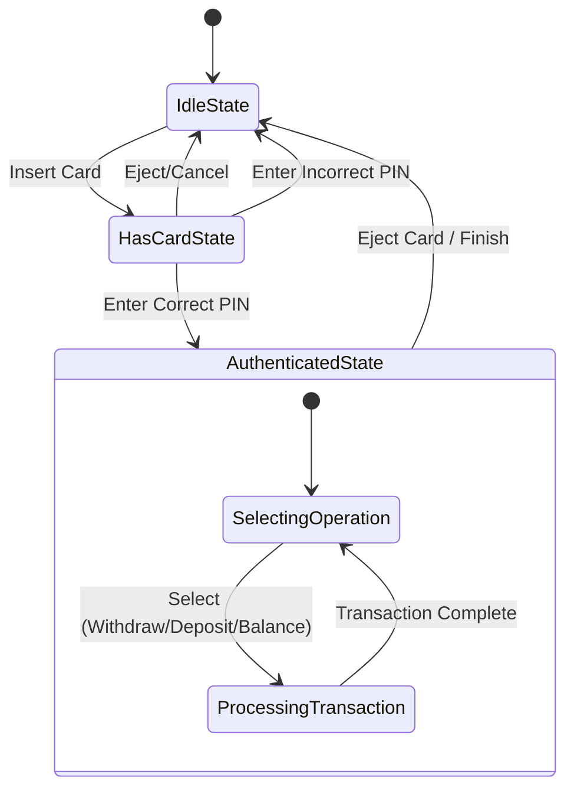
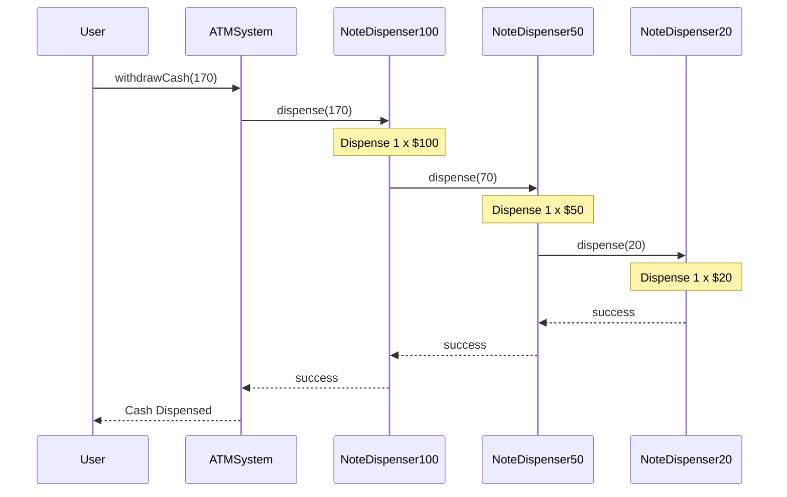

# ATM System Low-Level Design (LLD) - Interview Preparation

## 1. Problem Statement
**Interviewer:** Design a low-level architecture for an Automated Teller Machine (ATM) system. 

**Requirements to clarify (You should state these during the interview):**
*   **Users:** Can insert a card, enter a PIN, and perform operations like Check Balance, Withdraw Cash, and Deposit Cash.
*   **Hardware Components:** The ATM interacts with a Card Reader, Keypad, Screen, Cash Dispenser, and Cash Deposit Slot. 
*   **Stateful Nature:** The ATM goes through various states (e.g., Idle -> Has Card -> Authenticated -> Idle).
*   **Dispensing Logic:** Cash should be dispensed in available denominations (e.g., $100, $50, $20) starting from the highest.
*   **Backend System:** The ATM connects to a Bank Service to validate the card and process transactions securely.
*   **Concurrency:** Needs to handle concurrent withdrawals correctly without dispensing more than available balance.

## 2. Architectural Solution

To build a robust and extensible ATM system, I will decouple the responsibilities into clear entities and use design patterns to manage complexity. 

### Core Components
1.  **ATM System:** The central orchestrator that holds the current state, bank service, and cash dispenser.
2.  **State Management (State Pattern):** The ATM's behavior changes depending on its current state (Idle, Card Inserted, Authenticated).
3.  **Bank Service:** Acts as an interface to the backend. It handles account management, card authentication, and transaction processing.
4.  **Cash Dispenser (Chain of Responsibility Pattern):** Handles the logic of breaking down a withdrawal amount into available denominations.

## 3. Design Principles & Patterns Used

**1. State Design Pattern:**
*   **Why?** An ATM is fundamentally a state machine. The actions allowed depend on its state (e.g., you can't withdraw cash if you haven't inserted a card and entered a PIN).
*   **Implementation:** We define an `ATMState` interface with methods like `insertCard()`, `enterPin()`, and `selectOperation()`. Concrete classes like `IdleState`, `HasCardState`, and `AuthenticatedState` implement this interface. If an invalid action is performed for a given state (like inserting a card when one is already inserted), the state handles the error.

**2. Chain of Responsibility Pattern:**
*   **Why?** When withdrawing cash, the ATM needs to dispense notes in various denominations. We want to process the largest denominations first and pass the remaining amount to smaller denominations without hardcoding the logic in a single massive function.
*   **Implementation:** We create a `DispenseChain` interface. We implement it with `NoteDispenser100`, `NoteDispenser50`, and `NoteDispenser20`. If a user wants $170, the $100 dispenser gives one note and passes the remaining $70 to the $50 dispenser, which gives one note and passes $20 to the $20 dispenser.

**3. Singleton Pattern:**
*   **Why?** An ATM machine represents a single physical entity at a given location. There should only be one instance of the `ATMSystem` managing its hardware and state.
*   **Implementation:** The `ATMSystem` constructor is private, and access is provided via a `getInstance()` method.

## 4. Class Design

Here is how the core classes interact:

*   **`ATMSystem` (Singleton):** Holds references to the current `ATMState`, `BankService`, and `CashDispenser`.
*   **`BankService`:** Manages a collection of user `Account`s. It exposes methods for authentication, withdrawal, and deposits.
*   **`Card`:** Represents the user's physical card.
*   **`CashDispenser`:** Holds the root of the `DispenseChain` and tracks total cash available in the machine.

## 5. Flow Charts

### ATM State Machine Flow
This flowchart demonstrates how the ATM transitions between different states based on user interaction.

### Cash Dispensing Chain of Responsibility
This sequence shows how a withdrawal request (e.g., $170) is processed by the handlers.

## 6. Interview Delivery Strategy (How to explain this)

1.  **Start with the Big Picture:** "To design an ATM, I would view it as a finite state machine that coordinates with a backend banking service and a hardware cash dispenser."
2.  **Introduce the State Pattern:** "The most critical aspect is ensuring users can't perform actions out of order. I'll use the State Design Pattern. The ATM will start in an `IdleState`. Inserting a card moves it to `HasCardState`. Successful PIN entry moves it to `AuthenticatedState`. This eliminates complex `if-else` blocks in our main logic."
3.  **Explain Cash Dispensing:** "For cash withdrawal, the ATM needs to give out different notes. I'll use the Chain of Responsibility pattern. A $100 dispenser tries to fulfill the request, then passes the remainder to the $50 dispenser, and so on. This makes it very easy to add new denominations (like a $10 note) later without breaking existing code."
4.  **Mention Thread Safety:** "Since multiple ATMs could hit the `BankService` at the same time, I would ensure that account updates (debits/credits) in the backend are thread-safe, potentially using Atomic variables or concurrent collections."
5.  **Summarize:** "By isolating the state logic, decoupling the cash dispensing, and abstracting the backend service, this design is highly modular, easily testable, and robust against invalid user actions."
