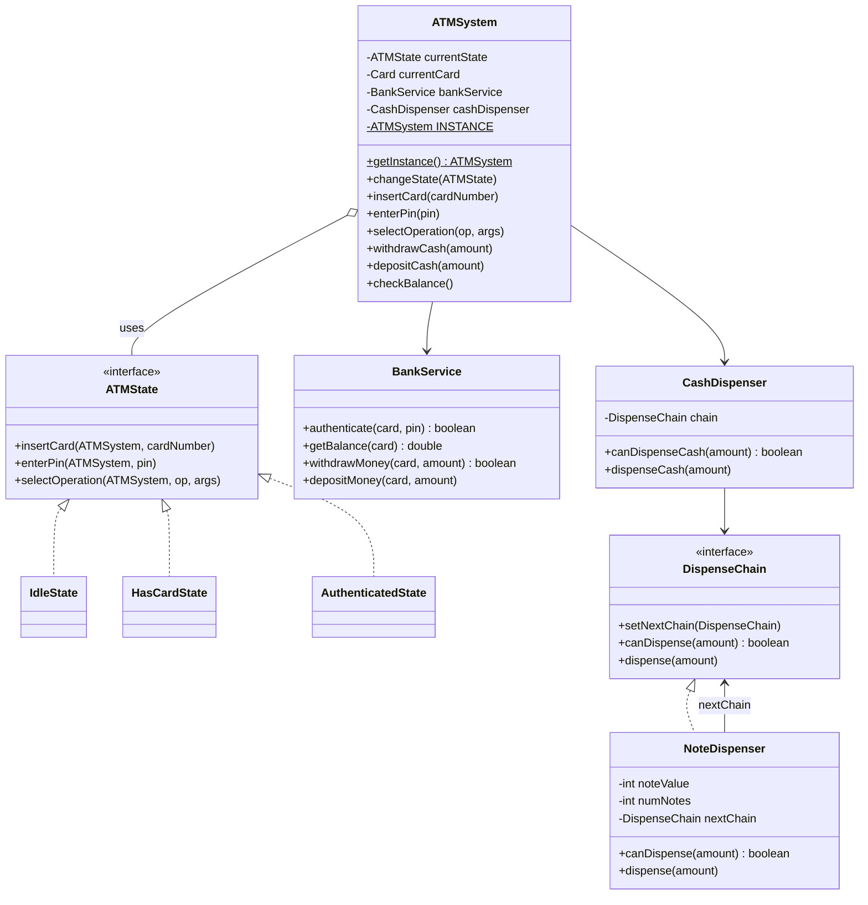
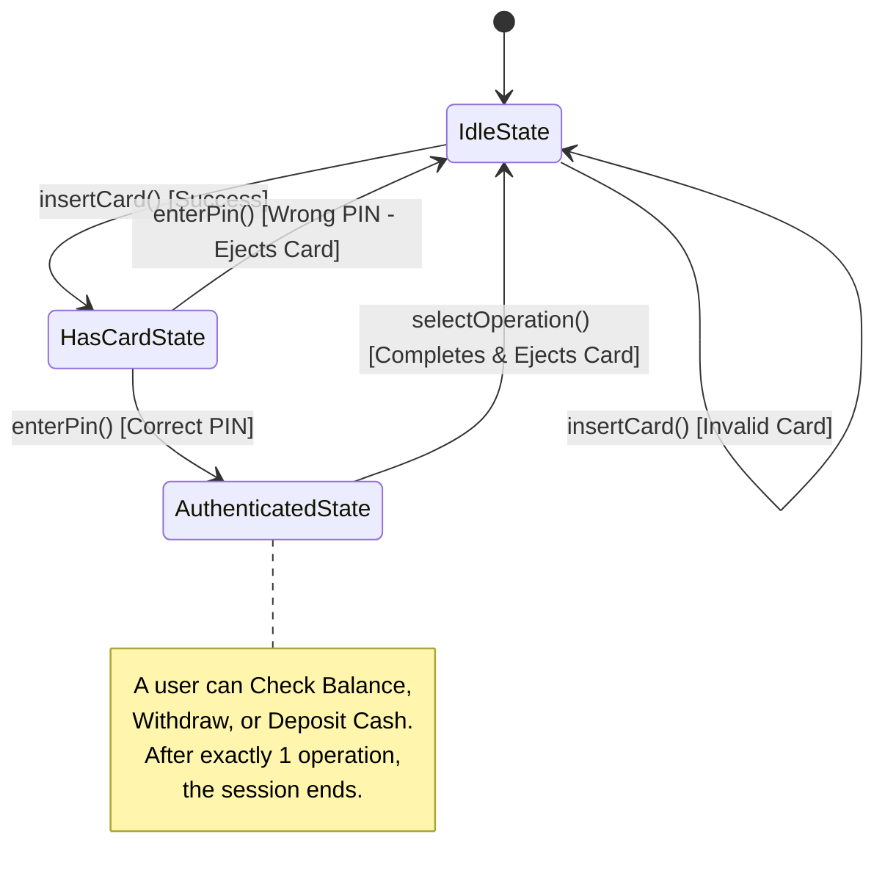
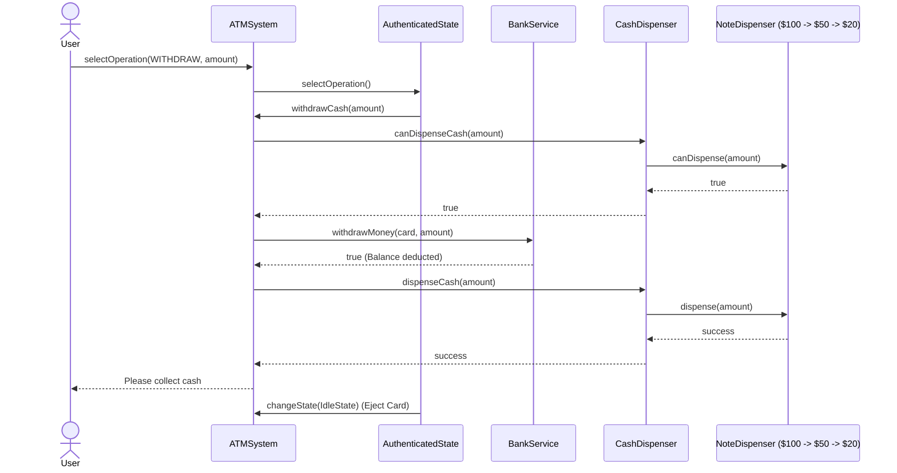
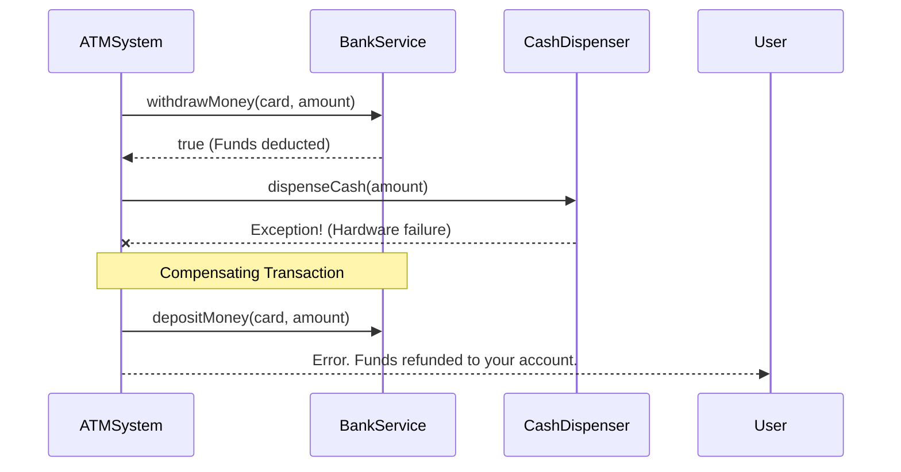

# ATM System — LLD Interview Preparation (Microsoft SDE-2)

> Reference implementation: [`atm/`](.) package — `ATMSystem`, `state/*`, `chainofresponsibility/*`, `entities/*`.

---

## 1. How to Open the Interview

When the interviewer says *"Design an ATM"*, don't start coding immediately. Spend the first 3-4 minutes clarifying
scope out loud — this signals structured thinking, which matters more than the code itself at SDE-2 level.

### Questions to ask the interviewer

| Question                                                                             | Why it matters                                                                                   |
|--------------------------------------------------------------------------------------|--------------------------------------------------------------------------------------------------|
| Is this a single physical ATM or a distributed network of ATMs?                      | Changes whether Singleton/in-memory state is even valid                                          |
| What operations must it support?                                                     | Defines the interface surface (balance, withdraw, deposit, mini-statement...)                    |
| Does the ATM own the account data, or does it talk to a remote bank server?          | Decides if we need a `BankService` abstraction (a "gateway")                                     |
| Should cash be dispensed in specific denominations?                                  | Signals a Chain of Responsibility / Strategy opportunity                                         |
| Do we need to model hardware (card reader, cash slot, printer)?                      | Keep scope tight — usually interviewers want the **software control flow**, not hardware drivers |
| Is concurrency in scope (multiple withdrawals in parallel on shared cash inventory)? | Signals whether thread-safety discussion is expected                                             |

### State the assumptions you'll design against

- One ATM machine = one `ATMSystem` instance (Singleton is defensible here because it's tied to one physical machine).
- The ATM is **stateful per session**: Idle → Card Inserted → Authenticated → back to Idle after one transaction.
- Cash is stored as a fixed inventory of note denominations ($100, $50, $20) inside the machine.
- A `BankService` acts as the external system of record for accounts/cards (in a real system this would be a remote
  call; here it's in-memory to keep the exercise focused on LLD).

---

## 2. Problem Statement (what you'd write on the whiteboard)

> Design the core software components of an ATM that allows a user to:
> 1. Insert a card
> 2. Enter a PIN and get authenticated
> 3. Perform exactly one of: **Check Balance**, **Withdraw Cash**, **Deposit Cash**
> 4. Get the card ejected automatically once the transaction finishes (or on error)
>
> The design must handle invalid PINs, insufficient balance, insufficient cash inventory in the machine, and must be
> easy to extend (new operations, new note denominations, new states) without rewriting existing code.

---

## 3 (a). Functional & Non-Functional Requirements

**Functional**

- Insert card → validate card exists.
- Enter PIN → authenticate against the bank.
- Select operation → only allowed once authenticated.
- Withdraw → validate sufficient account balance **and** sufficient physical cash, then dispense using the
  fewest/highest-value notes possible.
- Deposit → credit the account.
- Auto-eject the card after a transaction completes or after an authentication failure.

**Non-Functional**

- **Extensibility**: adding a new operation or a new note denomination shouldn't touch existing classes (Open/Closed
  Principle).
- **Consistency**: never dispense cash without first debiting the account; never leave the account debited if the
  physical dispense fails (compensating action).
- **Thread-safety**: the shared cash inventory and account balance must not be corrupted under concurrent withdrawals.

---

## 3 (b). High-Level Design — the Talk Track

Say this out loud, roughly in this order, while you sketch boxes on the whiteboard:

> "I'll split this into four responsibilities so each class has a single reason to change:
> 1. **`ATMSystem`** — the orchestrator / facade the client talks to. It doesn't contain business rules itself; it
     delegates to whichever *state* is currently active.
> 2. **State layer** (`ATMState` + `IdleState`, `HasCardState`, `AuthenticatedState`) — since the ATM's allowed actions
     change completely depending on where it is in the session lifecycle, I model this explicitly with the **State
     pattern** instead of a pile of boolean flags and if/else checks.
> 3. **`BankService` + `Account` + `Card`** — the 'bank side' of the world: authentication, balance, debit/credit. This
     is intentionally decoupled from the ATM so in a real system it could become a network call to a core-banking
     service without changing the ATM's state logic.
> 4. **Cash dispensing** (`CashDispenser` + `DispenseChain` + `NoteDispenser100/50/20`) — breaking a withdrawal amount
     into physical notes is a sequential 'try the biggest denomination, pass the remainder down' problem, which maps
     cleanly onto the **Chain of Responsibility pattern**."

---

## 4. Design Principles & Patterns Used

### 4.1 State Pattern (Managing the ATM Lifecycle)

**Why use it?** An ATM behaves completely differently depending on its current state. If it's idle, it shouldn't allow
you to withdraw cash. Using `if/else` checks for the state in every method makes the code messy and hard to extend.
**How it's used:** We define an `ATMState` interface. Concrete states (`IdleState`, `HasCardState`,
`AuthenticatedState`) implement only the actions valid in their specific state.

- *Benefit*: This follows the **Single Responsibility Principle** and **Open/Closed Principle**. Adding a new state
  (like `BlockedState`) is as simple as adding a new class.

### 4.2 Chain of Responsibility (Dispensing Cash)

**Why use it?** When a user withdraws $170, the system must try dispensing $100 notes first, pass the
remaining $70 to the $50 dispenser, and finally the $20 dispenser. **How it's used:** We use a `NoteDispenser` class
implementing `DispenseChain`. We link them together: `$100 -> $50 -> $20`. Each dispenser fulfills what it can and
passes the rest down the chain.

- *Benefit*: We can easily add a new $10 denomination just by configuring a new `NoteDispenser(10, count)` and hooking
  it to the chain, without modifying any dispensing logic.

### 4.3 Singleton Pattern (One ATM System)

**Why use it?** A single physical ATM machine should only have one software control instance running. **How it's used:**
`ATMSystem` is implemented as an eager, thread-safe Singleton
(`private static final ATMSystem INSTANCE = new ATMSystem();`).

### 4.4 SOLID Principles Highlight

- **S**ingle Responsibility: `CashDispenser` dispenses cash, `BankService` talks to the bank, states handle transition
  logic.
- **O**pen/Closed: New states or note denominations can be added without modifying existing core logic.
- **D**ependency Inversion: `ATMSystem` relies on the `ATMState` interface, not the concrete state implementations.

---

## 5. Class Diagram

Here is the structural blueprint of our ATM system.

```mermaid
classDiagram
    class ATMSystem {
        -ATMState currentState
        -Card currentCard
        -BankService bankService
        -CashDispenser cashDispenser
        -ATMSystem INSTANCE$
        +getInstance() ATMSystem$
        +changeState(ATMState)
        +insertCard(cardNumber)
        +enterPin(pin)
        +selectOperation(op, args)
        +withdrawCash(amount)
        +depositCash(amount)
        +checkBalance()
    }

    class ATMState {
        <<interface>>
        +insertCard(ATMSystem, cardNumber)
        +enterPin(ATMSystem, pin)
        +selectOperation(ATMSystem, op, args)
    }

    class IdleState
    class HasCardState
    class AuthenticatedState

    ATMState <|.. IdleState
    ATMState <|.. HasCardState
    ATMState <|.. AuthenticatedState
    ATMSystem o-- ATMState: uses

    class BankService {
        +authenticate(card, pin) boolean
        +getBalance(card) double
        +withdrawMoney(card, amount) boolean
        +depositMoney(card, amount)
    }

    class CashDispenser {
        -DispenseChain chain
        +canDispenseCash(amount) boolean
        +dispenseCash(amount)
    }

    class DispenseChain {
        <<interface>>
        +setNextChain(DispenseChain)
        +canDispense(amount) boolean
        +dispense(amount)
    }

    class NoteDispenser {
        -int noteValue
        -int numNotes
        -DispenseChain nextChain
        +canDispense(amount) boolean
        +dispense(amount)
    }

    DispenseChain <|.. NoteDispenser
    NoteDispenser --> DispenseChain: nextChain
    ATMSystem --> BankService
    ATMSystem --> CashDispenser
    CashDispenser --> DispenseChain
```

---

## 6. Flow Charts & Sequence Diagrams

### 6.1 State Machine Flow

This flowchart shows how the user progresses through the ATM session.

```mermaid
stateDiagram-v2
    [*] --> IdleState
    IdleState --> HasCardState: insertCard() [Success]
    IdleState --> IdleState: insertCard() [Invalid Card]
    HasCardState --> AuthenticatedState: enterPin() [Correct PIN]
    HasCardState --> IdleState: enterPin() [Wrong PIN - Ejects Card]
    AuthenticatedState --> IdleState: selectOperation() [Completes & Ejects Card]
    note right of AuthenticatedState
        A user can Check Balance,
        Withdraw, or Deposit Cash.
        After exactly 1 operation,
        the session ends.
    end note
```

### 6.2 Cash Withdrawal Sequence

Let's look at the most complex operation: Withdrawing Cash. This requires coordinating the Bank, the Cash Dispenser, and
ensuring consistency if something goes wrong.

```mermaid
sequenceDiagram
    actor User
    participant ATM as ATMSystem
    participant State as AuthenticatedState
    participant Bank as BankService
    participant Cash as CashDispenser
    participant Chain as NoteDispenser ($100 -> $50 -> $20)
    User ->> ATM: selectOperation(WITHDRAW, amount)
    ATM ->> State: selectOperation()
    State ->> ATM: withdrawCash(amount)
%% Dry run check for cash
    ATM ->> Cash: canDispenseCash(amount)
    Cash ->> Chain: canDispense(amount)
    Chain -->> Cash: true
    Cash -->> ATM: true
%% Bank deduction
    ATM ->> Bank: withdrawMoney(card, amount)
    Bank -->> ATM: true (Balance deducted)
%% Actual Dispense
    ATM ->> Cash: dispenseCash(amount)
    Cash ->> Chain: dispense(amount)
    Chain -->> Cash: success
    Cash -->> ATM: success
    ATM -->> User: Please collect cash
    State ->> ATM: changeState(IdleState) (Eject Card)
```

### 6.3 Handling Failures (Compensating Transaction)

What happens if the ATM deducts the money from the bank, but the physical cash dispenser jams?

```mermaid
sequenceDiagram
    participant ATM as ATMSystem
    participant Bank as BankService
    participant Cash as CashDispenser
    ATM ->> Bank: withdrawMoney(card, amount)
    Bank -->> ATM: true (Funds deducted)
    ATM ->> Cash: dispenseCash(amount)
    Cash --x ATM: Exception! (Hardware failure)
    Note over ATM, Bank: Compensating Transaction
    ATM ->> Bank: depositMoney(card, amount)
    ATM -->> User: Error. Funds refunded to your account.
```

*In the code, this is explicitly handled in a `try-catch` block inside `ATMSystem.withdrawCash`, which is an excellent
detail to mention in an interview to prove you think about fault tolerance.*

---

## 7. Key Code Walkthrough (Interview Talking Points)

1. **`ATMSystem.java`**: Notice how `withdrawCash` uses a "Check-then-Act" mechanism. It calls `canDispenseCash` (a dry
   run) before talking to the bank. Only if the bank confirms the deduction does it call `dispenseCash`. If
   `dispenseCash` throws an exception, it rolls back by depositing the money back into the bank.
2. **`NoteDispenser.java`**: This class perfectly implements the Chain of Responsibility. Instead of having $100, $50,
   and $20 classes, we just instantiate one class with different configs (`new NoteDispenser(100, 10)`). The
   `canDispense` logic uses backtracking to ensure exact amounts can be dispensed before committing to giving out the
   cash.
3. **Synchronization**: Methods like `withdrawMoney`, `depositMoney`, and `dispense` are `synchronized` to ensure thread
   safety if multiple transactions happen in the background or shared objects are accessed concurrently.

---

## 8. Handling Follow-up Questions

**Q1. How would you support a new operation, like "Change PIN"?**
*Answer:* I would add `CHANGE_PIN` to the `OperationType` enum. Then, inside `AuthenticatedState.selectOperation`, I'd
add a new case to handle it, calling a new method on `ATMSystem` which delegates to `BankService`. No other states or
classes need to change.

**Q2. What if we run out of $100 bills, but we have enough $50 bills to fulfill the request?**
*Answer:* The `NoteDispenser` chain handles this automatically.
The $100 dispenser will take as many as it can (0 in this case), and pass the entire remaining amount to the next chain (the $
50 dispenser), which will then process it.

**Q3. Is the Singleton `ATMSystem` thread-safe?**
*Answer:* Yes, we used static eager initialization (`private static final ATMSystem INSTANCE = new ATMSystem();`). This
is inherently thread-safe in Java.

**Q4. Are there any concurrency issues in `withdrawCash`?**
*Answer:* While methods are synchronized, the `withdrawCash` method itself does a check-then-act across multiple objects
(`canDispenseCash` -> `withdrawMoney` -> `dispenseCash`). If two threads processed a withdrawal simultaneously on the
same ATM, a race condition (Time-Of-Check to Time-Of-Use) could occur between checking cash inventory and dispensing it.
To fix this for a truly concurrent system, we would wrap the whole sequence in a distributed lock or an atomic critical
block.

---
