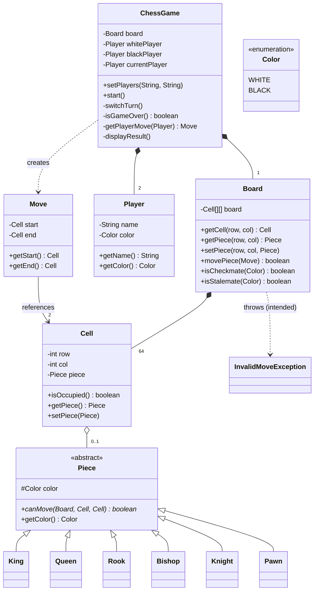
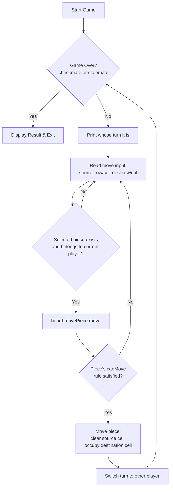
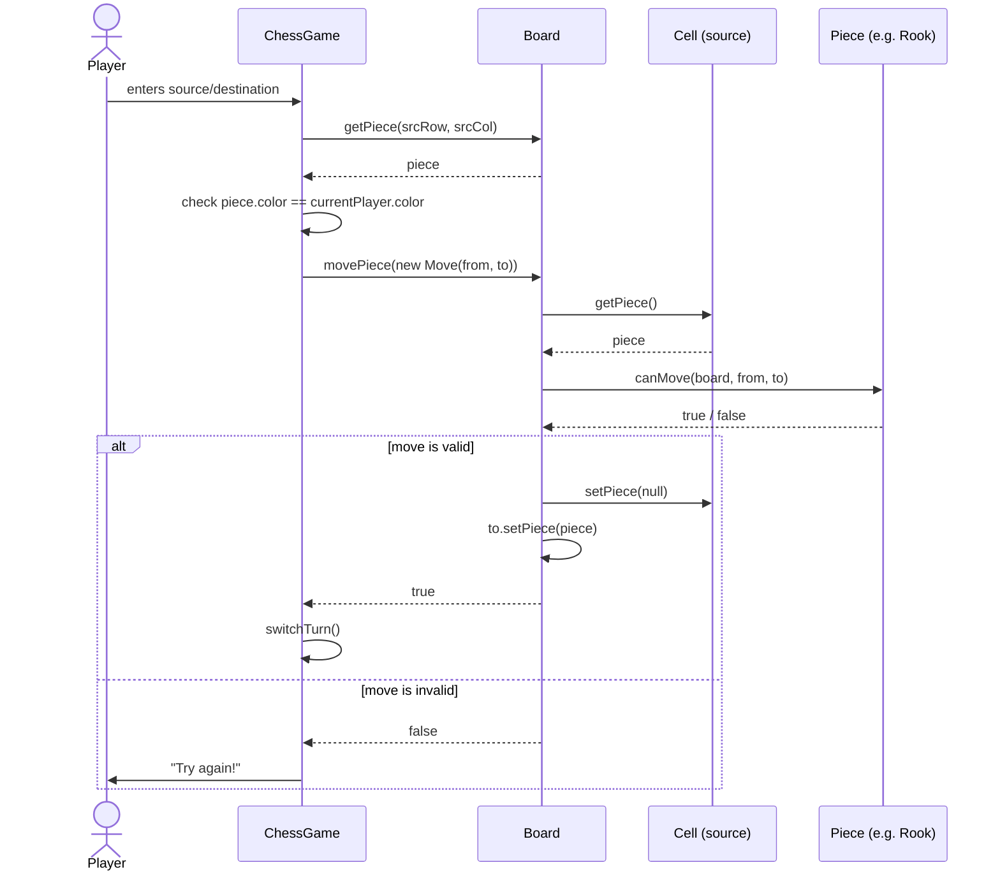

# Chess Game — Low Level Design (Interview Prep Guide)

> Goal of this doc: give you everything you need to *say out loud* in a Microsoft SDE-2 LLD round — problem framing, requirement gathering, class design, patterns, trade-offs, and the follow-up questions an interviewer will almost certainly throw at you.

---

## 1. How the Interviewer Will Open

> "Design a Chess Game. Two players should be able to play on a standard board, and the system should enforce chess rules."

That's it. It's intentionally vague — you are *expected* to ask clarifying questions before writing a single class. Jumping straight into code is the #1 way candidates lose points in LLD rounds.

---

## 2. Clarifying Questions (say these out loud first)

Asking these shows structured thinking — it's graded, not just filler:

1. Is this a **2-player, single-machine, turn-based** console/API game, or do I need networking / multiplayer over sockets? *(Assume single process, console-driven for this problem.)*
2. Do I need to implement **all** chess rules — castling, en passant, pawn promotion, check/checkmate/stalemate detection? *(Assume: core piece movement + turn management now; check/checkmate can be a stretch goal.)*
3. Do I need **move history / undo** or a **replay** feature?
4. Is there a **time control** (chess clock)?
5. Should the design be **extensible** for a future AI opponent or GUI?

Stating assumptions out loud (even if the interviewer doesn't answer) shows you know the scope is negotiable. For this solution, we assume: single process, console input, full piece movement rules, turn alternation, and check/checkmate/stalemate as **extension points** (explained in Section 12).

---

## 3. Requirements

### Functional
- Two players (White, Black), White moves first.
- Standard 8x8 board with all 6 piece types in starting positions.
- Each piece type follows its own movement rules.
- Players alternate turns; a player can only move their own pieces.
- Invalid moves are rejected without ending the game.
- Detect game-ending conditions: checkmate, stalemate.

### Non-functional
- **Extensible**: adding a new rule (castling, en passant) or a new player type (AI) shouldn't require rewriting existing classes.
- **Testable**: piece movement logic should be unit-testable in isolation from the game loop.
- Thread-safety isn't a hard requirement for a console game, but shouldn't be actively broken.

---

## 4. Identifying the Core Objects (noun extraction)

A classic LLD trick: underline the nouns in the problem statement, turn each into a candidate class.

| Noun | Becomes |
|---|---|
| Game | `ChessGame` (orchestrator) |
| Board | `Board` |
| Square/position | `Cell` |
| Player | `Player` |
| Piece (King, Queen, Rook, Bishop, Knight, Pawn) | `Piece` (abstract) + 6 subclasses |
| Move (from → to) | `Move` |
| Side | `Color` enum |
| Illegal action | `InvalidMoveException` |

This mapping *is* the design — walk the interviewer through it before touching code.

---

## 5. Class Diagram



**How to narrate this diagram in the interview:**
"`ChessGame` is the orchestrator — it owns a `Board` and two `Player`s, and drives the turn loop. `Board` owns a grid of `Cell`s. Each `Cell` optionally holds a `Piece`. `Piece` is abstract — each concrete piece (`Rook`, `Knight`, etc.) implements its own movement rule. This keeps `Board` completely ignorant of *how* any specific piece moves — it just asks the piece, 'can you make this move?'"

---

## 6. Class-by-Class Walkthrough

### `Color` (enum)
`WHITE`, `BLACK`. Trivial, but it removes magic strings/booleans from the rest of the code — every class that needs a side references this enum instead of a raw string or boolean `isWhite` flag (which doesn't scale if you ever add a third state, e.g. `NONE`).

### `Cell`
Holds `row`, `col`, and an optional `piece`. This is the single source of truth for "what occupies this square." Notice `Piece` doesn't know its own position — the `Cell` does. That's a deliberate ownership decision (see Section 8, Encapsulation).

### `Player`
Just a `name` + `Color`. Deliberately dumb — it holds identity, not behavior. This is what lets you later introduce an `AIPlayer` or `RemotePlayer` without touching `Player` itself (extension point — see Section 12).

### `Move`
An immutable value object: `start` cell + `end` cell. This is the **single unit of interaction** between `ChessGame` and `Board` — the entire "I want to do this" intent is captured in one object, instead of passing four raw ints (`srcRow, srcCol, dstRow, dstCol`) around. Easy to extend later (e.g. add a `promotionPiece` field for pawn promotion) without changing every method signature.

### `Piece` (abstract) + 6 subclasses
```java
public abstract class Piece {
    protected final Color color;
    public abstract boolean canMove(Board board, Cell from, Cell to);
    public Color getColor() { return color; }
}
```
Each subclass (`King`, `Queen`, `Rook`, `Bishop`, `Knight`, `Pawn`) implements `canMove()` with **only its own geometric rule**:

| Piece | Rule implemented |
|---|---|
| King | `\|Δrow\| ≤ 1` and `\|Δcol\| ≤ 1` |
| Queen | same row/col (straight) **or** `\|Δrow\| == \|Δcol\|` (diagonal) |
| Rook | same row **or** same col |
| Bishop | `\|Δrow\| == \|Δcol\|` |
| Knight | `(2,1)` or `(1,2)` L-shape |
| Pawn | 1 step forward; 2 steps from starting row; 1 diagonal step **only if capturing** |

The `Board` is passed into `canMove()` so a piece *can* look at board state if it needs to (e.g. `Pawn` needs to check if the diagonal target square is occupied, since pawns only capture diagonally).

### `Board`
Owns the `8x8` grid, initializes starting positions, and exposes `movePiece(Move)`:
```java
public synchronized boolean movePiece(Move move) {
    Cell from = move.getStart(), to = move.getEnd();
    Piece piece = from.getPiece();
    if (piece == null || !piece.canMove(this, from, to)) return false;
    to.setPiece(piece);
    from.setPiece(null);
    return true;
}
```
`Board` never asks "is this a Rook or a Knight?" — it just calls `piece.canMove(...)` and trusts the polymorphic dispatch to run the right rule. This is the crux of the design (see Strategy Pattern, Section 8).

### `ChessGame`
The orchestrator: owns the game loop, tracks `currentPlayer`, and switches turns. It is the *only* class that knows about console I/O — `Board`/`Piece`/`Cell` are pure game-state classes with zero I/O dependency, which makes them independently unit-testable.

### `InvalidMoveException`
An unchecked exception meant to signal illegal moves back up to the game loop so the player can be re-prompted, rather than crashing the whole program.

---

## 7. Design Principles & Patterns Used

### Strategy Pattern — the star of this design
Each `Piece` subclass is a **strategy** for "how do I validate a move for this piece type?" `Board.movePiece()` is the **context** — it holds a reference to a `Piece` and delegates the movement-validation algorithm to it, without knowing which concrete strategy it's talking to.

> **Why this matters in the interview:** if you didn't use this pattern, `Board.movePiece()` would need a giant `if (piece instanceof Rook) {...} else if (piece instanceof Bishop) {...}` chain. That violates Open/Closed (below) and is the #1 anti-pattern interviewers watch for in chess/piece-based LLD problems.

### Open/Closed Principle
Adding a brand-new piece (say, a custom "Archbishop" variant) only requires **adding a new `Piece` subclass** — zero changes to `Board`, `ChessGame`, or any existing piece class. The system is open for extension, closed for modification.

### Single Responsibility Principle
| Class | One job |
|---|---|
| `ChessGame` | Orchestrate turns and game flow |
| `Board` | Own board state, apply moves |
| `Piece` (+ subclasses) | Validate movement rules for one piece type |
| `Cell` | Hold position + occupant |
| `Player` | Hold identity |
| `Move` | Represent an intended action |

Each class has exactly one reason to change. If chess rules change for the Knight, you touch `Knight.java` only.

### Encapsulation
`Cell` hides its `piece` field behind `getPiece()`/`setPiece()`. `Board` hides its raw `Cell[][]` grid behind `getCell()`/`getPiece()`/`setPiece()` accessor methods rather than exposing the array directly — callers can't reach in and corrupt board state without going through `Board`'s API.

### Polymorphism
`piece.canMove(board, from, to)` is called on a `Piece` reference, but the JVM dispatches to whichever concrete subclass the object actually is at runtime. This is *what makes the Strategy Pattern work* in Java — worth explicitly naming both concepts (the pattern, and the OOP mechanism that implements it) in the interview.

### Composition over Inheritance
`ChessGame` **has-a** `Board` and **has-a** `Player` (not "is-a"). This is why `ChessGame` can be tested/reused without dragging in unrelated behavior — a hallmark of good LLD.

---

## 8. Flow: Overall Game Loop



---

## 9. Flow: Move Validation (Sequence Diagram)



---

## 10. How I'd Present This in the Interview (talk track)

1. **Restate the problem** and ask clarifying questions (Section 2). Don't skip this even under time pressure — it's graded.
2. **List core entities** via noun extraction (Section 4) — write them on the whiteboard/doc before any method signatures.
3. **Draw the class diagram** (Section 5) top-down: `ChessGame → Board → Cell → Piece`.
4. **Explain the Strategy Pattern decision explicitly**: "I made `Piece` abstract with a `canMove()` method so each piece type owns its own rule. This means `Board` never needs an `instanceof` chain, and adding a new piece variant doesn't touch existing code." — this sentence alone signals senior-level design thinking.
5. **Walk through one full move** end-to-end using the sequence diagram — this proves you understand the runtime behavior, not just the static structure.
6. **Proactively raise the current gaps** (Section 12) before the interviewer does — this is a strong signal of maturity ("I know what I didn't do, and here's why / here's how I'd do it with more time").
7. **Discuss extensibility** (Section 13) if time remains.

---

## 11. Piece Movement Rules — Quick Reference

| Piece | Move pattern | Captures |
|---|---|---|
| King | 1 square any direction | Same as move |
| Queen | Any straight line or diagonal, unlimited squares | Same as move |
| Rook | Straight line (row or column), unlimited squares | Same as move |
| Bishop | Diagonal, unlimited squares | Same as move |
| Knight | L-shape: (2,1) or (1,2) | Same as move (only piece that can jump over others) |
| Pawn | 1 forward (2 from start row); diagonal **only** to capture | Diagonal only, and only onto an occupied enemy square |

---

## 12. Known Gaps in the Current Implementation (be ready to discuss these!)

This is the **most important section** for interview credibility. This codebase is a good *skeleton*, but if an interviewer pokes at it with "what if I move my rook through another piece?", you should already know the answer. Calling these out yourself is a strength signal, not a weakness.

1. **No path-obstruction check for sliding pieces.** `Rook`, `Bishop`, and `Queen` only validate the *geometric shape* of the move (same row/col, or equal row/col delta) — they never check whether pieces sit in between `from` and `to`. As written, a Rook could "jump" over another piece.
   - **Fix:** in each sliding piece's `canMove()`, after the geometric check passes, step cell-by-cell from `from` toward `to` (using the row/col direction deltas) and return `false` if any intermediate cell is occupied.

2. **No self-capture prevention.** None of the `canMove()` implementations check whether the destination cell holds a piece of the *same* color. Nothing stops a player from "capturing" their own piece.
   - **Fix:** centralize this check in `Board.movePiece()` — before delegating to `piece.canMove()`, check `to.getPiece() == null || to.getPiece().getColor() != piece.getColor()`.

3. **Check / checkmate / stalemate are unimplemented stubs.** `Board.isCheckmate()` and `Board.isStalemate()` currently always `return false` — meaning the game loop's `isGameOver()` can never naturally end the game by these conditions.
   - **Fix:** `isCheck(Color)` = for the given color's King's cell, check whether *any* opposing piece's `canMove()` returns true for a move ending on the King's cell. `isCheckmate(Color)` = `isCheck(color)` is true **and** no legal move exists for that color that removes the check (requires simulating each candidate move on a scratch copy of the board). `isStalemate(Color)` = **not** in check, but no legal moves exist at all.

4. **`InvalidMoveException` is declared but never thrown.** `ChessGame.start()` catches it around `board.movePiece(move)`, but `movePiece()` just returns a `boolean` — it never actually throws. Practically, this means the `catch` block is dead code, and worse: the loop doesn't check the *returned* boolean, so **an invalid move still calls `switchTurn()`**, silently passing the turn to the opponent.
   - **Fix:** either make `Board.movePiece()` throw `InvalidMoveException` with a descriptive message instead of returning `false`, or (simpler) check the boolean return value in `ChessGame.start()` and only call `switchTurn()` when it's `true`.

5. **No turn ownership check inside `Board`.** Whose-turn-is-it validation currently only happens in `ChessGame.getPlayerMove()` (console path). If `Board.movePiece(Move)` were called directly (e.g. from a test, or a future API layer), nothing stops White from moving a Black piece.
   - **Fix:** pass the `currentPlayer`'s color into `movePiece`, or have `ChessGame` inject/verify it before delegating to `Board`.

6. **No castling, en passant, or pawn promotion.** Standard chess features not yet modeled.

7. **No move history.** Can't support undo/redo or PGN export without adding a `List<Move>` (or a dedicated `MoveHistory` class) tracked by `ChessGame` or `Board`.

---

## 13. How I'd Extend This Design

| Feature | Approach |
|---|---|
| **Check / Checkmate / Stalemate** | Add `isCheck(Color)` to `Board`: locate the King's `Cell`, loop over all opposing pieces, ask each `canMove(board, theirCell, kingCell)`. `Checkmate` = in check + no move resolves it (simulate-and-revert on a scratch board for every candidate move). |
| **Path obstruction** | Add a private helper `Board.isPathClear(from, to)` used by Rook/Bishop/Queen. |
| **Move history / Undo** | Add `MoveHistory` class holding a `Deque<Move>` (and captured piece per move) inside `ChessGame`; `undo()` pops and reverses the last move. |
| **Pawn promotion** | Extend `Move` with an optional `promotionPieceType`; `Board.movePiece()` replaces the pawn with the chosen piece when it reaches the back rank. |
| **Castling / En passant** | Track `hasMoved` state on King/Rook and `lastMove` on `Board`; add special-case handling in `movePiece()`. |
| **AI opponent** | Since `Player` only holds identity (not move-generation), introduce a `MoveStrategy` interface with `HumanMoveStrategy` (console) and `AIMoveStrategy` (minimax/alpha-beta) — `ChessGame` asks the strategy for a move instead of hardcoding `Scanner` reads. |
| **Networked multiplayer** | Swap the console I/O in `getPlayerMove()` for a network-backed `MoveStrategy` implementation — no change needed to `Board`/`Piece` at all, proving the separation of concerns pays off. |

---

## 14. Complexity Analysis

- **Space:** `O(1)` extra beyond the fixed 8x8 = 64-cell board (board size doesn't scale with input).
- **Single move validation:** `O(1)` for King/Knight/Pawn (fixed-size checks); `O(n)` for Rook/Bishop/Queen once path-obstruction is added (`n` ≤ 7, the max squares in one direction).
- **Checkmate detection (once implemented):** `O(p × m)` where `p` = number of that color's pieces (≤16) and `m` = average candidate destination squares per piece (≤27 for a queen) — each candidate move is simulated to check if it escapes check, so effectively `O(p × m × validationCost)`. Worth mentioning as the most expensive operation in the system if asked about performance.

---

## 15. Sample Q&A (rehearse these)

**Q: Why is `Piece` abstract instead of an interface?**
A: `Piece` has shared state (`color`) and a shared getter (`getColor()`), not just a shared contract. An abstract class lets me put that common implementation in one place instead of repeating `private Color color; public Color getColor()` in all 6 subclasses. If `Piece` had *zero* shared state, an interface would be the leaner choice.

**Q: Why does `canMove()` take the whole `Board`, not just the two cells?**
A: Some pieces need board context beyond their own start/end squares — e.g. `Pawn` needs to know if the diagonal target is occupied (it can only move diagonally when capturing), and a fully correct `Rook`/`Bishop`/`Queen` needs to inspect intermediate cells for obstructions. Passing the `Board` keeps `canMove()` self-sufficient without `Cell` needing a back-reference to `Board`.

**Q: How would you unit test this?**
A: `Piece` subclasses are pure functions of `(Board, Cell, Cell) → boolean` — construct a `Board`, place pieces via `setPiece()`, and assert `canMove()` results directly, with zero dependency on `ChessGame` or console I/O. That separation is exactly why `Board`/`Piece`/`Cell` don't know anything about `Scanner` or `System.out`.

**Q: What would you change for a multiplayer, networked version?**
A: Nothing in `Board`, `Piece`, or `Cell` — only `ChessGame.getPlayerMove()` (currently reading from `Scanner`) would be replaced with a network call. This is a direct payoff of keeping I/O isolated to the orchestrator class.

**Q: Is `synchronized` on `movePiece()` doing anything useful here?**
A: It prevents two threads from mutating the board concurrently (relevant if move input ever comes from multiple async sources, e.g. a network handler thread and a timeout thread). For a single-threaded console game it's a no-op safety measure — worth mentioning you'd remove it if profiling showed no concurrent access, per YAGNI, but it's cheap insurance for the multiplayer extension above.

---

## 16. 30-Second Summary (elevator pitch)

"I modeled Chess with `ChessGame` as the orchestrator owning a `Board` and two `Player`s. `Board` is an 8x8 grid of `Cell`s, each optionally holding a `Piece`. `Piece` is abstract, and each concrete piece — King, Queen, Rook, Bishop, Knight, Pawn — implements its own `canMove()` rule, which is a Strategy Pattern: `Board` just delegates to `piece.canMove()` without needing to know which piece it's dealing with. This keeps the design Open/Closed — new pieces or rule variants slot in without touching existing classes — and keeps game logic completely decoupled from I/O, so it's independently testable and easy to extend toward check/checkmate detection, undo, or an AI opponent."
