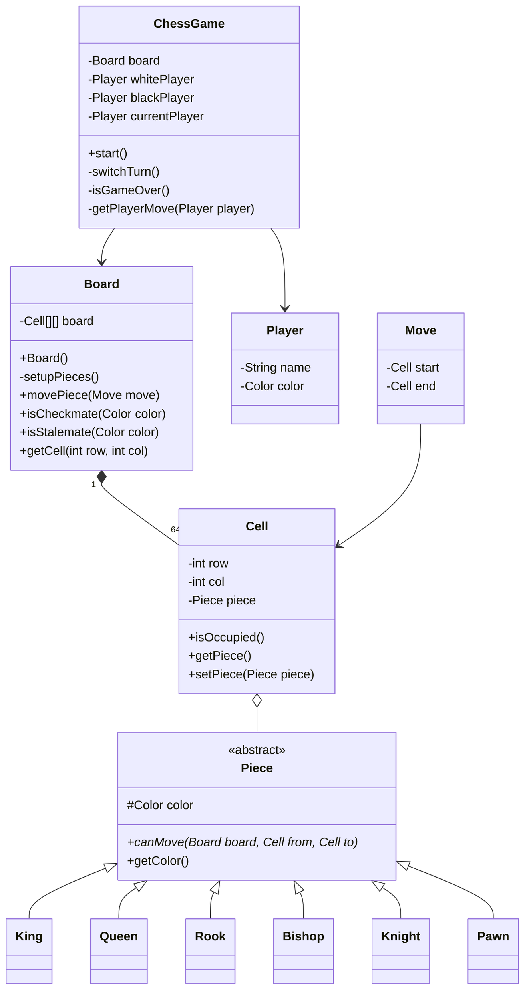
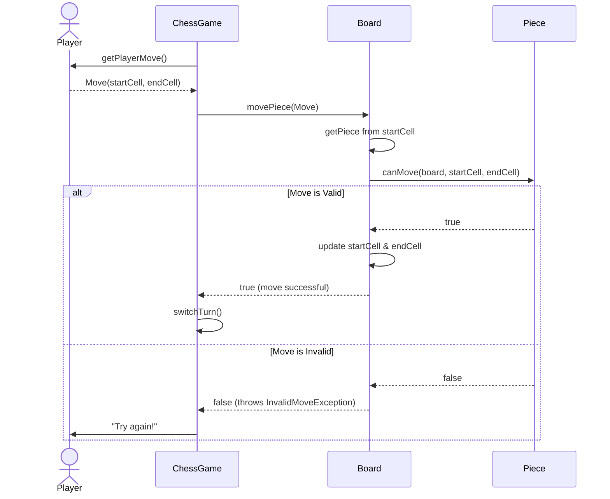

# Chess Game - Low Level Design (LLD)

This document outlines the low-level design for a complete Chess Game, tailored for a Microsoft SDE-2 interview. It covers the problem statement, class structures, core design principles used, flow diagrams, and a conversational script on how to explain this in an interview setting.

## 1. Problem Statement

Design a low-level architecture for a classic two-player Chess game. The system must support the following:
*   **The Board:** An 8x8 grid with 64 squares.
*   **The Players:** Two players, White and Black, taking alternating turns.
*   **The Pieces:** 16 pieces per player initially (King, Queen, 2 Rooks, 2 Knights, 2 Bishops, 8 Pawns).
*   **Movement Rules:** Each piece has specific movement capabilities. The system must validate moves.
*   **Game State:** The game must track turns and detect terminal states like Checkmate or Stalemate.

## 2. Core Entities & Class Design

Here is how we break down the problem into logical objects.

*   **`ChessGame`**: The central controller. It manages the game loop, keeps track of the players (`whitePlayer`, `blackPlayer`), the `currentPlayer`, and the `Board`.
*   **`Board`**: Represents the physical chessboard. It encapsulates an 8x8 2D array of `Cell` objects and is responsible for setting up the initial pieces and executing moves safely.
*   **`Cell`**: Represents a specific square on the board. It stores its `row` and `col` coordinates and holds a reference to the `Piece` currently occupying it.
*   **`Piece` (Abstract)**: The base class for all chess pieces. It holds the piece's `Color` and defines an abstract method `canMove(Board board, Cell from, Cell to)`.
*   **Concrete Pieces (`King`, `Queen`, `Rook`, `Bishop`, `Knight`, `Pawn`)**: These extend the `Piece` class and implement the `canMove()` logic specific to their rules.
*   **`Player`**: Represents a person playing the game, containing their `name` and chosen `Color`.
*   **`Move`**: A simple Data Transfer Object (DTO) that captures a move attempt, containing the `start` Cell and `end` Cell.
*   **`Color`**: An Enum (`WHITE`, `BLACK`) to differentiate sides.

## 3. Design Principles & Patterns

The design heavily relies on core **Object-Oriented Design (OOD)** principles:

1.  **Strategy Pattern (Implicit):** The `Piece` class hierarchy effectively acts as a Strategy pattern. The `Board` doesn't need to know *how* a Knight or a Bishop moves. It simply calls `piece.canMove()`. The specific piece provides the strategy for validating its move.
2.  **Open/Closed Principle (OCP):** If we wanted to introduce a new fairy chess piece (e.g., an "Archbishop"), we would simply create a new class extending `Piece` and implement its movement rules. We wouldn't need to touch the `Board` or `ChessGame` logic.
3.  **Single Responsibility Principle (SRP):**
    *   `ChessGame` handles game flow and turns.
    *   `Board` handles the spatial grid and piece positioning.
    *   `Piece` handles its own movement validation rules.

## 4. Architecture Flow Diagram

## 5. Execution Flow

Here is how a single turn is processed:

## 6. How to Explain this in an Interview (The Pitch)

**Introduction:**
> "To design the Chess game, I focused on creating a highly modular and extensible object-oriented system. The core orchestrator of the system is the `ChessGame` class, which is responsible for managing the players, tracking turns, and maintaining the main game loop."

**The Grid System:**
> "The state of the physical game is encapsulated within the `Board` class. Instead of dealing with raw arrays and complex piece-tracking, I designed the `Board` to hold an 8x8 2D array of `Cell` objects. A `Cell` is simply a container that holds its own coordinates and a reference to the `Piece` currently sitting on it. This separation makes it very easy to query the state of any specific square."

**Movement & Strategy Pattern:**
> "The most complex part of chess is validating moves, as every piece behaves differently. To solve this cleanly, I utilized an implicit Strategy Pattern. I created an abstract `Piece` base class with an abstract `canMove(Board, startCell, endCell)` method. Every specific piece, like `King` or `Knight`, inherits from `Piece` and implements its own mathematical logic to determine if a move is valid."

> "Because of this, the `Board` class remains completely agnostic to the rules of chess. When a player makes a move, the `Board` simply asks the piece: *'Can you move here?'*. This strongly adheres to the **Open/Closed Principle**. If we wanted to invent a new piece, we just add a new class without rewriting any existing board logic."

**Concurrency (Bonus Points):**
> "If we were to expose this as a backend service where multiple requests might try to modify the board state concurrently, I've marked the `movePiece()` method in the `Board` class as `synchronized`. This ensures that only one move is processed at a time, preventing race conditions where two threads might try to move pieces into the same cell simultaneously."
