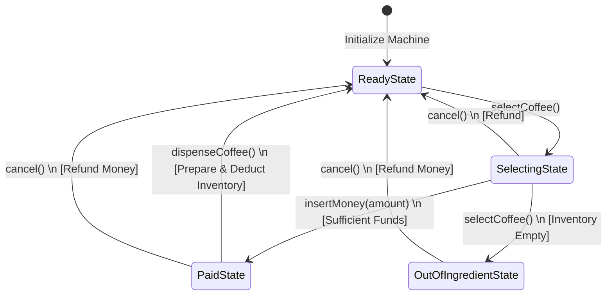
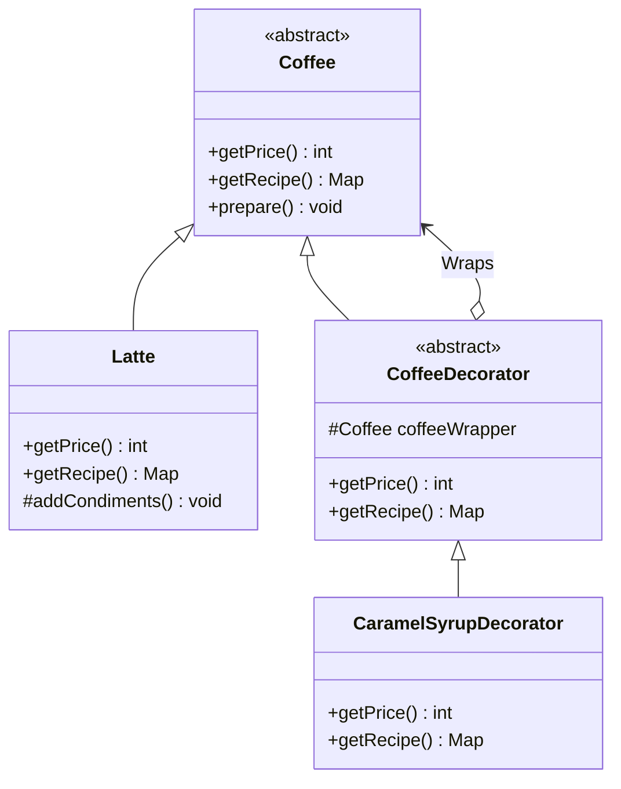

# Coffee Vending Machine - Low Level Design (LLD)

This document provides a comprehensive, interview-ready explanation for the Low-Level Design of a **Coffee Vending Machine**. It is structured to help you articulate your thought process clearly during a Microsoft SDE-2 interview.

---

## 1. Problem Statement

We need to design a smart Coffee Vending Machine with the following capabilities:
1. **Multiple Coffee Types:** The machine should dispense various coffee types (e.g., Espresso, Latte, Cappuccino).
2. **Customizations/Add-ons:** Users should be able to customize their drinks with toppings (e.g., Extra Sugar, Caramel Syrup).
3. **Dynamic Pricing & Ingredients:** The total price and the required ingredients should be dynamically calculated based on the base coffee and the selected customizations.
4. **Inventory Management:** The machine needs to manage an internal inventory of ingredients (Water, Milk, Coffee Beans, Sugar, Syrup) and deduct them accurately upon purchase. It should reject orders if ingredients are insufficient.
5. **Payment & Lifecycle:** The machine must handle a transaction lifecycle: selecting a coffee, inserting money, dispensing the coffee (or refunding if cancelled/insufficient funds).

---

## 2. Interview Approach & Design Principles

When explaining your design to the interviewer, follow a structured approach: start with the core entities, identify the complexities, and then introduce Design Patterns to solve them.

### Design Patterns Applied:

1. **Decorator Pattern (The Star of the Show)**
   - **Why:** Coffee customizations (Extra Sugar, Syrup) are dynamic and optional. If we use inheritance, we would end up with a class explosion (e.g., `LatteWithSugar`, `LatteWithSugarAndSyrup`). 
   - **How:** We treat `Coffee` as our base component. Customizations are decorators (`ExtraSugarDecorator`, `CaramelSyrupDecorator`) that wrap the base coffee object. This allows us to calculate the final price and combine the ingredient requirements seamlessly.

2. **State Pattern**
   - **Why:** A vending machine goes through distinct states (Ready, Selecting, Paid, Out of Ingredients). Hardcoding `if-else` blocks for every action (`insertMoney()`, `dispenseCoffee()`) based on current state leads to messy, unmaintainable code.
   - **How:** We define a `VendingMachineState` interface. Each state (`ReadyState`, `SelectingState`, `PaidState`, `OutOfIngredientState`) implements this interface, defining exactly how the machine behaves in that specific state.

3. **Singleton Pattern**
   - **Why:** The physical vending machine and its internal inventory represent a single source of truth.
   - **How:** We make `CoffeeVendingMachine` and `Inventory` classes Singletons to prevent multiple instances from causing inconsistent stock balances or state conflicts.

4. **Factory Pattern**
   - **Why:** We want to decouple the object creation logic from the main application.
   - **How:** `CoffeeFactory` takes an enum (`CoffeeType`) and returns the appropriate base `Coffee` instance (Espresso, Latte, etc.).

5. **Template Method Pattern**
   - **Why:** The process of making coffee has a standard algorithm, but certain steps vary by coffee type.
   - **How:** The base `Coffee` class has a `prepare()` method that defines the skeleton (Grind beans -> Brew -> **Add Condiments** -> Pour). The `addCondiments()` step is an abstract hook that subclasses (like `Latte`) implement specifically (e.g., adding steamed milk).

---

## 3. Flow Charts & Visuals

Drawing these out or explaining them clearly will earn you extra points in the interview.

### A. Vending Machine State Lifecycle

This diagram demonstrates how the machine transitions between different operational states based on user actions.

### B. Decorator Pattern Diagram for Coffee

This shows how toppings wrap the base coffee to build up the price and recipe dynamically.

---

## 4. How to Drive the Interview Narrative

1. **Start with the Core Data Structures:** Explain that the `Inventory` will be backed by a thread-safe `ConcurrentHashMap<Ingredient, Integer>` to map ingredients to their available quantities. Mention thread safety explicitly—interviewers love that for SDE-2.
2. **Explain the Product Creation:** Talk about how a user request comes in. "When a user asks for a Latte with Caramel Syrup, the `CoffeeFactory` creates the base `Latte`. We then wrap it inside a `CaramelSyrupDecorator`."
3. **Explain the Pricing and Recipe resolution:** "Because of the Decorator pattern, calling `wrappedCoffee.getPrice()` delegates down the chain. The Syrup adds 30 cents to the Latte's 2.20 base price. Similarly, `getRecipe()` merges the ingredient maps."
4. **Walk through a Transaction (The State Machine):** 
   - We are in `ReadyState`. 
   - User selects coffee -> Transition to `SelectingState`.
   - The machine verifies if `Inventory.hasIngredients(wrappedCoffee.getRecipe())`. If no, go to `OutOfIngredientState`.
   - User inserts money -> Transition to `PaidState`.
   - Dispense -> Call `Inventory.deductIngredients()`, call `wrappedCoffee.prepare()`, reset money, and transition back to `ReadyState`.

## 5. Potential Follow-up Questions from Interviewer

* **Q: How would you handle concurrent users trying to buy the last cup of coffee simultaneously?**
  * **Answer:** Explain that the `Inventory` methods (specifically the deduction logic) must be `synchronized` or use atomic operations. While we use a `ConcurrentHashMap` for reading, checking the balance and deducting it must be an atomic transaction to avoid race conditions.

* **Q: What if we want to add a new topping, say, Vanilla Extract?**
  * **Answer:** Thanks to the Decorator Pattern, we do not modify existing code (Open/Closed Principle). We simply create a new `VanillaExtractDecorator` class extending `CoffeeDecorator`, defining its specific price and ingredient requirements.

* **Q: How does the system handle an aborted transaction?**
  * **Answer:** Because we use the State pattern, calling `cancel()` in the `SelectingState` or `PaidState` handles the refund logic specific to that state (e.g., returning the exact `moneyInserted`) and resets the machine back to `ReadyState`.
