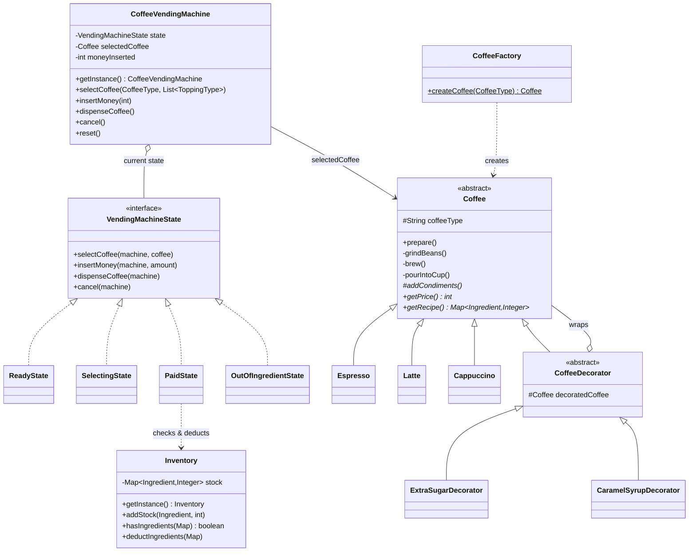
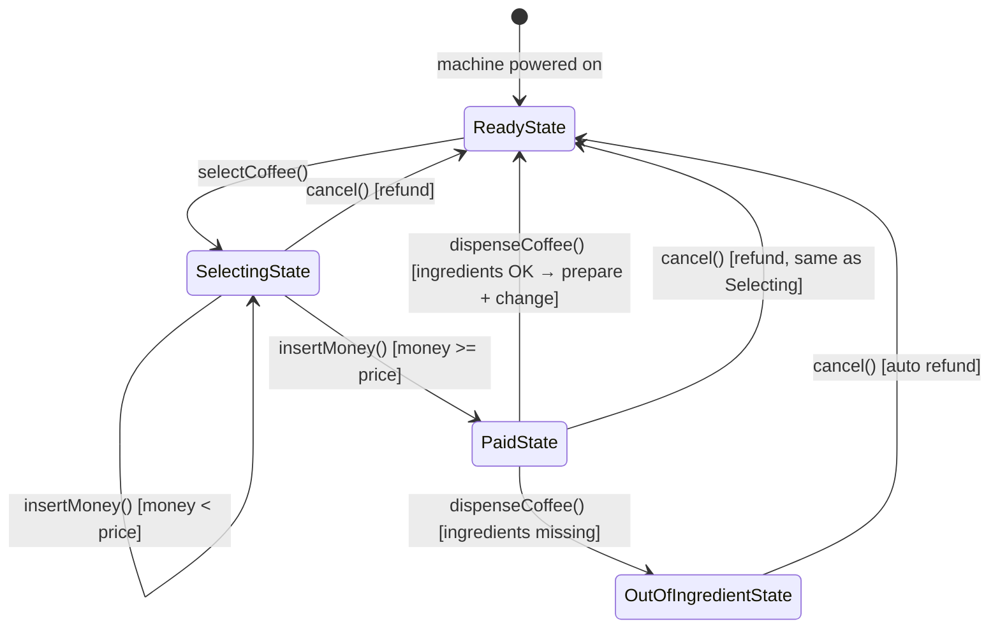
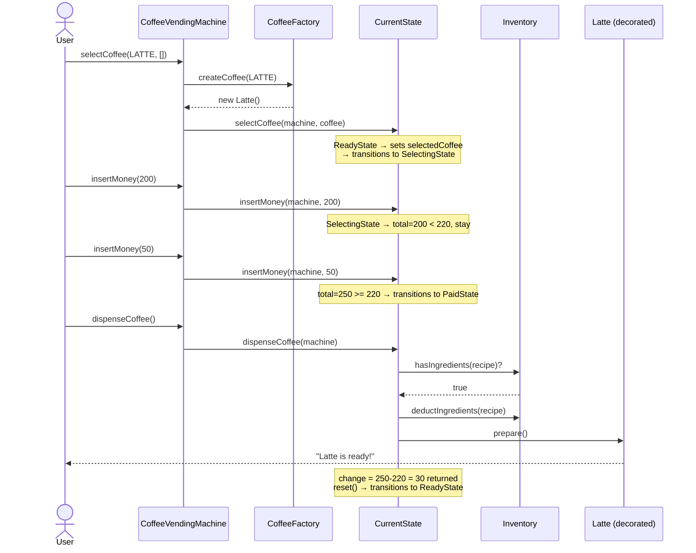
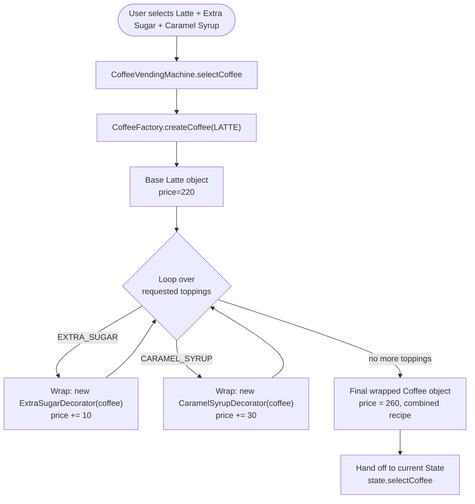

# Coffee Vending Machine — LLD Interview Guide (Microsoft SDE-2)

> Goal of this doc: give you everything you need to *say out loud* in a 45-minute LLD interview — problem framing, clarifying questions, design reasoning, diagrams, and answers to likely follow-ups. Read it like a script, not a reference manual.

---

## 1. Problem Statement

**As the interviewer might phrase it:**
> "Design a coffee vending machine. It should support multiple coffee types, let users pick add-ons/toppings, accept money, and dispense coffee only if there's enough stock and enough money. Handle edge cases like cancellation and running out of ingredients."

This is a classic **object-oriented design (OOD)** question. The interviewer isn't testing whether you can build hardware — they're testing whether you can:

1. Break a real-world workflow into clean objects.
2. Recognize recurring design patterns and apply them for the *right* reasons (not just to show off pattern names).
3. Handle state and edge cases without writing a pile of `if/else` and boolean flags.
4. Justify your design in terms of SOLID principles.

---

## 2. Clarifying Questions (ask these first — 2 minutes)

Asking good clarifying questions is itself a signal in SDE-2 interviews. Say something like:

- "How many coffee types do we need to support initially, and should the design allow adding new ones easily?" → *(Espresso, Latte, Cappuccino — extensible)*
- "Can users customize their coffee with toppings, and can they combine multiple toppings?" → *(Yes — Extra Sugar, Caramel Syrup, and combinations of both)*
- "Is this single-machine, single-user at a time? Do we need to worry about concurrent access (e.g., a shared backend inventory across multiple machines)?" → *(Assume single machine, but inventory should be thread-safe)*
- "What happens if the user doesn't have enough money, or the machine runs out of ingredients mid-transaction?" → *(Must refund cleanly)*
- "Do we need to simulate real payment gateways, or just track an integer amount inserted?" → *(Just track amount — no real payment gateway)*
- "Should the design support future extensions like adding new payment methods or an admin refill flow?" → *(Yes, favor extensibility)*

This shows the interviewer you think about scope before jumping to code.

---

## 3. Functional Requirements (write these on the whiteboard)

1. Support multiple coffee types (Espresso, Latte, Cappuccino), each with its own price and recipe (ingredients + quantities).
2. Support optional toppings (Extra Sugar, Caramel Syrup) that can be combined, each adding its own cost and ingredient usage.
3. Track ingredient inventory (coffee beans, water, milk, sugar, caramel syrup); block dispensing if stock is insufficient.
4. Accept money incrementally; only allow dispensing once enough money has been inserted.
5. Allow the user to cancel at any point before dispensing and get a refund.
6. Return change if the user overpays.
7. Machine should behave correctly regardless of the order of operations (e.g., can't dispense before paying, can't pay before selecting).
8. Be easy to extend — new coffee types, new toppings, new machine states — without breaking existing code.

**Non-functional:** thread-safe inventory (multiple machines/threads could touch shared stock), single canonical machine instance, clean separation of concerns.

---

## 4. Identifying the Core Objects

Talk through this out loud before you write a single class:

| Entity | Responsibility |
|---|---|
| `CoffeeVendingMachine` | The context/controller. Holds current state, selected coffee, money inserted. Delegates all user actions to the current state. |
| `VendingMachineState` | Defines what actions are legal and what they do, per state. |
| `Coffee` | Represents a coffee product — knows its price, recipe, and how to prepare itself. |
| `CoffeeFactory` | Knows how to build the correct `Coffee` object from a `CoffeeType`. |
| `CoffeeDecorator` | Wraps a `Coffee` to add toppings without changing the base class. |
| `Inventory` | Single source of truth for ingredient stock levels. |

This mapping alone (before code) tells the interviewer you're thinking in responsibilities, not just classes.

---

## 5. Design Patterns Used — and *why* each one earns its place

Don't just name-drop patterns. For each one, explain the **problem it solves**, then the **alternative you rejected**. That's what separates SDE-2 answers from junior answers.

### 5.1 State Pattern — for machine behavior

**Problem:** The machine behaves differently depending on what's happened so far. Selecting a coffee before inserting money is fine; dispensing before paying isn't. A naive implementation ends up as:

```java
if (isPaid) { ... }
else if (isSelecting) { ... }
else if (isOutOfStock) { ... }
// and this grows every time you add a new state
```

This is a **God-class anti-pattern** — every new state means touching every method and adding another flag. It gets unreadable and bug-prone fast.

**Solution:** Model each state as its own class implementing a common `VendingMachineState` interface (`selectCoffee`, `insertMoney`, `dispenseCoffee`, `cancel`). The `CoffeeVendingMachine` just forwards the call to `state.<method>(this, ...)` and lets the state decide what happens — including transitioning itself to the next state.

```java
public void insertMoney(int amount) { state.insertMoney(this, amount); }
```

States implemented: `ReadyState → SelectingState → PaidState → ReadyState`, with a side-branch to `OutOfIngredientState`.

**Why this is the right call to say in an interview:** "This turns *implicit* state (a pile of booleans) into *explicit* state (a class per state), which makes the finite state machine self-documenting and trivially extensible — adding a new state means adding a new class, not editing five existing ones."

### 5.2 Factory Pattern — for coffee creation

**Problem:** The machine needs to create the right `Coffee` object based on user input (`CoffeeType` enum) without hardcoding `new Espresso()` / `new Latte()` logic all over the place.

**Solution:** `CoffeeFactory.createCoffee(CoffeeType type)` centralizes creation logic in one place.

```java
public static Coffee createCoffee(CoffeeType type) {
    switch (type) {
        case ESPRESSO: return new Espresso();
        case LATTE: return new Latte();
        case CAPPUCCINO: return new Cappuccino();
    }
}
```

**Why:** Keeps `CoffeeVendingMachine` decoupled from concrete coffee classes. Adding "Mocha" tomorrow means adding one case here — no other class changes.

### 5.3 Decorator Pattern — for toppings

**Problem:** Users can combine toppings freely (sugar only, syrup only, both, neither). If you modeled every combination as a subclass, you'd need `LatteWithSugar`, `LatteWithSyrup`, `LatteWithSugarAndSyrup`... This is **class explosion** — it grows combinatorially with every new topping.

**Solution:** Wrap the base `Coffee` object dynamically at runtime. Each decorator (`ExtraSugarDecorator`, `CaramelSyrupDecorator`) implements the same `Coffee` contract, adds its own cost/ingredients on top of whatever it's wrapping, and delegates everything else to the wrapped object.

```java
Coffee coffee = CoffeeFactory.createCoffee(CoffeeType.LATTE);
coffee = new ExtraSugarDecorator(coffee);
coffee = new CaramelSyrupDecorator(coffee);
// coffee.getPrice() now = Latte price + sugar cost + syrup cost
```

**Why:** You get 2^N possible combinations for N toppings with **zero new classes per combination** — just one decorator class per topping. This is the single most important pattern to explain clearly in this problem because it's the most likely area of follow-up questions ("what if there were 10 toppings?").

### 5.4 Template Method Pattern — for standardized preparation

**Problem:** Every coffee follows the same physical steps — grind beans, brew, pour into cup — but the "add condiments" step differs (Cappuccino adds steamed milk + foam, Espresso adds nothing, Latte adds steamed milk).

**Solution:** The abstract `Coffee` class defines `prepare()` as a **template method** — a fixed algorithm skeleton — and delegates only the variable step to subclasses via an abstract hook `addCondiments()`.

```java
public void prepare() {
    grindBeans();       // fixed
    brew();              // fixed
    addCondiments();     // hook — subclass-specific
    pourIntoCup();        // fixed
}
```

**Why:** Prevents duplicating grind/brew/pour logic in every coffee subclass, while still letting each subclass customize the one step that actually differs. This is about **code reuse + enforcing a consistent process**.

### 5.5 Singleton Pattern — for shared, unique resources

**Problem:** There should be exactly one vending machine "brain" and one shared inventory — you don't want two different parts of the code operating on two different stock counts.

**Solution:** `CoffeeVendingMachine` and `Inventory` are both singletons.

```java
private static final Inventory INSTANCE = new Inventory();
public static Inventory getInstance() { return INSTANCE; }
```

`Inventory` uses a `ConcurrentHashMap` for stock and a `synchronized` method for deducting ingredients — this makes it safe if multiple threads (e.g. concurrent purchase attempts) touch it at once.

**Why:** Guarantees a single source of truth and thread-safety for shared mutable state, using eager initialization (simple, and fine because the machine/inventory are always needed).

---

## 6. SOLID Principles — map every pattern back to a principle

Interviewers love it when you connect patterns to principles explicitly. Have this table ready:

| Principle | How this design satisfies it |
|---|---|
| **S**ingle Responsibility | `Inventory` only manages stock. `CoffeeFactory` only creates coffee. Each `State` class only governs one state's behavior. Each `Decorator` only adds one topping's logic. |
| **O**pen/Closed | Add a new coffee type → new class + one factory case, zero edits elsewhere. Add a new topping → new decorator class, zero edits to existing decorators or `Coffee`. Add a new machine state → new class implementing `VendingMachineState`. |
| **L**iskov Substitution | Anywhere a `Coffee` is expected (machine, inventory, prepare logic), any subtype — a plain `Espresso` or a triple-decorated `Latte` — works identically without special-casing. |
| **I**nterface Segregation | `VendingMachineState` exposes exactly 4 focused methods — no state is forced to implement irrelevant behavior (each state still implements all 4, but each is genuinely relevant to "what can a user do right now"). |
| **D**ependency Inversion | `CoffeeVendingMachine` depends on the `VendingMachineState` **interface** and the abstract `Coffee` **class**, never on concrete states or concrete coffee types. |

---

## 7. Class Diagram



**How to draw this live on a whiteboard/shared doc if asked:** start with `CoffeeVendingMachine` in the center, draw the State interface + 4 implementations on one side, and the `Coffee` hierarchy (base coffees + decorators) on the other side. That visually communicates "two independent pattern clusters solving two independent problems," which is exactly the point you want to make.

---

## 8. State Transition Diagram



Talk through the two tricky transitions:
- **`SelectingState.insertMoney()`** accumulates money and only flips to `PaidState` once the running total crosses the price — otherwise it just prints the updated total and stays in `SelectingState`.
- **`PaidState.dispenseCoffee()`** double-checks inventory right before dispensing (not just when the coffee was selected) — stock could have run out in between, e.g. someone else used the last of the milk. If insufficient, it moves to `OutOfIngredientState` and immediately triggers a refund via `cancel()`.

---

## 9. Sequence Diagram — Happy Path (Buying a Latte)



---

## 10. Flowchart — Building an Order (Factory + Decorator working together)



**Key insight to say out loud:** the final object is a *chain* — `CaramelSyrupDecorator → ExtraSugarDecorator → Latte`. Calling `getPrice()` on the outermost decorator triggers a cascade of calls down the chain, each adding its own cost. Same for `getRecipe()` — each layer merges its own ingredient addition into the map it gets back from the layer below.

---

## 11. Walking Through the Code (what to say while pointing at files)

- **`CoffeeVendingMachine.java`** — the context. Notice it has *zero* business logic about what's "allowed" in each state — it just forwards to `state.xxx(this, ...)`. That's the whole point of the State pattern: the context stays thin.
- **`state/*.java`** — each file is short and only cares about its own state's rules. E.g. `ReadyState` only knows how to handle `selectCoffee` meaningfully; every other action just prints a rejection message.
- **`decorator/Coffee.java`** — the shared abstract base with the `prepare()` template method and abstract hooks/getters.
- **`decorator/CoffeeDecorator.java`** — the key trick: it extends `Coffee` (so it *is-a* Coffee) but also holds a `Coffee` reference (so it *has-a* Coffee). This dual nature is what makes decorators composable/stackable.
- **`templatemethod/{Espresso,Latte,Cappuccino}.java`** — each is tiny: just a price, a recipe map, and one line for `addCondiments()`.
- **`factory/CoffeeFactory.java`** — one static method, one switch statement, single responsibility.
- **`Inventory.java`** — `ConcurrentHashMap` + a `synchronized` deduct method. Call out this thread-safety choice proactively; it shows you think about concurrency without being asked.

---

## 12. Edge Cases & How They're Handled

| Scenario | What happens | Where |
|---|---|---|
| User inserts less than the price | Machine stays in `SelectingState`, keeps accumulating | `SelectingState.insertMoney` |
| User cancels mid-transaction | Full refund of `moneyInserted`, state resets to `ReadyState` | `SelectingState.cancel`, `PaidState.cancel` |
| Ingredients run out *after* payment but *before* dispensing | Machine transitions to `OutOfIngredientState`, auto-refunds | `PaidState.dispenseCoffee` |
| User overpays | Change is calculated and "returned" | `PaidState.dispenseCoffee` |
| User tries to dispense without paying | Rejected with a message, no state change | `SelectingState.dispenseCoffee`, `ReadyState.dispenseCoffee` |
| User tries to select coffee while already selecting/paid | Rejected — "already selected, please pay or cancel" | `SelectingState.selectCoffee`, `PaidState.selectCoffee` |
| Concurrent ingredient deduction | `synchronized deductIngredients` + `ConcurrentHashMap` prevent race conditions | `Inventory.java` |

---

## 13. How to Present This End-to-End in the Interview (~20 min script)

1. **(2 min) Restate the problem & ask clarifying questions** — see Section 2.
2. **(2 min) List functional requirements** on the board — see Section 3.
3. **(3 min) Identify core entities** before writing any class — see Section 4. This shows top-down thinking.
4. **(5 min) Lead with the State Pattern.** Say: *"A vending machine is fundamentally a finite state machine — its behavior for the exact same method call (`dispenseCoffee`) depends entirely on what happened before. I'll model each state as its own class implementing a common interface, so the machine class itself stays a thin dispatcher instead of a pile of if/else and boolean flags."* Draw the state diagram (Section 8).
5. **(4 min) Handle customization with Decorator.** When asked *"what if the user wants 2 sugars and a syrup?"*, say: *"Subclassing every combination causes class explosion — instead I wrap the base coffee dynamically at runtime, one decorator per topping, and each decorator adds its own cost and ingredients while delegating the rest."* Draw the flowchart (Section 10).
6. **(2 min) Mention Factory** for object creation — keeps the machine decoupled from concrete coffee classes.
7. **(2 min) Mention Template Method** for `prepare()` — reuse the fixed grind/brew/pour steps, vary only `addCondiments()`.
8. **(2 min) Mention Singleton + thread-safety** for `Inventory` — a shared resource that must stay consistent.
9. **(Wrap-up, 1-2 min) Tie it back to SOLID** explicitly (Section 6) and mention extensibility: *"Adding a new coffee, a new topping, or a new machine state each requires exactly one new class and zero modification to existing, tested code — that's the Open/Closed principle in action."*

**Closing line that lands well:** *"This design uses State, Factory, Decorator, Template Method, and Singleton — not because I wanted to name-drop patterns, but because each one maps to a concrete problem in the requirements: behavior-dependent-on-history, object creation, combinatorial customization, standardized-but-varying algorithms, and shared unique resources, respectively."*

---

## 14. Likely Follow-Up Questions & How to Answer

**Q: What if we need to support 10 toppings — does Decorator still scale?**
> Yes — that's exactly the point. With subclassing you'd need up to 2^10 classes; with Decorator you need exactly 10 decorator classes, and any combination is just a runtime chain of wraps.

**Q: How would you add a new payment method (card, UPI)?**
> Introduce a `PaymentStrategy` interface (Strategy pattern) with `CashPayment`, `CardPayment`, etc. `SelectingState`/`PaidState` would delegate to the strategy instead of a raw `int moneyInserted`. This wouldn't touch the State or Decorator logic at all — good separation of concerns.

**Q: How do you make `dispenseCoffee` safe if two people could interact with the same machine concurrently?**
> The `Inventory` is already thread-safe (`ConcurrentHashMap` + `synchronized deductIngredients`). For the machine's own state transitions, I'd guard the state-mutating methods (`selectCoffee`, `insertMoney`, `dispenseCoffee`, `cancel`) with a lock per machine instance, since a physical machine really does serve one user at a time — that maps well to `synchronized` methods on `CoffeeVendingMachine`.

**Q: What if `hasIngredients` passes but stock changes before `deductIngredients` runs (race condition)?**
> Good catch — that's a check-then-act race. Fix: make `deductIngredients` itself atomically verify-and-deduct inside the same `synchronized` block (rather than calling `hasIngredients` separately beforehand), so the check and the deduction are one atomic operation.

**Q: How would you persist state if the machine restarts (power cycle)?**
> Externalize `Inventory` stock and machine state to a database or file, and rehydrate on startup. The Singleton's `getInstance()` would load persisted state instead of always starting at `ReadyState`/empty stock.

**Q: Why Template Method for `prepare()` instead of just letting each subclass override `prepare()` entirely?**
> Because grind/brew/pour is genuinely identical across all coffee types — duplicating it in each subclass violates DRY and risks the steps drifting out of sync if someone changes the brewing logic in only one subclass later. The template method guarantees the *process* is enforced, and only the *actual difference* (condiments) is customizable.

**Q: What if we want to cap how many decorators can be applied (e.g. max 3 toppings)?**
> Validate the `toppings` list length in `CoffeeVendingMachine.selectCoffee()` before wrapping — that's a business rule check at the point of construction, not something the Decorator pattern itself needs to know about.

**Q: Singleton makes testing harder — how would you unit test this?**
> Fair critique. In production code I'd inject `Inventory` via constructor/dependency injection rather than a static `getInstance()`, and expose a package-private reset/setter for tests. For this exercise, Singleton keeps things simple, but I'd flag DI as the production-grade improvement.

---

## 15. Trade-offs Worth Mentioning Proactively

- **Singleton vs. Dependency Injection:** Singleton is simple here (one machine, one inventory) but hurts testability. In a larger system I'd inject dependencies instead.
- **Static factory vs. registry-based factory:** A `switch` in `CoffeeFactory` still needs editing for each new coffee type (Open/Closed at the *usage* level, but not the factory itself). A registry (`Map<CoffeeType, Supplier<Coffee>>`) would let new types self-register without ever touching `CoffeeFactory`. Worth mentioning as a further improvement if the interviewer pushes on strict OCP.
- **Decorator order sensitivity:** In this implementation, decorators only *add* cost/ingredients, so wrap order doesn't affect the result. If a future decorator applied a *percentage discount*, order would suddenly matter — worth flagging as a hidden assumption.

---

## 16. One-Page Cheat Sheet (memorize this)

| Pattern | Problem it solves here | Key class(es) |
|---|---|---|
| **State** | Machine behaves differently based on history; avoid boolean-flag soup | `VendingMachineState` + 4 states |
| **Factory** | Decouple machine from concrete coffee classes | `CoffeeFactory` |
| **Decorator** | Combine toppings without class explosion | `CoffeeDecorator` + 2 concrete decorators |
| **Template Method** | Reuse fixed prep steps, vary only condiments | `Coffee.prepare()` |
| **Singleton** | One machine, one inventory, thread-safe | `CoffeeVendingMachine`, `Inventory` |

**SOLID in one line each:**
- **S**RP — every class does exactly one job.
- **O**CP — new coffee/topping/state = new class, zero edits elsewhere.
- **L**SP — any `Coffee` (plain or decorated) is interchangeable everywhere.
- **I**SP — `VendingMachineState` stays small and focused.
- **D**IP — machine depends on abstractions (`Coffee`, `VendingMachineState`), never concretions.
