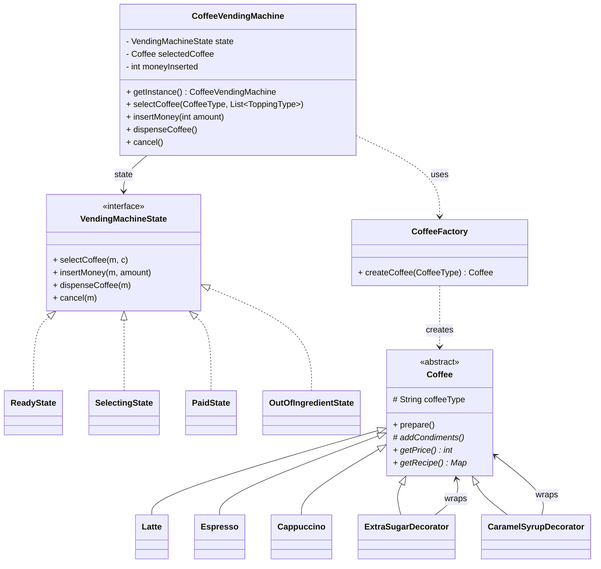
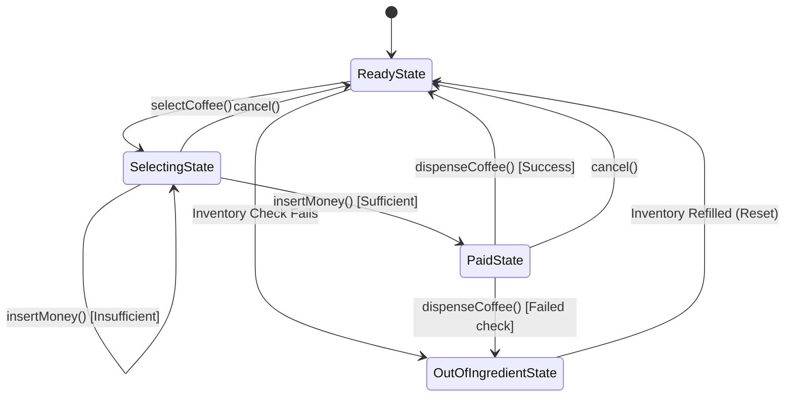

# Coffee Vending Machine - Low Level Design (LLD)

## 1. Problem Statement
Design a Coffee Vending Machine that serves multiple types of coffee (Espresso, Cappuccino, Latte), handles add-on ingredients/toppings (Extra Sugar, Caramel Syrup), tracks ingredient inventory, and manages user payment processing. 

### Core Requirements
1. **Coffee Types:** Support basic types like Espresso, Latte, and Cappuccino with their own unique pricing and ingredient requirements.
2. **Customizations:** Users can add extra toppings like extra sugar or caramel syrup, which dynamically alter the price and the final recipe.
3. **Inventory Management:** The system must maintain an inventory of ingredients (Water, Milk, Coffee Beans, Sugar, Syrup) and prevent dispensing if there's a shortage.
4. **State Management:** The vending machine goes through different states: Ready, Selecting Coffee, Paid, and Out of Ingredient. It should validate actions based on its current state.
5. **Payment Processing:** Accepts money, tracks the inserted amount, dispenses the coffee only when sufficient funds are provided, and handles cancellations (refunding).
6. **Extensibility:** It should be easy to add new coffee types, toppings, or states without modifying the core system.

---

## 2. Design Principles Followed

* **Single Responsibility Principle (SRP):** Each class has a single reason to change. For example, `Inventory` strictly manages stock, `CoffeeFactory` is only responsible for instantiating the correct base coffee, and individual `State` classes only handle logic for that specific phase of the transaction.
* **Open/Closed Principle (OCP):** The system is open for extension but closed for modification. We can add new coffee types (by extending `Coffee`), new toppings (by extending the `Decorator`), or new states (by implementing `VendingMachineState`) without altering the core `CoffeeVendingMachine` class.
* **Liskov Substitution Principle (LSP):** Our subclasses (e.g., `Latte`, `Cappuccino`) seamlessly substitute their base class (`Coffee`). The Decorators also cleanly substitute the base `Coffee` class.
* **Dependency Inversion Principle (DIP):** The main system depends on abstractions (`VendingMachineState`, `Coffee`) rather than concrete implementations.

---

## 3. Design Patterns Utilized

This design heavily leverages several Gang of Four (GoF) design patterns to achieve a highly decoupled and extensible architecture.

### 1. State Pattern
**Why:** A Vending Machine inherently acts as a finite state machine. A user cannot dispense coffee before paying, and cannot pay if an item hasn't been selected.
**How:** We implemented a `VendingMachineState` interface with methods like `selectCoffee()`, `insertMoney()`, `dispenseCoffee()`, and `cancel()`. The `CoffeeVendingMachine` delegates these calls to its current state object (`ReadyState`, `SelectingState`, `PaidState`, `OutOfIngredientState`).

### 2. Decorator Pattern
**Why:** To prevent class explosion when handling customizations. If we didn't use a decorator, we'd need classes like `LatteWithSugar`, `LatteWithSugarAndSyrup`, `EspressoWithSyrup`, etc.
**How:** Toppings like `ExtraSugarDecorator` and `CaramelSyrupDecorator` implement the `Coffee` interface and wrap around the base coffee object. They dynamically add their own price and ingredient requirements to the base coffee's price and recipe.

### 3. Template Method Pattern
**Why:** All coffee preparations share a common skeletal process (grinding beans, brewing, pouring into a cup) but differ in specific condiment additions.
**How:** The abstract `Coffee` class has a `prepare()` method that defines the rigid sequence of steps. It calls an abstract `addCondiments()` method, which is implemented differently by subclasses like `Cappuccino` or `Latte`.

### 4. Factory Pattern
**Why:** To encapsulate the logic of object creation so the main machine doesn't have to know the exact class names.
**How:** `CoffeeFactory` takes an enum `CoffeeType` and returns the corresponding concrete subclass of `Coffee`.

### 5. Singleton Pattern
**Why:** There should only be one instance of the Vending Machine and one central Inventory.
**How:** Both `CoffeeVendingMachine` and `Inventory` are implemented as singletons (e.g., private constructors, `getInstance()` method). The inventory uses a `ConcurrentHashMap` to be thread-safe.

---

## 4. Architecture & Diagrams

### 4.1 Class Diagram

```mermaid
classDiagram
    class CoffeeVendingMachine {
        - VendingMachineState state
        - Coffee selectedCoffee
        - int moneyInserted
        + getInstance() CoffeeVendingMachine
        + selectCoffee(CoffeeType, List~ToppingType~)
        + insertMoney(int amount)
        + dispenseCoffee()
        + cancel()
    }

    class VendingMachineState {
        <<interface>>
        + selectCoffee(m, c)
        + insertMoney(m, amount)
        + dispenseCoffee(m)
        + cancel(m)
    }

    class ReadyState { }
    class SelectingState { }
    class PaidState { }
    class OutOfIngredientState { }

    VendingMachineState <|.. ReadyState
    VendingMachineState <|.. SelectingState
    VendingMachineState <|.. PaidState
    VendingMachineState <|.. OutOfIngredientState
    CoffeeVendingMachine --> VendingMachineState : state

    class Coffee {
        <<abstract>>
        # String coffeeType
        + prepare()
        # addCondiments()*
        + getPrice()* int
        + getRecipe()* Map
    }
    
    class Latte { }
    class Espresso { }
    class Cappuccino { }

    Coffee <|-- Latte
    Coffee <|-- Espresso
    Coffee <|-- Cappuccino

    class ExtraSugarDecorator { }
    class CaramelSyrupDecorator { }
    
    Coffee <|-- ExtraSugarDecorator
    Coffee <|-- CaramelSyrupDecorator
    ExtraSugarDecorator --> Coffee : wraps
    CaramelSyrupDecorator --> Coffee : wraps

    class CoffeeFactory {
        + createCoffee(CoffeeType) Coffee
    }
    CoffeeFactory ..> Coffee : creates
    CoffeeVendingMachine ..> CoffeeFactory : uses
```

### 4.2 State Machine Flow

```mermaid
stateDiagram-v2
    [*] --> ReadyState
    
    ReadyState --> SelectingState : selectCoffee()
    ReadyState --> OutOfIngredientState : Inventory Check Fails

    SelectingState --> SelectingState : insertMoney() [Insufficient]
    SelectingState --> PaidState : insertMoney() [Sufficient]
    SelectingState --> ReadyState : cancel()

    PaidState --> ReadyState : dispenseCoffee() [Success]
    PaidState --> OutOfIngredientState : dispenseCoffee() [Failed check]
    PaidState --> ReadyState : cancel()

    OutOfIngredientState --> ReadyState : Inventory Refilled (Reset)
```

---

## 5. Walkthrough: The User Journey (Simple English)

1. **Initialization:** The application starts. The `Inventory` is loaded with ingredients (milk, water, beans, sugar). The `CoffeeVendingMachine` starts in the `ReadyState`.
2. **Selection:** A user selects a "Latte" with "Extra Sugar". 
   - The `CoffeeVendingMachine` asks the `CoffeeFactory` for a Latte. 
   - It then wraps the Latte object inside an `ExtraSugarDecorator`. 
   - The machine shifts into `SelectingState`.
3. **Payment:** The user inserts money.
   - The machine tracks the money. If the amount is less than the total required price, it stays in `SelectingState` and asks for more.
   - Once the total inserted amount equals or exceeds the required price, it automatically transitions into the `PaidState`.
4. **Dispensing:** The user hits 'Dispense'.
   - In the `PaidState`, the system first checks the `Inventory` using the decorated coffee's dynamically calculated recipe.
   - If stock is sufficient, ingredients are deducted. The `prepare()` template method is called on the coffee object (which grinds beans, brews, adds sugar, and pours).
   - Any extra change is refunded. The machine transitions back to `ReadyState`.
   - If stock is insufficient, it refunds the full amount, alerts the user, and transitions to the `OutOfIngredientState` until it is restocked and reset.
