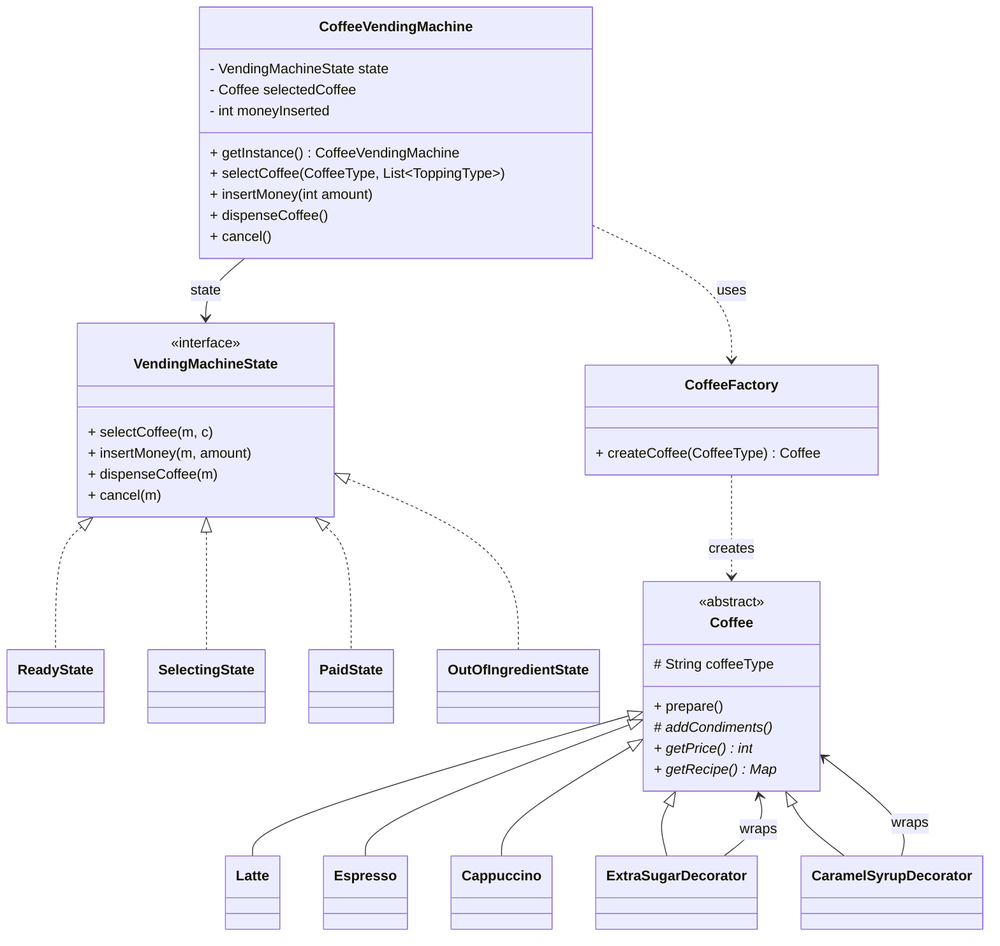
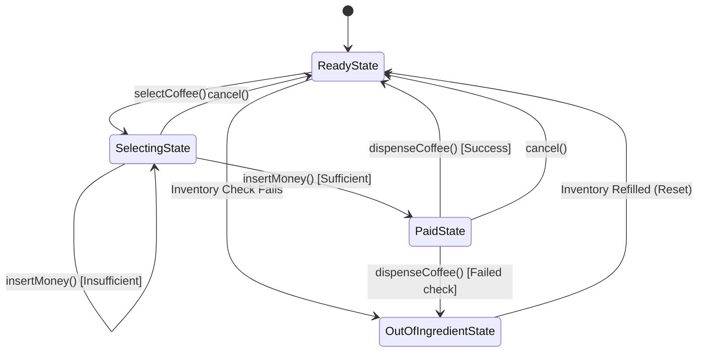

# Coffee Vending Machine — LLD Interview Guide (Microsoft SDE-2)

> Goal of this doc: give you everything you need to *say out loud* in a 45-minute LLD interview — problem framing,
> clarifying questions, design reasoning, diagrams, and answers to likely follow-ups. Read it like a script, not a
> reference manual.

---

## 1. Problem Statement

**As the interviewer might phrase it:**
> "Design a coffee vending machine. It should support multiple coffee types, let users pick add-ons/toppings, accept
> money, and dispense coffee only if there's enough stock and enough money. Handle edge cases like cancellation and
> running out of ingredients."

This is a classic **object-oriented design (OOD)** question. The interviewer isn't testing whether you can build
hardware — they're testing whether you can:

1. Break a real-world workflow into clean objects.
2. Recognize recurring design patterns and apply them for the *right* reasons (not just to show off pattern names).
3. Handle state and edge cases without writing a pile of `if/else` and boolean flags.
4. Justify your design in terms of SOLID principles.

---

## 2. Clarifying Questions (ask these first — 2 minutes)

Asking good clarifying questions is itself a signal in SDE-2 interviews. Say something like:

- "How many coffee types do we need to support initially, and should the design allow adding new ones easily?" → *(
  Espresso, Latte, Cappuccino — extensible)*
- "Can users customize their coffee with toppings, and can they combine multiple toppings?" → *(Yes — Extra Sugar,
  Caramel Syrup, and combinations of both)*
- "Is this single-machine, single-user at a time? Do we need to worry about concurrent access (e.g., a shared backend
  inventory across multiple machines)?" → *(Assume single machine, but inventory should be thread-safe)*
- "What happens if the user doesn't have enough money, or the machine runs out of ingredients mid-transaction?" → *(Must
  refund cleanly)*
- "Do we need to simulate real payment gateways, or just track an integer amount inserted?" → *(Just track amount — no
  real payment gateway)*
- "Should the design support future extensions like adding new payment methods or an admin refill flow?" → *(Yes, favor
  extensibility)*

This shows the interviewer you think about scope before jumping to code.

---

## 3 (a. Functional Requirements (write these on the whiteboard)

1. Support multiple coffee types (Espresso, Latte, Cappuccino), each with its own price and recipe (ingredients +
   quantities).
2. Support optional toppings (Extra Sugar, Caramel Syrup) that can be combined, each adding its own cost and ingredient
   usage.
3. Track ingredient inventory (coffee beans, water, milk, sugar, caramel syrup); block dispensing if stock is
   insufficient.
4. Accept money incrementally; only allow dispensing once enough money has been inserted.
5. Allow the user to cancel at any point before dispensing and get a refund.
6. Return change if the user overpays.
7. Machine should behave correctly regardless of the order of operations (e.g., can't dispense before paying, can't pay
   before selecting).
8. Be easy to extend — new coffee types, new toppings, new machine states — without breaking existing code.

**Non-functional:** thread-safe inventory (multiple machines/threads could touch shared stock), single canonical machine
instance, clean separation of concerns.

---

## 3 (b). Design Principles Followed

* **Single Responsibility Principle (SRP):** Each class has a single reason to change. For example, `Inventory` strictly
  manages stock, `CoffeeFactory` is only responsible for instantiating the correct base coffee, and individual `State`
  classes only handle logic for that specific phase of the transaction.
* **Open/Closed Principle (OCP):** The system is open for extension but closed for modification. We can add new coffee
  types (by extending `Coffee`), new toppings (by extending the `Decorator`), or new states (by implementing
  `VendingMachineState`) without altering the core `CoffeeVendingMachine` class.
* **Liskov Substitution Principle (LSP):** Our subclasses (e.g., `Latte`, `Cappuccino`) seamlessly substitute their base
  class (`Coffee`). The Decorators also cleanly substitute the base `Coffee` class.
* **Dependency Inversion Principle (DIP):** The main system depends on abstractions (`VendingMachineState`, `Coffee`)
  rather than concrete implementations.

---

## 3 (c). Design Patterns Utilized

This design heavily leverages several Gang of Four (GoF) design patterns to achieve a highly decoupled and extensible
architecture.

### 1. State Pattern

**Why:** A Vending Machine inherently acts as a finite state machine. A user cannot dispense coffee before paying, and
cannot pay if an item hasn't been selected. **How:** We implemented a `VendingMachineState` interface with methods like
`selectCoffee()`, `insertMoney()`, `dispenseCoffee()`, and `cancel()`. The `CoffeeVendingMachine` delegates these calls
to its current state object (`ReadyState`, `SelectedState`, `PaidState`, `OutOfIngredientState`).

### 2. Decorator Pattern

**Why:** To prevent class explosion when handling customizations. If we didn't use a decorator, we'd need classes like
`LatteWithSugar`, `LatteWithSugarAndSyrup`, `EspressoWithSyrup`, etc. **How:** Toppings like `ExtraSugarDecorator` and
`CaramelSyrupDecorator` implement the `Coffee` interface and wrap around the base coffee object. They dynamically add
their own price and ingredient requirements to the base coffee's price and recipe.

### 3. Template Method Pattern

**Why:** All coffee preparations share a common skeletal process (grinding beans, brewing, pouring into a cup) but
differ in specific condiment additions. **How:** The abstract `Coffee` class has a `prepare()` method that defines the
rigid sequence of steps. It calls an abstract `addCondiments()` method, which is implemented differently by subclasses
like `Cappuccino` or `Latte`.

### 4. Factory Pattern

**Why:** To encapsulate the logic of object creation so the main machine doesn't have to know the exact class names.
**How:** `CoffeeFactory` takes an enum `CoffeeType` and returns the corresponding concrete subclass of `Coffee`.

### 5. Singleton Pattern

**Why:** There should only be one instance of the Vending Machine and one central Inventory. **How:** Both
`CoffeeVendingMachine` and `Inventory` are implemented as singletons (e.g., private constructors, `getInstance()`
method). The inventory uses a `ConcurrentHashMap` to be thread-safe.

---

## 4. Architecture & Diagrams

### 4.1 Class Diagram

```mermaid
classDiagram
    class CoffeeVendingMachine {
        - VendingMachineState state
        - Coffee selectedCoffee
        - int moneyInserted
        + getInstance() CoffeeVendingMachine
        + selectCoffee(CoffeeType, List~ToppingType~)
        + insertMoney(int amount)
        + dispenseCoffee()
        + cancel()
    }

    class VendingMachineState {
        <<interface>>
        + selectCoffee(m, c)
        + insertMoney(m, amount)
        + dispenseCoffee(m)
        + cancel(m)
    }

    class ReadyState {
    }
    class SelectingState {
    }
    class PaidState {
    }
    class OutOfIngredientState {
    }

    VendingMachineState <|.. ReadyState
    VendingMachineState <|.. SelectingState
    VendingMachineState <|.. PaidState
    VendingMachineState <|.. OutOfIngredientState
    CoffeeVendingMachine --> VendingMachineState: state

    class Coffee {
        <<abstract>>
        # String coffeeType
        + prepare()
        # addCondiments()*
        + getPrice()* int
        + getRecipe()* Map
    }

    class Latte {
    }
    class Espresso {
    }
    class Cappuccino {
    }

    Coffee <|-- Latte
    Coffee <|-- Espresso
    Coffee <|-- Cappuccino

    class ExtraSugarDecorator {
    }
    class CaramelSyrupDecorator {
    }

    Coffee <|-- ExtraSugarDecorator
    Coffee <|-- CaramelSyrupDecorator
    ExtraSugarDecorator --> Coffee: wraps
    CaramelSyrupDecorator --> Coffee: wraps

    class CoffeeFactory {
        + createCoffee(CoffeeType) Coffee
    }
    CoffeeFactory ..> Coffee: creates
    CoffeeVendingMachine ..> CoffeeFactory: uses
```

### 4.2 State Machine Flow

```mermaid
stateDiagram-v2
    [*] --> ReadyState
    ReadyState --> SelectingState: selectCoffee()
    ReadyState --> OutOfIngredientState: Inventory Check Fails
    SelectingState --> SelectingState: insertMoney() [Insufficient]
    SelectingState --> PaidState: insertMoney() [Sufficient]
    SelectingState --> ReadyState: cancel()
    PaidState --> ReadyState: dispenseCoffee() [Success]
    PaidState --> OutOfIngredientState: dispenseCoffee() [Failed check]
    PaidState --> ReadyState: cancel()
    OutOfIngredientState --> ReadyState: Inventory Refilled (Reset)
```

---

## 5. Walkthrough: The User Journey (Simple English)

1. **Initialization:** The application starts. The `Inventory` is loaded with ingredients (milk, water, beans, sugar).
   The `CoffeeVendingMachine` starts in the `ReadyState`.
2. **Selection:** A user selects a "Latte" with "Extra Sugar".
    - The `CoffeeVendingMachine` asks the `CoffeeFactory` for a Latte.
    - It then wraps the Latte object inside an `ExtraSugarDecorator`.
    - The machine shifts into `SelectedState`.
3. **Payment:** The user inserts money.
    - The machine tracks the money. If the amount is less than the total required price, it stays in `SelectedState`
      and asks for more.
    - Once the total inserted amount equals or exceeds the required price, it automatically transitions into the
      `PaidState`.
4. **Dispensing:** The user hits 'Dispense'.
    - In the `PaidState`, the system first checks the `Inventory` using the decorated coffee's dynamically calculated
      recipe.
    - If stock is sufficient, ingredients are deducted. The `prepare()` template method is called on the coffee object
      (which grinds beans, brews, adds sugar, and pours).
    - Any extra change is refunded. The machine transitions back to `ReadyState`.
    - If stock is insufficient, it refunds the full amount, alerts the user, and transitions to the
      `OutOfIngredientState` until it is restocked and reset.
