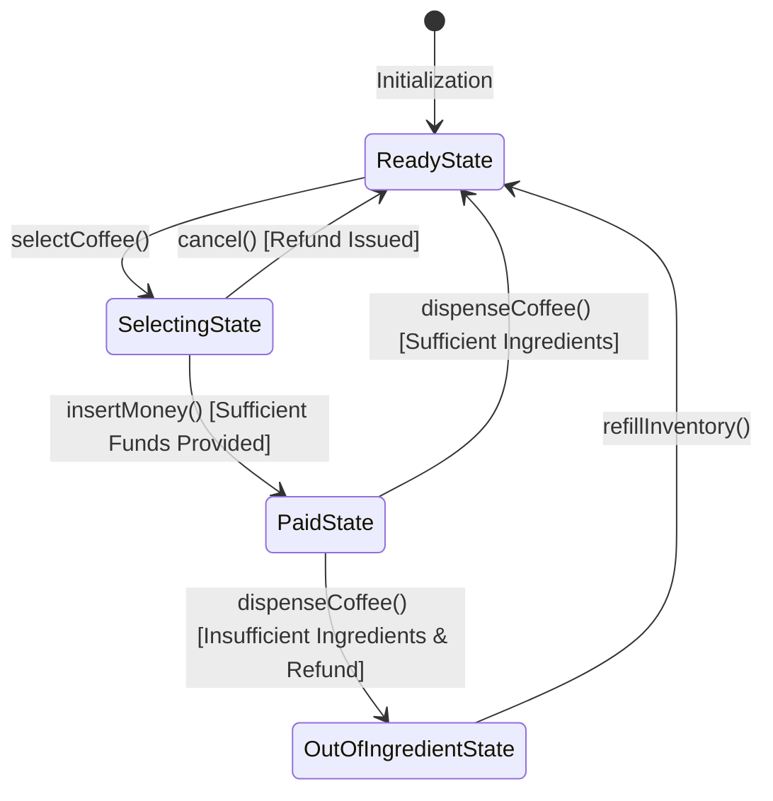
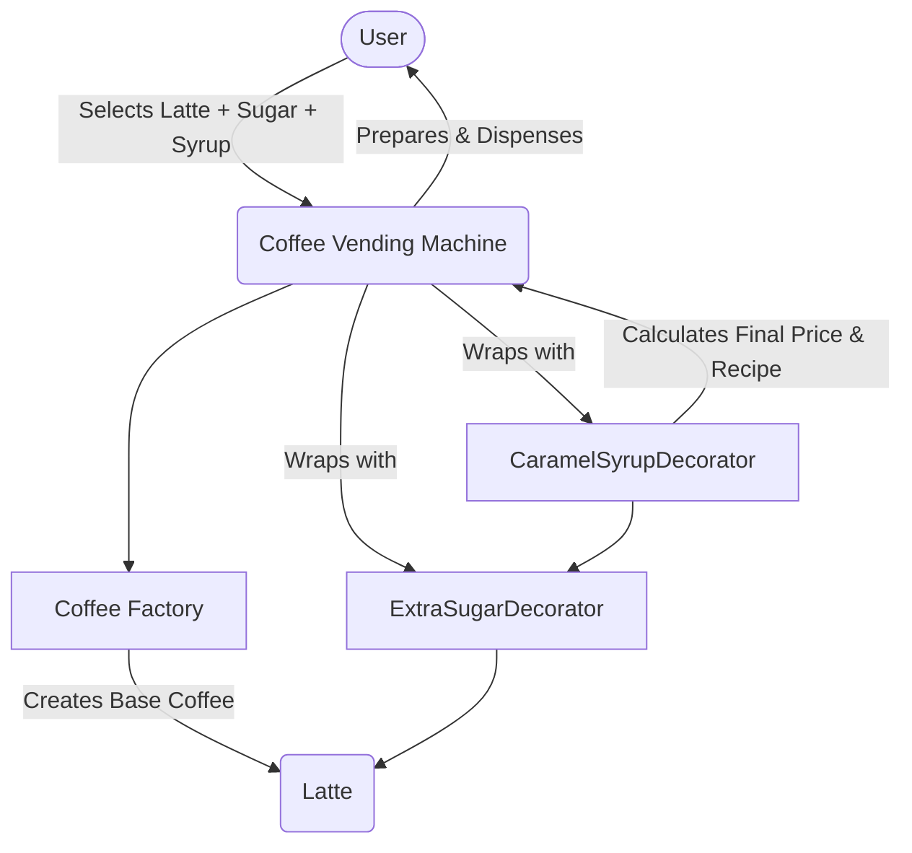

# Coffee Vending Machine - Low Level Design (LLD)

## 1. Problem Statement
Design a software system for a smart **Coffee Vending Machine**. The machine should be capable of:
- Serving multiple types of coffee (Espresso, Latte, Cappuccino).
- Customizing coffee with extra toppings (Sugar, Caramel Syrup).
- Managing ingredient inventory (Coffee Beans, Water, Milk, Sugar, Syrup) and restricting dispensing if ingredients are insufficient.
- Accepting payments and managing the machine's state (Ready, Selecting, Paid, Out of Ingredient).
- Allowing administrators to refill ingredients and reset the machine.

## 2. Requirements & Use Cases
- **User Actions**:
  - Select coffee type and desired toppings.
  - Insert money for the order.
  - Dispense coffee (or cancel the transaction for a refund).
- **System Actions**:
  - Calculate the total price dynamically based on the base coffee and added toppings.
  - Check inventory dynamically before dispensing to ensure all required ingredients are available.
  - Transition seamlessly between operational states (`ReadyState` -> `SelectingState` -> `PaidState` -> `ReadyState`).

---

## 3. Architectural Solution & Design Principles

The architecture leverages several classic Object-Oriented Design Patterns to ensure the code is modular, extensible, maintainable, and strictly adheres to **SOLID** principles.

### 3.1 State Pattern (Managing Machine States)
**Why?** A vending machine behaves differently based on its current state. For example, it shouldn't dispense coffee unless payment is successfully made, and it shouldn't accept money if it's out of stock.
**Implementation**: We define a `VendingMachineState` interface with methods like `selectCoffee()`, `insertMoney()`, `dispenseCoffee()`, and `cancel()`. Concrete states (`ReadyState`, `SelectingState`, `PaidState`, `OutOfIngredientState`) implement this interface. The central `CoffeeVendingMachine` context delegates user actions to the current state, completely eliminating messy `if-else` blocks.

### 3.2 Decorator Pattern (Customizing Orders)
**Why?** Users can add any combination of toppings (e.g., extra sugar, caramel syrup) to their coffee. Creating a subclass for every combination (e.g., `EspressoWithSugar`, `LatteWithSugarAndSyrup`) leads to a massive class explosion.
**Implementation**: We use a `CoffeeDecorator` abstract class that implements the base `Coffee` interface. Concrete decorators (`ExtraSugarDecorator`, `CaramelSyrupDecorator`) wrap the base `Coffee` object. They dynamically add their own cost to the total price and append their specific ingredient requirements to the recipe.

### 3.3 Factory Pattern (Object Creation)
**Why?** We need to instantiate specific coffee types based on user input without coupling the core vending machine logic to concrete classes.
**Implementation**: A `CoffeeFactory` takes a `CoffeeType` enum (e.g., `LATTE`, `ESPRESSO`) and returns the appropriate concrete subclass, centralizing object creation and adhering to the Open/Closed Principle.

### 3.4 Template Method Pattern (Standardized Preparation)
**Why?** Every coffee is prepared following a specific, unchangeable sequence: Grind Beans -> Brew -> Add Condiments -> Pour. However, the "Add Condiments" step varies by coffee type.
**Implementation**: The abstract `Coffee` class defines a `prepare()` template method. This method enforces the algorithm's skeleton. Subclasses like `Latte` or `Espresso` only implement the abstract `addCondiments()` hook method to provide their specific behavior, ensuring the overarching preparation process remains standard and safe.

### 3.5 Singleton Pattern (System Uniqueness)
**Why?** There should only be one instance of the Vending Machine context and one central Inventory tracking stock levels.
**Implementation**: Both `CoffeeVendingMachine` and `Inventory` are implemented as Thread-Safe Singletons.

---

## 4. System Flow Charts

### Vending Machine State Transitions

### Order Creation (Factory & Decorator Flow)

---

## 5. Interview Perspective & Talking Points (SDE-2)

If asked to design this in a Microsoft SDE-2 interview, structure your explanation to highlight your architectural forethought:

1. **Clarify Requirements First (2-3 mins)**: Confirm the coffee types, available toppings, and how inventory is tracked. Ask if the system needs to manage physical hardware interfaces or just the logical state.
2. **Lead with the State Machine (5 mins)**: Start by explaining that a Vending Machine is inherently a **State Machine**. Propose the **State Pattern** immediately. Highlight that this prevents a monolithic class filled with boolean flags (e.g., `isPaid`, `isSelecting`) and makes the code highly testable.
3. **Address Customizations Gracefully (5 mins)**: When the interviewer asks, *"How do you handle someone wanting 2 sugars and a syrup?"*, confidently propose the **Decorator Pattern**. Explain how it dynamically calculates both the price and the combined ingredient list without modifying existing code (Open/Closed Principle).
4. **Abstract Object Creation (3 mins)**: Mention using a **Factory** for the coffee base to keep your vending machine context agnostic of the actual menu changes. If a new "Mocha" is added, the vending machine class remains untouched.
5. **Standardize the Workflow (3 mins)**: Bring up the **Template Method** to demonstrate you understand code reusability and algorithmic enforcement. It ensures every coffee follows standard prep guidelines without duplicating the grinding and brewing logic in every subclass.

**Closing Statement**: Conclude by stating that this combination of patterns demonstrates a deep understanding of SOLID principles. It achieves high cohesion (classes do one thing well) and loose coupling, resulting in a system that is resilient to changing business requirements.
