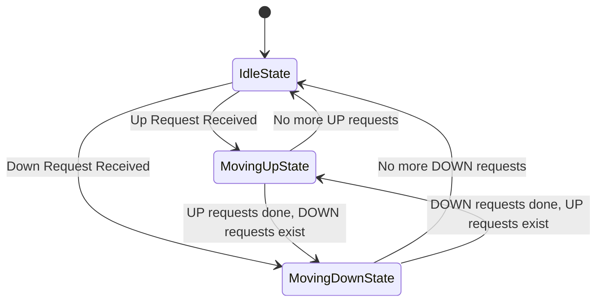
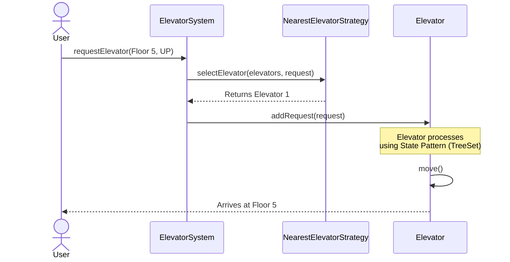

# Elevator System - Low Level Design

This document provides a comprehensive Low-Level Design (LLD) for an Elevator System, formatted as an explanation you would deliver during a Microsoft SDE-2 interview.

## 1. Requirements & Problem Statement

**Interviewer:** *"Design an Elevator System for a multi-story building."*

**Clarifying Requirements (The "What"):**
- **Multiple Elevators:** The system must manage multiple elevators (e.g., 2 or more).
- **Requests (Calls):**
  - **External Requests (Hall Calls):** A user presses 'Up' or 'Down' from a specific floor.
  - **Internal Requests (Cabin Calls):** A user inside the elevator presses a floor number to go to.
- **Dispatching:** When a hall call is made, the system should optimally dispatch an elevator.
- **State Management:** Elevators must know their current floor, direction (Moving Up, Moving Down, Idle), and process requests accordingly.
- **Concurrency:** Elevators move concurrently and handle requests in real-time.

---

## 2. Core Entities and Architecture

To solve this modularly and follow SOLID principles, I broke the system down into a few core entities:

- `ElevatorSystem`: The central manager. It orchestrates the assignment of external requests to the elevators.
- `Elevator`: Represents a single physical elevator. Each elevator is its own independently running thread.
- `Request`: Models a user request, tracking the floor, direction, and source (Internal vs. External).
- `ElevatorState`: The behavior of the elevator depending on if it is Idle, Moving Up, or Moving Down.
- `ElevatorSelectionStrategy`: The algorithm used by the `ElevatorSystem` to decide which elevator should serve an external request.

---

## 3. Design Principles and Patterns Used (The "How" & "Why")

In an SDE-2 interview, explaining *why* you chose a pattern is as important as the pattern itself.

### 1. Facade Pattern (`ElevatorSystem`)
- **Why:** The client (e.g., the building's physical buttons) shouldn't worry about the complex logic of selecting elevators or managing thread pools.
- **Implementation:** `ElevatorSystem` acts as a unified interface (`requestElevator`, `selectFloor`). It hides the complexity of dispatching requests and delegating to individual `Elevator` instances.

### 2. Singleton Pattern (`ElevatorSystem`)
- **Why:** There should only be one central controller for a building to avoid conflicting instructions and maintain a single source of truth.
- **Implementation:** `ElevatorSystem.getInstance(numElevators)` ensures exactly one system instance is created.

### 3. State Pattern (`ElevatorState`)
- **Why:** An elevator behaves differently based on its state. If it's going UP, it should prioritize higher floors. If IDLE, it can change direction. Avoids massive `if-else` blocks in the move logic.
- **Implementation:** I defined an `ElevatorState` interface with classes `IdleState`, `MovingUpState`, and `MovingDownState`. Each state dictates how an `Elevator` processes a new request and what its next move is.

### 4. Strategy Pattern (`ElevatorSelectionStrategy`)
- **Why:** The algorithm for dispatching an elevator can change (e.g., Nearest Elevator, Least Loaded Elevator, Round Robin). We want this to be pluggable without modifying the core system.
- **Implementation:** The `ElevatorSystem` uses an `ElevatorSelectionStrategy` interface. Currently, we inject `NearestElevatorStrategy`, but we can easily swap it out later.

### 5. Observer Pattern (`ElevatorObserver` & `ElevatorDisplay`)
- **Why:** We need to display the status of the elevators on a digital screen. The display should update automatically whenever an elevator changes its state or floor.
- **Implementation:** `Elevator` acts as the Subject. `ElevatorDisplay` implements `ElevatorObserver`. Whenever the elevator moves, it calls `notifyObservers()`.

---

## 4. Concurrency & Multithreading (Crucial for SDE-2)

- **Independent Threads:** Each `Elevator` implements `Runnable` and is submitted to an `ExecutorService` inside the `ElevatorSystem`. This allows all elevators to operate and move concurrently.
- **Thread Safety:** 
  - Using `AtomicInteger` for `currentFloor` to ensure atomic updates when the elevator is moving and when the observer reads it.
  - The `addRequest()` method inside `Elevator` is `synchronized` to handle race conditions when internal and external requests arrive simultaneously.
- **Data Structures:** 
  - Using two `TreeSet<Integer>` structures inside the `Elevator` class—one for `upRequests` (sorted naturally) and one for `downRequests` (sorted in reverse). `TreeSet` automatically deduplicates floor requests and keeps them strictly ordered, acting essentially like the **SCAN (Elevator) algorithm**.

---

## 5. System Flow Charts

### High-Level Architecture Flow

```mermaid
flowchart TD
    Client((User)) -->|Presses Hall Button| ES[ElevatorSystem Facade]
    Client -->|Presses Cabin Button| ES
    
    ES --> |selectElevator()| Strat((ElevatorSelectionStrategy))
    Strat -.-> |Returns best| ES
    
    ES --> |Adds Request| E1[Elevator 1 Thread]
    ES --> |Adds Request| E2[Elevator 2 Thread]
    
    E1 --> |notify()| Obs[ElevatorDisplay Observer]
    E2 --> |notify()| Obs
```

### Elevator State Machine



### Request Lifecycle (Sequence Diagram)



---

## 6. Interview Execution Summary

If you are asked this in a Microsoft interview, drive the conversation with these key talking points:
1. **"I will decouple the dispatching algorithm from the system using the Strategy Pattern."** (Shows you think about extensibility).
2. **"I will manage the elevator's directional logic using the State Pattern to prevent complex nested conditionals."** (Shows you write clean code).
3. **"Since elevators move in real-time, I'll run each Elevator on a separate thread via an ExecutorService and use TreeSets to naturally sort the floors, effectively implementing the LOOK/SCAN algorithm."** (Shows strong concurrent and algorithmic reasoning).
