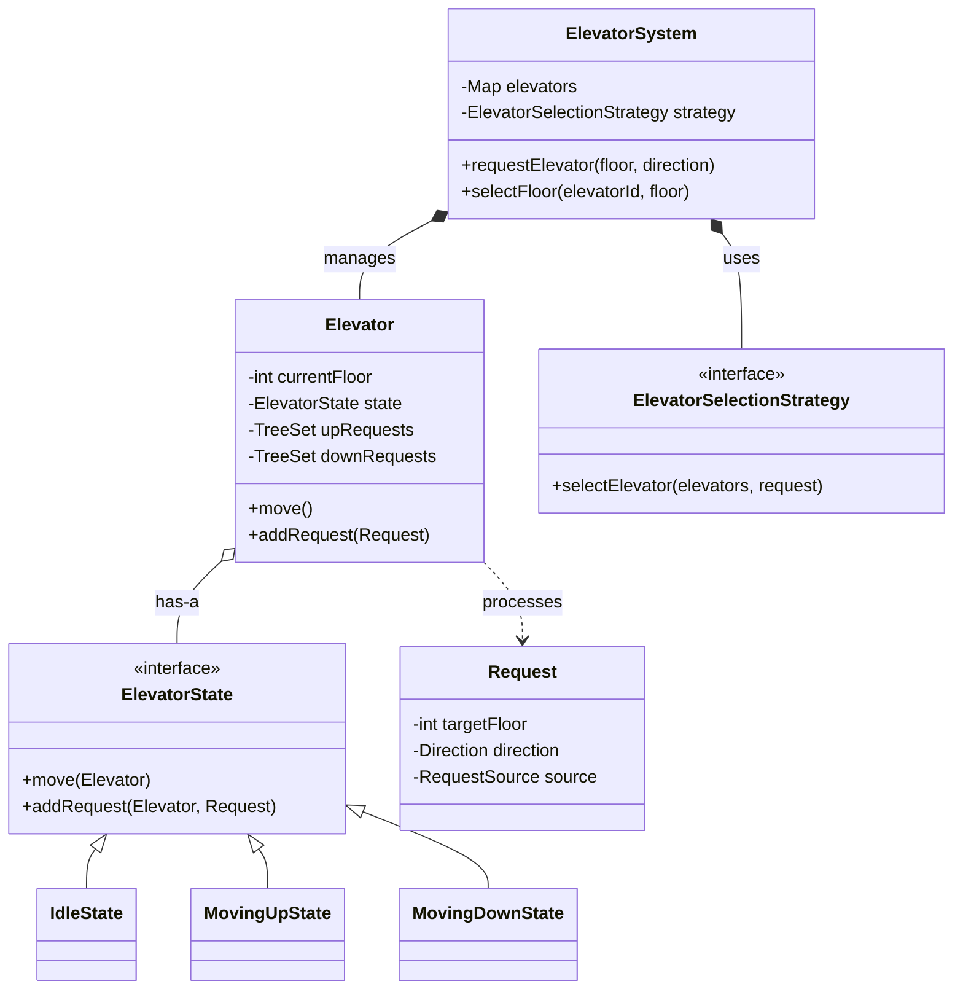
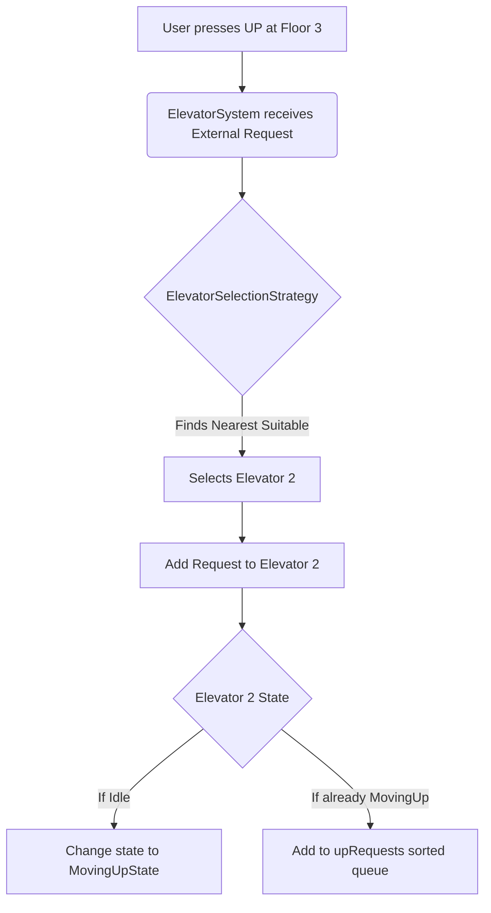
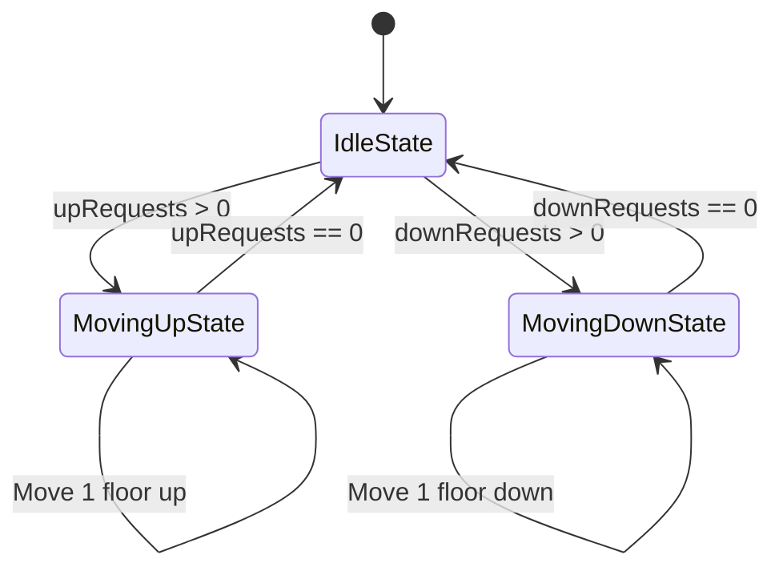

# Elevator System - Low Level Design (LLD)

This document provides a comprehensive Low-Level Design (LLD) for an Elevator System, structured exactly how you should explain it in a Microsoft SDE-2 interview.

---

## 1. Requirements & Problem Statement

**Interviewer:** *"Design an Elevator System for a multi-story building."*

**Candidate (You):** *"Before jumping into the design, I'd like to clarify a few requirements to scope the system correctly."*
*   **Capacity:** Are we designing for a single elevator or multiple? *(Assume Multiple)*
*   **Request Types:** Will the system handle both external requests (people waiting at a floor pressing Up/Down) and internal requests (people inside the elevator pressing floor numbers)? *(Yes, both)*
*   **Dispatching Algorithm:** Should the system just assign any elevator, or should it try to be optimal (e.g., nearest elevator)? *(Let's go with a nearest-elevator strategy for now, but keep it extensible)*
*   **Concurrency:** I assume elevators should move concurrently in real-time? *(Yes)*

**Summary of Scope:** A multi-elevator system handling concurrent internal and external requests, using a pluggable dispatch strategy, with clear state management for each elevator.

---

## 2. Core Entities and Architecture

To solve this modularly, I will break down the system into the following core entities:

1.  **`ElevatorSystem`:** The central dispatcher (Singleton). It takes external requests and routes them to the best elevator.
2.  **`Elevator`:** Represents a single physical elevator. Each elevator runs on its own thread. It maintains its own queue of requests (`upRequests` and `downRequests`).
3.  **`Request`:** A model class representing a user's request (Target Floor, Direction, Source: Internal/External).
4.  **`ElevatorState`:** Interface managing the behavior of the elevator based on its current state (Idle, Moving Up, Moving Down).
5.  **`ElevatorSelectionStrategy`:** An algorithm interface used by the system to decide which elevator serves an external request.
6.  **`ElevatorDisplay` / `ElevatorObserver`:** Handles showing the current floor and direction to the users.

---

## 3. Design Principles and Patterns Used

In an SDE-2 interview, explaining *why* you chose a pattern is as important as the code itself.

*   **State Design Pattern:** An elevator has distinct states (`Idle`, `MovingUp`, `MovingDown`). Moving the state-specific logic into separate classes (`IdleState`, `MovingUpState`) avoids massive `if-else` blocks in the `Elevator` class and makes state transitions explicit.
*   **Strategy Design Pattern:** The logic for selecting the best elevator can change (e.g., Nearest Elevator, Least Loaded Elevator, Odd/Even Floors). I created an `ElevatorSelectionStrategy` interface so the selection algorithm can be swapped at runtime without modifying the core system.
*   **Observer Design Pattern:** The display panels on each floor and inside the cabin need to know the elevator's current floor and direction. I used the Observer pattern so the `Elevator` can notify the `ElevatorDisplay` asynchronously whenever its state or floor changes.
*   **Singleton Design Pattern:** The `ElevatorSystem` acts as the central controller. We only want one instance of this system managing the building's elevators.
*   **Single Responsibility Principle (SOLID):** The `ElevatorSystem` only routes requests. The `Elevator` only manages its movement. The `ElevatorSelectionStrategy` only runs the assignment algorithm.

---

## 4. Visualizing the Architecture

### Class Diagram

---

## 5. System Workflows (Flow Charts)

### Workflow 1: Handling an External Request (Hall Call)

When a user presses the 'UP' button on Floor 3:

### Workflow 2: Elevator Movement Loop

Each elevator runs on its own thread, constantly evaluating its state.

---

## 6. Implementation Deep Dive (How it works under the hood)

**1. Managing Requests Effectively (The `TreeSet` Approach)**
Inside the `Elevator` class, I used two `TreeSet<Integer>` collections: `upRequests` and `downRequests`.
*   `TreeSet` inherently sorts the elements. 
*   If the elevator is moving UP, it only looks at `upRequests`. The `TreeSet` ensures that if I press Floor 5, 8, and 3, it visits them in the ordered sequence: 3 -> 5 -> 8.
*   For `downRequests`, I initialized it with a custom comparator `(a, b) -> b - a` so it sorts in descending order. If I am at Floor 10 and press 8, 2, and 5, it visits them: 8 -> 5 -> 2.

**2. Thread Safety and Concurrency**
*   Because `ElevatorSystem` receives requests from multiple users concurrently, the `addRequest` method inside `Elevator` is `synchronized` to prevent race conditions when adding to the `TreeSet`.
*   The `currentFloor` is an `AtomicInteger` to ensure thread-safe reads and updates when the display observers query it.
*   Elevators are instantiated and submitted to an `ExecutorService` thread pool, allowing them to run their `run()` loops concurrently without blocking the main system thread.

**3. State Management (`MovingUpState.java`)**
When in `MovingUpState`:
*   The elevator checks its `upRequests`.
*   It increments its current floor.
*   If the current floor equals the next target floor, it stops, removes that request from the queue, and opens doors.
*   If external requests come in while moving up, it only accepts them if the request is also going UP *and* the target floor is greater than the current floor. Otherwise, it queues it for the next pass or ignores it (leaving it for another elevator).

---

## 7. Interview Closing Remarks

If the interviewer asks for future improvements or how to scale this, you can mention:
1.  **Handling Overload/Capacity:** Implement a maximum capacity or weight limit for elevators, rejecting requests or pausing if exceeded.
2.  **Advanced Algorithms:** Upgrade the `NearestElevatorStrategy` to a full `SCAN` algorithm (Elevator Algorithm) which minimizes wait times across the building, similar to disk scheduling.
3.  **Distributed Systems Context:** In a real distributed software system modeling an elevator, we would use a message broker (like Kafka or RabbitMQ) for requests and Redis to store elevator states. If a server managing elevators crashes, the system could recover its state seamlessly.
