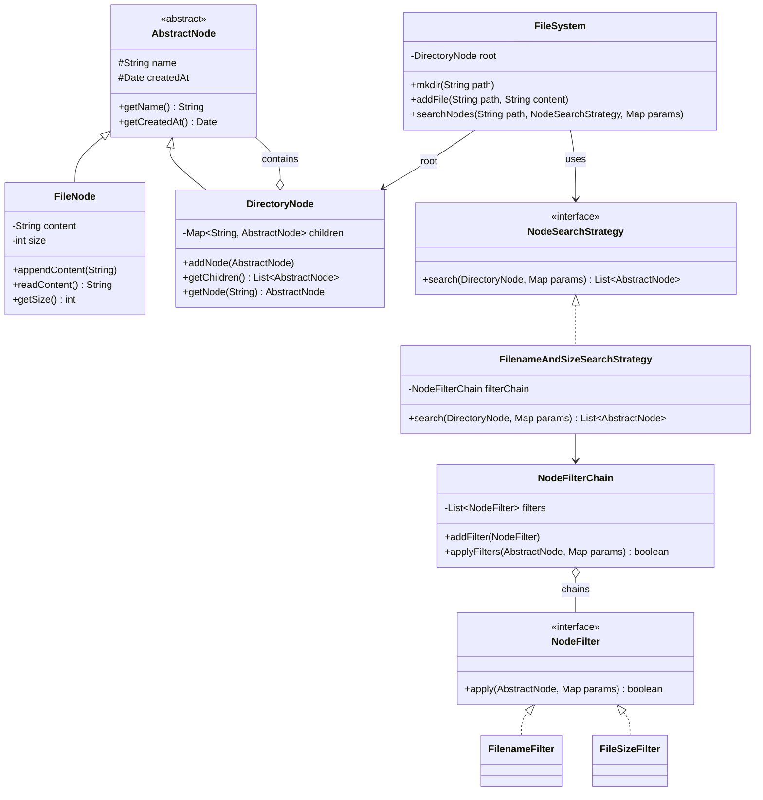
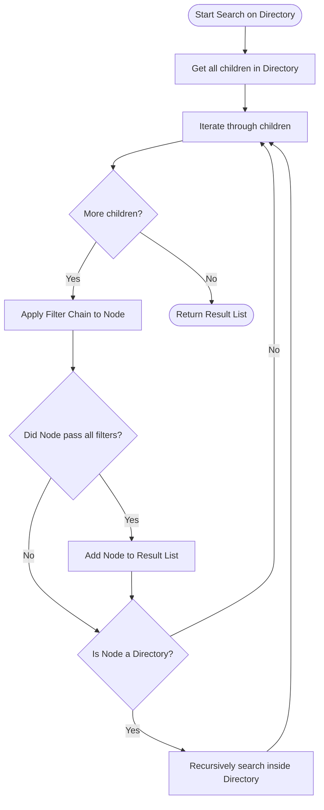

# File System - Low Level Design (LLD) Interview Preparation

This document serves as a comprehensive guide to presenting the **File System LLD** during a Microsoft SDE-2 interview. It is structured in an "interview style" to help you smoothly transition from understanding the problem to pitching the final architecture.

---

## 1. The Problem Statement

**Interviewer:** "Design an in-memory File System. You should be able to create directories, add files, and search for files or directories based on certain parameters (e.g., matching a filename, file size). The system should be extensible so we can easily add new filtering criteria later."

---

## 2. Clarifying Questions (Interview Pitch)

Before jumping into the design, it is crucial to clarify the scope with the interviewer. Here is how you can drive the conversation:

*   **You:** "Will the file system support nested directories?"
    *   **Interviewer:** "Yes, directories can contain files as well as other directories."
*   **You:** "What kind of search parameters do we need to support?"
    *   **Interviewer:** "For now, searching by file name and file size. But assume we might add search by file extension, creation date, etc., in the future."
*   **You:** "Do we need to handle concurrency or thread safety for this round?"
    *   **Interviewer:** "Let's stick to a single-threaded environment for the core logic first."

---

## 3. System Architecture & Design Principles

To solve this problem, we need a hierarchical data structure. Since a directory can contain both files and directories, the **Composite Design Pattern** is a perfect fit. 

Furthermore, because search criteria can grow or be combined (e.g., search by name AND size), we should decouple the search logic from the core File System. We will use the **Strategy Pattern** for the search algorithms and the **Chain of Responsibility Pattern** to elegantly combine multiple search filters.

### Key Design Patterns Used:
1.  **Composite Pattern:** For the hierarchical relationship. Both `File` and `Directory` will implement a common `Node` interface. A `Directory` will hold a list of `Node`s.
2.  **Strategy Pattern:** To encapsulate the search behavior (e.g., `NodeSearchStrategy`) so the core file system does not need to know *how* searching is done.
3.  **Chain of Responsibility (CoR) Pattern:** To dynamically chain various filters (e.g., `FilenameFilter` -> `FileSizeFilter`) during a search operation. If a node fails any filter in the chain, it's discarded.

---

## 4. Class Architecture (UML)

Here is a visual representation of the classes and interfaces we will implement.



---

## 5. Flow Charts

### A. Adding a File or Directory
When we create a path like `/a/b/c/file.txt`, the system must traverse the hierarchy from the root, creating any missing directories along the way.

```mermaid
flowchart TD
    Start([Start: addFile("/a/b/file.txt")]) --> Parse[Split path into parts: a, b, file.txt]
    Parse --> Init[Set current = Root Directory]
    Init --> LoopCheck{More directories?}
    LoopCheck -- Yes --> GetNode[Get child node by name]
    GetNode --> Exists{Does it exist?}
    Exists -- No --> CreateDir[Create new DirectoryNode]
    CreateDir --> AddChild[Add child to current]
    AddChild --> MoveCurrent[Set current = child]
    Exists -- Yes --> MoveCurrent
    MoveCurrent --> LoopCheck
    LoopCheck -- No (File level) --> CheckFile{Does File exist?}
    CheckFile -- No --> CreateFile[Create FileNode & add to current]
    CreateFile --> Append[Append Content]
    CheckFile -- Yes --> Append
    Append --> End([End])
```

### B. Searching for Nodes
Search logic utilizes the chained filters to validate each node recursively.



---

## 6. Interview Walkthrough (How to explain the code)

When writing or explaining the code, present it layer by layer:

### Step 1: The Core File System (Composite Pattern)
**You:** "I'll start by defining an `AbstractNode` which acts as the base for both files and directories. A `FileNode` will contain its actual string content and track its size. A `DirectoryNode` will maintain a `HashMap` mapping names to `AbstractNode` children. Using a Map ensures $O(1)$ lookups for child elements during traversal."

### Step 2: Path Traversal
**You:** "To handle operations like `mkdir` or `addFile`, I'll create a `FileSystem` class with a `root` directory. I will implement a private helper method called `traverse(String path, boolean createMissingDirs)`. This method splits the path by `'/'` and traverses down from the root. If `createMissingDirs` is true, it automatically instantiates missing directories. This avoids writing duplicate traversal logic for different commands."

### Step 3: Search Functionality (Strategy + Chain of Responsibility)
**You:** "For search, we want maximum flexibility. We don't want to hardcode `if (node.name == target && node.size > minSize)` inside our traversal code. 
Instead, I'll inject a `NodeSearchStrategy` into the search method. 

Inside my specific search strategy (e.g., `FilenameAndSizeSearchStrategy`), I'll initialize a `NodeFilterChain`. This Chain will hold a list of `NodeFilter` implementations, like `FilenameFilter` and `FileSizeFilter`. 
During the recursive search, every node is passed into the `applyFilters()` method of the chain. If a node fails even one filter, the loop short-circuits and rejects the node. If it passes all, it's added to our result set. 

This means if tomorrow we need to search by 'creation date', we just implement a `CreationDateFilter`, add it to the chain, and we don't have to touch the core `FileSystem` or the recursive search algorithm at all. This beautifully respects the **Open-Closed Principle**."

---

## 7. Summary & Wrap Up

At the end of your explanation, briefly summarize the benefits:
*   **Scalability:** Extensible search functionality via Strategy and CoR patterns.
*   **Maintainability:** Clean separation of concerns. Traversal logic is decoupled from business rules (filtering).
*   **Performance:** $O(1)$ lookups per path segment using `HashMap` in Directory nodes.

*"By structuring the application this way, we ensure that as new file system requirements emerge, our core architecture remains resilient and easy to extend."*
