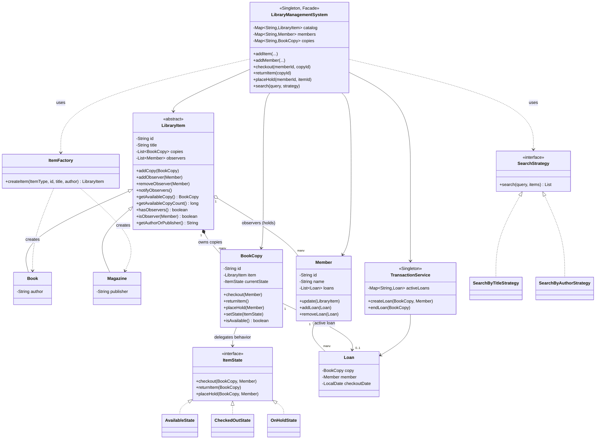
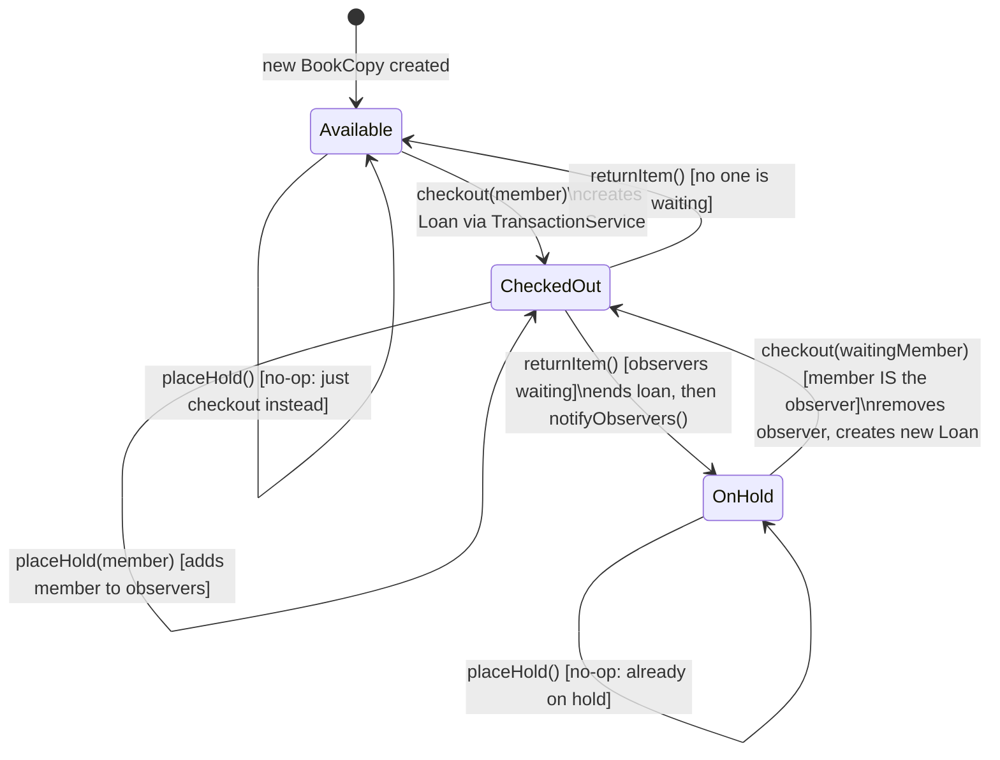
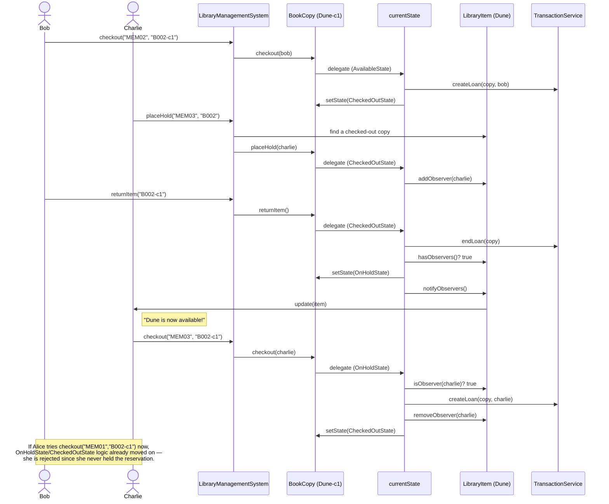
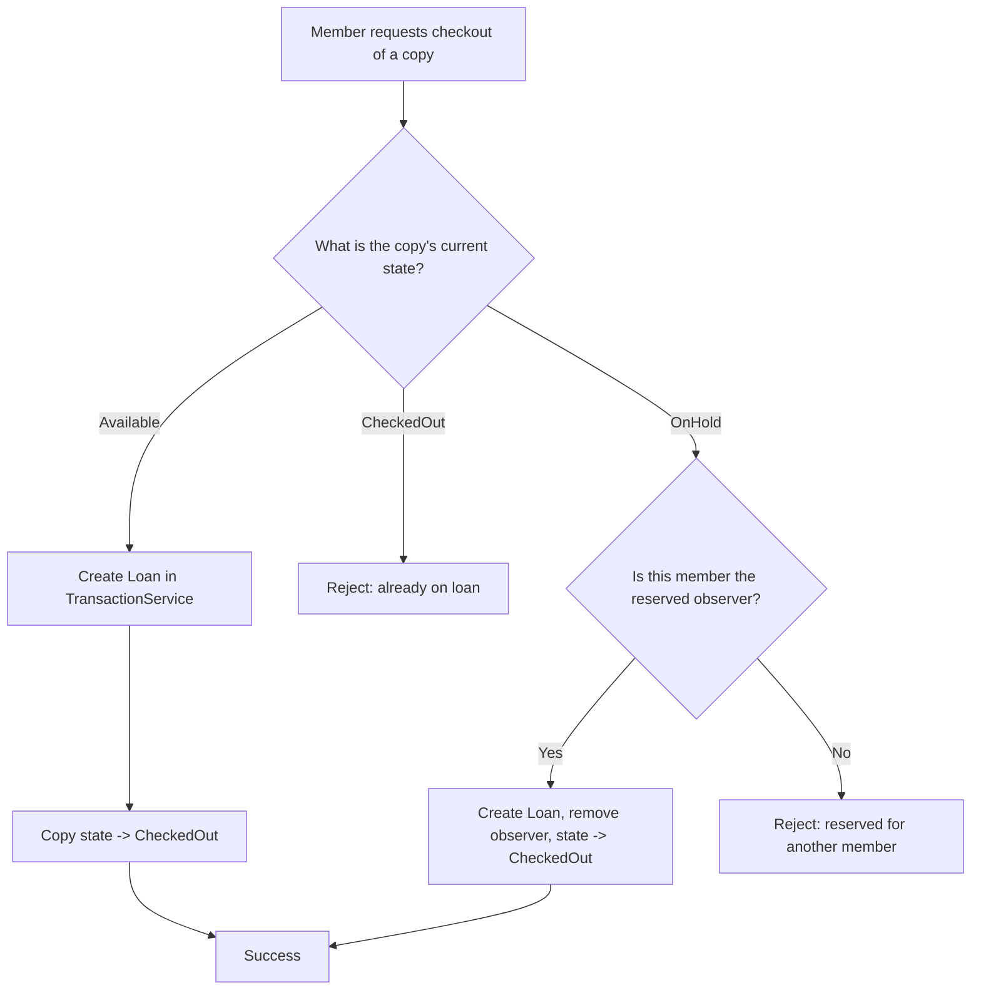

# Library Management System — LLD Interview Notes

> Goal of this doc: give you an interview-ready script — problem statement, requirements, design, patterns with justification, and diagrams — so you can *talk through* this design confidently in a Microsoft SDE‑2 LLD round.

---

## 1. Problem Statement

> "Design a Library Management System. Members should be able to search the catalog, check out an item, return it, and place a hold on an item if all its copies are currently checked out. When a checked-out copy is returned, members waiting on hold should be notified."

This is a classic LLD prompt because it forces you to reason about:
- **Object modeling** — what is a "book" vs. a physical "copy" of that book?
- **State management** — a copy behaves differently depending on whether it's available, checked out, or reserved for someone.
- **Decoupled notifications** — the book shouldn't need to know *how* to notify a member.
- **Extensibility** — new item types, new search strategies, without rewriting core logic.

### 1.1 Clarifying Questions (ask these first in the interview)
- Are there multiple *types* of items (books, magazines, DVDs) or just books? → We assumed **Book** and **Magazine**.
- Can an item have multiple physical copies? → **Yes**, this is central to the design.
- If multiple members place a hold on the same item, do we need a queue (FIFO), or is "first available observer wins" acceptable? → We implemented the simple observer-list version; queueing is a natural extension (see §7).
- Do we need fines / due dates / reservation expiry? → Out of scope for this version, but worth mentioning as a follow-up in the interview.
- Is this single-threaded or do we need to worry about concurrency? → Mention it as a trade-off (see §7).

### 1.2 Functional Requirements
1. Add new items (Book / Magazine) with N physical copies to the catalog.
2. Register members.
3. Search the catalog by title or by author.
4. Check out an available copy to a member.
5. Return a checked-out copy.
6. Place a hold on an item when no copies are available.
7. Notify members with a pending hold as soon as a copy is returned.
8. Prevent a copy from being checked out by anyone other than the member the hold was reserved for, once it enters the "on hold" state.

### 1.3 Non-Functional Requirements
- Easy to add new item types without touching existing code (**Open/Closed Principle**).
- Easy to add new search criteria without touching the core system.
- Single, consistent source of truth for the catalog and for active loans.

---

## 2. High-Level Design Walkthrough (how to open the interview)

Say this out loud, roughly:

> "I'll model two separate things that people often conflate: a **LibraryItem**, which is the *logical* concept of a book — like 'The Hobbit' — and a **BookCopy**, which is one *physical* copy of it sitting on a shelf. This separation matters because availability, checkout, and holds are all properties of a specific physical copy, not the abstract book. A library can own two copies of 'The Hobbit', where one is checked out and the other is sitting on the shelf — that's impossible to model correctly if 'the book' and 'the copy' are the same object."

Then introduce the rest of the cast:
- **`Member`** — a library user; can hold active loans and receive hold notifications.
- **`Loan`** — a record that ties a `BookCopy` to the `Member` who borrowed it.
- **`LibraryManagementSystem`** — the single entry point (Facade) client code talks to.
- **`TransactionService`** — owns the bookkeeping of *who has what on loan right now*, kept separate from catalog/search logic so that responsibility doesn't bloat one class.

---

## 3. Class Diagram



---

## 4. Design Principles & Patterns Applied

The most important part of an SDE-2 LLD round isn't naming the pattern — it's justifying *why* it was the right tool. Structure every answer as: **problem → naive approach → why it breaks down → pattern → how it fixes it**.

### 4.1 State Pattern — `ItemState`, `AvailableState`, `CheckedOutState`, `OnHoldState`
- **Problem:** A `BookCopy` can be `Available`, `CheckedOut`, or `OnHold`. Every action (`checkout`, `returnItem`, `placeHold`) behaves differently depending on which of these three states the copy is in.
- **Naive approach:** Put an `enum status` field on `BookCopy` and write `if/else` or `switch` blocks inside `checkout()`, `returnItem()`, `placeHold()`. Every time you add a new state (e.g., `Lost`, `UnderRepair`), you touch *every* method — violates **Open/Closed Principle**, and the conditionals multiply (3 methods × N states).
- **Fix:** Each state is its own class implementing `ItemState`. `BookCopy` just holds a `currentState` reference and *delegates*:
  ```java
  public void checkout(Member member) { currentState.checkout(this, member); }
  ```
  Adding a new state means adding one new class — existing states and `BookCopy` are untouched.
- **Where it lives:** `state/ItemState.java`, `state/AvailableState.java`, `state/CheckedOutState.java`, `state/OnHoldState.java`, and the `currentState` field + delegating methods in `models/BookCopy.java`.

### 4.2 Observer Pattern — `LibraryItem` (Subject) & `Member` (Observer)
- **Problem:** When a copy of "Dune" is returned, every member who placed a hold on "Dune" needs to be told. But `BookCopy`/`LibraryItem` shouldn't need to know *how* a member is notified (println today, email/SMS tomorrow), and definitely shouldn't be hardcoded to a specific member.
- **Fix:** `LibraryItem` maintains a `List<Member> observers` and exposes `addObserver`, `removeObserver`, `notifyObservers()`. `Member` implements the observer contract via `update(LibraryItem item)`. `CheckedOutState.returnItem()` triggers `copy.getItem().notifyObservers()` — the item has no idea what a `Member.update()` actually does internally.
- **Why this is the "Pub/Sub for a book" framing:** the book publishes "I'm back!"; interested members subscribed earlier and get told, and the book stays decoupled from notification mechanics.
- **Where it lives:** `models/LibraryItem.java` (subject: `observers`, `addObserver`, `notifyObservers`), `models/Member.java` (`update()`), triggered from `state/CheckedOutState.java`.

### 4.3 Strategy Pattern — `SearchStrategy`
- **Problem:** Search-by-title today, search-by-author today, but tomorrow it could be search-by-ISBN, search-by-genre, search-by-publication-year. If `LibraryManagementSystem.search()` has an `if(type == TITLE) ... else if (type == AUTHOR) ...`, that class keeps growing and keeps needing modification (violates **Open/Closed Principle**).
- **Fix:** Extract the search algorithm behind a `SearchStrategy` interface (`search(query, items)`). Concrete strategies (`SearchByTitleStrategy`, `SearchByAuthorStrategy`) each own one algorithm. The **caller chooses the strategy at runtime** and passes it in:
  ```java
  library.search("Dune", new SearchByTitleStrategy());
  ```
  `LibraryManagementSystem` never needs to change to support a new search type.
- **Where it lives:** `strategy/SearchStrategy.java`, `strategy/SearchByTitleStrategy.java`, `strategy/SearchByAuthorStrategy.java`; consumed in `LibraryManagementSystem.search()`.

### 4.4 Factory Pattern — `ItemFactory`
- **Problem:** Creating a `Book` vs. a `Magazine` needs an `if/switch` on type somewhere. We don't want that logic scattered across the codebase, and we don't want the facade class to know concrete subclasses directly.
- **Fix:** `ItemFactory.createItem(ItemType, id, title, author)` centralizes the "which concrete class to instantiate" decision. `LibraryManagementSystem.addItem()` just calls the factory and works only with the abstract `LibraryItem` type.
- **Where it lives:** `factory/ItemFactory.java`.

### 4.5 Singleton Pattern — `LibraryManagementSystem`, `TransactionService`
- **Problem:** There must be exactly one catalog and one active-loans ledger for the whole application — two competing instances would cause data inconsistency (e.g., two different maps both thinking a copy is available).
- **Fix:** Both classes have a private constructor and a static `getInstance()`.
- **Interview trade-off to mention:** classic Singletons are awkward for unit testing and for multi-tenant/multi-library scenarios; in a production system you'd more likely inject a single shared instance via a DI framework (Spring `@Service` bean) instead of a hard Singleton. Good to say this proactively — it shows maturity.

### 4.6 Facade Pattern — `LibraryManagementSystem`
- **Problem:** The client (`LibraryManagementDemo`) shouldn't need to know about `TransactionService`, `ItemFactory`, or how `BookCopy` internally delegates to `ItemState`.
- **Fix:** `LibraryManagementSystem` exposes a small, simple API — `addItem`, `addMember`, `checkout`, `returnItem`, `placeHold`, `search` — and internally coordinates the catalog, the factory, and the transaction service. This is also what makes it double as the natural Singleton entry point.

### 4.7 SOLID principles reflected in this design
- **SRP (Single Responsibility):** `TransactionService` owns loan bookkeeping; `LibraryManagementSystem` owns catalog/member orchestration; `BookCopy` owns per-copy lifecycle; each `ItemState` owns one state's behavior.
- **OCP (Open/Closed):** new item types → new `ItemFactory` branch + subclass, not new `if` in every consumer. New search type → new `SearchStrategy` implementation. New copy state → new `ItemState` implementation.
- **LSP (Liskov Substitution):** `Book` and `Magazine` are fully interchangeable wherever a `LibraryItem` is expected; any `ItemState` is interchangeable wherever `BookCopy` needs to delegate.
- **DIP (Dependency Inversion):** `LibraryManagementSystem.search()` depends on the `SearchStrategy` abstraction, not concrete strategies; `BookCopy` depends on the `ItemState` abstraction, not concrete states.

---

## 5. State Transition Diagram

This is the heart of the design — walk through it slowly in the interview, one transition at a time.



**Talking point:** notice `OnHold` is really "checked out, but earmarked for a specific member" — the copy isn't physically on the shelf, it just came back and is being held. That's why `returnItem()` on an `OnHold` copy is invalid: you can't return something that isn't out.

---

## 6. Sequence Diagram — Checkout → Hold → Return → Notify → Fulfilled

This walks through the exact scenario in `LibraryManagementDemo`: Bob checks out "Dune", Charlie places a hold on it, Bob returns it (Charlie gets notified), and then Charlie — and only Charlie — can check it out.



---

## 7. Anticipate Interviewer Follow-ups

Be ready for these — they test whether you understand the *limits* of what you built, which is exactly what separates SDE-2 from SDE-1 answers.

| Question | How to answer |
|---|---|
| **What if two members race to check out the same last copy at the same time?** | Current design isn't thread-safe: state check-and-set inside `ItemState.checkout()` isn't atomic. In production, guard `BookCopy`'s state transition with a lock (or a DB row-level lock / optimistic version column if state is persisted), so "check available → create loan → set state" is one atomic unit. |
| **What if multiple members want to hold the same item?** | Today `observers` is an unordered list and *whoever calls `checkout()` first while `OnHold`* wins, provided they're in the list — there's no FIFO fairness. A real system would use a `Queue<Member>` and only let the front of the queue through, popping on fulfillment. |
| **How do you handle a hold on an item that already has an available copy?** | We deliberately made `placeHold()` a no-op on `Available`/newly-available copies — the member should just check it out directly. `LibraryManagementSystem.placeHold()` only ever attaches to a copy that's already `!isAvailable()`. |
| **How would you add due dates and fines?** | Extend `Loan` with a `dueDate`, add a `FineCalculator` (could itself be a Strategy, e.g. flat-fee vs. per-day) run when `TransactionService.endLoan()` is called late. |
| **How would you support reservation expiry (hold expires after N days)?** | Attach a timestamp when a member is added as an observer; a scheduled job (or check-on-access) evicts stale observers from `OnHoldState` back to the next observer or to `Available`. |
| **Why separate `TransactionService` from `LibraryManagementSystem` at all?** | Single Responsibility — catalog/search/facade concerns vs. "who owes what, right now" bookkeeping. It also means loan analytics/reporting could read from `TransactionService` without depending on catalog internals. |
| **Why is `BookCopy` a *Context* and not merged into the State classes?** | The State pattern requires a stable object (`BookCopy`) that *holds* a reference to its current state and exposes the actions; the state classes are typically stateless/swappable strategies for behavior, not the data holder itself. |

**One thing worth raising yourself (shows attention to detail):** in the current `LibraryManagementSystem.addItem()`, each loop iteration constructs a `BookCopy` twice — once assigned to `copy` and again inline inside `copies.put(copyId, new BookCopy(...))` — so `LibraryItem` ends up with two distinct copy objects sharing one ID, silently inflating `getAvailableCopyCount()`. The fix is trivial (reuse `copy` in the `put` call), but flagging bugs like this unprompted is exactly the kind of code-review instinct interviewers want to see.

---

## 8. Checkout Decision Flow (for extra clarity)



---

## 9. How to Deliver This in the Interview (script outline)

1. **Restate the problem in your own words** and ask the 2-3 clarifying questions from §1.1. This buys thinking time and shows structured thinking.
2. **Identify nouns → candidate classes** out loud: item, copy, member, loan. Immediately call out the `LibraryItem` vs `BookCopy` split — this is the single most "senior" insight in the whole design, lead with it.
3. **Draw (or narrate) the class diagram** top-down: abstract `LibraryItem`, its two subclasses, `BookCopy` holding an `ItemState`.
4. **Walk the state machine** for a single copy — this is where most of the interesting logic lives. Explicitly say: "I could do this with an enum and if/else, but that violates Open/Closed as more states get added — so I'm using the State pattern."
5. **Introduce holds via Observer** naturally, as a consequence of "what happens when a copy comes back and someone was waiting" — don't present it as "and now here's pattern #2", let it fall out of the requirement.
6. **Mention Strategy for search and Factory for item creation** more briefly — they're straightforward and you don't want to spend interview time on the easy parts.
7. **Proactively raise trade-offs** from §7 (concurrency, hold fairness) before being asked — this is what pushes the signal from "knows patterns" to "thinks like someone who's shipped this."
8. **If time allows, trace one end-to-end scenario** verbally using the sequence diagram: Bob checks out → Charlie holds → Bob returns → Charlie notified → Charlie checks out → Alice denied. This proves the design actually works, not just that it "has patterns in it."

---

## 10. One-line Summary (elevator pitch)

> "I modeled the logical book separately from its physical copies, used the **State pattern** so each copy's `checkout/return/placeHold` behavior is owned by its current state instead of scattered conditionals, used **Observer** so a returned copy can notify waiting members without coupling the book to notification logic, and used **Strategy** and **Factory** to keep search and item-creation open to extension. A `Facade` (`LibraryManagementSystem`) ties it together as the single entry point, backed by a separate `TransactionService` that owns loan bookkeeping."
