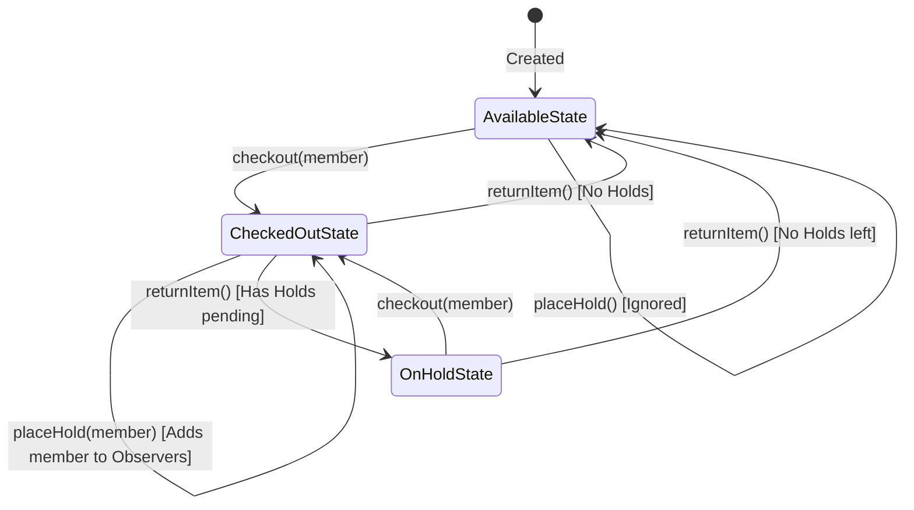
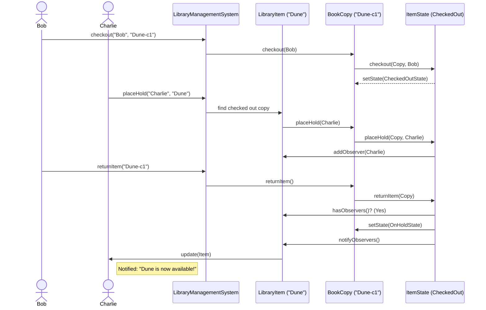

# Library Management System - Low Level Design (LLD)

## 1. Problem Statement
Design a Low-Level system for a Library Management System. The system should allow members to search for items, check them out, return them, and place holds on items that are currently unavailable. The system must effectively manage the states of individual item copies and notify members when their held items become available.

### 1.1 Core Requirements
*   **Item Management:** The library contains various items like Books and Magazines. Each item can have multiple physical copies.
*   **Member Management:** Members can interact with the library to borrow items.
*   **Search Functionality:** Members can search the catalog by Title or Author.
*   **Checkout & Return:** Members can check out available copies and return them when done.
*   **Hold & Notification:** If an item's copies are all checked out, a member can place a hold on it. Once any copy is returned, members who placed a hold should be notified.

---

## 2. Architectural Solution & Core Entities
To solve this cleanly, we need to separate concerns. We have data models, a central facade for operations, a transaction service, and specific design patterns to handle complex state transitions and dynamic algorithms.

### 2.1 Core Entities (Data Models)
*   **`LibraryItem` (Abstract Subject):** Represents the concept of a book or magazine (e.g., "The Hobbit"). It maintains a list of its physical `BookCopy` objects and a list of `Member` observers waiting for a hold.
*   **`Book` / `Magazine`:** Concrete implementations of `LibraryItem`.
*   **`BookCopy` (Context):** Represents a physical copy of an item (e.g., "The Hobbit - Copy 1"). It holds a reference to its current `ItemState`.
*   **`Member` (Observer):** A user of the library. It can receive notifications.
*   **`Loan`:** Represents a record of a member checking out a specific copy.

### 2.2 Core Services
*   **`LibraryManagementSystem` (Facade & Singleton):** The central entry point for the client to interact with the system (setup catalog, checkout, search).
*   **`TransactionService` (Singleton):** Manages active loans independently from the library catalog logic.

---

## 3. Design Principles and Patterns Applied

In an SDE-2 interview, demonstrating *why* you chose a pattern is more important than just knowing it.

### 3.1 State Pattern (Crucial for Copy Lifecycle)
*   **Why?** A physical library item copy goes through various states: `Available`, `CheckedOut`, and `OnHold`. The behavior of actions like `checkout()`, `returnItem()`, and `placeHold()` changes drastically depending on the copy's current state. Using `if/else` statements for this leads to brittle, hard-to-maintain code.
*   **Implementation:** We created an `ItemState` interface with concrete classes: `AvailableState`, `CheckedOutState`, and `OnHoldState`. The `BookCopy` delegates these actions to its current state object. 
    *   *Example:* Calling `checkout()` on an `AvailableState` creates a loan and transitions the state to `CheckedOutState`. Calling `checkout()` on a `CheckedOutState` simply throws an error or prints a message.

### 3.2 Observer Pattern (For Notifications)
*   **Why?** When a checked-out book is returned, we need to notify members who placed a hold on it. We don't want the `BookCopy` or `LibraryItem` to be tightly coupled to specific members or a notification service.
*   **Implementation:** `LibraryItem` acts as the **Subject**, maintaining a list of `Member` **Observers**. When a copy of that item is returned, the `CheckedOutState` triggers `copy.getItem().notifyObservers()`, which iterates through the waiting members and calls their `update()` method.

### 3.3 Strategy Pattern (For Extensible Search)
*   **Why?** Searching algorithms can vary. Today we search by Title and Author, tomorrow we might want to search by Publication Date, Genre, or ISBN. We shouldn't modify the core `LibraryManagementSystem` class every time a new search type is added (adhering to the Open/Closed Principle).
*   **Implementation:** We define a `SearchStrategy` interface with a `search()` method. We implement `SearchByTitleStrategy` and `SearchByAuthorStrategy`. The client passes the desired strategy at runtime.

### 3.4 Factory Pattern (For Object Creation)
*   **Why?** To encapsulate the logic of instantiating different types of library items (Books, Magazines).
*   **Implementation:** `ItemFactory.createItem()` takes an `ItemType` enum and returns the appropriate concrete `LibraryItem`.

### 3.5 Singleton Pattern (For Centralized Management)
*   **Why?** There should only be one instance of the `LibraryManagementSystem` catalog and one `TransactionService` managing loans across the application to prevent data inconsistency.

---

## 4. System Logic & Flow Charts

### 4.1 State Transition of a Book Copy
This flowchart explains how a `BookCopy` moves between different states during its lifecycle.

### 4.2 Checkout and Hold Notification Flow
This sequence diagram shows the interaction when Bob checks out a book, Charlie places a hold on it, and Bob returns it, triggering a notification to Charlie.

---

## 5. Interview Delivery Tips for SDE-2
1.  **Start High-Level:** Don't jump straight into code. Talk about the core entities (`LibraryItem`, `BookCopy`, `Member`) and the relationships between them. Explain *why* you are separating a `LibraryItem` (the logical book) from a `BookCopy` (the physical book).
2.  **Focus on the State Pattern:** Interviewers love state machines. Clearly explain the dilemma: "If I don't use the State Pattern, my `checkout()` method will be a giant `if(isAvailable) ... else if (isOnHold) ...` block." Explain how polymorphism solves this by delegating behavior to the state object itself.
3.  **Explain the Observer Pattern Naturally:** When discussing holds, frame it as a pub/sub problem. "The members need to know when the book arrives, but the book shouldn't care who the members are. It just notifies anyone who subscribed to it."
4.  **Discuss Trade-offs:** Mention concurrency. "In a real multi-threaded environment, checking out a book and changing its state needs to be synchronized or handled via a database transaction with Row-Level locks to prevent two users from checking out the exact same copy simultaneously." This shows SDE-2 maturity.
