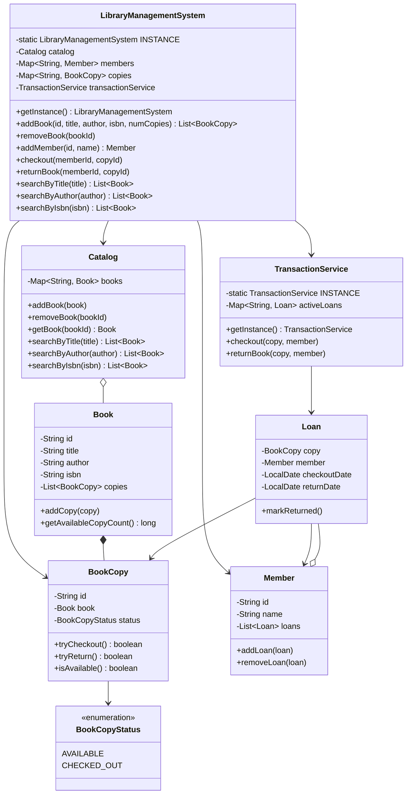
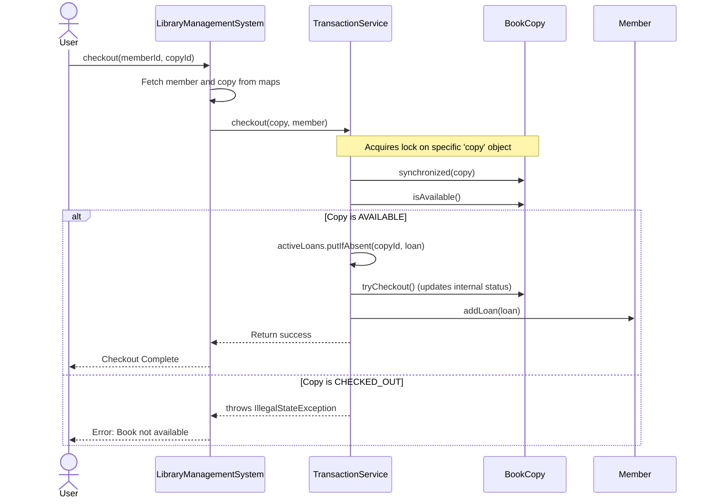

# Library Management System — LLD Interview Notes

> Goal of this doc: give you an interview-ready script — problem statement, requirements, design, patterns with
> justification, and diagrams — so you can *talk through* this design confidently in a Microsoft SDE‑2 LLD round.

---

## 1. Problem Statement

> "Design a Library Management System. Members should be able to search the catalog, check out an item, return it, and
> place a hold on an item if all its copies are currently checked out. When a checked-out copy is returned, members
> waiting on hold should be notified."

This is a classic LLD prompt because it forces you to reason about:

- **Object modeling** — what is a "book" vs. a physical "copy" of that book?
- **State management** — a copy behaves differently depending on whether it's available, checked out, or reserved for
  someone.
- **Decoupled notifications** — the book shouldn't need to know *how* to notify a member.
- **Extensibility** — new item types, new search strategies, without rewriting core logic.

### 1.1 Clarifying Questions (ask these first in the interview)

- Are there multiple *types* of items (books, magazines, DVDs) or just books? → We assumed **Book** and **Magazine**.
- Can an item have multiple physical copies? → **Yes**, this is central to the design.
- If multiple members place a hold on the same item, do we need a queue (FIFO), or is "first available observer wins"
  acceptable? → We implemented the simple observer-list version; queueing is a natural extension (see §7).
- Do we need fines / due dates / reservation expiry? → Out of scope for this version, but worth mentioning as a
  follow-up in the interview.
- Is this single-threaded or do we need to worry about concurrency? → Mention it as a trade-off (see §7).

### 1.2 Functional Requirements

1. Add new items (Book / Magazine) with N physical copies to the catalog.
2. Register members.
3. Search the catalog by title or by author.
4. Check out an available copy to a member.
5. Return a checked-out copy.
6. Place a hold on an item when no copies are available.
7. Notify members with a pending hold as soon as a copy is returned.
8. Prevent a copy from being checked out by anyone other than the member the hold was reserved for, once it enters the
   "on hold" state.

### 1.3 Non-Functional Requirements

- Easy to add new item types without touching existing code (**Open/Closed Principle**).
- Easy to add new search criteria without touching the core system.
- Single, consistent source of truth for the catalog and for active loans.

---

## 2. High-Level Design Walkthrough (how to open the interview)

Say this out loud, roughly:

> "I'll model two separate things that people often conflate: a **LibraryItem**, which is the *logical* concept of a
> book — like 'The Hobbit' — and a **BookCopy**, which is one *physical* copy of it sitting on a shelf. This separation
> matters because availability, checkout, and holds are all properties of a specific physical copy, not the abstract
> book.
> A library can own two copies of 'The Hobbit', where one is checked out and the other is sitting on the shelf — that's
> impossible to model correctly if 'the book' and 'the copy' are the same object."

Then introduce the rest of the cast:

- **`Member`** — a library user; can hold active loans and receive hold notifications.
- **`Loan`** — a record that ties a `BookCopy` to the `Member` who borrowed it.
- **`LibraryManagementSystem`** — the single entry point (Facade) client code talks to.
- **`TransactionService`** — owns the bookkeeping of *who has what on loan right now*, kept separate from catalog/search
  logic so that responsibility doesn't bloat one class.

---

## 3. Class Diagram


```mermaid
classDiagram
    class LibraryManagementSystem {
        -static LibraryManagementSystem INSTANCE
        -Catalog catalog
        -Map~String, Member~ members
        -Map~String, BookCopy~ copies
        -TransactionService transactionService
        +getInstance() LibraryManagementSystem
        +addBook(id, title, author, isbn, numCopies) List~BookCopy~
        +removeBook(bookId)
        +addMember(id, name) Member
        +checkout(memberId, copyId)
        +returnBook(memberId, copyId)
        +searchByTitle(title) List~Book~
        +searchByAuthor(author) List~Book~
        +searchByIsbn(isbn) List~Book~
    }
    
    class Catalog {
        -Map~String, Book~ books
        +addBook(book)
        +removeBook(bookId)
        +getBook(bookId) Book
        +searchByTitle(title) List~Book~
        +searchByAuthor(author) List~Book~
        +searchByIsbn(isbn) List~Book~
    }
    
    class TransactionService {
        -static TransactionService INSTANCE
        -Map~String, Loan~ activeLoans
        +getInstance() TransactionService
        +checkout(copy, member)
        +returnBook(copy, member)
    }

    class Book {
        -String id
        -String title
        -String author
        -String isbn
        -List~BookCopy~ copies
        +addCopy(copy)
        +getAvailableCopyCount() long
    }

    class BookCopy {
        -String id
        -Book book
        -BookCopyStatus status
        +tryCheckout() boolean
        +tryReturn() boolean
        +isAvailable() boolean
    }
    
    class Member {
        -String id
        -String name
        -List~Loan~ loans
        +addLoan(loan)
        +removeLoan(loan)
    }
    
    class Loan {
        -BookCopy copy
        -Member member
        -LocalDate checkoutDate
        -LocalDate returnDate
        +markReturned()
    }
    
    class BookCopyStatus {
        <<enumeration>>
        AVAILABLE
        CHECKED_OUT
    }

    LibraryManagementSystem --> Catalog
    LibraryManagementSystem --> TransactionService
    LibraryManagementSystem --> Member
    LibraryManagementSystem --> BookCopy
    Catalog o-- Book
    Book *-- BookCopy
    BookCopy --> BookCopyStatus
    TransactionService --> Loan
    Loan --> BookCopy
    Loan --> Member
    Member o-- Loan
```

---

## 4. Design Principles Applied (SOLID & GoF Patterns)

When explaining your design in an interview, explicitly mentioning these principles shows maturity:

1. **Single Responsibility Principle (SRP):**
    * The `Catalog` class is solely responsible for managing the collection of books and providing search
      functionalities.
    * The `TransactionService` handles only the business rules and concurrency logic for checking out and returning
      books.
    * `Models` (`Book`, `BookCopy`, `Member`, `Loan`) are mostly pure data structures with only localized state-change
      logic.

2. **Singleton Pattern:**
    * `LibraryManagementSystem` and `TransactionService` are implemented as Singletons. Logically, there should be only
      one central coordinator for the library state and one transaction manager to maintain consistency across the
      application.

3. **Facade Pattern:**
    * `LibraryManagementSystem` acts as a Facade. It provides a unified, simple interface to the client (e.g.,
      `checkout(memberId, copyId)`) while hiding the complex interactions between `Catalog`, `TransactionService`, and
      internal maps.

4. **Encapsulation & Information Hiding:**
    * Thread-safe mechanisms (like `synchronized` blocks) are hidden deep inside `TransactionService` and `BookCopy`.
      The client doesn't need to know *how* the system prevents race conditions, only that it *does*.

---

## 5. System Components & Concurrency Handling

### 5.1 Core Entities

* **Book vs. BookCopy:** A crucial distinction. `Book` holds the metadata (Title, Author, ISBN). `BookCopy` represents
  the physical item on the shelf. This allows a library to own 5 copies of "Dune" without duplicating metadata.
* **Member:** Represents a user. It uses a thread-safe `CopyOnWriteArrayList` to maintain their active `Loan`s, ensuring
  that iterating over a member's loans while they are concurrently returning a book doesn't throw a
  `ConcurrentModificationException`.
* **Loan:** Acts as the historical and active record linking a `BookCopy` to a `Member` along with timestamps.

### 5.2 Concurrency Handling (Crucial for Microsoft SDE-2)

As an SDE-2, your ability to handle multi-threading is highly scrutinized.

1. **Thread-Safe Collections:** We use `ConcurrentHashMap` for in-memory databases (`members`, `books`, `copies`,
   `activeLoans`). This allows multiple threads to read and write to the system state safely without locking the entire
   collection.
2. **Granular Locking (Mutex):** Instead of synchronizing the entire `checkout` method (which would make the system
   perfectly sequential and extremely slow), we synchronize on the specific `BookCopy` object being transacted.

```java
// Inside TransactionService
public void checkout(BookCopy copy, Member member) {
    synchronized (copy) { // Granular lock on the specific physical copy
        if (!copy.isAvailable()) {
            throw new IllegalStateException("Not available");
        }
        // ... proceed with creating Loan and updating state
    }
}
```

**Why this is good:** If Alice tries to checkout Copy C1 and Bob tries to checkout Copy C1 simultaneously, one thread
wins the lock, checks it out, and the other gets an exception. However, if Alice checks out Copy C1 and Charlie checks
out Copy C2, they proceed in completely parallel threads without blocking each other. This maximizes throughput.

---

## 6. Interaction Flow Diagrams

### Checking out a book

This sequence diagram shows how responsibilities are delegated during a checkout process.


```mermaid
sequenceDiagram
    actor User
    participant LMS as LibraryManagementSystem
    participant TS as TransactionService
    participant Copy as BookCopy
    participant Member as Member
    
    User->>LMS: checkout(memberId, copyId)
    LMS->>LMS: Fetch member and copy from maps
    LMS->>TS: checkout(copy, member)
    
    Note over TS,Copy: Acquires lock on specific 'copy' object
    TS->>Copy: synchronized(copy)
    TS->>Copy: isAvailable()
    
    alt Copy is AVAILABLE
        TS->>TS: activeLoans.putIfAbsent(copyId, loan)
        TS->>Copy: tryCheckout() (updates internal status)
        TS->>Member: addLoan(loan)
        TS-->>LMS: Return success
        LMS-->>User: Checkout Complete
    else Copy is CHECKED_OUT
        TS-->>LMS: throws IllegalStateException
        LMS-->>User: Error: Book not available
    end
```

---

## 7. Interview Script (How to present this)

*If asked to design this in an interview, here is how you should drive the conversation:*

**1. Clarification & Requirement Gathering (2-3 mins)**
> **You:** "Before jumping into code, I'd like to clarify a few things. Do we treat multiple copies of the same book as
> individual entities? For example, if we have 5 copies of 'Harry Potter', are they tracked separately?"
> **Interviewer:** "Yes, they are physical copies."
> **You:** "Great. Also, since this is a backend system, I assume we need to handle concurrent requests? What happens if
> two users try to grab the exact same physical copy at the same millisecond?"
> **Interviewer:** "Yes, concurrency is key. Only one should succeed."

**2. High-Level Architecture & Entities (5 mins)**
> **You:** "I'll start by defining the core entities. We'll need a `Book` class for the metadata and a `BookCopy` class
> for the physical inventory. A `Member` class will represent the user. To link a checkout event, I'll create a `Loan`
> class.
> For the system architecture, I'll use the **Facade Pattern**. I'll create a `LibraryManagementSystem` singleton. It
> will expose clean APIs like `checkout()` and `search()`. Under the hood, it will delegate search to a `Catalog` service,
> and checkout/return logic to a `TransactionService`. This adheres to the **Single Responsibility Principle**."

**3. Deep Dive into Concurrency (Crucial Step - 10 mins)**
> **You:** "Let's talk about the data structures and thread safety. For an in-memory system, using standard `HashMap`s
> for our databases will lead to race conditions. I'll use `ConcurrentHashMap` for storing books, members, and active
> loans.
> For the checkout process, we cannot lock the entire `TransactionService` because it would throttle the system.
> Instead, I will use **Granular Locking**. When a user tries to checkout a book, I will use a `synchronized` block
> specifically on the `BookCopy` instance they are requesting.
> This means if two threads target copy 'C1', they are synchronized safely. But if they target 'C1' and 'C2', they run
> in parallel, ensuring high performance without compromising data integrity."

**4. Writing the Code (15-20 mins)**
> *(Proceed to write the `TransactionService`, `LibraryManagementSystem`, and `Catalog` as implemented in the provided
Java files, explaining as you type).*

**5. Handling Edge Cases & Wrap Up (5 mins)**
> **You:** "To make the system fully robust, inside the `Member` class, I used a `CopyOnWriteArrayList` to store their
> loans. This ensures that if one thread is looping through a member's loans to display them, and another thread returns a
> book concurrently, we won't throw a `ConcurrentModificationException`.
> Furthermore, in `TransactionService`, I ensure the `synchronized` block encapsulates checking the state, updating the
> state, and adding to the `activeLoans` map so the entire transaction is atomic."
