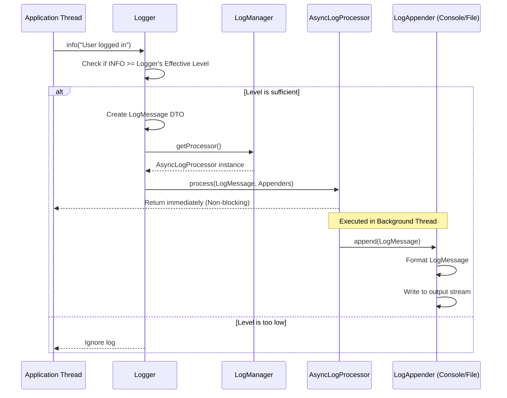

# Low-Level Design (LLD) of a Logging Framework

## 1. Problem Statement

In any production-grade software, logging is a critical aspect for monitoring, debugging, and auditing. The goal here is to design a flexible, extensible, and thread-safe Logging Framework (similar to Log4j or SLF4J) that can be easily integrated into any application.

**Key Requirements:**
1. **Log Levels:** Support for various log levels (e.g., DEBUG, INFO, WARN, ERROR, FATAL) to filter log granularity.
2. **Multiple Output Destinations (Appenders):** Ability to log messages to different destinations like Console, File, or external systems simultaneously.
3. **Custom Formatting:** Support for configurable message formats (e.g., plain text, JSON).
4. **Logger Hierarchy & Additivity:** Loggers should follow a namespace hierarchy (e.g., `com.example.service`). A child logger should inherit configurations from its parent, and logs should naturally propagate up the hierarchy (additivity).
5. **Asynchronous Logging:** The logging framework should not block the main execution thread of the application. It should be highly performant.
6. **Thread Safety:** The framework must safely handle concurrent log requests from multiple threads.

---

## 2. System Architecture & Core Components

To solve this, we can divide our framework into a few distinct, decoupled components. 

### Core Entities:

1. **LogManager:** The central entry point. It manages the lifecycle of all loggers, maintains the logger hierarchy, and handles the asynchronous logging processor.
2. **Logger:** The primary interface for the client. It captures the log message and the severity level. Each logger has a name, a designated log level, a parent logger, and a list of appenders.
3. **LogMessage:** A simple data transfer object (DTO) containing the timestamp, severity level, logger name, and the actual message.
4. **LogAppender:** An interface defining *where* the log goes (Console, File, Database).
5. **LogFormatter:** An interface defining *how* the log looks before it's written.
6. **AsyncLogProcessor:** A background worker (using a thread pool) that actually takes the log messages and writes them to the appenders, ensuring the main application thread isn't blocked.

---

## 3. Design Principles and Patterns Applied

To ensure our system is highly extensible and maintainable (crucial for an SDE-2 interview), I have leveraged several Object-Oriented Design principles and GoF Design Patterns:

### Design Patterns:
- **Singleton Pattern (`LogManager`):** The system should only have one registry of loggers and one asynchronous processor. `LogManager` is implemented as a Singleton to provide a global point of access.
- **Strategy Pattern (`LogAppender`, `LogFormatter`):** The logic for formatting a log and writing a log changes frequently. By defining interfaces for these, we allow clients to inject their own strategies (e.g., `ConsoleAppender`, `JSONFormatter`) at runtime without modifying the core Logger code (Open/Closed Principle).
- **Chain of Responsibility Pattern (Logger Additivity):** When a logger receives a log, it processes it through its own appenders and then optionally passes it up to its parent logger's appenders. This forms a chain.
- **Flyweight / Registry Pattern (`LogManager`):** The `LogManager` caches `Logger` instances in a ConcurrentHashMap. If a client requests a logger named `com.api` twice, they get the exact same object, saving memory and ensuring consistent configuration.

### SOLID Principles:
- **Single Responsibility Principle (SRP):** `Logger` only decides *if* a log should be processed. `LogAppender` handles the *destination*. `LogFormatter` handles the *look*. `AsyncLogProcessor` handles the *concurrency*.
- **Open/Closed Principle (OCP):** You can add a new destination (e.g., `KafkaAppender`) by simply implementing the `LogAppender` interface without touching existing code.

---

## 4. Flow of a Log Request

When a user calls `logger.info("User logged in");`, here is the exact sequence of events.

---

## 5. Deep Dive into Specific Mechanisms (Interview Focus Areas)

### A. Hierarchical Loggers and Additivity
Loggers are named using dot notation (e.g., `com.myapp.db`). When a logger is created, the `LogManager` parses this name. If `com.myapp` exists, it becomes the parent. If not, `root` becomes the parent.

**Effective Level Resolution:** If a logger doesn't have a specific log level set, it recursively checks its parent's level, going all the way up to `root`.

**Additivity:** By default, if `com.myapp.db` logs a message, it writes to its own appenders, and then calls `parent.callAppenders()`. This continues up to `root`. This allows you to attach a `FileAppender` to `root` to catch *everything*, and a special `ConsoleAppender` to `com.myapp.db` to see DB logs on the screen as well.

### B. High-Performance Asynchronous Logging
Writing to a file or a network socket is slow (I/O bound). If the main application thread waits for the log to be written, application performance degrades drastically.

**Solution:**
We use an `AsyncLogProcessor`. When a logger accepts a message, it packages the `LogMessage` and its `Appenders` and submits them to an `ExecutorService` (a background thread pool). 
- The main thread returns instantly.
- The background daemon thread picks up the task and performs the actual I/O.
- We use a Daemon thread so that the JVM can gracefully shut down even if the logger thread is idle. We also implement a graceful `shutdown()` hook in `LogManager` to await termination and flush remaining logs before the app dies.

### C. Thread Safety
Since multiple application threads will use the same Logger instances simultaneously:
1. `LogManager` uses a `ConcurrentHashMap` to store and retrieve loggers safely.
2. `Logger` uses a `CopyOnWriteArrayList` to store `Appenders`. This ensures that if an appender is added or removed dynamically at runtime, iterating over appenders during a log event doesn't throw a `ConcurrentModificationException`.

---

## 6. How to Drive the Interview (Talking Points)

If you are asked this in an interview, here is how you structure your verbal explanation:

1. **Start High-Level:** *"To build a robust logging framework, I'd split the problem into three main responsibilities: capturing the log (Logger), formatting it (LogFormatter), and writing it (LogAppender). I'd manage all this through a central Singleton called LogManager."*
2. **Address Concurrency Early:** Interviewers care about performance. Say, *"Since I/O operations are slow, I will make the logging asynchronous. The Logger will just drop the message into a queue or an ExecutorService, and a background thread will actually write it. This prevents the application from slowing down."*
3. **Explain the Hierarchy:** Explain how dot-notation works. *"I'll implement a parent-child relationship. `com.amazon` is the parent of `com.amazon.cart`. This allows us to set a DEBUG level for the cart service while keeping the rest of the application at INFO."*
4. **Mention SOLID/Patterns:** Explicitly drop the names of the patterns you are using. *"I'll use the Strategy pattern for Appenders so users can easily plug in a Database or Kafka appender later without modifying my core framework."*
5. **Handle Edge Cases:** Discuss what happens on application shutdown. *"I'd implement a shutdown hook in the LogManager to gracefully terminate the ExecutorService and flush any remaining logs in the queue before closing the file streams."*
