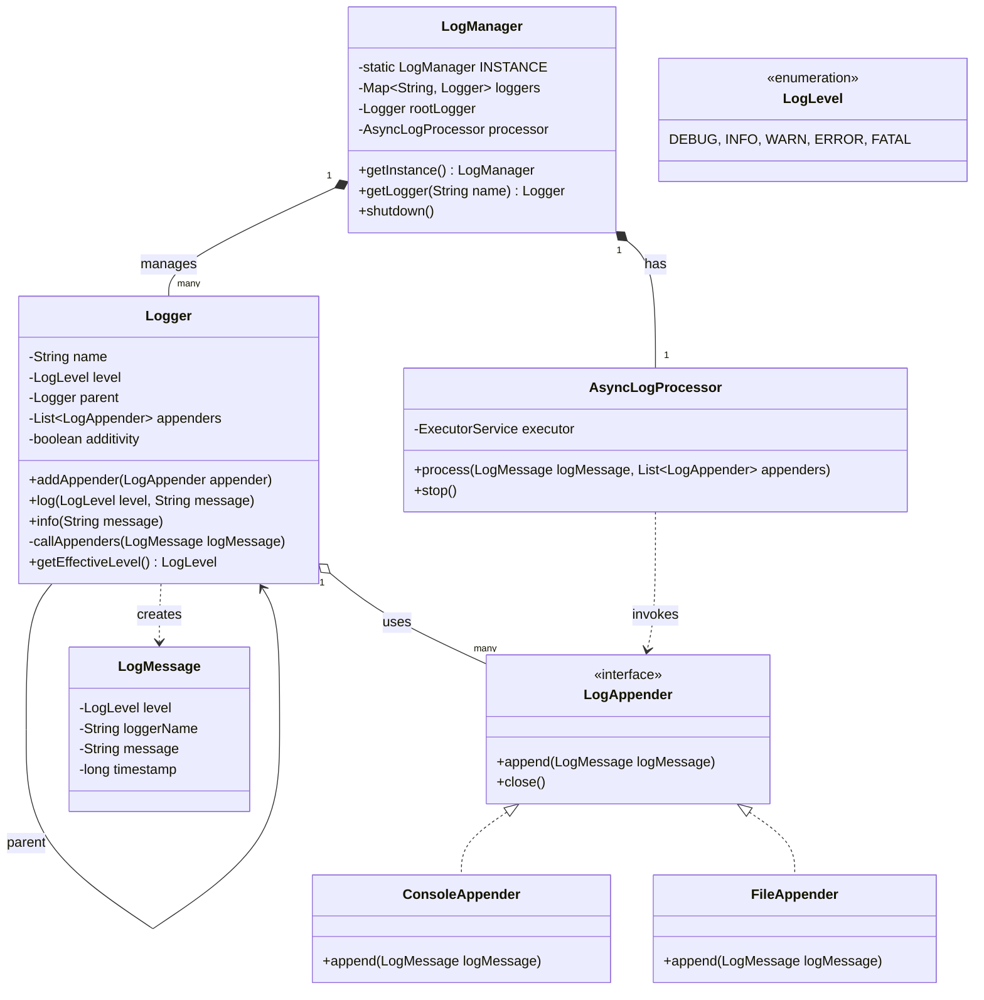
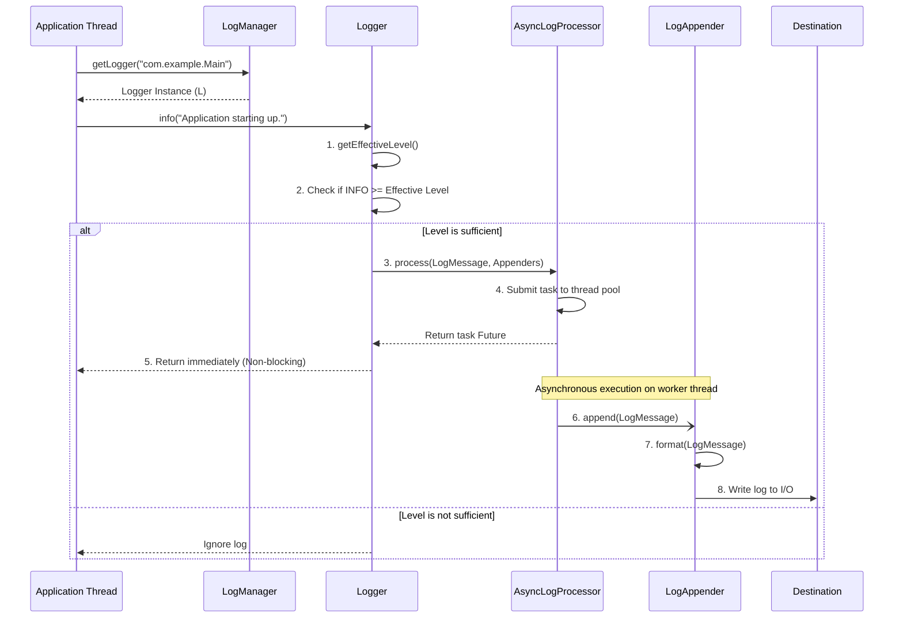

# Low-Level Design (LLD): Logging Framework

## 1. Problem Statement
**Interviewer:** "Design a flexible and extensible Logging Framework."

**Your Goal:** To design a library that can be integrated into any application to handle logging. It should allow developers to log messages at various levels (INFO, DEBUG, ERROR), format these messages, and route them to multiple destinations (console, file, database) without blocking the main application flow.

---

## 2. Requirements Gathering

*When you start the interview, clarify the requirements clearly. Mention functional and non-functional requirements to show structured thinking.*

### **Functional Requirements:**
1. **Multiple Log Levels:** Support for `DEBUG`, `INFO`, `WARN`, `ERROR`, `FATAL`.
2. **Multiple Destinations (Appenders):** Should be able to route logs to the Console, a File, or potentially over the network/DB.
3. **Custom Formatting:** Support custom formats for the logs (e.g., JSON, Plain Text).
4. **Hierarchical Loggers:** Loggers should inherit configurations from a parent or root logger (e.g., `com.example.service` inherits from `com.example`).
5. **Additivity:** A child logger can pass its log messages to its parent's appenders.

### **Non-Functional Requirements:**
1. **Thread-Safe:** Multiple threads will log concurrently; the framework must handle this safely.
2. **Low Latency (Asynchronous):** Writing logs to a file or DB can be slow. The logging framework should not block the main application thread.
3. **Extensibility:** It should be easy to add new appenders or formatters without changing the core framework.

---

## 3. Core Components

*Explain the actors in your system briefly.*

1. **`LogManager`**: A central hub that creates and manages all logger instances.
2. **`Logger`**: The main interface used by the application to log messages. Contains logic to check log levels and pass messages to appenders.
3. **`LogMessage`**: An entity representing the log event (holds timestamp, level, message, and logger name).
4. **`LogAppender`**: An interface representing the destination. Implementations include `ConsoleAppender`, `FileAppender`.
5. **`LogFormatter`**: An interface representing the layout/format of the message before it is appended.
6. **`AsyncLogProcessor`**: Handles processing log messages asynchronously via an `ExecutorService` so the main application thread is not blocked.

---

## 4. Design Principles (SOLID) and Patterns

*This is the most critical part of an SDE-2 interview. Explicitly mention these.*

### **Design Patterns Used:**
1. **Singleton Pattern (`LogManager`):** 
   - We need only one instance of the `LogManager` to manage the cache of loggers globally across the application.
2. **Strategy Pattern (`LogAppender`, `LogFormatter`):**
   - Writing to a console vs. a file are different strategies. We inject the specific `LogAppender` strategy into the `Logger` at runtime.
3. **Chain of Responsibility / Hierarchy (`Logger` tree):**
   - Loggers are structured in a tree (e.g., `com.example` is the parent of `com.example.service`). If a child doesn't have a specific log level set, it inherits it from its parent. If `additivity` is true, the child forwards the log to the parent's appenders.
4. **Observer / Producer-Consumer Pattern (`AsyncLogProcessor`):**
   - The application thread *produces* a log task and hands it to the `AsyncLogProcessor`. The internal worker thread *consumes* it and writes it to the IO destination.

### **SOLID Principles Achieved:**
- **Single Responsibility Principle (SRP):** `Logger` routes logs, `LogAppender` writes them, `LogFormatter` formats them. Each class does exactly one thing.
- **Open/Closed Principle (OCP):** If we want to add a `DatabaseAppender`, we simply create a new class implementing `LogAppender`. We do not touch the existing `Logger` or `LogManager` code.
- **Dependency Inversion Principle (DIP):** The `Logger` relies on the `LogAppender` interface, not concrete classes like `ConsoleAppender`.

---

## 5. System Architecture & Flow

*Use these diagrams to visualize your design during the explanation.*

### **A. Class Diagram**

### **B. Execution Flow (Sequence Diagram)**

*Walk the interviewer through what happens when someone calls `logger.info("...")`.*

---

## 6. How to Explain This in the Interview (The Script)

**1. The Setup (LogManager & Logger):**
> "To start, we need a way for the application to get a Logger. I'd use a `LogManager` which follows the Singleton pattern. When an application asks for a logger by name, say `com.abc.service`, the `LogManager` creates it, caches it in a thread-safe `ConcurrentHashMap`, and links it to its parent logger (`com.abc`). This establishes our Logger Hierarchy."

**2. Handling the Log Call (Effective Level):**
> "When the client calls `logger.info("msg")`, the logger first checks its `Effective Level`. If the logger doesn't have a specific log level set, it recurses up to its parent until it hits the `root` logger. If the incoming message's level (`INFO`) is greater than or equal to the effective level, we proceed to create a `LogMessage` object."

**3. Asynchronous Non-Blocking I/O:**
> "Writing logs to a file is an I/O bound operation. If we do this on the main application thread, it will degrade the application's performance. Therefore, I've introduced an `AsyncLogProcessor`. The logger takes the `LogMessage` and its list of `LogAppenders`, and hands it to the `AsyncLogProcessor`."
> 
> "The processor submits a task to a background `ExecutorService`. The main thread returns immediately. The background thread takes care of invoking `appender.append()`."

**4. Writing the Log (Appender & Formatter):**
> "Finally, the `LogAppender` receives the message. Following the Strategy pattern, we can have a `ConsoleAppender` or a `FileAppender`. The appender uses a injected `LogFormatter` to turn the `LogMessage` object into a final String (like JSON or plain text) and writes it to the destination."

**5. Graceful Shutdown:**
> "An important edge case is when the application shuts down. We need to ensure we don't lose logs that are waiting in the async queue. The `LogManager.shutdown()` method gracefully shuts down the `AsyncLogProcessor`, waits for pending tasks to complete, and then calls `close()` on all appenders to release file locks."
