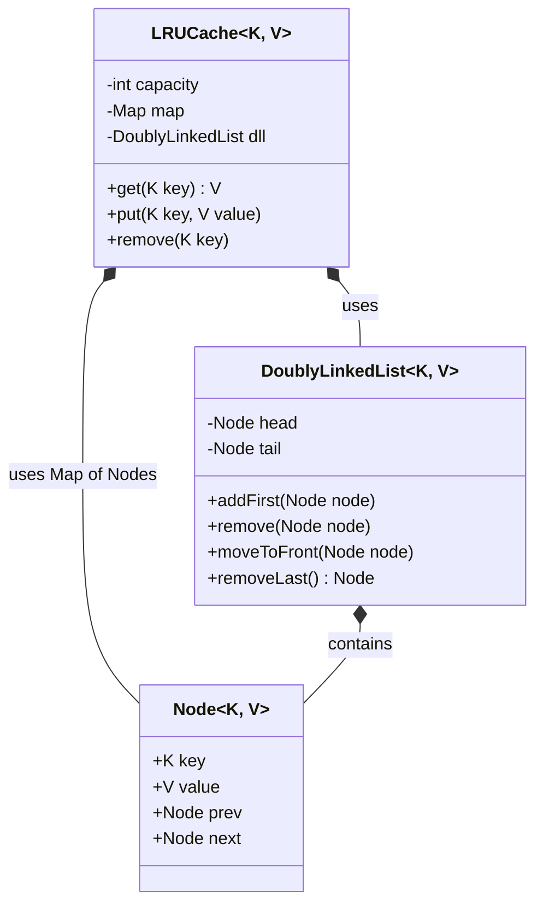
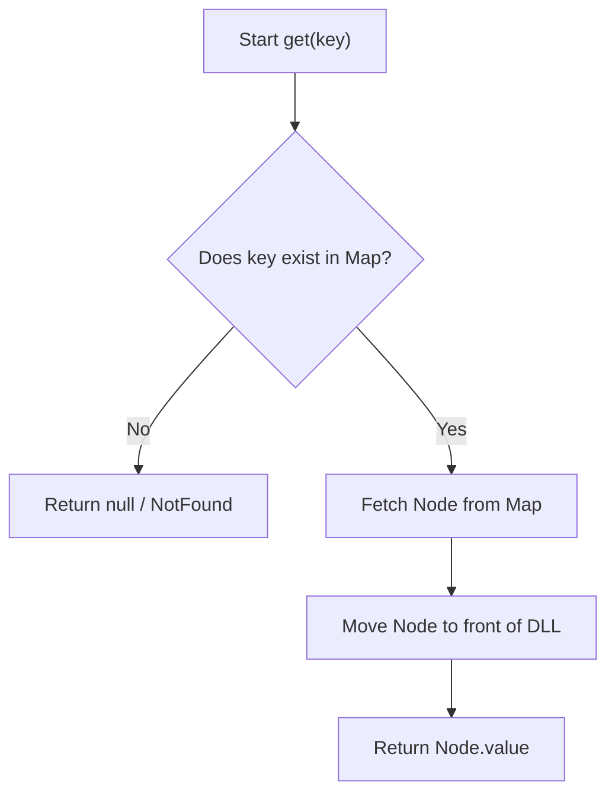
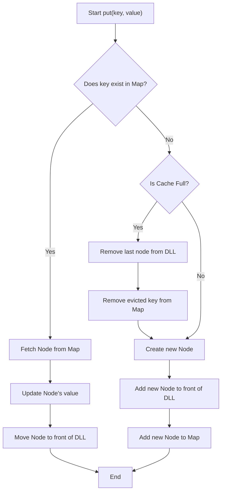

# LRU Cache - Low Level Design (Interview Guide)

This document is prepared to help you articulate the Low-Level Design (LLD) of an **LRU (Least Recently Used) Cache** effectively in an SDE-2 interview at companies like Microsoft.

---

## 1. Problem Statement

An LRU Cache is a data structure that stores a limited number of items. When the cache reaches its capacity and a new item needs to be inserted, it must evict the **Least Recently Used** item to make space. 

### Requirements to clarify with the interviewer:
*   **Functional Requirements:**
    *   `put(key, value)`: Insert a new key-value pair or update an existing one. If the cache is full, evict the least recently used item.
    *   `get(key)`: Retrieve the value associated with the key. If the key is accessed, it becomes the most recently used item. Return null/exception if the key doesn't exist.
    *   `remove(key)`: Remove a specific key from the cache.
*   **Non-Functional Requirements:**
    *   Operations (`get` and `put`) should ideally work in **O(1)** time complexity.
    *   The cache should be **Thread-Safe** to handle concurrent requests in a multi-threaded environment.
    *   The design should be generic to support different data types for keys and values.

---

## 2. Approach & Data Structures Used

To achieve **O(1)** time complexity for both access and eviction, we need a combination of two data structures:

1.  **HashMap (Map):** Gives us **O(1)** lookup time to find if a key exists and returns the pointer to its location.
2.  **Doubly Linked List (DLL):** Gives us **O(1)** time to add, remove, and move elements. We maintain the "Most Recently Used" items at the front (head) and the "Least Recently Used" items at the back (tail).

*Why not an Array or Singly Linked List?*
If we used an array, shifting elements to maintain order would take O(N). If we used a Singly Linked List, removing an element from the middle (when it gets accessed and needs to move to the front) would take O(N) because we wouldn't have a pointer to the previous node.

---

## 3. Class Design

Our implementation separates concerns by splitting the logic into three independent classes:

1.  `Node<K, V>`: Represents a single entry in the cache.
2.  `DoublyLinkedList<K, V>`: Manages the ordering of nodes (MRU to LRU).
3.  `LRUCache<K, V>`: Manages the HashMap and interacts with the DLL to expose the Cache API.

### Class Diagram

---

## 4. Operation Workflows (Flowcharts)

### `get(key)` Flow

When a user fetches a key, we must check if it exists. If it does, we must move it to the front of our DLL to mark it as most recently used.

### `put(key, value)` Flow

When inserting or updating, we have to handle capacity and reordering.

---

## 5. Design Principles & Best Practices Applied

If the interviewer asks *why* you coded it this way, you can highlight these principles:

1.  **Single Responsibility Principle (SRP):** 
    Instead of cramming the linked list logic inside the `LRUCache` class, we extracted a `DoublyLinkedList` class. The `DoublyLinkedList` only worries about pointer manipulation, while `LRUCache` worries about cache eviction policies and HashMap lookups.
    
2.  **Separation of Concerns:** 
    By using Dummy Head and Dummy Tail nodes in the `DoublyLinkedList` constructor (`head = new Node(null, null); head.next = tail;`), we completely eliminate null pointer checks when inserting or deleting nodes. This simplifies the code vastly.

3.  **Generics:** 
    The classes are defined as `<K, V>`. This makes the cache highly reusable. The user can create an `LRUCache<String, Integer>` or `LRUCache<Integer, UserObject>`.

4.  **Thread Safety (Concurrency):**
    In the provided implementation, the `get`, `put`, and `remove` methods in the `LRUCache` class are marked as `synchronized`. This ensures that in a multi-threaded environment, two threads won't corrupt the HashMap or the Doubly Linked List pointers at the same time.
    
    *SDE-2 Pro-Tip (Bonus):* You can mention to the interviewer that while `synchronized` works, it locks the entire cache, which might cause a bottleneck under high load. A better real-world implementation might involve lock striping (like `ConcurrentHashMap`) and `ReentrantReadWriteLock`, or sharding the cache into smaller segments to increase concurrency.

---

## 6. How to present this in the interview

1.  **Start with the Interface:** Before writing implementation code, write down the interface or the method signatures. Show the interviewer you think about the API first.
2.  **Discuss Data Structures:** Verbally explain why you need *both* a Map and a DLL. Draw a small visual representation on the whiteboard/pad (e.g., `Map -> DLL Nodes`).
3.  **Write the Node and DLL first:** Build the foundational blocks first. Write the dummy head/tail logic and show how `addFirst` and `remove` are easily implemented.
4.  **Implement the Cache:** Finally, stitch them together in the `LRUCache` class. 
5.  **Address Concurrency:** Bring up thread safety *proactively* before the interviewer asks about it. Mention the `synchronized` keyword and its trade-offs. 

By following this narrative, you demonstrate strong modular design, an understanding of algorithmic complexity, and awareness of real-world multi-threading concerns—exactly what is expected of an SDE-2.
