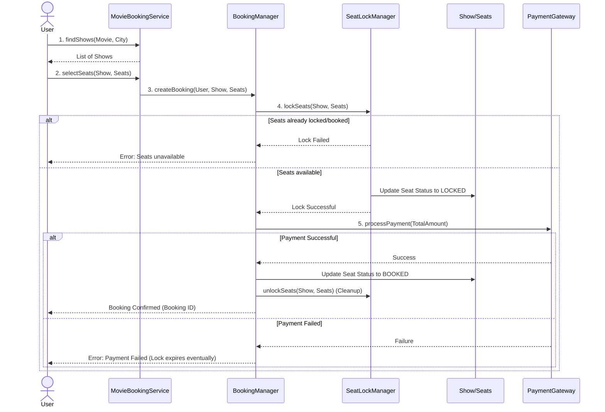
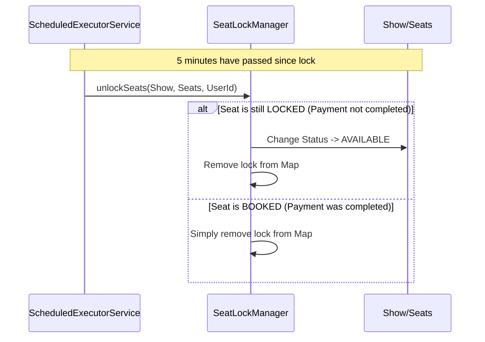

# Movie Ticket Booking System - Low Level Design (LLD)

## 1. Introduction & Problem Statement
**Interviewer:** "Design a Movie Ticket Booking System like BookMyShow or Fandango."

**Candidate (You):** "Sure! The primary goal of a movie ticket booking system is to allow users to search for movies in their city, choose a cinema and showtime, select their preferred seats, and make a payment to confirm the booking. 

The biggest challenge in this system is **concurrency**—handling the scenario where two users try to book the exact same seat at the exact same time. We must ensure that a seat is only booked by one person without causing deadlocks or a bad user experience.

### Key Requirements
1. **Browse Movies & Shows:** Users can select a city and see available movies and their showtimes across various cinemas.
2. **Seat Selection:** Users can view the seating arrangement and select available seats.
3. **Booking & Payment:** Users can book selected seats by making a payment.
4. **Concurrency (Seat Locking):** When a user selects a seat, it should be temporarily locked for a few minutes to allow them to complete the payment. If the payment fails or times out, the seat becomes available again.
5. **Notifications:** Users can be notified when a new movie is released or a show is added.

---

## 2. Core Entities & Models
Before jumping into the services, let's identify the core nouns (entities) in our system.

*   **City:** Represents a geographical location (e.g., New York, Los Angeles).
*   **Cinema:** A theater building located in a city. It contains multiple screens.
*   **Screen:** An auditorium inside a cinema that has a specific seating arrangement.
*   **Movie:** The film being screened (e.g., "The Matrix").
*   **Seat:** A physical seat in a screen. It has a type (Regular, Premium) and a status (Available, Locked, Booked).
*   **Show:** A specific screening of a Movie in a Screen at a particular time.
*   **User:** The customer interacting with the system.
*   **Booking:** Represents a confirmed reservation.
*   **Payment:** Represents the transaction details.

---

## 3. System Architecture & Components
To keep the system modular and maintainable, I have divided the logic into specific managers and services.

1.  **MovieBookingService:** This is the main entry point (Facade) of our system. It acts as a central registry to add movies, cinemas, users, and shows.
2.  **BookingManager:** This component orchestrates the actual booking workflow. It talks to the seat locking mechanism, calculates the price, and processes the payment.
3.  **SeatLockManager:** This is the heart of our concurrency control. It ensures that seats are locked exclusively for a user for a short duration.

---

## 4. Design Principles & Patterns Used
I have heavily utilized **SOLID principles** and standard design patterns to make the codebase extensible.

### 1. Singleton Pattern
*   **Where:** `MovieBookingService`
*   **Why:** The main service acts as the central orchestrator and data store for our application. We only want one instance of it running to prevent inconsistencies.

### 2. Strategy Pattern
*   **Where:** Pricing & Payments (`PricingStrategy`, `PaymentStrategy`)
*   **Why:** Pricing can vary (e.g., `WeekdayPricingStrategy` vs. `WeekendPricingStrategy`). Similarly, users can pay via Credit Card, UPI, or PayPal. The Strategy pattern allows us to plug in different algorithms at runtime without modifying the core booking logic (Open/Closed Principle).

### 3. Observer Pattern
*   **Where:** Movie Notifications (`MovieSubject`, `UserObserver`)
*   **Why:** Users might want to be notified when bookings open for a highly anticipated movie (like "Avengers: Endgame"). By using the Observer pattern, users can subscribe to a `Movie`, and when the movie is released, the system broadcasts a notification to all subscribers.

### 4. Builder Pattern
*   **Where:** `Booking` object creation.
*   **Why:** A `Booking` object has many attributes (user, show, seats, total amount, payment details). Using a Builder (`Booking.BookingBuilder`) makes the object creation clean and prevents complex constructors.

---

## 5. Handling Concurrency (The Tricky Part)
**Interviewer:** "How do you handle the situation where two users click on the same seat at the same time?"

**Candidate (You):** "To handle this, I've introduced a `SeatLockManager`. When a user selects a seat to proceed to payment, the system doesn't immediately book it. Instead, it **locks** the seat temporarily."

Here is how it works under the hood:
1.  **Synchronization:** We use a `synchronized (show)` block. When multiple threads try to lock seats for the same show, they are processed sequentially. This guarantees atomicity.
2.  **In-Memory Locks:** I use a `ConcurrentHashMap` to store which user has locked which seat.
3.  **Timeouts:** I use a `ScheduledExecutorService`. As soon as a seat is locked, a background task is scheduled to run after a timeout (e.g., 5 minutes). 
4.  **Expiration:** If the user completes the payment, the seat status becomes `BOOKED`, and the background task safely removes the lock. If the user doesn't pay in time, the background task executes, sees the seat is still `LOCKED`, and reverts it to `AVAILABLE`.

---

## 6. Flow Charts (Visualizing the Logic)

### A. Core Booking Flow
Here is the sequence of events when a user tries to book a ticket.

### B. Seat Lock Timeout Flow
What happens behind the scenes when a lock expires.

---

## 7. Interview Summary / Elevator Pitch
If asked to summarize the design in 2 minutes:

> *"My design is modular and built on SOLID principles. The `MovieBookingService` acts as the central facade. The core business logic is split between the `BookingManager` (which orchestrates the booking and payment via Strategy patterns) and the `SeatLockManager`. I've solved the critical concurrency problem using synchronized blocks at the Show level, backed by a `ScheduledExecutorService` that handles lock timeouts automatically. Furthermore, the system is highly extensible—adding a new pricing strategy (like Surge Pricing) or a new payment method requires zero changes to the core logic."*
