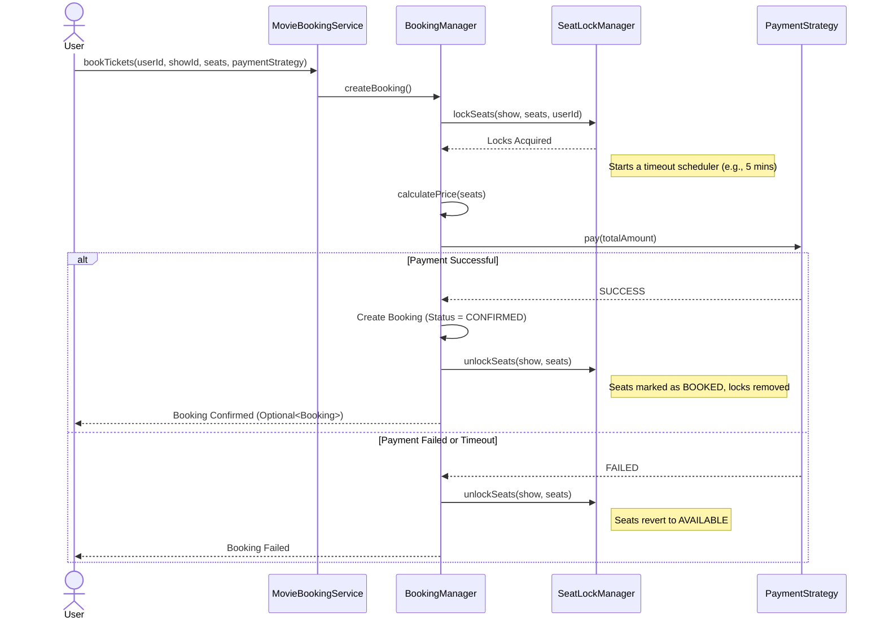
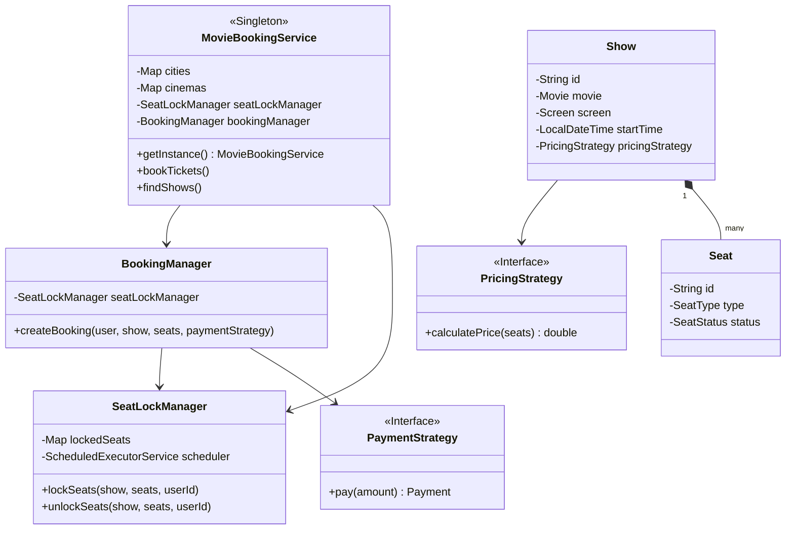

# Movie Ticket Booking System Low-Level Design (LLD) - Interview Guide

This guide breaks down the Low-Level Design of a Movie Ticket Booking System (like BookMyShow or Fandango), structured specifically for a Microsoft SDE-2 interview. It focuses on the problem statement, core components, concurrency handling (a critical aspect), and the design patterns used.

---

## 1. Problem Statement

Design a Movie Ticket Booking System where users can browse movies, view showtimes in different cities and cinemas, select seats, and book tickets. The system must seamlessly handle high concurrency, especially when multiple users attempt to book the exact same seats simultaneously.

### Key Functional Requirements:
*   **Browsing:** Users should be able to search for movies by city and view cinemas/showtimes.
*   **Seat Selection:** Users can view seat availability (Available, Locked, Booked) and select seats.
*   **Booking & Payment:** Users should be able to book selected seats and make payments using different methods.
*   **Concurrency Management:** The system must prevent double-booking of seats. A seat selected by a user should be temporarily locked.

### Non-Functional Requirements:
*   **Thread Safety:** The core booking process must be thread-safe.
*   **Fault Tolerance:** If a payment fails or a user abandons the booking, the locked seats must automatically become available again after a timeout.

---

## 2. Core Entities

The system revolves around these primary entities:

*   **City:** Represents a geographical location containing multiple cinemas.
*   **Cinema:** A physical theater building containing multiple screens.
*   **Screen:** A specific auditorium inside a cinema, containing a layout of seats.
*   **Seat:** An individual seat within a screen. It has a type (e.g., SILVER, GOLD, PLATINUM) and a status (`AVAILABLE`, `LOCKED`, `BOOKED`).
*   **Movie:** Details about the film (Title, Duration, Language).
*   **Show:** A scheduled screening of a specific `Movie` on a specific `Screen` at a specific time. It includes a `PricingStrategy`.
*   **Booking:** Represents a confirmed reservation made by a `User` for a `Show`, including the locked `Seats` and the associated `Payment`.

---

## 3. High-Level Flow Chart: The Booking Process

The following flow chart illustrates the sequence of operations when a user attempts to book tickets. This is exactly how you should explain the workflow to the interviewer.

---

## 4. Handling Concurrency: SeatLockManager (Crucial)

In an SDE-2 interview, the interviewer will heavily focus on how you handle concurrency (i.e., when two users try to book the same seat at the same time). 

### The Solution: Temporary Locking Mechanism

We implement a `SeatLockManager` that handles the temporary reservation of seats while the user is proceeding with payment.

**Key Implementation Details:**
1.  **In-Memory Locks:** We use a `ConcurrentHashMap<Show, Map<Seat, String>>` to map locked seats to a specific `userId` for a given `Show`. 
2.  **Granular Synchronization:** We synchronize the lock operation at the `Show` object level (`synchronized (show)`). This ensures atomicity for that specific show without bottlenecking the entire system.
3.  **Timeout Mechanism:** A background thread (using `ScheduledExecutorService`) is fired when seats are locked. If the booking isn't confirmed within a set timeframe (e.g., 10 minutes), the thread releases the lock, reverting the seat status to `AVAILABLE`.

**Why this works:**
*   By locking only the specific `Show`, we allow concurrent bookings for *different* shows to proceed without waiting.
*   If User A is on the payment screen, User B sees the seat as `LOCKED` and cannot select it.
*   The timeout guarantees that seats aren't permanently locked if a user's browser crashes or payment fails silently.

---

## 5. Applied Design Principles and Patterns

This system extensively utilizes Object-Oriented Design principles and GoF Design Patterns.

### 1. Singleton Pattern
*   **Where:** `MovieBookingService`
*   **Why:** We need a single, centralized coordinator to manage all in-memory data (cities, cinemas, shows) and handle interactions between the presentation layer and our core logic. We use double-checked locking to make it thread-safe.

### 2. Strategy Pattern
*   **Where:** `PricingStrategy` and `PaymentStrategy`
*   **Why:** 
    *   Pricing logic can vary greatly (e.g., dynamic pricing on weekends, surge pricing, standard seat-tier pricing). Injecting a `PricingStrategy` into a `Show` allows us to calculate prices dynamically without altering the core booking logic.
    *   `PaymentStrategy` decouples the booking flow from specific payment gateways (Credit Card, UPI, NetBanking).

### 3. Builder Pattern
*   **Where:** `BookingBuilder` inside the `Booking` class.
*   **Why:** A `Booking` object requires many parameters (User, Show, Seats, Payment, TotalAmount). Using a builder makes the construction process readable, less prone to errors (avoiding telescopic constructors), and ensures immutability once built.

### 4. Separation of Concerns (SRP - Single Responsibility Principle)
*   **Where:** Splitting logic into `MovieBookingService` (facade), `BookingManager` (workflow), and `SeatLockManager` (concurrency).
*   **Why:** It keeps classes focused. The `BookingManager` doesn't need to know *how* thread-safety is implemented; it just calls `lockSeats()`.

---

## 6. System Class Diagram

---

## 7. How to pitch this in an interview (The "Elevator Pitch")

> *"I have designed the Movie Ticket Booking System with high concurrency and modularity in mind. The entry point is the `MovieBookingService`, acting as a Singleton facade. The core complexity of double-booking is handled by a dedicated `SeatLockManager`. When a user attempts to book, I synchronize at the `Show` level to ensure atomicity, lock the specific seats in a `ConcurrentHashMap`, and trigger a background scheduler for a timeout mechanism. This ensures that if a payment fails or a session expires, the seats are automatically released without a memory leak.*
> 
> *To make the system extensible, I heavily relied on the Strategy pattern. Pricing logic is decoupled via a `PricingStrategy`, meaning we can easily implement surge pricing for blockbusters without touching the core `Show` logic. Similarly, payments are handled via a `PaymentStrategy`. Finally, to construct complex `Booking` records, I utilized the Builder pattern."*
