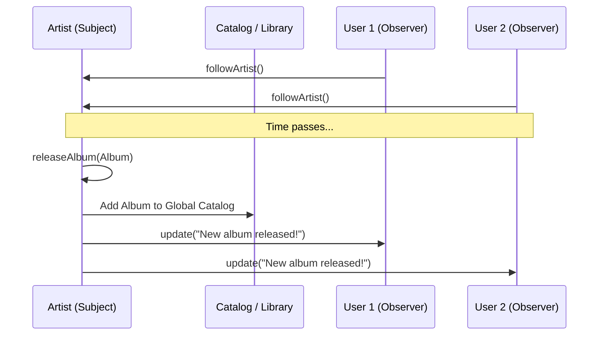
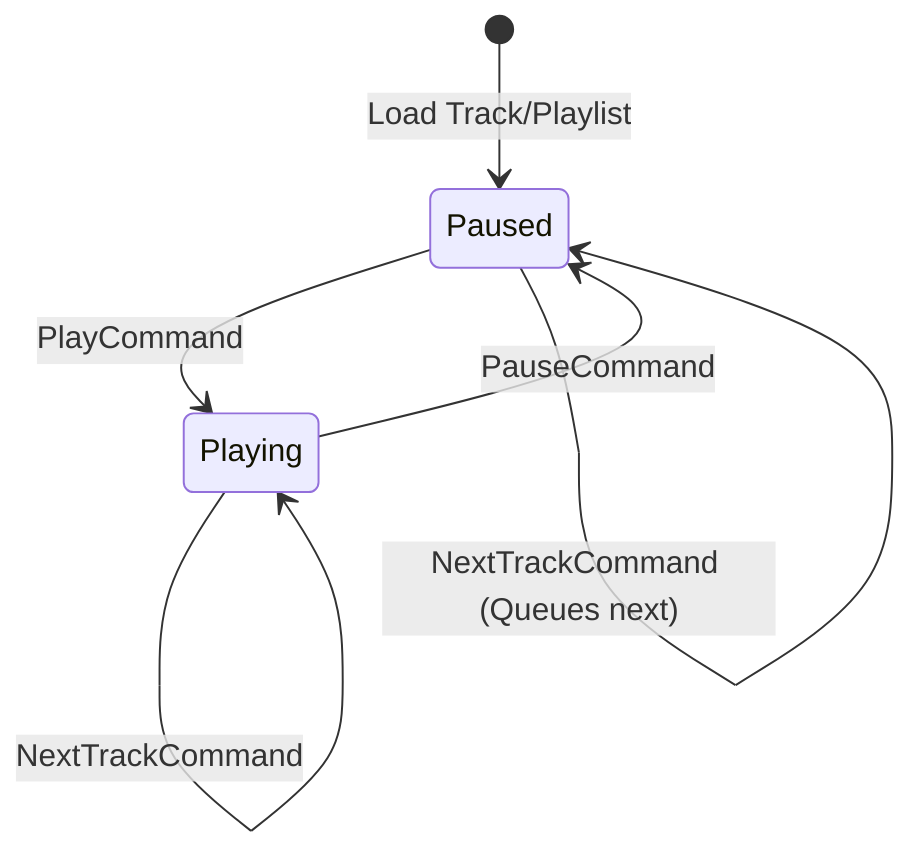

# Low-Level Design (LLD): Music Streaming Service (Spotify Clone)

**Target Audience:** Microsoft SDE-2 Interview Preparation  
**Goal:** Deliver a clear, structured, and pattern-rich explanation of a Music Streaming System.

---

## 1. Problem Statement

**Interviewer:** *"Design an online music streaming service like Spotify. Users should be able to search for songs, manage playlists, play music, and follow artists. We also have free and premium users, so the playback experience might differ (e.g., ads)."*

**My Response:** "Got it. I'll design a highly extensible music streaming service. The system will handle user subscriptions, library management, and smooth playback controls. I will heavily utilize object-oriented design patterns to keep the architecture decoupled, scalable, and easy to test."

---

## 2. Requirements

### Functional Requirements:
1. **User Management:** Users can register, choose a subscription tier (Free vs. Premium), and manage profiles.
2. **Catalog Management:** The system stores and manages Songs, Albums, and Artists.
3. **Playback Control:** Users can play, pause, and skip tracks. Playlists and Albums should both be playable collections.
4. **Subscription Behavior (Monetization):** Free users should hear advertisements between songs; Premium users get uninterrupted, ad-free listening.
5. **Notifications:** Users can follow Artists and get notified when a new album is released.
6. **Recommendations & Search:** Suggest songs based on user preferences and search by title.

### Non-Functional Requirements:
- **Extensibility:** Adding new playback features or subscription rules (like a 'Family Plan') should not require modifying existing core logic.
- **Maintainability:** Code must adhere strictly to SOLID principles.
- **Modularity:** The UI (or API controllers) should be decoupled from the core playback engine.

---

## 3. Core Entities

Before jumping into complex logic, let's define the primary entities in our domain model:

- **Song:** Basic unit of music (ID, Title, Artist, Duration in seconds).
- **Album / Playlist:** Collections of songs.
- **Artist:** Creator of songs and albums.
- **User:** The consumer (ID, Name, Subscription Tier, Followed Artists).
- **Player:** The component responsible for executing playback commands and managing state.

---

## 4. Design Patterns Applied (The "SDE-2" Factor)

To make the system robust and demonstrate seniority, I applied several Gang of Four (GoF) design patterns. Here is how and *why* they were used:

### A. Singleton Pattern (System Initialization)
The `MusicStreamingSystem` acts as the central facade and repository (acting as an in-memory database wrapper for this demo). We only need **one instance** of this system running.
- **Implementation:** Double-checked locking ensures thread safety during initialization, preventing race conditions if multiple threads try to boot the system simultaneously.

### B. Builder Pattern (Complex Object Creation)
Users can have various configurations (Free tier, Premium tier, offline limits, etc.). 
- **Implementation:** A `User.Builder` simplifies user creation and ensures the immutability of core properties upon construction. It avoids the "telescoping constructor" anti-pattern.

### C. Observer Pattern (Push Notifications)
Users want to be notified when their favorite artist drops a new album. Polling the database continuously is inefficient.
- **Implementation:** `Artist` acts as the **Subject** (Publisher) and `User` acts as the **Observer** (Subscriber). When `artist.releaseAlbum()` is called, it iterates through its list of followers and pushes an update directly.

### D. Strategy Pattern (Subscription Tiers & Ads)
Free users hear ads; Premium users don't. Hardcoding `if (user.isFree()) { playAd(); } else { playSong(); }` inside the player logic violates the Open-Closed Principle.
- **Implementation:** The `Player` delegates the "What to play next" logic to a `PlaybackStrategy`. A `FreeUserPlaybackStrategy` keeps a counter and inserts an ad every 3 songs, while a `PremiumUserPlaybackStrategy` simply queues up the next song.

### E. Command Pattern (Playback Controls)
The user interface needs to issue commands like Play, Pause, and Next without knowing *how* the player executes them or what its internal state is.
- **Implementation:** `PlayCommand`, `PauseCommand`, and `NextTrackCommand` encapsulate the request. The UI just calls `command.execute()`. This makes it incredibly easy to add features like a "Playback History" or remote control functionality.

### F. State Pattern (Player States)
A player behaves differently based on its current state (Playing, Paused). Calling "Play" while already playing shouldn't restart the song, but calling it while paused should resume it.
- **Implementation:** Instead of massive switch statements checking booleans (`isPlaying`, `isPaused`), we use a `PlayerState` interface (`PlayingState`, `PausedState`). The Player delegates actions to its current state object.

### G. Composite Pattern (Playable Collections)
A `Player` needs to play both `Albums` and `Playlists`.
- **Implementation:** Both `Album` and `Playlist` implement a common `PlayableCollection` interface (or hold a list of playable tracks). This allows the Player to iterate over a list of tracks uniformly, treating an Album and a Playlist identically during playback.

---

## 5. System Flow Charts

To visualize how these patterns interact, here are a few critical system flows.

### Flow 1: Playback Logic with Strategy Pattern (Ads vs. No Ads)

Here is how the system determines what audio to output next when a user finishes a song or clicks 'Next'.

```mermaid
graph TD
    A[User clicks 'Next Track'] --> B[NextTrackCommand.execute()]
    B --> C[Player.next()]
    C --> D{Evaluate PlaybackStrategy}
    
    D -->|Free User| E[FreePlaybackStrategy]
    D -->|Premium User| F[PremiumPlaybackStrategy]
    
    E --> G{Tracks played since last Ad >= 3?}
    G -->|Yes| H[Play Audio Ad]
    G -->|No| I[Play Next Song in Queue]
    H --> J[Reset Ad Counter]
    
    F --> I[Play Next Song in Queue]
```

### Flow 2: Artist Notification (Observer Pattern)

This demonstrates the decoupled nature of notifications when new music drops.



### Flow 3: Player State Machine (State Pattern)

This ensures the player transitions safely between logical states.



---

## 6. Interview Talking Points & Final Summary

If asked to summarize your design at the end of the interview, use this professional summary:

> "My design for the Music Streaming Service focuses heavily on the **SOLID principles** and loose coupling. 
> 
> I isolated the playback mechanics using the **State and Command patterns**, ensuring the UI is entirely decoupled from the core audio engine. To handle evolving business requirements—like differing ad experiences for Free vs. Premium users—I utilized the **Strategy pattern**. This guarantees that if marketing introduces a new 'Student Tier', we simply write a new strategy class without touching existing player code. 
> 
> Furthermore, the **Observer pattern** allowed me to build a highly responsive, real-time notification system for artist followers without tightly coupling users to the artists they follow. The resulting system is scalable, testable, and highly cohesive."
