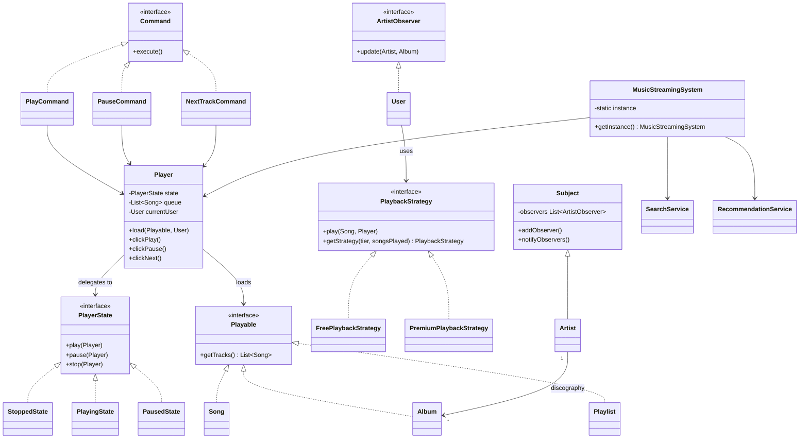
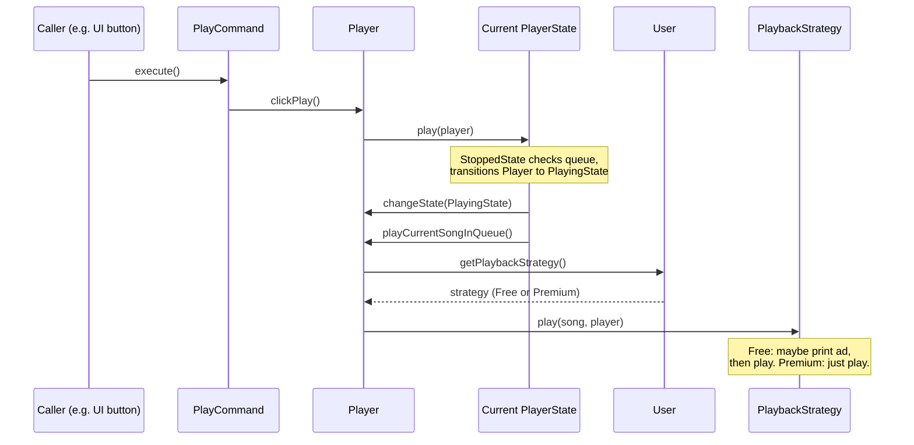
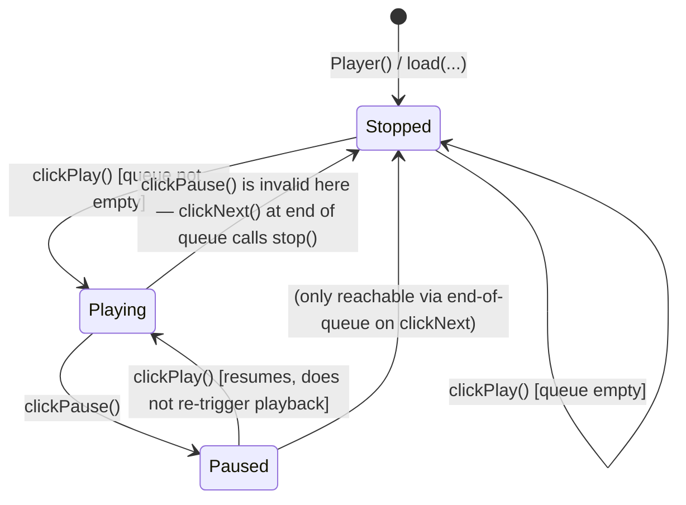
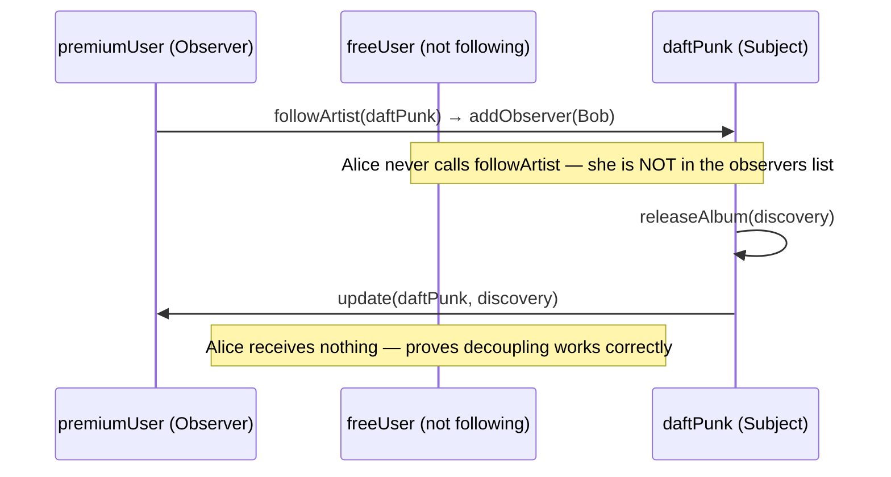
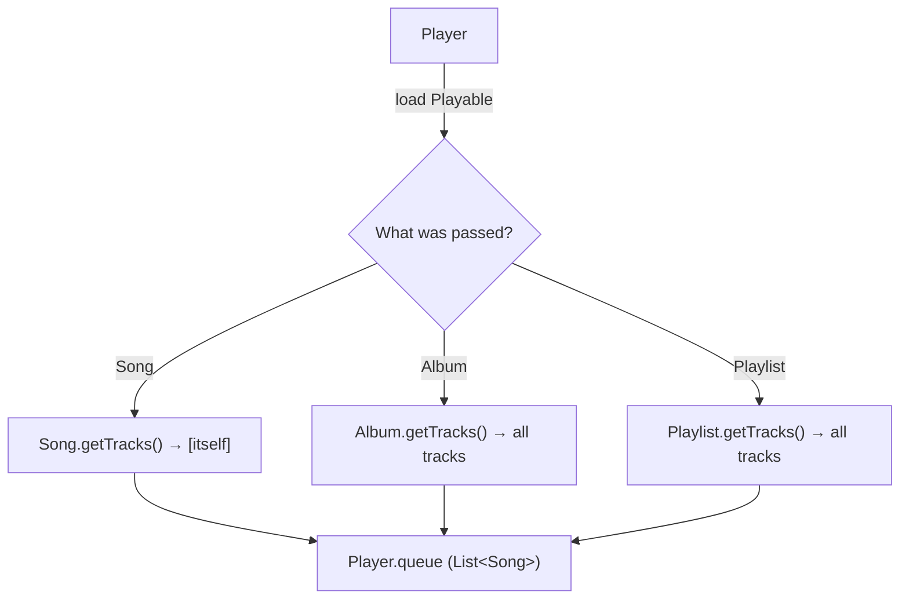

# Low-Level Design: Music Streaming Service (Spotify-style)

**Prepared for:** Microsoft SDE-2 LLD Interview
**Code reference:** `solutions/java/src/musicstreamingservice/`

This document explains the problem, the design, and the exact code we built — in the words you'd actually say out loud in an interview. Read it top to bottom once, then use the "How to narrate" boxes as your script.

---

## 1. Problem Statement

> **Interviewer:** "Design a music streaming service like Spotify. Users should be able to browse a catalog of songs/albums, create playlists, play/pause/skip tracks, follow artists, search, and get recommendations. There are Free and Premium users — Free users hear ads."

### Clarifying questions to ask first (shows maturity)
- Is this a single-process backend design, or do we need to think about distributed playback/streaming (CDN, buffering)? → *Assume single-process in-memory system; focus on OOP design, not infra.*
- Can a song belong to multiple albums/playlists? → *Yes, many-to-many.*
- What exactly differs between Free and Premium? → *Ads every N songs for Free; no ads for Premium.*
- Do we need persistence (DB)? → *No, in-memory catalog is fine for this exercise.*
- Do we need concurrency handling? → *Keep it in mind, but don't over-engineer; call out where thread-safety would need work.*

### Functional Requirements
1. **Catalog management** — Artists, Songs, Albums.
2. **Playlists** — user-created, ordered collections of songs.
3. **Playback control** — play, pause, next — behaves correctly regardless of current player state.
4. **Subscription-based playback** — Free users get an ad after every 3 songs; Premium users don't.
5. **Follow / notify** — a user can follow an artist and gets notified when that artist releases a new album.
6. **Search** — find songs by title.
7. **Recommendations** — suggest songs to a user.

### Non-Functional Requirements
1. **Open/Closed** — adding a new subscription tier, a new recommendation algorithm, or a new remote-control command should not require touching existing classes.
2. **Single point of truth** — one system-wide registry of users/songs/artists.
3. **Testability** — playback logic, state transitions, and recommendation logic should be unit-testable in isolation.

---

## 2. Core Entities

| Entity | Responsibility |
|---|---|
| `Song` | Basic playable unit: id, title, artist, duration. |
| `Album` | Ordered collection of songs released by an artist. |
| `Playlist` | User-curated ordered collection of songs. |
| `Artist` | Owns a discography; can be followed; publishes album-release events. |
| `User` | Consumer; has a subscription-driven playback strategy; can follow artists. |
| `Player` | Stateful engine that holds the current queue and drives playback. |
| `MusicStreamingSystem` | Single facade / in-memory repository tying everything together. |
| `SearchService` / `RecommendationService` | Stateless helper services, each with one job. |

---

## 3. Class Diagram



---

## 4. Design Patterns Used — What, Why, How

For each pattern: the problem it solves, why it was the right fit (not just "because we could"), and where it lives in the code.

### 4.1 Singleton — `MusicStreamingSystem`
**Problem:** We need exactly one shared registry of users/songs/artists and one shared `Player`/`SearchService`/`RecommendationService` — creating multiple would fragment state.
**Why this pattern and not a static class:** A static class can't be mocked/injected in tests and can't ever support multi-tenant instances later; a Singleton keeps the door open while still guaranteeing one instance today.
**How:** `MusicStreamingSystem.getInstance()` uses **double-checked locking** with a `volatile` field — safe under concurrent first-time initialization without paying a lock cost on every call afterward.

```java
private static volatile MusicStreamingSystem instance;
public static MusicStreamingSystem getInstance() {
    if (instance == null) {
        synchronized (MusicStreamingSystem.class) {
            if (instance == null) instance = new MusicStreamingSystem();
        }
    }
    return instance;
}
```

> **How to narrate:** "I used a thread-safe lazy Singleton for the system facade because we only ever need one catalog/registry, and double-checked locking avoids synchronizing on every single access after startup."

### 4.2 Builder — `User.Builder`
**Problem:** `User` has an id (generated), a name, and a strategy derived from a subscription tier — a plain constructor would either need many overloads or force callers to pass a raw strategy object.
**Why:** Avoids the telescoping-constructor problem and lets us keep `User`'s fields `final`/immutable while still assembling it step by step.
**How:**
```java
User premiumUser = new User.Builder("Bob").withSubscription(SubscriptionTier.PREMIUM, 0).build();
```
The `Builder` internally calls `PlaybackStrategy.getStrategy(tier, songsPlayed)` to resolve the correct strategy before construction.

### 4.3 Observer — `Subject` / `ArtistObserver`
**Problem:** Users want a push notification when an artist they follow drops an album. Polling would be wasteful and would couple every user to every artist's internals.
**Why:** Observer decouples the publisher (`Artist`) from subscribers (`User`) — the artist doesn't know or care what a `User` does with the notification.
**How:** `Artist extends Subject`. `User implements ArtistObserver`. `user.followArtist(artist)` registers the user; `artist.releaseAlbum(album)` calls `notifyObservers(this, album)`, which loops over registered observers and calls `update(...)`.

```java
premiumUser.followArtist(daftPunk);
daftPunk.releaseAlbum(discovery); // pushes notification to Bob only, not Alice
```

### 4.4 Strategy — used **twice**

**(a) `PlaybackStrategy` (Free vs Premium ads)**
**Problem:** Free users need an ad every 3 songs, Premium users don't. Hardcoding `if (user.isPremium())` inside `Player` would violate Open/Closed — every new tier (e.g. "Family Plan") would mean editing `Player` again.
**How:** `Player` never checks the tier itself. It asks the user for its strategy and delegates:
```java
currentUser.getPlaybackStrategy().play(songToPlay, this);
```
`FreePlaybackStrategy` keeps its own `songsPlayed` counter and inserts an ad every 3rd play; `PremiumPlaybackStrategy` just plays.

**(b) `RecommendationStrategy` (how recommendations are generated)**
**Problem:** Today recommendations are genre-based (simulated), tomorrow it might be collaborative-filtering or ML-based. `RecommendationService` shouldn't need to change when the algorithm changes.
**How:** `RecommendationService` holds a `RecommendationStrategy` reference and even exposes `setStrategy(...)` to swap algorithms at runtime.

> **How to narrate:** "I applied Strategy in two independent places — playback behavior and recommendation generation — because both are 'the same operation, many possible algorithms' problems. That's the textbook signal for Strategy."

### 4.5 Simple Factory — `PlaybackStrategy.getStrategy(...)`
**Problem:** Something has to decide *which* concrete `PlaybackStrategy` to build from a `SubscriptionTier` — we don't want that decision logic duplicated at every call site.
**Note (be precise if asked):** This is a **Simple Factory idiom** (a static creation method), not the GoF **Factory Method pattern** (which relies on subclasses overriding a creation method). Interviewers sometimes probe this distinction — know it.
```java
static PlaybackStrategy getStrategy(SubscriptionTier tier, int songsPlayed) {
    return tier == SubscriptionTier.PREMIUM ? new PremiumPlaybackStrategy() : new FreePlaybackStrategy(songsPlayed);
}
```

### 4.6 State — `PlayerState` (`Stopped` / `Playing` / `Paused`)
**Problem:** The player behaves differently depending on what's currently happening — clicking Play while already playing should no-op, clicking Play while paused should resume, clicking Play while stopped should start from the queue. Modeling this with booleans (`isPlaying`, `isPaused`) turns into an exploding matrix of `if/else`.
**Why:** State pattern turns "what does Play do right now" into a **virtual dispatch** — each state class only knows how to handle transitions relevant to itself.
**How:** `Player` holds a `PlayerState state` and forwards every click to it:
```java
public void clickPlay() { state.play(this); }
public void clickPause() { state.pause(this); }
```
Each concrete state decides what happens and calls `player.changeState(new XState())` to transition.

| Current State | `play()` | `pause()` | `stop()` |
|---|---|---|---|
| `Stopped` | if queue non-empty → `Playing`, plays current song | "Cannot pause" | already stopped |
| `Playing` | "Already playing" | → `Paused` | → `Stopped` |
| `Paused` | → `Playing` (resume, no re-trigger of play) | "Already paused" | → `Stopped` |

### 4.7 Command — `PlayCommand` / `PauseCommand` / `NextTrackCommand`
**Problem:** Whatever issues playback controls (a UI button, a hardware remote, a voice assistant) shouldn't need to know `Player`'s internals — it should just say "do the play action."
**Why:** Command decouples the *invoker* from the *receiver* and turns each user action into an object — which is what makes things like undo history, macro/queueing, or remote-control replay easy to add later without touching `Player`.
**How:** Each command wraps a `Player` reference and a single `execute()` that calls the matching click-method:
```java
public class PlayCommand implements Command {
    private final Player player;
    public void execute() { player.clickPlay(); }
}
```

### 4.8 Composite — `Playable` (`Song`, `Album`, `Playlist`)
**Problem:** `Player.load(...)` needs to accept a single `Song`, a full `Album`, or a `Playlist` — and treat all three the same way (as "a list of tracks to queue").
**Why:** Composite lets a **leaf** (`Song`) and **composites** (`Album`, `Playlist`) share one interface, so the client code (`Player`) never has to type-check what it was handed.
**How:** All three implement `Playable { List<Song> getTracks(); }`. A `Song` is a degenerate composite that returns a single-item list of itself:
```java
// Song.java
public List<Song> getTracks() { return Collections.singletonList(this); }
```
This is why `player.load(discovery, user)` and `player.load(myPlaylist, user)` are literally the same call signature.

---

## 5. SOLID Principles Mapping

| Principle | Where it shows up |
|---|---|
| **S — Single Responsibility** | `SearchService` only searches. `RecommendationService` only recommends. Each `PlayerState`/`PlaybackStrategy`/`Command` class has exactly one reason to change. |
| **O — Open/Closed** | New subscription tier → new `PlaybackStrategy`, zero edits to `Player`. New recommendation algorithm → new `RecommendationStrategy`, zero edits to `RecommendationService`. New remote-control action → new `Command`, zero edits to `Player`. |
| **L — Liskov Substitution** | `Song`, `Album`, `Playlist` are fully interchangeable anywhere a `Playable` is expected — `Player.load(Playable, User)` never needs to know which one it got. |
| **I — Interface Segregation** | Interfaces are small and single-purpose: `Command` (1 method), `PlayerState` (3 tightly related methods), `ArtistObserver` (1 method), `Playable` (1 method). No class is forced to implement methods it doesn't need. |
| **D — Dependency Inversion** | `Player` depends on the `PlaybackStrategy` **abstraction** (via `user.getPlaybackStrategy()`), never on `FreePlaybackStrategy`/`PremiumPlaybackStrategy` directly. `MusicStreamingSystem` depends on `RecommendationStrategy`, not a concrete algorithm. |

---

## 6. Flow Diagrams

### 6.1 End-to-end playback flow (Command → State → Strategy)

This is the most important diagram — it shows how three patterns cooperate on a single `play()` call.



### 6.2 Player state machine (accurate to code)



### 6.3 Observer notification flow



### 6.4 Composite pattern — uniform playback of Song / Album / Playlist



---

## 7. Walking Through the Demo (`MusicStreamingDemo.java`) — Narrate This Live

If the interviewer says "show me it working," narrate the actual demo flow — it exercises every pattern in order:

1. **Setup catalog** — `system.addArtist(daftPunk)`, then `system.addSong(...)` for 4 tracks, added to an `Album` → plain catalog population, no pattern needed here.
2. **Register users via Builder** — `new User.Builder("Bob").withSubscription(PREMIUM, 0).build()` → Builder + Simple Factory (`getStrategy`) fire together here.
3. **Observer demo** — `premiumUser.followArtist(daftPunk)` then `daftPunk.releaseAlbum(discovery)` → only Bob (premium) gets notified; Alice (free, not following) gets nothing.
4. **Load + Command + State + Strategy demo** — `player.load(discovery, freeUser)` resets the player to `Stopped` with a 4-song queue. Then:
   - `play.execute()` → `Stopped→Playing`, plays song 1 (no ad, `songsPlayed` 0→1).
   - `next.execute()` → plays song 2 (no ad, 1→2). *(Note: `clickNext()` doesn't consult the state machine at all — it plays regardless of Playing/Paused/Stopped. Worth flagging as a known simplification — see §9.)*
   - `pause.execute()` → `Playing→Paused`.
   - `play.execute()` → `Paused→Playing`, **resumes without replaying** song 2.
   - `next.execute()` → plays song 3 (no ad, 2→3).
   - `next.execute()` → **ad plays**, then song 4 (`songsPlayed` was 3, `3 % 3 == 0` → ad, then 3→4).
5. **Premium experience** — reload with `premiumUser`; `PremiumPlaybackStrategy` never prints an ad, no counter needed.
6. **Composite demo** — build a `Playlist`, add 2 songs, `player.load(myPlaylist, premiumUser)` — identical call shape to loading an `Album`, proving the Composite payoff.
7. **Search & Recommend** — `system.searchSongsByTitle("love")` (case-insensitive substring match via `SearchService`) and `system.getSongRecommendations()` (delegates to `GenreBasedRecommendationStrategy`, currently a shuffled sample — a clearly swappable stub).

---

## 8. Anticipated Follow-Up Questions

**Q: How would you add a "Family Plan" tier?**
A: Add `FAMILY` to `SubscriptionTier`, add a `FamilyPlaybackStrategy`, extend the `getStrategy` factory's branch. Zero changes to `Player`, `User`, or any existing strategy — that's the Open/Closed payoff of Strategy + Simple Factory.

**Q: How would you support playback history / undo?**
A: Because controls are already `Command` objects, keep a `Deque<Command>` of executed commands in an invoker; add an `undo()` to the `Command` interface. This is exactly the extension Command is designed to make cheap.

**Q: Is this implementation thread-safe?**
A: The `MusicStreamingSystem` singleton itself is (double-checked locking), but `Player` is not — concurrent calls to `clickPlay`/`clickNext` from two threads could race on `currentIndex` and `state`. In a real system I'd either confine `Player` mutation to a single-threaded executor per user session, or add synchronization around state transitions.

**Q: How would you persist this instead of in-memory maps?**
A: `MusicStreamingSystem` is already the single seam where `users`/`songs`/`artists` live — swap the `HashMap`s for repository interfaces (`UserRepository`, `SongRepository`) backed by a DB, without touching `Player`, `Strategy`, `State`, or `Command` code at all. This is the Dependency Inversion payoff.

**Q: Why not just use booleans (`isPlaying`) instead of the State pattern?**
A: With 2 states a boolean is fine; with 3+ states and cross-cutting rules ("pause only valid from Playing", "play from Paused resumes vs from Stopped starts fresh") booleans multiply into unmanageable `if/else` chains. State pattern isolates each state's rules into its own class and makes adding a 4th state (e.g. `Buffering`) additive, not a rewrite.

---

## 9. Honest Limitations (good to raise proactively — shows critical thinking)

- **`clickNext()` bypasses the state machine.** It calls `playCurrentSongInQueue()` directly instead of asking `state` first, so calling "Next" while `Stopped` still plays a song. A stricter design would route it through `PlayerState` like `play`/`pause` do.
- **`Command` classes depend on the concrete `Player` class**, not an interface — a minor Dependency Inversion gap. Fine for this scope, but worth mentioning if asked "what would you tighten up with more time."
- **`GenreBasedRecommendationStrategy` is a stub** (random shuffle) — clearly marked as simulated, real implementation would need actual genre/listening-history data.

---

## 10. Closing Summary (say this if asked to wrap up)

> "I modeled the system around small, single-purpose interfaces and let composition do the work Open/Closed requires. `State` isolates player-transition rules, `Strategy` isolates both playback-tier and recommendation behavior so new tiers or algorithms are pure additions, `Command` decouples whatever triggers playback from the player itself, `Observer` gives artists a push-based way to notify followers without coupling them together, and `Composite` lets a single `Song`, an `Album`, or a `Playlist` all be loaded into the player through one identical code path. Everything sits behind one `Singleton` facade so the rest of the app has a single, thread-safe entry point into the system."
