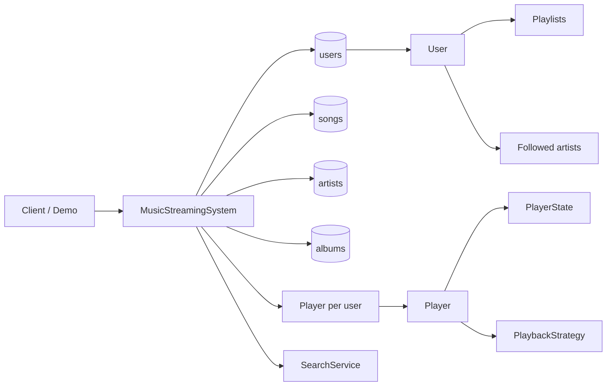
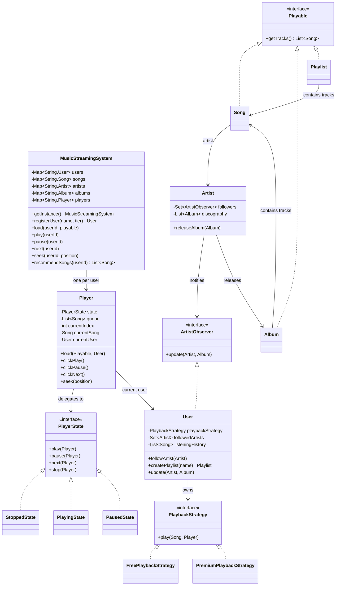
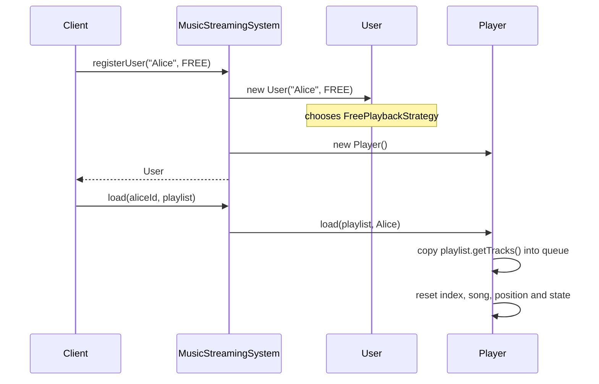
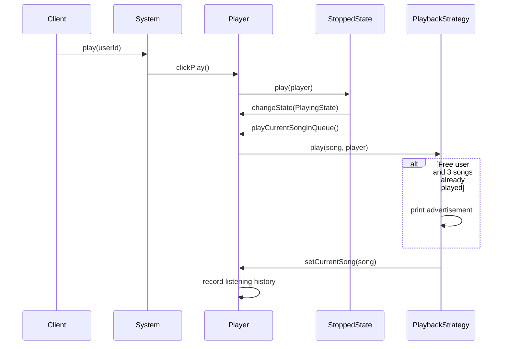
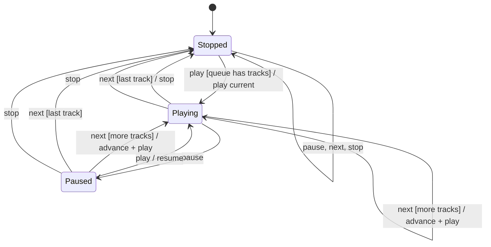
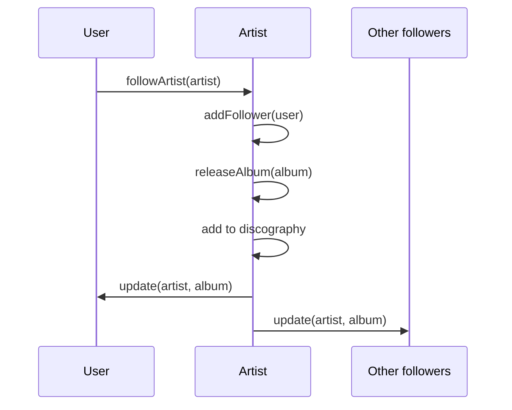
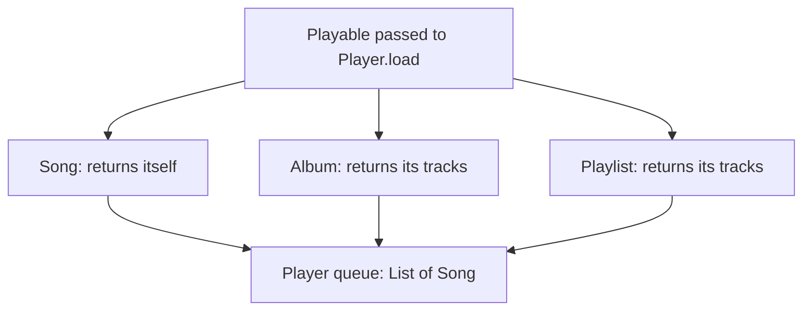

# Music Streaming Service — SDE-2 LLD Interview Guide

**Code discussed:** `solutions/java/src/musicstreamingservice/`

This is an interview explanation for the implementation in this package. It deliberately describes what the current code does, rather than the older design that previously appeared in this file.

## 1. How I would start the interview

> “I will design an in-memory music streaming service. A user can register, search songs, artists and albums, create playlists, follow artists, receive album-release notifications, and control playback. There are Free and Premium subscriptions: Free users hear an advertisement before every fourth song play, while Premium users do not. I will keep one player per user so concurrent users do not overwrite each other’s queues.”

Before coding, clarify these assumptions:

- This is an LLD exercise, so actual audio delivery, buffering, CDN, authentication, and database persistence are out of scope.
- A song may appear in many playlists and may be part of an album.
- Search is a case-insensitive title/name substring search.
- Recommendations return up to ten catalog songs by artists the user follows.
- A loaded queue belongs to one user’s `Player`; another user has a separate player.

## 2. Requirements covered by this code

| Area | What the code supports |
|---|---|
| Catalog | Add artists, albums, and songs; reject duplicate IDs. |
| User management | Register a user with `FREE` or `PREMIUM` tier. |
| Search | Search songs by title, artists by name, and albums by title. |
| Collection | Create playlists and add/remove songs. Albums and playlists keep ordered tracks. |
| Playback | Load a song/album/playlist, play, pause, stop, skip, and seek. |
| Subscription | Free playback inserts an ad after every three played songs; Premium playback does not. |
| Artist follow | Follow/unfollow an artist; followers are notified when an album is released. |
| Recommendation | Recommend catalog songs from followed artists. |
| Concurrency | Shared registries use concurrent maps; each player’s mutable operations are synchronized. |

## 3. High-level design

`MusicStreamingSystem` is the application facade. It owns the in-memory catalog and creates one `Player` for every registered user. Callers use the facade for catalog, search, playback, and recommendations instead of directly coordinating all objects.


```mermaid
flowchart LR
    Client[Client / Demo] --> System[MusicStreamingSystem]
    System --> Users[(users)]
    System --> Songs[(songs)]
    System --> Artists[(artists)]
    System --> Albums[(albums)]
    System --> Players[Player per user]
    System --> Search[SearchService]
    Players --> Player[Player]
    Player --> States[PlayerState]
    Player --> Strategy[PlaybackStrategy]
    Users --> User[User]
    User --> Playlists[Playlists]
    User --> Artist[Followed artists]
```

### Why one player per user?

A player contains mutable session state: queue, current index, current song, current position, user, and playback state. A global player would make Alice’s `load()` replace Bob’s queue. Therefore, `MusicStreamingSystem.players` maps a user ID to a dedicated `Player`.

## 4. Core model and responsibilities

| Class/interface | Responsibility |
|---|---|
| `Song` | Immutable song metadata: ID, title, artist, duration. A song is playable as a one-song list. |
| `Playable` | Contract with `getTracks()`. It allows `Song`, `Album`, and `Playlist` to be loaded uniformly. |
| `Album` | Ordered track collection and album metadata. |
| `Playlist` | User-created ordered, mutable track collection. |
| `Artist` | Artist metadata, discography, and follower management. Publishes release notifications. |
| `User` | Subscription behavior, playlists, listening history, and followed artists. Receives artist notifications. |
| `Player` | Owns a user’s playback queue and delegates behavior to its current state and user’s playback strategy. |
| `MusicStreamingSystem` | Singleton facade and in-memory repositories; creates players and exposes use cases. |
| `SearchService` | Performs case-insensitive catalog filtering. |

## 5. Class diagram


```mermaid
classDiagram
    class MusicStreamingSystem {
        -Map~String,User~ users
        -Map~String,Song~ songs
        -Map~String,Artist~ artists
        -Map~String,Album~ albums
        -Map~String,Player~ players
        +getInstance() MusicStreamingSystem
        +registerUser(name, tier) User
        +load(userId, playable)
        +play(userId)
        +pause(userId)
        +next(userId)
        +seek(userId, position)
        +recommendSongs(userId) List~Song~
    }
    class Playable { <<interface>>
        +getTracks() List~Song~
    }
    class Song
    class Album
    class Playlist
    Playable <|.. Song
    Playable <|.. Album
    Playable <|.. Playlist
    Album --> Song : contains tracks
    Playlist --> Song : contains tracks
    Song --> Artist : artist

    class User {
        -PlaybackStrategy playbackStrategy
        -Set~Artist~ followedArtists
        -List~Song~ listeningHistory
        +followArtist(Artist)
        +createPlaylist(name) Playlist
        +update(Artist, Album)
    }
    class Artist {
        -Set~ArtistObserver~ followers
        -List~Album~ discography
        +releaseAlbum(Album)
    }
    class ArtistObserver { <<interface>>
        +update(Artist, Album)
    }
    ArtistObserver <|.. User
    Artist --> ArtistObserver : notifies
    Artist --> Album : releases

    class Player {
        -PlayerState state
        -List~Song~ queue
        -int currentIndex
        -Song currentSong
        -User currentUser
        +load(Playable, User)
        +clickPlay()
        +clickPause()
        +clickNext()
        +seek(position)
    }
    class PlayerState { <<interface>>
        +play(Player)
        +pause(Player)
        +next(Player)
        +stop(Player)
    }
    class StoppedState
    class PlayingState
    class PausedState
    PlayerState <|.. StoppedState
    PlayerState <|.. PlayingState
    PlayerState <|.. PausedState
    Player --> PlayerState : delegates to

    class PlaybackStrategy { <<interface>>
        +play(Song, Player)
    }
    class FreePlaybackStrategy
    class PremiumPlaybackStrategy
    PlaybackStrategy <|.. FreePlaybackStrategy
    PlaybackStrategy <|.. PremiumPlaybackStrategy
    User --> PlaybackStrategy : owns
    Player --> User : current user
    MusicStreamingSystem --> Player : one per user
```

## 6. Key flows to narrate

### A. Register and load


```mermaid
sequenceDiagram
    participant C as Client
    participant S as MusicStreamingSystem
    participant U as User
    participant P as Player
    C->>S: registerUser("Alice", FREE)
    S->>U: new User("Alice", FREE)
    Note over U: chooses FreePlaybackStrategy
    S->>P: new Player()
    S-->>C: User
    C->>S: load(aliceId, playlist)
    S->>P: load(playlist, Alice)
    P->>P: copy playlist.getTracks() into queue
    P->>P: reset index, song, position and state
```

`load()` copies the tracks into a new `ArrayList`. This prevents later playlist edits from silently changing an already loaded queue.

### B. Playback flow: State + Strategy


```mermaid
sequenceDiagram
    participant C as Client
    participant S as System
    participant P as Player
    participant ST as StoppedState
    participant PS as PlaybackStrategy
    C->>S: play(userId)
    S->>P: clickPlay()
    P->>ST: play(player)
    ST->>P: changeState(PlayingState)
    ST->>P: playCurrentSongInQueue()
    P->>PS: play(song, player)
    alt Free user and 3 songs already played
        PS->>PS: print advertisement
    end
    PS->>P: setCurrentSong(song)
    P->>P: record listening history
```

The state decides whether the control is valid. The subscription strategy decides *how* the selected song is played. This separation keeps `Player` free from subscription `if/else` checks.

### C. Player state machine


```mermaid
stateDiagram-v2
    [*] --> Stopped
    Stopped --> Playing : play [queue has tracks] / play current
    Stopped --> Stopped : pause, next, stop
    Playing --> Paused : pause
    Playing --> Playing : play / already playing
    Playing --> Playing : next [more tracks] / advance + play
    Playing --> Stopped : next [last track] / stop
    Playing --> Stopped : stop
    Paused --> Playing : play / resume
    Paused --> Playing : next [more tracks] / advance + play
    Paused --> Stopped : next [last track]
    Paused --> Stopped : stop
```

Important interview detail: `PausedState.play()` resumes by changing status to `PLAYING`; it does **not** replay the current track or reset the position. `next()` from paused explicitly starts the next song.

### D. Artist release notification


```mermaid
sequenceDiagram
    participant U as User
    participant A as Artist
    participant O as Other followers
    U->>A: followArtist(artist)
    A->>A: addFollower(user)
    A->>A: releaseAlbum(album)
    A->>A: add to discography
    A->>U: update(artist, album)
    A->>O: update(artist, album)
```

The artist only knows the `ArtistObserver` interface, not the concrete `User` implementation. A future push notification, email sender, or activity feed can implement the same interface.

## 7. Patterns and design principles actually used

### Singleton — `MusicStreamingSystem`

The system needs one shared in-memory catalog and one lookup point for per-user players. The implementation uses an eager singleton:

```java
private static final MusicStreamingSystem INSTANCE = new MusicStreamingSystem();
```

Eager construction is simple and thread-safe because Java class initialization happens once. Say “singleton facade,” not “singleton database”; it is a convenient in-memory boundary for this exercise.

### Composite — `Playable`

`Song` is the leaf. `Album` and `Playlist` are collections of songs. All implement `Playable`, so `Player.load(Playable, User)` works for any of them without `instanceof` checks.


```mermaid
flowchart TD
    Input[Playable passed to Player.load] --> Song[Song: returns itself]
    Input --> Album[Album: returns its tracks]
    Input --> Playlist[Playlist: returns its tracks]
    Song --> Queue[Player queue: List of Song]
    Album --> Queue
    Playlist --> Queue
```

### State — `PlayerState`

`StoppedState`, `PlayingState`, and `PausedState` own the behavior for play, pause, next, and stop. This avoids a fragile chain of checks such as `if (status == ...)` inside `Player`. It is particularly useful because `play` means “start” from stopped but “resume” from paused.

### Strategy — `PlaybackStrategy`

`FreePlaybackStrategy` counts played songs and prints an ad when `songsPlayed > 0 && songsPlayed % 3 == 0`. `PremiumPlaybackStrategy` directly sets the current song. `Player` delegates to `currentUser.getPlaybackStrategy()`, so it does not need to know the subscription tier.

For a new tier, add a strategy and extend the user’s tier-to-strategy selection. `Player` stays unchanged.

### Observer — `ArtistObserver`

`User` implements `ArtistObserver`; `Artist` keeps a concurrent set of followers. `followArtist()` registers once, and `releaseAlbum()` notifies every follower. This is a natural push model for release events.

### Facade — `MusicStreamingSystem`

This is not merely a registry. It provides simple use-case methods—`load`, `play`, `pause`, `next`, and `seek`—and hides the lookup of the right user and player. A controller/UI has a small, clear API.

## 8. SOLID discussion

| Principle | Evidence in this design | Honest caveat |
|---|---|---|
| Single Responsibility | `SearchService` searches; strategies apply subscription behavior; states handle playback transitions. | `MusicStreamingSystem` combines facade and in-memory repositories, acceptable for a small exercise but separable later. |
| Open/Closed | Add a new playback strategy without modifying `Player`; add another `Playable` type without changing `load`. | `User` currently uses an `if` on `SubscriptionTier`, so a factory would improve tier extension. |
| Liskov Substitution | Any `Playable` can be supplied to `Player.load`. | Implementations must return a valid track list. |
| Interface Segregation | `Playable`, `ArtistObserver`, and `PlaybackStrategy` are small focused interfaces. | `PlayerState` has four related controls, which is cohesive. |
| Dependency Inversion | `Player` works through `PlayerState` and `PlaybackStrategy` abstractions. | `User` directly constructs concrete strategies; inject a factory/provider in a production design. |

## 9. Searching and recommendations

`SearchService` normalizes both query and candidate fields using `Locale.ROOT` and performs a case-insensitive `contains` match. Its time complexity is **O(n)** for each search because it scans the in-memory collection.

`recommendSongs(userId)` gets the user’s followed artists and returns up to ten songs whose artist appears in that set. This is **O(S)** over the song catalog. It is intentionally a simple, explainable baseline—not collaborative filtering or a personalized ranking engine.

> “For production search I would use an index such as Elasticsearch/OpenSearch. For recommendations I would add a strategy interface and supply listening-history, genre, and collaborative signals.”

## 10. Concurrency discussion

This implementation makes a good interview distinction between protecting shared data and protecting a session:

- Catalog maps and the user-to-player map are `ConcurrentHashMap`s, so concurrent registration/lookups do not corrupt map structure.
- Followers are held in a concurrent set.
- `Album`, `Playlist`, and mutable `Player` methods are synchronized.
- Each user has a separate `Player`, reducing contention and preventing queue leakage between users.

Do not overclaim atomicity: registering a user adds to `users` and then `players` as two operations, so it is not a transactional workflow. In a real service, use a transaction or create a session/player lazily with `computeIfAbsent`.

## 11. Walkthrough of `MusicStreamingDemo`

1. Obtain the singleton and add Daft Punk, the `Discovery` album, and three songs.
2. Search the three songs and add them to the album, then call `daftPunk.releaseAlbum(discovery)`. This occurs before any user follows the artist, so this particular release produces no user notification.
3. Register Alice as Free and Bob as Premium. Registration creates each user’s independent player.
4. Both follow Daft Punk, registering themselves for future releases. Alice creates a playlist containing the album’s tracks.
5. The demo searches the catalog with partial queries such as `digital`, `daft`, and `discovery`.
6. Alice loads her playlist, plays the first song, seeks to 30 seconds, skips to the next track, and pauses.
7. Recommendations return songs by artists Alice follows—here, Daft Punk songs.
8. Alice and Bob load the same album and play/skip from separate executor tasks. They do not share a player queue.

## 12. Important code issue to fix before presenting

The current `StoppedState.play()` calls `player.hasQueue()`, but `Player` does not define `hasQueue()`. As written, the package will not compile. Add this small method to `Player` before running the demo:

```java
public synchronized boolean hasQueue() {
    return !queue.isEmpty();
}
```

This documentation does not change production code because the requested output is the interview markdown file, but this is a necessary correction for a runnable demo.

## 13. Follow-up questions and strong answers

**How would you add a Family tier?** Create `FamilyPlaybackStrategy`, add `FAMILY` to the enum, and move the strategy selection from `User` to a `PlaybackStrategyFactory`. `Player` does not change.

**How would you persist data?** Introduce `UserRepository`, `SongRepository`, `ArtistRepository`, and `AlbumRepository` interfaces. The facade calls those interfaces instead of concurrent maps. Keep player session state in a cache/session store.

**How would you make recommendations better?** Define `RecommendationStrategy`. One implementation can use followed artists; others can use listening history, genres, embeddings, or collaborative filtering. Rank and filter already-played songs.

**How would you support shuffle or repeat?** Put queue traversal behind a `QueuePolicy`/play-order strategy. The player asks it for the next index rather than directly incrementing `currentIndex`.

**How would real streaming work?** Separate metadata/control-plane services from the media data plane. Store audio in object storage, deliver through a CDN, and have the player fetch chunked audio. This LLD model still owns the playback session and entitlements.

## 14. Two-minute closing script

> “I designed the system around a single facade with per-user playback sessions. `Playable` gives a uniform way to load a song, album, or playlist. `Player` owns the mutable queue and delegates control behavior to the State pattern, which keeps stopped, playing, and paused rules isolated. It delegates subscription-specific behavior to a playback Strategy, so Free and Premium behavior do not leak into player logic. Artists notify followers through Observer, which decouples release publishing from notification consumers. The code uses concurrent collections and synchronized session operations for its in-memory scope. For production, I would replace maps with repositories, add indexed search, use a strategy-based recommendation engine, and separate audio delivery from this metadata and session domain.”
