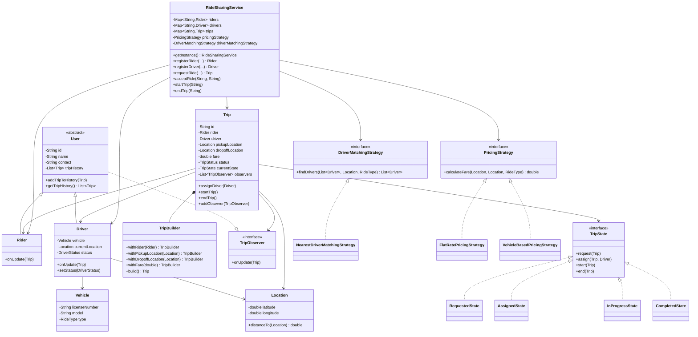
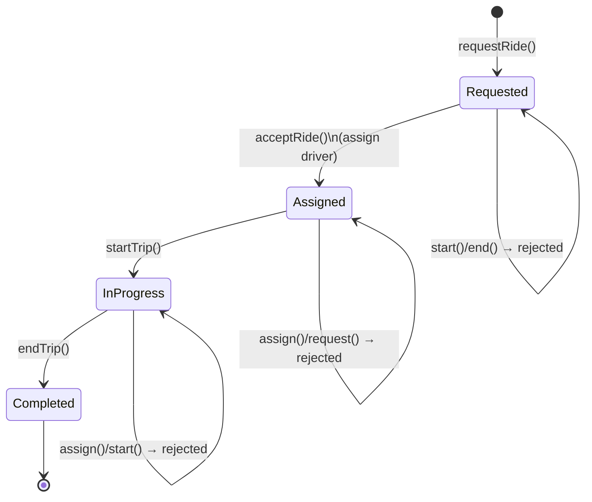
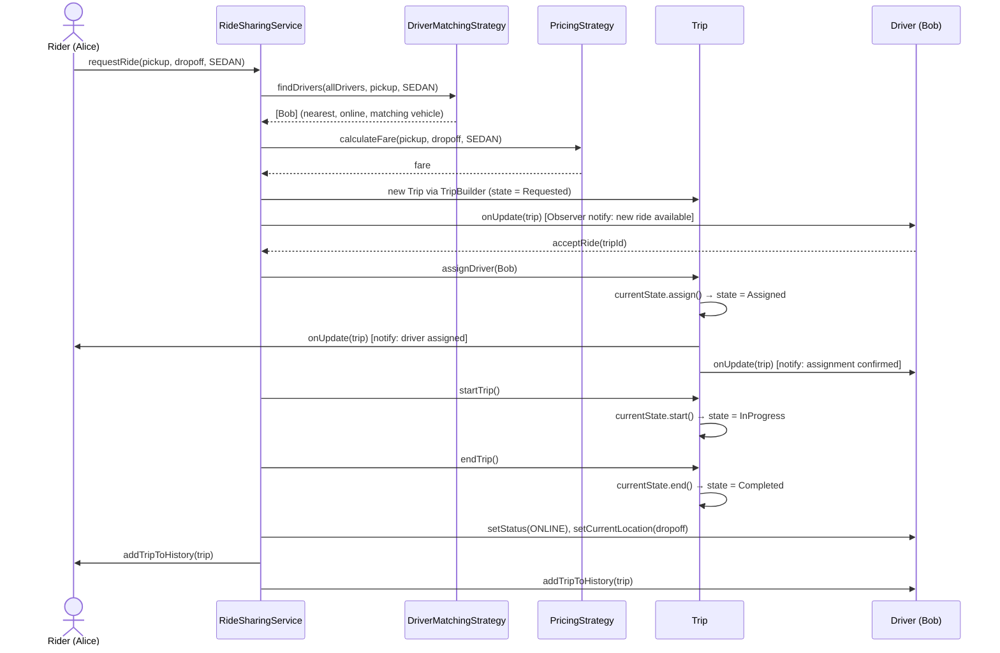

# Ride Sharing Service — LLD Interview Guide

> A step-by-step walkthrough of how to design and explain a Ride Sharing Service (think Uber/Lyft/Ola) in a Machine Coding / LLD round, using the actual implementation in this package as reference code.

---

## 1. How to Open the Interview

When the interviewer says *"Design a ride-sharing system like Uber"*, don't jump straight to code. Spend the first 5 minutes on **clarifying requirements**. This shows structured thinking, which is exactly what an SDE-2 LLD round evaluates.

### Questions to ask the interviewer
- Do we need real-time GPS tracking, or is location just a coordinate we compare?
- Should the system support multiple vehicle types (Sedan, SUV, Auto)?
- How is a driver matched to a rider — nearest driver, or some other criteria?
- Is pricing dynamic (surge pricing) or fixed?
- Do we need to support ride cancellation / trip history?
- Is this single-process (in-memory) or distributed? (For LLD rounds, it's almost always in-memory, single process — no need to bring in Kafka/DB unless asked.)

### State the scope you'll implement
"I'll design this as an in-memory, object-oriented system that supports: registering riders and drivers, requesting a ride, matching the rider to a nearby available driver, calculating fare, and taking the trip through its lifecycle — requested → assigned → in-progress → completed. I'll make the driver-matching logic and the pricing logic pluggable, since those are the parts most likely to change in a real system."

---

## 2. Functional Requirements

1. Riders and drivers can register with the system.
2. A rider can request a ride by specifying pickup location, drop-off location, and ride type (Sedan/SUV/Auto).
3. The system finds and notifies eligible nearby drivers.
4. A driver can accept a ride request.
5. The trip moves through a well-defined lifecycle: **Requested → Assigned → In Progress → Completed**.
6. Fare is calculated based on distance and ride type.
7. Riders and drivers should be notified when trip status changes.
8. Riders and drivers should have access to their trip history.

## 3. Non-Functional Requirements (mention, even if not fully implemented)

- **Extensibility**: Easy to plug in a new matching algorithm (e.g., "highest rated driver" instead of "nearest driver") or a new pricing model (e.g., surge pricing) without touching existing code.
- **Consistency**: Only one instance of the ride-sharing service coordinates state (in a single-process context).
- **Thread-safety**: Since multiple riders/drivers could interact concurrently, shared collections should be safe for concurrent access.

---

## 4. Identifying the Core Entities

This is the "nouns" step — pull the entities straight out of the requirements:

| Entity | Responsibility |
|---|---|
| `User` (abstract) | Common fields shared by Rider and Driver: id, name, contact, trip history |
| `Rider` | A user who requests rides |
| `Driver` | A user who provides rides; has a `Vehicle`, a `Location`, and a `DriverStatus` |
| `Vehicle` | License plate, model, and `RideType` (Sedan/SUV/Auto) |
| `Location` | Latitude/longitude + distance calculation |
| `Trip` | The ride itself — pickup, drop-off, fare, current state, assigned driver |
| `RideSharingService` | The orchestrator / facade that ties everything together |

Notice `Rider` and `Driver` share a lot (id, name, contact, trip history) — that's a natural signal to introduce an abstract base class `User`. This is a chance to mention the **DRY principle** and basic OOP inheritance.

---

## 5. Design Patterns Used (this is the heart of the interview)

A good LLD answer doesn't just say "I used the Singleton pattern" — it explains **the problem that pattern solves**, in this specific context. Below is how to narrate each one.

### 5.1 Singleton — `RideSharingService`

**Problem it solves:** We need exactly one central coordinator that holds all riders, drivers, and trips in memory. If multiple instances existed, state would be split and requests could be served inconsistently.

**How it's implemented:**
```java
private static volatile RideSharingService instance;

public static synchronized RideSharingService getInstance() {
    if (instance == null) {
        instance = new RideSharingService();
    }
    return instance;
}
```
- Private constructor prevents `new RideSharingService()` from outside.
- `synchronized` on the getter + `volatile` on the field guards against race conditions if two threads call `getInstance()` at the same time during creation.

**Interview talking point:** "I used a thread-safe lazy singleton. In a real production system this would instead be a Spring-managed singleton bean, but since this is a plain-Java in-memory design, I hand-rolled it with double-checked locking style safety."

---

### 5.2 Strategy Pattern — Driver Matching & Pricing

This is the **most important pattern** in this design, and appears twice. Strategy is used whenever *"the algorithm to do X can vary, and I don't want the core class to know the details of each algorithm."*

#### a) `DriverMatchingStrategy`
```java
public interface DriverMatchingStrategy {
    List<Driver> findDrivers(List<Driver> allDrivers, Location pickupLocation, RideType rideType);
}
```
Implementation used: `NearestDriverMatchingStrategy` — filters drivers who are `ONLINE`, drive the requested `RideType`, and are within `MAX_DISTANCE_KM`, then sorts by distance.

**Why Strategy here?** Tomorrow the business might want "match by driver rating" or "match by lowest ETA using live traffic." Instead of rewriting `RideSharingService`, we just write a new class implementing `DriverMatchingStrategy` and swap it in.

#### b) `PricingStrategy`
```java
public interface PricingStrategy {
    double calculateFare(Location pickup, Location dropoff, RideType rideType);
}
```
Two implementations:
- `FlatRatePricingStrategy` — same rate regardless of vehicle type.
- `VehicleBasedPricingStrategy` — different per-km rate for Sedan/SUV/Auto, using a `Map<RideType, Double>`.

**Why Strategy here?** Fare rules change constantly (surge pricing, promo codes, city-specific rates). Isolating this logic means pricing changes never touch matching logic or trip lifecycle logic — that's the **Open/Closed Principle** in action: open for extension (new strategy classes), closed for modification (existing code untouched).

**How strategies are injected:** `RideSharingService` doesn't create these strategies itself — they're set from outside via setters:
```java
service.setDriverMatchingStrategy(new NearestDriverMatchingStrategy());
service.setPricingStrategy(new VehicleBasedPricingStrategy());
```
This is **Dependency Injection** — the service depends on the *abstraction* (`interface`), not a concrete class. This also satisfies the **Dependency Inversion Principle** (the "D" in SOLID).

---

### 5.3 State Pattern — Trip Lifecycle

**Problem it solves:** A `Trip` behaves differently depending on what phase it's in. Without the State pattern, `Trip` would be full of `if/else` or `switch` blocks like:

```java
if (status == REQUESTED) { ... }
else if (status == ASSIGNED) { ... }
else if (status == IN_PROGRESS) { ... }
```

This gets messy fast and violates the Open/Closed Principle — every new state means editing this one giant method. Instead, each state is its **own class** that knows exactly what's legal to do in that state.

```java
public interface TripState {
    void request(Trip trip);
    void assign(Trip trip, Driver driver);
    void start(Trip trip);
    void end(Trip trip);
}
```

Four concrete states: `RequestedState`, `AssignedState`, `InProgressState`, `CompletedState`. Each one implements all four methods, but only one or two are "valid" — the rest just print a rejection message (in production, these would throw a domain exception like `InvalidTripTransitionException`).

**Example — `RequestedState`:**
```java
@Override
public void assign(Trip trip, Driver driver) {
    trip.setDriver(driver);
    trip.setStatus(TripStatus.ASSIGNED);
    trip.setState(new AssignedState());   // transition to next state
}

@Override
public void start(Trip trip) {
    System.out.println("Cannot start a trip that has not been assigned a driver.");
}
```

The `Trip` class simply **delegates** to whatever its current state object is:
```java
public void assignDriver(Driver driver) {
    currentState.assign(this, driver);
    addObserver(driver);
    notifyObservers();
}
```

**Interview talking point:** "The Trip class doesn't need to know the full state machine — it just forwards the call to its current state object, and that object decides whether the transition is legal and what the next state should be. This keeps `Trip` clean and makes adding a new state (e.g., `CancelledState`) a matter of adding one new class, not editing existing ones."

---

### 5.4 Observer Pattern — Notifications

**Problem it solves:** When a trip's status changes (assigned, started, ended), both the `Rider` and the `Driver` need to be notified — and possibly more parties later (a notification microservice, an analytics logger, etc.). We don't want `Trip` to be hardcoded to call `rider.notify()` and `driver.notify()` directly.

```java
public interface TripObserver {
    void onUpdate(Trip trip);
}
```

`User` (so both `Rider` and `Driver`) implements `TripObserver`. `Trip` keeps a list of observers and notifies all of them on any state change:
```java
private void notifyObservers() {
    observers.forEach(o -> o.onUpdate(this));
}
```

Each concrete observer decides *what to do* with the update — `Rider.onUpdate()` prints driver + vehicle details, `Driver.onUpdate()` prints trip status and highlights new ride requests.

**Interview talking point:** "This decouples the subject (Trip) from its observers. If I later want to add push notifications or SMS alerts, I just create a new class implementing `TripObserver` and register it — Trip's code doesn't change at all."

---

### 5.5 Builder Pattern — `Trip` Construction

**Problem it solves:** `Trip` has several fields (rider, pickup, dropoff, fare) and we want object construction to be readable and to validate required fields before the object exists (so we never end up with a half-built, invalid `Trip`).

```java
Trip trip = new Trip.TripBuilder()
        .withRider(rider)
        .withPickupLocation(pickup)
        .withDropoffLocation(dropoff)
        .withFare(fare)
        .build();
```

The private `Trip` constructor only accepts a `TripBuilder`, and `build()` validates before construction:
```java
public Trip build() {
    if (rider == null || pickupLocation == null || dropoffLocation == null) {
        throw new IllegalStateException("Rider, pickup, and dropoff locations are required to build a trip.");
    }
    return new Trip(this);
}
```

**Interview talking point:** "I used Builder instead of a large constructor because Trip has multiple fields, some optional. It also gives me a single place — `build()` — to validate invariants before the object is created, so I never have a `Trip` floating around in an invalid state."

---

## 6. SOLID Principles — Quick Mapping

| Principle | Where it shows up |
|---|---|
| **S**ingle Responsibility | `PricingStrategy` only prices, `DriverMatchingStrategy` only matches, `Trip` only tracks trip state — `RideSharingService` just orchestrates |
| **O**pen/Closed | New pricing/matching algorithm or new trip state = new class, zero edits to existing classes |
| **L**iskov Substitution | Any `PricingStrategy` / `DriverMatchingStrategy` / `TripState` implementation can be swapped in without breaking callers |
| **I**nterface Segregation | Small, focused interfaces: `TripObserver` (1 method), `PricingStrategy` (1 method), `DriverMatchingStrategy` (1 method) |
| **D**ependency Inversion | `RideSharingService` depends on `PricingStrategy`/`DriverMatchingStrategy` interfaces, not concrete classes — injected via setters |

---

## 7. Class Diagram



---

## 8. Trip State Diagram



**Explain this out loud as:** "A trip can only ever move forward through these four states. Every illegal transition — like trying to start a trip with no driver assigned — is rejected by the current state object itself, not by some central `if` check."

---

## 9. End-to-End Sequence Diagram (Ride Request Flow)



---

## 10. How to Narrate the Code Walkthrough (Talk Track)

When asked to "walk me through your code", follow this order — it mirrors how a senior engineer explains a system top-down, not bottom-up:

1. **Start with the entry point / orchestrator**: "`RideSharingService` is a Singleton facade. It holds three maps — riders, drivers, trips — and two pluggable strategies."
2. **Walk through `requestRide()` line by line**: find drivers → calculate fare → build the Trip → notify drivers. This is the "spine" of the whole system.
3. **Zoom into the Strategy interfaces**: explain why matching and pricing are pluggable.
4. **Zoom into `Trip` and the State pattern**: explain the delegation to `currentState`.
5. **Zoom into Observer**: explain how `Rider`/`Driver` get notified without `Trip` knowing their concrete types.
6. **Mention Builder** briefly when you reach `Trip` construction.
7. **Close with SOLID/extensibility**: "If the interviewer asks me to add surge pricing or add a `CancelledState`, here's exactly which single class I'd add — no existing code changes."

---

## 11. Anticipated Interview Follow-Up Questions

**Q: How would you add ride cancellation?**
A: Add a `CancelledState implements TripState`. Add a `cancel(Trip trip)` method to the `TripState` interface (and implement it in all states — most reject it, `RequestedState`/`AssignedState` allow it). No change needed to `RideSharingService`'s core flow.

**Q: How would you support surge pricing?**
A: Add a `SurgePricingStrategy implements PricingStrategy` that takes current demand/supply ratio into account, and inject it via `service.setPricingStrategy(...)`. Could also make pricing a **Decorator** around a base strategy if surge should stack on top of vehicle-based pricing.

**Q: What if two drivers try to accept the same ride at the same time?**
A: This is a real race condition. Current code doesn't guard `acceptRide()` against double-acceptance — the `TripState.assign()` check on `AssignedState` would reject the second call, but there's a window between reading `currentState` and setting it. In an interview, mention adding a lock per trip (e.g., `synchronized` on the `Trip` object, or a `CAS` on trip status) to make the accept operation atomic.

**Q: How does this scale to millions of drivers? How would you find "nearest" drivers efficiently?**
A: Current `NearestDriverMatchingStrategy` does an O(n) linear scan with Euclidean distance — fine for LLD/demo scope. In a real system you'd use a **geospatial index** (Quadtree, Geohash, or Google's S2/H3) to query only drivers in nearby cells, and Euclidean distance would be replaced with Haversine (great-circle) distance since Earth isn't flat.

**Q: Why Singleton for RideSharingService — isn't that an anti-pattern?**
A: Fair challenge — Singleton makes unit testing harder and hides a dependency. In a Spring Boot app, I'd instead make this a `@Service`-annotated Spring bean (framework manages the single instance via IoC container) rather than hand-rolling a static singleton. I used a manual Singleton here purely because this is a plain-Java, framework-free LLD exercise.

**Q: Why use the State pattern instead of just an enum + switch statement?**
A: An enum + switch keeps growing a single method every time you add a state or a new operation — that's an Open/Closed Principle violation, and it centralizes unrelated logic. The State pattern spreads the responsibility: each state class only knows about its own valid transitions, so adding a state means adding a class, not editing a switch statement everywhere it appears.

**Q: How would you make driver notifications real-time instead of console prints?**
A: Keep the Observer interface exactly as-is (`onUpdate(Trip)`), and change what the *implementation* does — instead of `System.out.println`, `Driver.onUpdate()` would push to a WebSocket connection or trigger a mobile push notification. The rest of the system (Trip, State, Strategy) doesn't need to change at all — that's the payoff of decoupling via Observer.

**Q: Is `Location.distanceTo` accurate for real-world GPS coordinates?**
A: No — it uses simple Euclidean distance (`√(dx² + dy²)`), which is a simplification for demo purposes since it treats lat/long like flat X/Y coordinates. Real systems use the **Haversine formula** to account for Earth's curvature.

---

## 12. Summary Cheat-Sheet (30-second recap before the interview)

- **Singleton** → one `RideSharingService` coordinating everything.
- **Strategy** (x2) → pluggable driver matching (`NearestDriverMatchingStrategy`) and pluggable pricing (`FlatRatePricingStrategy` / `VehicleBasedPricingStrategy`).
- **State** → `Trip` lifecycle (`Requested → Assigned → InProgress → Completed`), each state controls its own legal transitions.
- **Observer** → `Rider`/`Driver` get notified of trip updates without `Trip` knowing their concrete types.
- **Builder** → `Trip` is constructed safely and validated via `TripBuilder`.
- **SOLID** → especially Open/Closed (new strategies/states = new classes) and Dependency Inversion (service depends on interfaces, injected from outside).
- **Known gaps to proactively mention**: no concurrency guard on `acceptRide`, Euclidean distance instead of Haversine, linear scan instead of geospatial index — mentioning these unprompted signals seniority.
