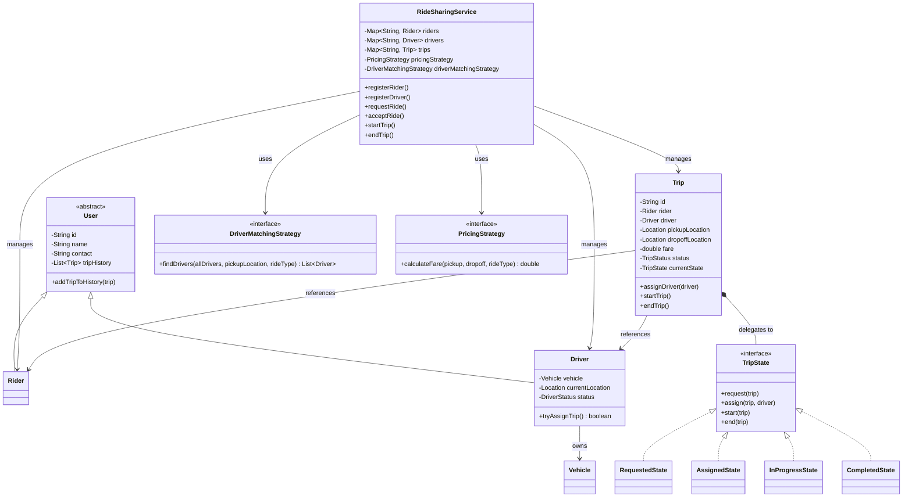
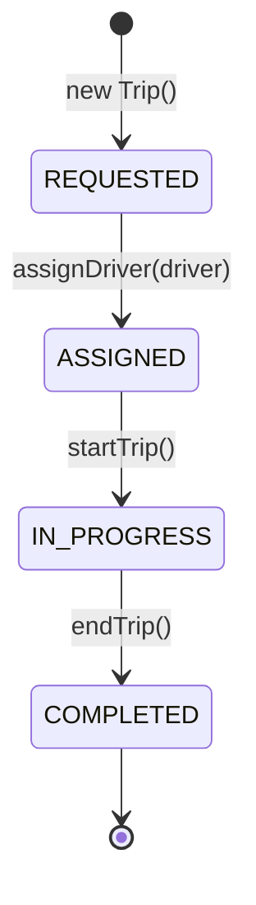
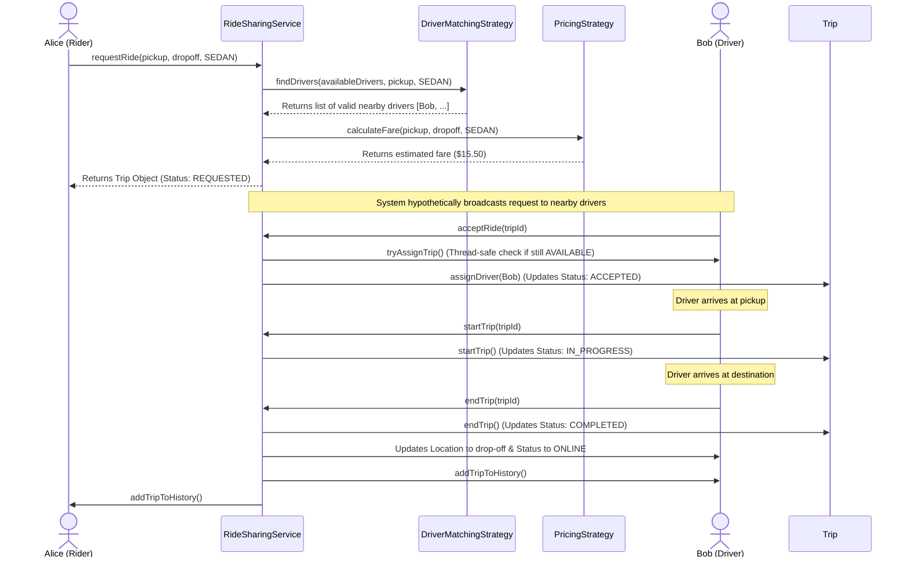

# Ride Sharing Service — LLD Interview Guide

> A step-by-step walkthrough of how to design and explain a Ride Sharing Service (think Uber/Lyft/Ola) in a Machine
> Coding / LLD round, using the actual implementation in this package as reference code.

---

## 1 (a). How to Open the Interview

When the interviewer says *"Design a ride-sharing system like Uber"*, don't jump straight to code. Spend the first 5
minutes on **clarifying requirements**. This shows structured thinking, which is exactly what an SDE-2 LLD round
evaluates.

### Questions to ask the interviewer

- Do we need real-time GPS tracking, or is location just a coordinate we compare?
- Should the system support multiple vehicle types (Sedan, SUV, Auto)?
- How is a driver matched to a rider — nearest driver, or some other criteria?
- Is pricing dynamic (surge pricing) or fixed?
- Do we need to support ride cancellation / trip history?
- Is this single-process (in-memory) or distributed? (For LLD rounds, it's almost always in-memory, single process — no
  need to bring in Kafka/DB unless asked.)

### State the scope you'll implement

"I'll design this as an in-memory, object-oriented system that supports: registering riders and drivers, requesting a
ride, matching the rider to a nearby available driver, calculating fare, and taking the trip through its lifecycle —
requested → assigned → in-progress → completed. I'll make the driver-matching logic and the pricing logic pluggable,
since those are the parts most likely to change in a real system."

---

## 1 (b). Functional Requirements

1. Riders and drivers can register with the system.
2. A rider can request a ride by specifying pickup location, drop-off location, and ride type (Sedan/SUV/Auto).
3. The system finds and notifies eligible nearby drivers.
4. A driver can accept a ride request.
5. The trip moves through a well-defined lifecycle: **Requested → Assigned → In Progress → Completed**.
6. Fare is calculated based on distance and ride type.
7. Riders and drivers should be notified when trip status changes.
8. Riders and drivers should have access to their trip history.

## 1 (c). Non-Functional Requirements (mention, even if not fully implemented)

- **Extensibility**: Easy to plug in a new matching algorithm (e.g., "highest rated driver" instead of "nearest driver")
  or a new pricing model (e.g., surge pricing) without touching existing code.
- **Consistency**: Only one instance of the ride-sharing service coordinates state (in a single-process context).
- **Thread-safety**: Since multiple riders/drivers could interact concurrently, shared collections should be safe for
  concurrent access.

---

## 2. Core Entities (Nouns in our system)

Based on the requirements, I've identified the following primary entities:

1. **Rider:** The user requesting the ride.
2. **Driver:** The user providing the ride. A driver is associated with a specific `Vehicle` and has a dynamic
   `Location` and `Status` (Online, Offline, On Trip).
3. **Vehicle:** Represents the car, primarily encapsulating its `RideType` (Sedan, SUV).
4. **Trip:** The core transactional entity linking a Rider and a Driver. It tracks pickup/drop-off locations, fare, and
   the current trip status.
5. **Location:** A simple representation of coordinates (latitude, longitude).

---

## 3. Design Principles & Patterns Used

To ensure the system is robust, maintainable, and extensible, I have heavily relied on standard Object-Oriented Design
principles and Design Patterns:

### A. Strategy Pattern (Behavioral Pattern)

* **Why?** Pricing logic and driver matching logic are highly volatile business rules. They change frequently based on
  market conditions or geographic regions.
* **How?** I created `PricingStrategy` and `DriverMatchingStrategy` interfaces. The main `RideSharingService` depends
  strictly on these interfaces, not their concrete implementations.
    * *Implementations:* `VehicleBasedPricingStrategy`, `NearestDriverMatchingStrategy`.

### B. Dependency Injection

* **Why?** To decouple the core `RideSharingService` from the specific concrete strategies, making the code flexible and
  testable.
* **How?** The strategies are passed (injected) into the constructor of `RideSharingService`. If we want to unit test
  the service, we can easily inject mock strategies.

### C. Single Responsibility Principle (SRP)

* **Why?** A class should have only one reason to change, keeping the codebase clean and modular.
* **How?** The `RideSharingService` acts solely as an orchestrator/coordinator. It doesn't calculate prices itself; it
  asks the `PricingStrategy` to do it. Similarly, entities like `Trip` and `Driver` encapsulate only their specific
  state transitions.

### D. Thread Safety (Concurrency Management)

* **Why?** In a production environment, thousands of users request rides concurrently.
* **How?** I utilized `ConcurrentHashMap` in the main service for storing the registries of riders, drivers, and trips.
  This ensures thread-safe read and write operations without explicit locking overhead.

---

## 4. Class Diagram

Here is a visual representation of how our core classes and interfaces interact.

```mermaid
classDiagram
    class RideSharingService {
        -Map~String, Rider~ riders
        -Map~String, Driver~ drivers
        -Map~String, Trip~ trips
        -PricingStrategy pricingStrategy
        -DriverMatchingStrategy driverMatchingStrategy
        +registerRider()
        +registerDriver()
        +requestRide()
        +acceptRide()
        +startTrip()
        +endTrip()
    }

    class User {
        <<abstract>>
        -String id
        -String name
        -String contact
        -List~Trip~ tripHistory
        +addTripToHistory(trip)
    }

    class Rider {
    }

    class Driver {
        -Vehicle vehicle
        -Location currentLocation
        -DriverStatus status
        +tryAssignTrip() boolean
    }

    class Trip {
        -String id
        -Rider rider
        -Driver driver
        -Location pickupLocation
        -Location dropoffLocation
        -double fare
        -TripStatus status
        -TripState currentState
        +assignDriver(driver)
        +startTrip()
        +endTrip()
    }

    class TripState {
        <<interface>>
        +request(trip)
        +assign(trip, driver)
        +start(trip)
        +end(trip)
    }

    class RequestedState
    class AssignedState
    class InProgressState
    class CompletedState

    class DriverMatchingStrategy {
        <<interface>>
        +findDrivers(allDrivers, pickupLocation, rideType) List~Driver~
    }

    class PricingStrategy {
        <<interface>>
        +calculateFare(pickup, dropoff, rideType) double
    }

    User <|-- Rider
    User <|-- Driver
    RideSharingService --> Rider: manages
    RideSharingService --> Driver: manages
    RideSharingService --> Trip: manages
    RideSharingService --> DriverMatchingStrategy: uses
    RideSharingService --> PricingStrategy: uses
    Trip --> Rider: references
    Trip --> Driver: references
    Trip *-- TripState: delegates to
    TripState <|.. RequestedState
    TripState <|.. AssignedState
    TripState <|.. InProgressState
    TripState <|.. CompletedState
    Driver --> Vehicle: owns
```

---

## 5. State Diagram

To manage the lifecycle of a `Trip` cleanly, we use the **State Pattern**. This prevents complex `if-else` or `switch`
statements when transitioning between statuses.

```mermaid
stateDiagram-v2
    [*] --> REQUESTED: new Trip()
    REQUESTED --> ASSIGNED: assignDriver(driver)
    ASSIGNED --> IN_PROGRESS: startTrip()
    IN_PROGRESS --> COMPLETED: endTrip()
    COMPLETED --> [*]
```

---

## 6. System Workflow (How a Ride Happens)

Let's walk through the exact sequence of events when a user successfully requests and completes a ride.

```mermaid
sequenceDiagram
    actor Alice as Alice (Rider)
    participant Service as RideSharingService
    participant Matcher as DriverMatchingStrategy
    participant Pricer as PricingStrategy
    actor Bob as Bob (Driver)
    Alice ->> Service: requestRide(pickup, dropoff, SEDAN)
    Service ->> Matcher: findDrivers(availableDrivers, pickup, SEDAN)
    Matcher -->> Service: Returns list of valid nearby drivers [Bob, ...]
    Service ->> Pricer: calculateFare(pickup, dropoff, SEDAN)
    Pricer -->> Service: Returns estimated fare ($15.50)
    Service -->> Alice: Returns Trip Object (Status: REQUESTED)
    Note over Service, Bob: System hypothetically broadcasts request to nearby drivers
    Bob ->> Service: acceptRide(tripId)
    Service ->> Bob: tryAssignTrip() (Thread-safe check if still AVAILABLE)
    Service ->> Trip: assignDriver(Bob) (Updates Status: ACCEPTED)
    Note over Bob: Driver arrives at pickup
    Bob ->> Service: startTrip(tripId)
    Service ->> Trip: startTrip() (Updates Status: IN_PROGRESS)
    Note over Bob: Driver arrives at destination
    Bob ->> Service: endTrip(tripId)
    Service ->> Trip: endTrip() (Updates Status: COMPLETED)
    Service ->> Bob: Updates Location to drop-off & Status to ONLINE
    Service ->> Bob: addTripToHistory()
    Service ->> Alice: addTripToHistory()
```

---

## 7. Execution Walkthrough (`RideSharingServiceDemo.java`)

To prove the design works, let's trace the execution of our demo code in simple English:

1. **System Initialization:** We bootstrap the `RideSharingService`. Crucially, we inject our specific business rules:
   `VehicleBasedPricingStrategy` and `NearestDriverMatchingStrategy`.
2. **Onboarding Users:**
    * Alice registers as a Rider.
    * Bob registers as a Driver with a Sedan. He is close to the city center (1.0, 1.0).
    * Charlie registers as a Driver with an SUV.
    * David registers as a Driver with a Sedan. He is far away (10.0, 10.0).
    * All drivers mark themselves as `ONLINE`.
3. **Ride Request 1 (Alice):**
    * Alice wants a ride from (0,0) to (5,5) and requests a **SEDAN**.
    * The `NearestDriverMatchingStrategy` kicks in. It ignores Charlie (he drives an SUV). It evaluates Bob and David.
      David is too far away. **Bob is matched.**
    * The fare is calculated, and the Trip is created.
4. **Trip Lifecycle Execution:**
    * Bob accepts the ride.
    * Bob starts the trip.
    * Bob ends the trip. The service automatically updates Bob's coordinates to the drop-off location (5,5), puts him
      back `ONLINE`, and logs the trip in both Alice's and Bob's personal histories.
5. **Ride Request 2 (Harry):**
    * Harry registers and requests an **SUV**.
    * Because of our strategy pattern, the matching logic cleanly filters for SUVs. Only Charlie is matched, and the
      trip executes flawlessly.

---

## 8. Interview Closing Thoughts

**Candidate (You):**

"By structuring the application this way, I've prioritized maintainability. For example, if the product team asks for a
'Surge Pricing' feature for New Year's Eve, I do not need to touch the core `RideSharingService` or the `Trip` classes.
I only need to create a new `SurgePricingStrategy` class that implements `PricingStrategy`, and inject it into the
service. This perfectly adheres to the Open-Closed Principle (Open for extension, closed for modification)."
