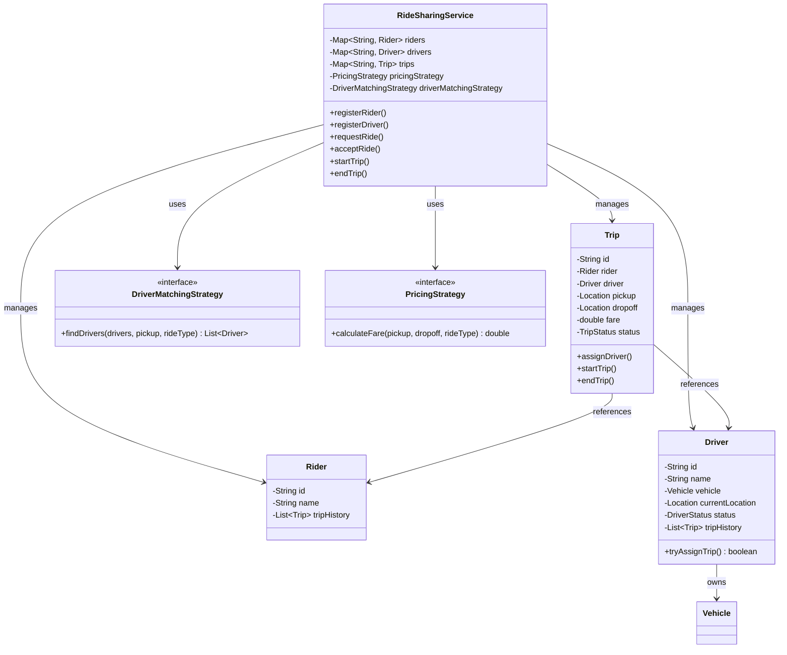
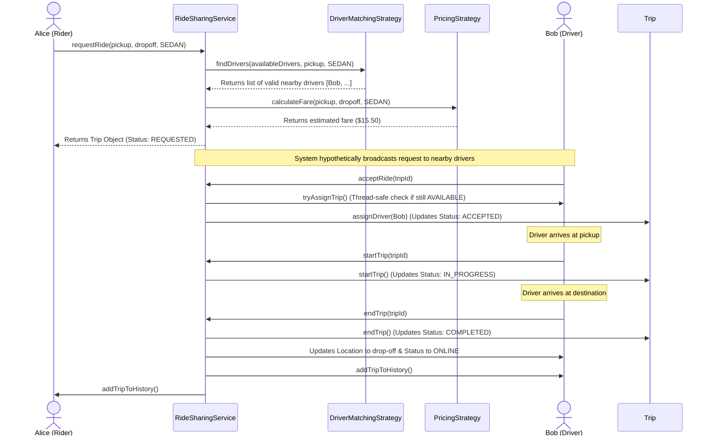

# Ride-Sharing Service (Uber/Lyft) - Low-Level Design

*This document is structured as an interview discussion for an SDE-2 position, explaining the Low-Level Design (LLD) of a Ride-Sharing Service.*

---

## 1. Understanding the Problem Statement

**Interviewer:** Design a ride-sharing service like Uber or Lyft.

**Candidate (You):** Got it. Before jumping into the design, I'd like to clarify the core requirements to ensure we are building the right system.

### Functional Requirements
*   **User Registration:** The system should allow Riders and Drivers to register securely.
*   **Ride Request:** Riders can request a ride by providing a pickup location, a drop-off location, and their preferred type of vehicle (e.g., Sedan, SUV).
*   **Driver Matching:** The system must efficiently find nearby available drivers whose vehicle matches the requested type.
*   **Trip Lifecycle:** Drivers should be able to accept a ride. The trip should transition through logical states (Requested, Accepted, In-Progress, and Completed).
*   **Pricing:** The system should calculate an estimated fare before the trip starts based on distance and vehicle type.
*   **History:** Both Riders and Drivers should have access to a history of their past trips.

### Non-Functional Requirements
*   **Extensibility:** The architecture must allow us to easily add new pricing models (like surge pricing during rain) or new matching algorithms (like VIP matching) in the future without modifying the core business logic.
*   **Concurrency (Important for SDE-2):** Multiple ride requests can come in simultaneously; our in-memory data structures must handle this gracefully without data corruption or race conditions.

---

## 2. Core Entities (Nouns in our system)

Based on the requirements, I've identified the following primary entities:

1.  **Rider:** The user requesting the ride.
2.  **Driver:** The user providing the ride. A driver is associated with a specific `Vehicle` and has a dynamic `Location` and `Status` (Online, Offline, On Trip).
3.  **Vehicle:** Represents the car, primarily encapsulating its `RideType` (Sedan, SUV).
4.  **Trip:** The core transactional entity linking a Rider and a Driver. It tracks pickup/drop-off locations, fare, and the current trip status.
5.  **Location:** A simple representation of coordinates (latitude, longitude).

---

## 3. Design Principles & Patterns Used

To ensure the system is robust, maintainable, and extensible, I have heavily relied on standard Object-Oriented Design principles and Design Patterns:

### A. Strategy Pattern (Behavioral Pattern)
*   **Why?** Pricing logic and driver matching logic are highly volatile business rules. They change frequently based on market conditions or geographic regions.
*   **How?** I created `PricingStrategy` and `DriverMatchingStrategy` interfaces. The main `RideSharingService` depends strictly on these interfaces, not their concrete implementations.
    *   *Implementations:* `VehicleBasedPricingStrategy`, `NearestDriverMatchingStrategy`.

### B. Dependency Injection
*   **Why?** To decouple the core `RideSharingService` from the specific concrete strategies, making the code flexible and testable.
*   **How?** The strategies are passed (injected) into the constructor of `RideSharingService`. If we want to unit test the service, we can easily inject mock strategies.

### C. Single Responsibility Principle (SRP)
*   **Why?** A class should have only one reason to change, keeping the codebase clean and modular.
*   **How?** The `RideSharingService` acts solely as an orchestrator/coordinator. It doesn't calculate prices itself; it asks the `PricingStrategy` to do it. Similarly, entities like `Trip` and `Driver` encapsulate only their specific state transitions.

### D. Thread Safety (Concurrency Management)
*   **Why?** In a production environment, thousands of users request rides concurrently.
*   **How?** I utilized `ConcurrentHashMap` in the main service for storing the registries of riders, drivers, and trips. This ensures thread-safe read and write operations without explicit locking overhead.

---

## 4. Class Diagram

Here is a visual representation of how our core classes and interfaces interact.

```mermaid
classDiagram
    class RideSharingService {
        -Map~String, Rider~ riders
        -Map~String, Driver~ drivers
        -Map~String, Trip~ trips
        -PricingStrategy pricingStrategy
        -DriverMatchingStrategy driverMatchingStrategy
        +registerRider()
        +registerDriver()
        +requestRide()
        +acceptRide()
        +startTrip()
        +endTrip()
    }

    class Rider {
        -String id
        -String name
        -List~Trip~ tripHistory
    }

    class Driver {
        -String id
        -String name
        -Vehicle vehicle
        -Location currentLocation
        -DriverStatus status
        -List~Trip~ tripHistory
        +tryAssignTrip() boolean
    }

    class Trip {
        -String id
        -Rider rider
        -Driver driver
        -Location pickup
        -Location dropoff
        -double fare
        -TripStatus status
        +assignDriver()
        +startTrip()
        +endTrip()
    }

    class DriverMatchingStrategy {
        <<interface>>
        +findDrivers(drivers, pickup, rideType) List~Driver~
    }

    class PricingStrategy {
        <<interface>>
        +calculateFare(pickup, dropoff, rideType) double
    }

    RideSharingService --> Rider : manages
    RideSharingService --> Driver : manages
    RideSharingService --> Trip : manages
    RideSharingService --> DriverMatchingStrategy : uses
    RideSharingService --> PricingStrategy : uses
    Trip --> Rider : references
    Trip --> Driver : references
    Driver --> Vehicle : owns
```

---

## 5. System Workflow (How a Ride Happens)

Let's walk through the exact sequence of events when a user successfully requests and completes a ride.

```mermaid
sequenceDiagram
    actor Alice as Alice (Rider)
    participant Service as RideSharingService
    participant Matcher as DriverMatchingStrategy
    participant Pricer as PricingStrategy
    actor Bob as Bob (Driver)

    Alice->>Service: requestRide(pickup, dropoff, SEDAN)
    
    Service->>Matcher: findDrivers(availableDrivers, pickup, SEDAN)
    Matcher-->>Service: Returns list of valid nearby drivers [Bob, ...]
    
    Service->>Pricer: calculateFare(pickup, dropoff, SEDAN)
    Pricer-->>Service: Returns estimated fare ($15.50)
    
    Service-->>Alice: Returns Trip Object (Status: REQUESTED)
    
    Note over Service, Bob: System hypothetically broadcasts request to nearby drivers
    
    Bob->>Service: acceptRide(tripId)
    Service->>Bob: tryAssignTrip() (Thread-safe check if still AVAILABLE)
    Service->>Trip: assignDriver(Bob) (Updates Status: ACCEPTED)
    
    Note over Bob: Driver arrives at pickup
    
    Bob->>Service: startTrip(tripId)
    Service->>Trip: startTrip() (Updates Status: IN_PROGRESS)
    
    Note over Bob: Driver arrives at destination
    
    Bob->>Service: endTrip(tripId)
    Service->>Trip: endTrip() (Updates Status: COMPLETED)
    Service->>Bob: Updates Location to drop-off & Status to ONLINE
    Service->>Bob: addTripToHistory()
    Service->>Alice: addTripToHistory()
```

---

## 6. Execution Walkthrough (`RideSharingServiceDemo.java`)

To prove the design works, let's trace the execution of our demo code in simple English:

1.  **System Initialization:** We bootstrap the `RideSharingService`. Crucially, we inject our specific business rules: `VehicleBasedPricingStrategy` and `NearestDriverMatchingStrategy`.
2.  **Onboarding Users:** 
    *   Alice registers as a Rider.
    *   Bob registers as a Driver with a Sedan. He is close to the city center (1.0, 1.0).
    *   Charlie registers as a Driver with an SUV.
    *   David registers as a Driver with a Sedan. He is far away (10.0, 10.0).
    *   All drivers mark themselves as `ONLINE`.
3.  **Ride Request 1 (Alice):**
    *   Alice wants a ride from (0,0) to (5,5) and requests a **SEDAN**.
    *   The `NearestDriverMatchingStrategy` kicks in. It ignores Charlie (he drives an SUV). It evaluates Bob and David. David is too far away. **Bob is matched.**
    *   The fare is calculated, and the Trip is created.
4.  **Trip Lifecycle Execution:**
    *   Bob accepts the ride.
    *   Bob starts the trip.
    *   Bob ends the trip. The service automatically updates Bob's coordinates to the drop-off location (5,5), puts him back `ONLINE`, and logs the trip in both Alice's and Bob's personal histories.
5.  **Ride Request 2 (Harry):**
    *   Harry registers and requests an **SUV**.
    *   Because of our strategy pattern, the matching logic cleanly filters for SUVs. Only Charlie is matched, and the trip executes flawlessly.

---

## 7. Interview Closing Thoughts

**Candidate (You):** 

"By structuring the application this way, I've prioritized maintainability. For example, if the product team asks for a 'Surge Pricing' feature for New Year's Eve, I do not need to touch the core `RideSharingService` or the `Trip` classes. I only need to create a new `SurgePricingStrategy` class that implements `PricingStrategy`, and inject it into the service. This perfectly adheres to the Open-Closed Principle (Open for extension, closed for modification)."
