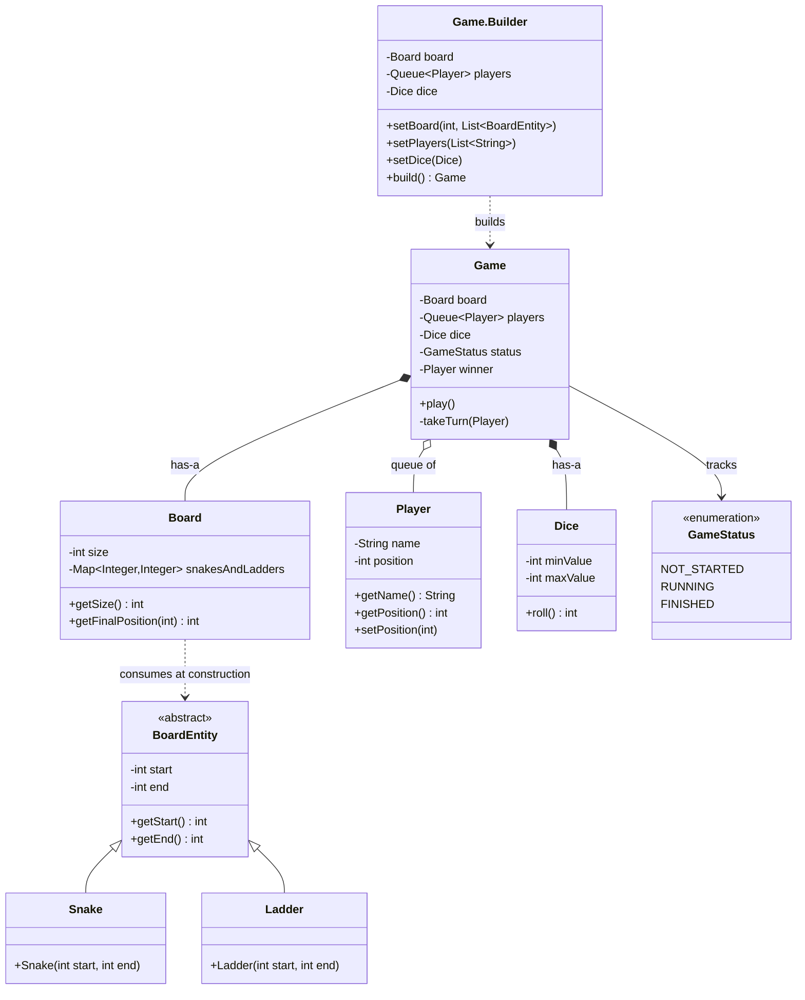
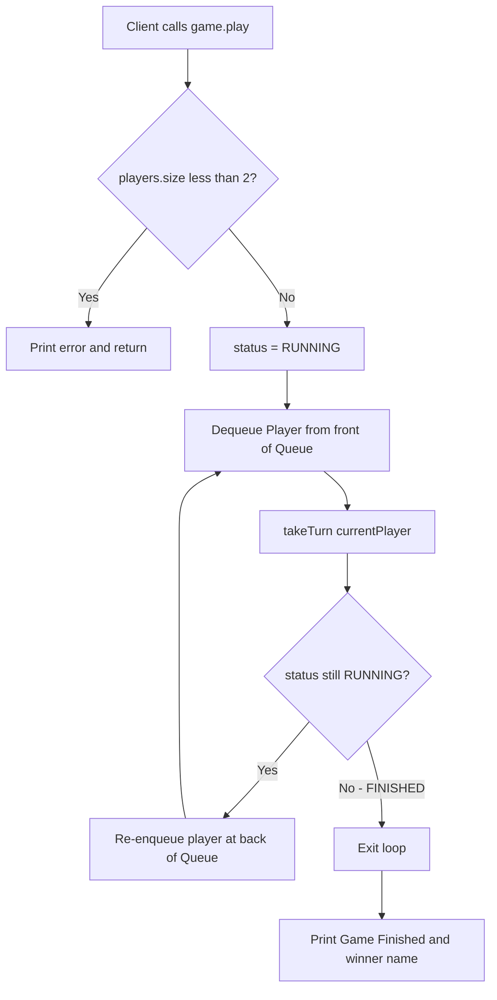
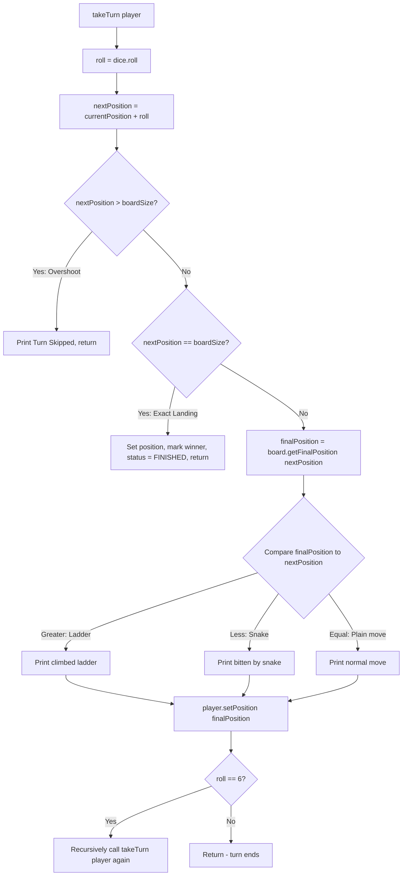

# Snake and Ladder Game - Low Level Design (LLD)

This document explains the Low-Level Design of a Snake and Ladder game, structured exactly how you should present it in a Microsoft SDE-2 interview — starting from requirements, moving to design, and ending with implementation details and follow-up talking points.

---

## 1. Requirements & Problem Statement

**Interviewer:** *"Design a Snake and Ladder game."*

**Candidate (You):** *"Before I design this, let me lock down the scope with a few questions."*

* **Board size:** Is it the standard 10x10 (1 to 100) board, or should the size be configurable? *(Let's keep it configurable.)*
* **Number of players:** Single dice, multiple players, turn-based? *(Yes, 2 or more players, turns rotate.)*
* **Snakes and Ladders:** Are their positions fixed/hardcoded, or should they be configurable at game setup? *(Configurable — pass in a list at setup time.)*
* **Dice:** A single, standard 6-sided die? Should the range be configurable (in case we want a biased/testable die later)? *(Yes, keep the range configurable.)*
* **Winning condition:** Does a player need to land **exactly** on the last cell, or is overshooting allowed? *(Exact landing required — this is the real board-game rule and it's a great detail to call out proactively.)*
* **Extra turn rule:** Does rolling a 6 give the player another roll? *(Yes.)*
* **Concurrency:** Is this a single console/local game, or multiplayer over network? *(Single process, turn-based, no concurrency concerns — keeps the design simple. I'll mention how I'd extend it later.)*

**Summary of Scope:** A configurable-size board game supporting N players (N ≥ 2), a configurable dice, configurable snake/ladder placements, standard "exact landing to win" and "roll a 6 for an extra turn" rules.

---

## 2. Core Entities and Architecture

I'll break the problem into small, single-purpose classes rather than one giant `Game` God-class:

1. **`Game`** — The orchestrator/controller. Owns the game loop, decides turn order, and applies game rules (win check, overshoot check, extra-turn-on-6).
2. **`Board`** — Owns the board size and the snake/ladder mapping. Given any square, it can tell you where you actually end up.
3. **`BoardEntity`** *(abstract)* — A generic concept of "something that teleports you from square A to square B." Both snakes and ladders are really the same mechanic, just in opposite directions.
4. **`Snake`** / **`Ladder`** — Concrete `BoardEntity` subtypes that only differ in *validation rules* (a snake's head must be higher than its tail; a ladder's bottom must be lower than its top).
5. **`Player`** — A simple data holder: name + current position on the board.
6. **`Dice`** — Knows how to produce a random roll within a configurable range.
7. **`GameStatus`** *(enum)* — Represents the lifecycle of the game: `NOT_STARTED`, `RUNNING`, `FINISHED`.

This mirrors how you'd describe it out loud: *"The Game asks the Dice for a roll, moves the Player, and asks the Board where that move actually lands — because the Board silently applies any Snake/Ladder that happens to be there."*

---

## 3. Design Principles and Patterns Used

Calling out *why* you made each choice is what separates an SDE-2 answer from an SDE-1 answer.

* **Builder Design Pattern** — `Game` is constructed via `Game.Builder` (`setBoard()`, `setPlayers()`, `setDice()`, `build()`). A `Game` has several optional-looking configuration pieces (board layout, player list, dice), so a telescoping constructor would get messy fast. The Builder gives a readable, fluent setup and lets me **validate everything in one place** (`build()` throws `IllegalStateException` if board/players/dice aren't set) instead of scattering null-checks across constructors.
* **Abstraction via `BoardEntity`** — `Snake` and `Ladder` are conceptually "opposite" but mechanically identical: both just map a `start` square to an `end` square. I model that shared mechanic once in an abstract `BoardEntity`, and let the subclasses only own what's actually different — their validation rule.
* **Open/Closed Principle (SOLID)** — `Board` doesn't know or care whether a `BoardEntity` is a `Snake`, a `Ladder`, or something else entirely. It just reads `getStart()`/`getEnd()` and builds a `Map<Integer, Integer>`. If tomorrow the game adds a "Portal" or "Wormhole" entity, I add a new `BoardEntity` subclass with its own validation — **zero changes** to `Board` or `Game`.
* **Liskov Substitution Principle (SOLID)** — Anywhere a `BoardEntity` is expected (the `List<BoardEntity>` passed into `Board`), a `Snake` or a `Ladder` can be passed in interchangeably without breaking behavior.
* **Single Responsibility Principle (SOLID)** — `Dice` only knows how to roll. `Player` only tracks identity and position. `Board` only knows layout and square-resolution. `Game` is the only class that knows *rules* (turn order, win condition, extra turn). Nobody's job overlaps.
* **Encapsulation** — Every field is `private`. `Player.position` can only be mutated through `setPosition()`, and `Board`'s internal `Map` is never exposed directly — callers only get a resolved answer via `getFinalPosition()`.
* **Fail-Fast Validation** — `Snake`'s and `Ladder`'s constructors validate their own invariant immediately (`start <= end` throws for a Snake, `start >= end` throws for a Ladder). This stops a misconfigured board from being built at all, rather than producing weird bugs mid-game.
* **Enum-based State Management** — `GameStatus` (`NOT_STARTED → RUNNING → FINISHED`) replaces what could have been a fragile `boolean isRunning` / `boolean isOver` pair. It's explicit, and the compiler won't let you represent an invalid combination.
* **Composition over Inheritance** — `Game` *has-a* `Board`, *has-a* `Dice`, *has-a* queue of `Player`s. None of these relationships are modeled as inheritance, because a Game isn't a kind of Board or Dice — it just uses them.
* **Efficient lookups (`Map` over List scan)** — `Board` stores `Map<Integer, Integer> snakesAndLadders` keyed by the *start* square. Resolving a landing square is an **O(1)** `getOrDefault()` lookup instead of looping through a list of entities on every single move.

---

## 4. Visualizing the Architecture

### Class Diagram



---

## 5. System Workflows (Flow Charts)

### Workflow 1: The Main Game Loop



**Why a `Queue<Player>` for turn order?** Round-robin turn scheduling is exactly what a queue gives you for free: poll the front, process it, push it to the back. No manual index/modulo arithmetic needed, and it naturally supports players joining/leaving in future extensions.

### Workflow 2: Resolving a Single Turn (`takeTurn`)



**Talking point:** notice the win check happens *before* the snake/ladder lookup, and the extra-turn-on-6 is handled by **recursion on the same player**, not by re-queueing them. That's a deliberate, explainable design choice — walk the interviewer through it rather than just reading the code.

---

## 6. Implementation Deep Dive (How it works under the hood)

**1. Storing Snakes and Ladders as a `Map<Integer, Integer>`**
`Board`'s constructor loops over the `List<BoardEntity>` once and inserts `start → end` into a `HashMap`. After that, `getFinalPosition(position)` is a single `getOrDefault(position, position)` call — if the square has no snake/ladder, you just get the same square back. This is O(1) per move instead of scanning a list of entities every turn.

**2. Why `Snake` and `Ladder` are separate classes instead of one `BoardEntity(start, end, type)`**
Using subclasses lets each type enforce its own invariant **in the constructor**, so an invalid board configuration fails immediately at setup time (fail-fast) instead of silently producing wrong gameplay:
```java
new Snake(17, 7);   // OK: head(17) > tail(7)
new Snake(7, 17);   // throws IllegalArgumentException — that's a ladder shape!
new Ladder(3, 38);  // OK: bottom(3) < top(38)
```

**3. Turn resolution order matters**
Inside `takeTurn`, the checks happen in this exact order, and the order is meaningful:
1. **Overshoot check** (`nextPosition > boardSize`) — turn is skipped entirely, player doesn't move at all.
2. **Exact-landing win check** (`nextPosition == boardSize`) — this must run *before* consulting the Board, because the winning square itself doesn't need a snake/ladder lookup.
3. **Only then** does it call `board.getFinalPosition(nextPosition)` to see if a snake or ladder applies.

**4. Extra turn on rolling a 6 — recursion, not a loop or re-queue**
```java
if (roll == 6) {
    takeTurn(player); // same player rolls again immediately
}
```
This keeps the "same player keeps rolling until they don't get a 6 (or they win/overshoot)" rule very close to the actual game rule text, and it avoids re-inserting the player into the turn queue multiple times, which would corrupt turn order.

**5. Builder validates before construction**
```java
public Game build() {
    if (board == null || players == null || dice == null) {
        throw new IllegalStateException("Board, Players, and Dice must be set.");
    }
    return new Game(this);
}
```
This guarantees a `Game` object, once constructed, is **always** in a valid, ready-to-play state — no partially configured `Game` can ever leak out of the Builder.

**6. Minimum player check happens in `play()`, not in the Builder**
`play()` checks `players.size() < 2` at runtime rather than in `Builder.build()`. This is a reasonable interview talking point either way — you could argue it belongs in `build()` for even-earlier fail-fast behavior, and mention that as a possible improvement.

---

## 7. Edge Cases & "Gotchas" Worth Raising Proactively

Bringing these up **yourself** in an interview signals strong attention to detail:

* **Exact landing rule**: A roll that would take a player past the last square is a wasted turn — very easy to forget if you're coding this live under time pressure.
* **Ladder ending exactly on the last square**: In the current implementation, the win check only compares the *raw* `nextPosition` to `boardSize`, **before** the snake/ladder map is consulted. If a ladder's top square happened to be exactly the last square, `board.getFinalPosition()` would correctly return the last square, but the code wouldn't re-check for a win after applying it — the player would sit on the winning square without being declared the winner. Calling this out shows the interviewer you can spot subtle order-of-operations bugs. (Fix: re-check `finalPosition == board.getSize()` after resolving the snake/ladder, or simply resolve the snake/ladder first and do a single win check at the end.)
* **Unbounded 6-streak recursion**: Some official rule variants say "three 6s in a row voids your turn / sends you back to the start" to prevent a player from monopolizing turns indefinitely. This implementation doesn't cap it — worth mentioning as a rule you'd clarify with the interviewer.
* **A snake's tail or a ladder's top landing on another entity's start square**: Not validated here — e.g., nothing stops a ladder from ending exactly where a snake begins. Real board games avoid this by design; a production version might validate no two entities chain into each other unexpectedly.
* **Concurrent modification safety**: Since this is a single-threaded, turn-based game, there's no synchronization needed — but if asked to extend this to a server handling multiple simultaneous game rooms, each `Game` instance is independent and would need its own lock/actor if shared across threads.

---

## 8. Interview Closing Remarks (Possible Extensions)

If the interviewer asks "how would you extend this?", here are strong answers:

1. **Strategy Pattern for the Dice** — Today `Dice` is a single concrete class. If we wanted multiple dice, a "cheat/loaded" die for testing, or a rule like "sum of two dice," I'd extract a `DiceRollStrategy` interface so `Game` doesn't care how the roll is produced.
2. **Observer Pattern for Game Events** — Right now, all feedback is `System.out.println` calls baked directly into `Game`. In a real product (web/mobile UI, or multiplayer over network), I'd emit events (`PlayerMoved`, `PlayerWon`, `SnakeBite`, `LadderClimb`) to registered `GameObserver`s (UI renderer, logger, analytics, WebSocket broadcaster) instead of printing directly — this decouples game logic from presentation.
3. **State Pattern for `GameStatus`** — For a more complex game (pause/resume, multiplayer lobby states), I'd promote `GameStatus` from an enum into a full State pattern (`NotStartedState`, `RunningState`, `FinishedState`) where each state governs which actions are legal.
4. **Factory for `BoardEntity` from config** — If snakes/ladders were loaded from a JSON/DB config rather than hardcoded in `main()`, I'd add a `BoardEntityFactory` to parse and validate entries, keeping `Board`'s constructor unaware of the source format.
5. **Distributed/Networked Version** — For an online multiplayer variant, I'd move `Game` state into a shared store (Redis) keyed by game-room ID, have each player action come in as a message (Kafka/WebSocket), and broadcast state changes to all connected clients — the core `Board`/`Player`/`Dice` domain model stays exactly the same, only the transport and persistence layers change.

---

## 9. The 60-Second Verbal Pitch (say this out loud in the interview)

> "I modeled the game around four core ideas: a `Board` that only knows how to resolve a square (applying snakes or ladders via an O(1) map lookup), a `BoardEntity` abstraction so snakes and ladders share one mechanic but validate their own shape independently, a `Player` that's just a name and position, and a `Game` that owns the actual rules — turn order via a queue, the exact-landing win condition, and the roll-a-6-gets-another-turn rule via simple recursion. I used the Builder pattern to construct the `Game` because it has multiple required pieces — board, players, dice — and I wanted one place to validate that all of them are present before the game can start. Each class has exactly one reason to change, which is what makes it easy to extend later — for example, swapping in a weighted dice or adding an Observer for a UI layer wouldn't touch the core game logic at all."
