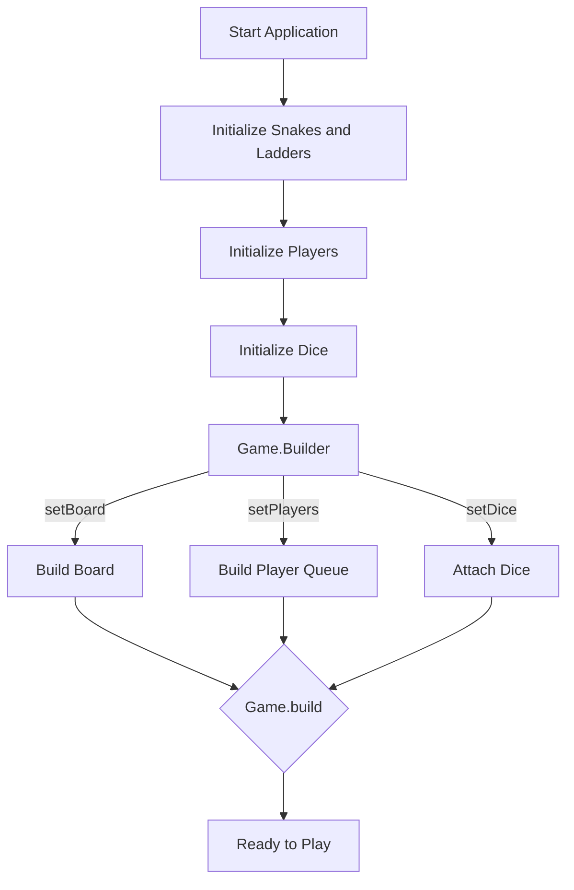
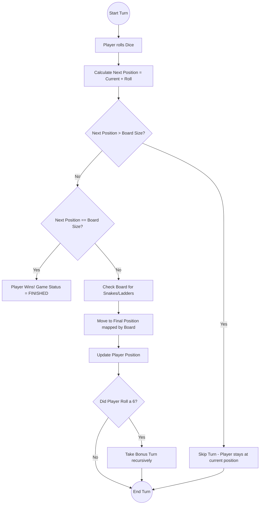

# Low-Level Design (LLD): Snake and Ladder Game

This document outlines the Low-Level Design (LLD) for a Snake and Ladder game, structured specifically for a Microsoft SDE-2 interview. It provides a clear problem statement, architectural components, applied design patterns, and visual flowcharts to help you explain the solution confidently.

---

## 1. Problem Statement

We need to design a backend system for a multiplayer Snake and Ladder game with the following core rules:
- **Board:** A grid with a configurable number of cells (e.g., 1 to 100).
- **Entities:** The board contains Snakes (which move a player down) and Ladders (which move a player up).
- **Players:** Two or more players can play. Players take turns in a round-robin fashion.
- **Dice:** A configurable dice (e.g., 1 to 6).
- **Movement Rules:** 
  - A player needs an exact roll to land on the final square. If a roll takes them beyond the final square, their turn is skipped.
  - If a player rolls a 6 (the maximum dice value), they get an immediate bonus turn.
- **Winning:** The game finishes when the first player reaches exactly the last cell of the board.

---

## 2. Core Entities and Object-Oriented Design

To build a modular and extensible system, we identify the following entities:

1. **`BoardEntity` (Abstract):** Represents any object on the board that alters a player's position. It has a `start` and an `end` position.
2. **`Snake` & `Ladder` (Concrete Entities):** Extend `BoardEntity`. They enforce logical validations (e.g., for a Snake, the head/start must be strictly greater than the tail/end).
3. **`Board`:** Holds the size of the game and a mapping of `start` -> `end` for all board entities. It abstracts away whether a jump is a snake or a ladder, simply returning the "final position" for a given cell.
4. **`Dice`:** Responsible for generating a random number between `minValue` and `maxValue`.
5. **`Player`:** Maintains the state of a participant (name and current position).
6. **`Game`:** The central orchestrator. It manages the queue of players, tracks the game status, and enforces the game rules.

---

## 3. Design Patterns & Principles

### A. Builder Pattern (`Game.Builder`)
**Why?** The `Game` requires multiple complex configurations (Board size, list of Snakes/Ladders, Queue of Players, Dice configuration). Using the Builder pattern ensures that a `Game` object is fully and correctly constructed before it is played. It prevents the creation of a "half-baked" game state (e.g., a game with players but no dice).

### B. Single Responsibility Principle (SRP)
Every class has a strict, single reason to change:
- `Dice` only handles randomness.
- `Player` acts purely as a state-holder (DTO-like).
- `Board` only maps start positions to end positions. It doesn't know about game rules.
- `Game` strictly enforces rules (like rolling a 6, exact win condition) without worrying about how a dice generates a number.

### C. Polymorphism and Open/Closed Principle (OCP)
By introducing the `BoardEntity` abstraction, the system is open for extension but closed for modification. If we want to add a new entity tomorrow (e.g., a "Teleportation Pad" or a "Spring"), we simply create a new class extending `BoardEntity`. The `Board` mapping logic remains entirely untouched.

---

## 4. System Logic & Flow Diagrams

### A. Game Initialization Flow
The game uses a Builder to assemble the necessary parts. 

### B. Turn Execution Logic
The game uses a `Queue<Player>` to simulate round-robin turns. The player at the front of the queue is polled, they take their turn, and if the game is still running, they are added back to the back of the queue.

Here is the exact flow of a single turn:

---

## 5. Interview Delivery Script (How to explain this in an interview)

If you are asked to design this in a Microsoft interview, guide the interviewer through your thought process logically:

1. **Clarify Requirements:** *"Before I jump into the code, I want to confirm a few rules. Does a player need to roll the exact number to win? (Yes) What happens if they roll a 6? (Bonus turn).*
2. **Identify Entities:** *"I'll start by defining the core entities. We clearly have a `Player`, a `Dice`, and a `Board`. On the board, we have `Snakes` and `Ladders`."*
3. **Introduce Abstraction (The "Aha!" Moment):** *"To make the board generic, I won't hardcode snakes and ladders into the board class. Instead, I'll create an abstract `BoardEntity` with `start` and `end` positions. `Snake` and `Ladder` will inherit from this and validate their own coordinates. The `Board` will just maintain a `Map<Integer, Integer>` to handle transitions from any start point to any end point. This makes our design highly extensible."*
4. **Explain Game Loop:** *"For turn management, I will use a `Queue` data structure. We poll the player at the front, let them play, and if they don't win, we offer them back to the queue. This beautifully simulates a round-robin schedule."*
5. **Explain the Builder:** *"Because configuring a game requires setting up the board size, entities, dice type, and players, I will use the Builder pattern for the `Game` class to ensure immutability and valid state upon creation."*

This structured approach shows that you don't just write code, but you think deeply about **extensibility, data structures (like Queues and HashMaps), and robust object instantiation.**
