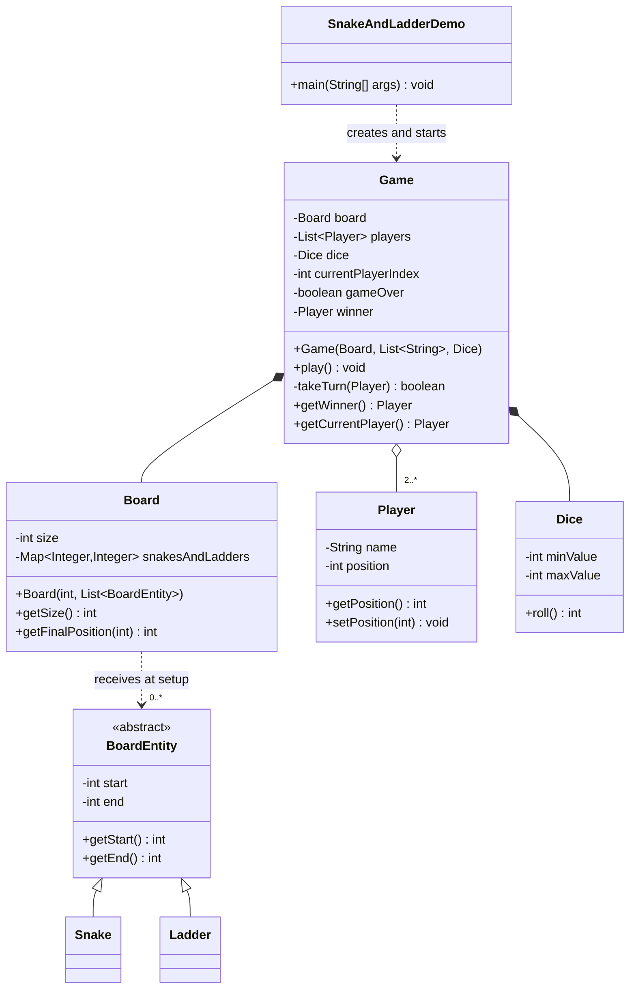
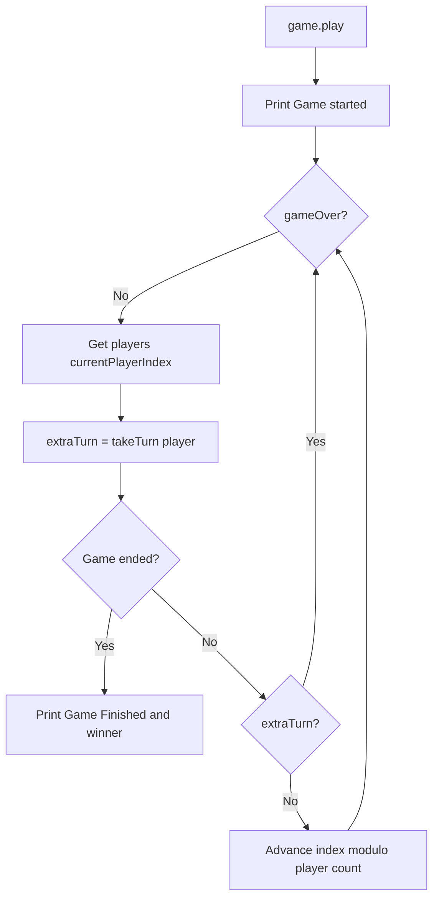
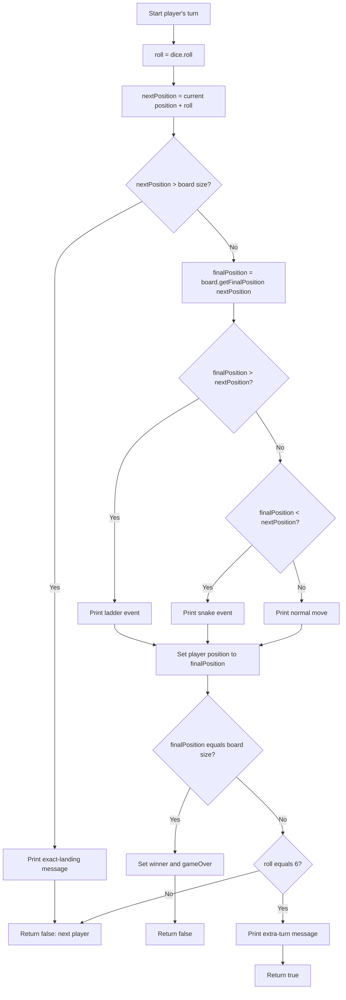

# Snake and Ladder — Low-Level Design Interview Guide

This guide explains the implementation in this package, especially [SnakeAndLadderDemo.java](SnakeAndLadderDemo.java) and `Game.java`. It is written as a simple, interview-style narrative you can use in an SDE-2 low-level design round.

## 1. Problem statement

Design a configurable, turn-based Snake and Ladder game.

The game should:

- Support two or more players.
- Support a configurable board size; the demo uses squares `1` through `100`.
- Accept configurable snakes and ladders when the board is created.
- Use a configurable dice range; the demo uses one six-sided dice, `1` to `6`.
- Move players in round-robin order.
- Require **exact landing** on the last square. A move beyond the board is skipped.
- Move a player immediately on landing at the start of a snake or ladder.
- Give an extra turn when the dice result is `6`.
- Print game events and the winner to the console.

`SnakeAndLadderDemo` is the composition root: it creates the entities, board, players, dice, and starts the game.

```java
Board board = new Board(100, boardEntities);
Dice dice = new Dice(1, 6);
Game game = new Game(board, List.of("Alice", "Bob", "Charlie"), dice);
game.play();
```

## 2. How to begin the interview

Do not jump straight into classes. First clarify the rules. You can say:

> “I will assume a local, turn-based game with at least two players. The board size, dice range, snake positions, and ladder positions are configurable. A player must land exactly on the last square, rolling a six gives an immediate extra turn, and this version needs one winner. I will keep the design extensible for future rules.”

Useful questions if the interviewer has not specified them:

1. Must a player land exactly on the last square? This implementation says yes.
2. Does rolling a six give an extra turn? This implementation says yes.
3. Is there a limit on consecutive sixes? This implementation has no limit.
4. Can a snake or ladder end on another jump start? This implementation performs one jump only.
5. Is this a console game or an online game? This implementation is a single-process console game.

## 3. Core design

| Class | Responsibility | Important state / operation |
| --- | --- | --- |
| `Game` | Runs turns and applies game rules | player index, winner, `play()`, `takeTurn()` |
| `Board` | Holds board size and resolves jumps | immutable start-to-end map |
| `BoardEntity` | Common abstraction for any board jump | `start`, `end` |
| `Snake` | A downward board jump | validates `start > end` |
| `Ladder` | An upward board jump | validates `start < end` |
| `Player` | Player identity and current square | name, position |
| `Dice` | Produces a random configured value | `roll()` |
| `SnakeAndLadderDemo` | Wires the objects together | `main()` |

The central collaboration is:

> “`Game` asks `Dice` for a roll, calculates a tentative square, asks `Board` to resolve a possible jump, updates `Player`, then decides whether the game ends or the player receives another turn.”

## 4. Class diagram


```mermaid
classDiagram
    class SnakeAndLadderDemo {
        +main(String[] args) void
    }
    class Game {
        -Board board
        -List~Player~ players
        -Dice dice
        -int currentPlayerIndex
        -boolean gameOver
        -Player winner
        +Game(Board, List~String~, Dice)
        +play() void
        -takeTurn(Player) boolean
        +getWinner() Player
        +getCurrentPlayer() Player
    }
    class Board {
        -int size
        -Map~Integer,Integer~ snakesAndLadders
        +Board(int, List~BoardEntity~)
        +getSize() int
        +getFinalPosition(int) int
    }
    class BoardEntity {
        <<abstract>>
        -int start
        -int end
        +getStart() int
        +getEnd() int
    }
    class Snake
    class Ladder
    class Player {
        -String name
        -int position
        +getPosition() int
        +setPosition(int) void
    }
    class Dice {
        -int minValue
        -int maxValue
        +roll() int
    }
    SnakeAndLadderDemo ..> Game : creates and starts
    Game *-- Board
    Game *-- Dice
    Game o-- "2..*" Player
    Board ..> "0..*" BoardEntity : receives at setup
    BoardEntity <|-- Snake
    BoardEntity <|-- Ladder
```

## 5. Object creation and validation

### Board entities

`BoardEntity` stores the shared `start` and `end` fields. Both subclasses use this common shape but enforce their own invariant:

```java
new Snake(17, 7);   // valid: head is above tail
new Ladder(3, 38);  // valid: bottom is below top
```

A snake with `start <= end`, or a ladder with `start >= end`, throws `IllegalArgumentException` during construction. This is fail-fast validation: invalid game setup is rejected before play begins.

### Board

`Board` validates that its size is at least two. It converts the input entities into an immutable `Map<Integer, Integer>`:

```text
start square -> end square
17 -> 7       (snake)
3  -> 38      (ladder)
```

It rejects a null entity, positions outside the board, and two entities with the same start square. `Map.copyOf(jumps)` prevents the mapping from changing after board creation.

`getFinalPosition(position)` uses `getOrDefault`; a normal landing returns the same position, while a jump start returns its destination. Either lookup is average **O(1)**.

### Dice and players

`Dice` rejects an inverted range and uses `ThreadLocalRandom` to return an inclusive value between its configured bounds. The demo creates `new Dice(1, 6)`.

`Game` rejects a null board/dice, fewer than two players, and blank player names. It converts the supplied names into new `Player` objects, each beginning at position `0`, immediately before the first board square.

## 6. Game flow

### Main loop: round-robin scheduling

`Game` keeps players in a `List<Player>` and records whose turn it is using `currentPlayerIndex`. This is a good fit because the player list is fixed during this game.


```mermaid
flowchart TD
    A[game.play] --> B[Print Game started]
    B --> C{gameOver?}
    C -->|No| D[Get players currentPlayerIndex]
    D --> E[extraTurn = takeTurn player]
    E --> F{Game ended?}
    F -->|Yes| G[Print Game Finished and winner]
    F -->|No| H{extraTurn?}
    H -->|Yes| C
    H -->|No| I[Advance index modulo player count]
    I --> C
```

Modulo wraps the index after the last player, creating `Alice -> Bob -> Charlie -> Alice`. A six does not advance the index, so the same player acts immediately again.

### Single-turn flow


```mermaid
flowchart TD
    A[Start player's turn] --> B[roll = dice.roll]
    B --> C[nextPosition = current position + roll]
    C --> D{nextPosition > board size?}
    D -->|Yes| E[Print exact-landing message]
    E --> Z[Return false: next player]
    D -->|No| F[finalPosition = board.getFinalPosition nextPosition]
    F --> G{finalPosition > nextPosition?}
    G -->|Yes| H[Print ladder event]
    G -->|No| I{finalPosition < nextPosition?}
    I -->|Yes| J[Print snake event]
    I -->|No| K[Print normal move]
    H --> L[Set player position to finalPosition]
    J --> L
    K --> L
    L --> M{finalPosition equals board size?}
    M -->|Yes| N[Set winner and gameOver]
    N --> O[Return false]
    M -->|No| P{roll equals 6?}
    P -->|Yes| Q[Print extra-turn message]
    Q --> R[Return true]
    P -->|No| Z
```

### Rule ordering matters

Inside `takeTurn()`, rules occur in this order:

1. Roll the dice and calculate `nextPosition`.
2. If it exceeds the board size, do not change the player position; end the turn.
3. Resolve one snake or ladder using the board map.
4. Update the player position.
5. Check whether the **final** position is the last square; this correctly supports a ladder that ends on the final square.
6. If the player did not win and rolled six, return `true` so the outer loop keeps the same player.

## 7. Example walkthrough

If Alice is at `15` and rolls `2`:

1. Tentative position is `17`.
2. The board map contains `17 -> 7`.
3. `Board.getFinalPosition(17)` returns `7`.
4. Alice is moved to `7`, and the game prints a snake event.
5. Alice did not reach 100 and did not roll six, so the next player gets a turn.

If Bob is at `0` and rolls `3`, the board resolves `3 -> 38`; he ends on 38 that turn. If Charlie is at `98` and rolls `4`, position 102 overshoots, so Charlie remains on 98.

## 8. Design principles used

Connect every principle to a code choice instead of only naming it.

### Single Responsibility Principle

- `Dice` owns random-roll behavior.
- `Player` owns player state.
- `Board` owns layout and jump resolution.
- `Game` owns turn, win, and extra-turn rules.
- `Snake` and `Ladder` own their individual validity rules.

### Encapsulation and immutability

Fields are private. `Board` exposes lookup operations rather than its map, and the map is immutable after construction. Board-entity coordinates and dice bounds are final. `Player.position` is mutable because moving is a valid state transition.

### Abstraction and polymorphism

`Board` accepts `List<BoardEntity>`, not separate snake and ladder lists. It only needs the common start/end contract, so either subclass can be used wherever a board entity is needed.

### Open/Closed Principle — partly achieved

A new basic jump type such as `Portal` can extend `BoardEntity` and reuse board storage without changing `Board`. Be accurate: `Game` currently determines the console message by comparing start and end positions. A portal with special behaviour or messaging can require a small change there.

### Composition over inheritance

`Game` has a board, dice, and players; it does not inherit from them. Inheritance is used only for a true “is a” relationship: a snake or ladder is a board entity.

### Fail-fast validation

Constructors reject invalid dice ranges, player input, board sizes, duplicate jump starts, and invalid snake/ladder directions. This makes a broken configuration fail at setup rather than in the middle of a game.

### Thread-safety boundary

`play()` is `synchronized`, so two threads cannot execute the complete game loop simultaneously on the same `Game` instance. This is sufficient for the console scope. It is not a full online multiplayer design; any concurrent external state access would need the same synchronization policy.

## 9. Complexity

Let `P` be player count and `E` be number of snakes and ladders.

| Operation | Time | Space | Reason |
| --- | --- | --- | --- |
| Construct board | O(E) | O(E) | Validate and insert every entity once. |
| Resolve landing square | O(1) average | O(1) extra | Hash-map lookup. |
| Resolve one turn | O(1) average | O(1) extra | One roll, arithmetic, and lookup. |
| Advance player | O(1) | O(1) | Index increment and modulo. |
| Store players | O(P) | O(P) | One object per player. |

The game’s total number of turns is unbounded because dice rolls are random; an individual turn remains constant time on average.

## 10. Boundaries and sensible extensions

- **Three consecutive sixes:** Add a per-turn six counter if that variant is required.
- **Chained jumps:** The board currently resolves one jump. If chaining is allowed, loop with cycle detection or reject chain-producing configurations during board validation.
- **Testable dice:** Extract a small `Roller` interface and inject a deterministic implementation for unit tests.
- **UI or network output:** Replace direct console prints with game events and observers for a UI, logger, or WebSocket broadcaster.
- **Dynamic players:** The index/list approach is ideal for fixed players. If players can join or leave, specify the desired turn-order semantics and use a queue or dedicated turn manager if clearer.
- **Online game:** Persist state by room ID and serialize player actions; use a per-game lock or actor/event loop for ordered updates.

## 11. A strong 60–90 second verbal answer

> “I separated the design into a `Game` orchestrator, a `Board`, `Player`, and `Dice`. `Game` owns the turn order, exact-landing rule, extra turn on six, and winner. It keeps players in a list and uses a current index, so round-robin advancement is O(1) using modulo; when a player rolls six, the index is not advanced. `Board` owns only the board size and jump resolution. At construction, it converts snakes and ladders into an immutable start-to-end hash map, so resolving a landing square is O(1) on average. `Snake` and `Ladder` extend a common `BoardEntity` because both are board jumps, while each validates its own direction. Constructors validate invalid setup early. During a turn, I check overshoot first, resolve one possible jump, update the player, check for a win on the final square, then apply the extra-turn rule. This keeps responsibilities small and makes extensions such as deterministic dice testing or UI event listeners straightforward.”

## 12. Live-coding order

1. State assumptions and name the entities.
2. Implement `Player`, `BoardEntity`, `Snake`, and `Ladder` with validation.
3. Implement `Board` with a map and duplicate-start validation.
4. Implement `Dice`.
5. Implement `Game.takeTurn()` first, since it contains the important rules.
6. Add the index-based game loop, getters, and the small demo.
7. State complexity and one or two extensions.

This order demonstrates solid modelling first, then rule orchestration, instead of beginning with console output.
