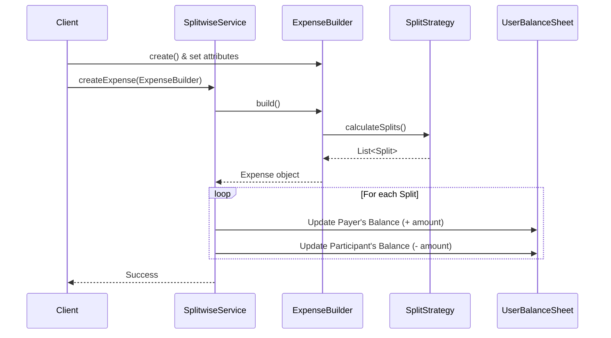

# Low-Level Design (LLD) for Splitwise

This document provides a comprehensive Low-Level Design (LLD) for a Splitwise-like application. This explanation is structured for a Microsoft SDE-2 interview, focusing on clarity, problem-solving, architectural choices, and the specific design patterns utilized to build a scalable and maintainable system.

---

## 1. Problem Statement

**Goal:** Design a highly scalable and extensible expense-sharing application (like Splitwise) where users can add expenses, split them among friends using various strategies, track who owes whom, and settle debts efficiently.

### Key Requirements
1. **User Management:** Users should be able to register and form groups.
2. **Expense Management:** Users can add expenses. An expense should support multiple splitting strategies:
    *   **Equal Split:** The amount is divided equally among all participants.
    *   **Exact Split:** Users specify the exact amount each participant owes.
    *   **Percentage Split:** Users specify the percentage of the total amount each participant owes.
3. **Balance Tracking:** The system should maintain an ongoing balance sheet for each user, showing their net balance with every other user (who owes whom and how much).
4. **Debt Simplification:** A feature to minimize the number of transactions needed to settle all debts within a group.
5. **Settle Up:** Users should be able to make payments to settle their debts.

---

## 2. Core Entities

To model the real-world scenario accurately, we define the following core entities:

*   **User:** Represents an individual in the system (Id, Name, Email, BalanceSheet).
*   **Group:** Represents a collection of users who share expenses (Id, Name, List of Members).
*   **Expense:** Represents a specific transaction where money was spent (Id, Description, Amount, PaidBy, List of Splits).
*   **Split:** Represents how much a specific user owes in a particular expense (User, Amount).
*   **BalanceSheet:** Maintains a map of user-to-amount representing how much the current user owes to (or is owed by) other users.
*   **Transaction:** Represents a settlement payment between two users.

---

## 3. Design Principles & Patterns Used

A senior engineer is expected to write code that is modular, extensible, and adheres to SOLID principles. Here are the key design patterns used in this implementation:

### A. Strategy Pattern (Extensibility for Splits)
**Problem:** We have multiple ways to split an expense (Equal, Exact, Percentage), and we might add more in the future (e.g., By Shares). If we use `if-else` blocks in the `Expense` class, it violates the Open/Closed Principle.
**Solution:** We define a `SplitStrategy` interface with a `calculateSplits()` method. We then create concrete classes: `EqualSplitStrategy`, `ExactSplitStrategy`, and `PercentageSplitStrategy`.
*   **Benefit:** Adding a new split type requires zero changes to the core `Expense` logic.

### B. Builder Pattern (Complex Object Creation)
**Problem:** An `Expense` object requires many parameters (Description, Amount, PaidBy, Participants, Strategy, optional Split Values). A constructor with all these parameters becomes unreadable and prone to errors.
**Solution:** We use an `ExpenseBuilder` static inner class.
*   **Benefit:** It provides a clean, fluent API to construct an `Expense` step-by-step and ensures all mandatory validations are performed before the `Expense` object is created.

### C. Singleton Pattern (Centralized Service)
**Problem:** We need a single point of truth to manage all users, groups, and coordinate the core business logic.
**Solution:** The `SplitwiseService` is implemented as a Singleton.
*   **Benefit:** Ensures that there is only one instance of the service holding the in-memory data (`Map<String, User>`) preventing inconsistencies.

### D. Facade Pattern (Simplified Interface)
**Problem:** The client shouldn't need to know how balances are updated internally when an expense is added.
**Solution:** `SplitwiseService` acts as a facade. The client just calls `service.createExpense(builder)`, and the service orchestrates calculating splits and updating individual balance sheets.

---

## 4. System Workflows & Flow Charts

### Workflow 1: Adding a New Expense

When a user adds an expense, the system must calculate how much everyone owes using the provided strategy, and then update the balance sheet of every participant.



### Workflow 2: Debt Simplification Algorithm

This is a classic interview problem in itself. If A owes B $10, and B owes C $10, we can simplify this so A just pays C $10.

**Algorithm Logic:**
1.  **Calculate Net Balance:** For every user in the group, calculate their net balance (total money owed to them minus total money they owe).
2.  **Separate Users:** Divide users into two lists:
    *   `Creditors` (Net Balance > 0): People who need to receive money.
    *   `Debtors` (Net Balance < 0): People who need to pay money.
3.  **Sort:** Sort Creditors descending (largest receiver first) and Debtors ascending (largest payer first).
4.  **Greedy Settlement:** Use two pointers (`i` for creditors, `j` for debtors).
    *   Find the minimum amount between what the current creditor needs and what the current debtor owes: `settleAmount = min(creditor.amount, abs(debtor.amount))`
    *   Create a transaction for `settleAmount`.
    *   Adjust their net balances. If a user's balance hits 0, move the pointer to the next person.

```mermaid
flowchart TD
    A[Start: Simplify Debts] --> B[Calculate Net Balance for all users]
    B --> C{Net Balance > 0?}
    C -- Yes --> D[Add to Creditors List]
    C -- No --> E{Net Balance < 0?}
    E -- Yes --> F[Add to Debtors List]
    E -- No --> G[Ignore (Balance is 0)]
    
    D --> H[Sort Creditors Descending]
    F --> I[Sort Debtors Ascending]
    
    H --> J[Initialize Pointers i=0, j=0]
    I --> J
    
    J --> K{i < creditors.size AND j < debtors.size?}
    K -- Yes --> L[Find Min: min(Creditor[i], abs(Debtor[j]))]
    L --> M[Create Transaction: Debtor pays Creditor]
    M --> N[Deduct amount from both]
    N --> O{Creditor[i] == 0?}
    O -- Yes --> P[i++]
    O -- No --> Q{Debtor[j] == 0?}
    P --> Q
    Q -- Yes --> R[j++]
    Q -- No --> K
    R --> K
    
    K -- No --> S[End: Return List of Transactions]
```

---

## 5. Summary for the Interviewer

If asked to summarize the design during an interview, use this elevator pitch:

> "I designed the Splitwise application centering around the **User**, **Group**, and **Expense** entities. I utilized the **Strategy Pattern** to handle varying split logic (Equal, Exact, Percentage) which makes the system highly extensible without modifying core classes (OCP principle). To handle the complex creation of an Expense, I implemented a **Builder Pattern**. The core orchestration is handled by a **Singleton Service** acting as a **Facade**, ensuring that balance sheets are updated atomically when an expense is added. Finally, for optimizing group settlements, I implemented a greedy debt simplification algorithm that calculates net balances and efficiently matches maximum debtors with maximum creditors."
