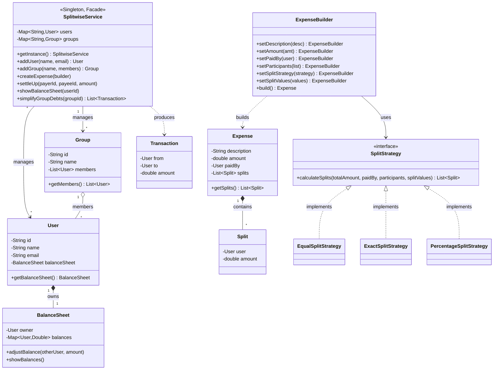
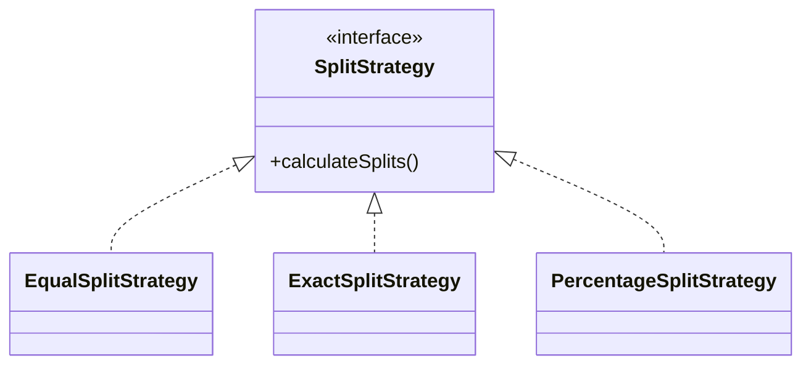
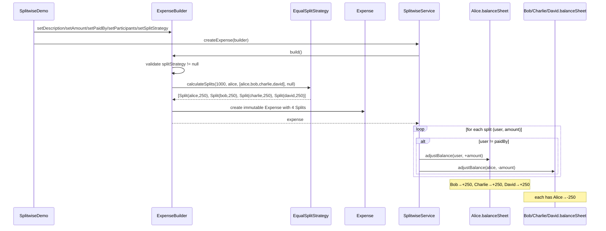
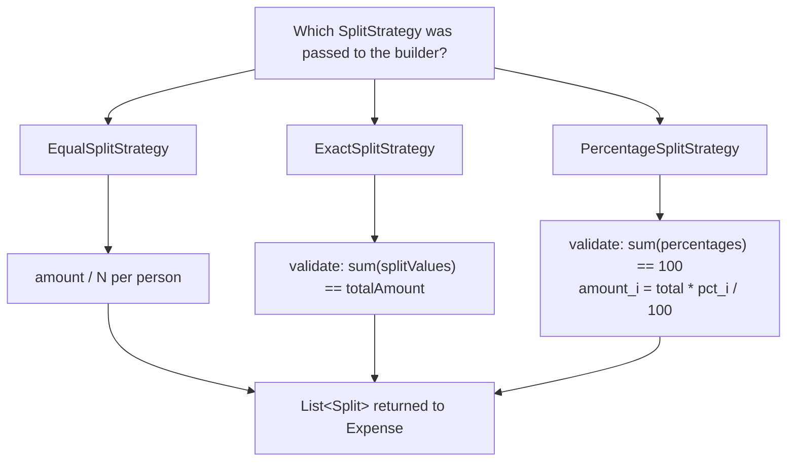
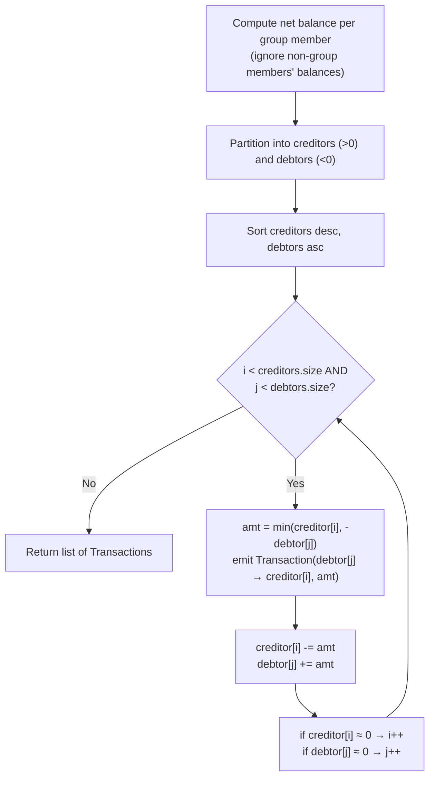

# Splitwise — Low Level Design (Interview Prep Guide)

> Target: Microsoft SDE-2 LLD round
> Style: Written the way you should *speak* it in the interview — problem → requirements → design → code walkthrough → trade-offs → follow-ups.

---

## 1. How to open the interview (Problem Statement)

When the interviewer says *"Design Splitwise"*, restate the problem in your own words before writing any code. This shows you can convert an ambiguous prompt into concrete scope.

**In your own words, say something like:**

> "Splitwise is an expense-sharing app. A group of people (friends, roommates, colleagues) incur shared expenses. One person pays the bill, but the cost should be split among the participants — equally, by exact amounts, or by percentage. The system needs to track who owes whom how much, let two people settle up, and be able to simplify a tangled web of debts into the minimum number of payments."

Then **clarify scope with the interviewer** — this is the single most important signal in an LLD round.

### Functional Requirements (what I confirmed with the interviewer)
1. Users can be added to the system.
2. Users can be grouped (e.g., "Goa Trip", "Flatmates").
3. Any user can add an **expense**, specifying who paid and who the participants are.
4. An expense can be split in multiple ways:
   - **Equal** — split evenly among participants.
   - **Exact** — payer specifies the exact amount each participant owes.
   - **Percentage** — payer specifies what % each participant owes (must sum to 100).
5. The system maintains a running **balance** between every pair of users.
6. A user can view their own **balance sheet** — who owes them, and whom they owe.
7. Users can **settle up** (record a payment) to clear/reduce a balance.
8. Within a group, the system can **simplify debts** — reduce a chain of IOUs into the minimum number of transactions.

### Non-Functional Requirements
1. **Extensibility** — adding a new split type (e.g., "split by shares") shouldn't touch existing code.
2. **Consistency** — a balance update must be atomic; concurrent expense creation shouldn't corrupt balances.
3. **Single source of truth** — there should be one global service to talk to, not scattered state.

### Explicitly out of scope (say this out loud — it shows maturity)
- Real payment gateway integration (settleUp is just a ledger entry).
- Currency conversion / multi-currency.
- Notifications, auth, persistence (DB) — assume in-memory for the interview.

---

## 2. Identify the core entities (nouns → classes)

Before jumping to code, list the nouns in the problem and turn them into classes. This is the step interviewers want to *see* you do out loud.

| Noun in problem | Class | Responsibility |
|---|---|---|
| Person using the app | `User` | Identity + owns a `BalanceSheet` |
| Collection of users | `Group` | Just a named list of members |
| A bill someone paid | `Expense` | What was paid, by whom, split how |
| One person's share of an expense | `Split` | (user, amount) pair |
| "Who owes whom" ledger for one user | `BalanceSheet` | Map of `User -> net amount` |
| A settlement suggestion | `Transaction` | (from, to, amount) — used for debt simplification output |
| The algorithm to divide the amount | `SplitStrategy` | Equal / Exact / Percentage |
| The orchestrator | `SplitwiseService` | Facade — the only class the outside world talks to |

**Verbalize the split-strategy insight**: *"The one part of this problem that clearly varies is 'how do we divide the amount'. That's a classic sign to pull it out as a **Strategy** instead of an if-else chain in the expense class."*

---

## 3. Class Diagram



---

## 4. Design Patterns used (be ready to *justify*, not just name)

Interviewers at Microsoft care less about "which pattern" and more about **"why this pattern, what breaks without it."** Have that answer ready for each.

### 4.1 Strategy Pattern — `SplitStrategy`

- **Where**: `strategy/SplitStrategy.java` + 3 implementations.
- **Why**: The *way an expense amount is divided* is the one axis of variation in this problem. Without Strategy, `Expense` would need an `if (type == EQUAL) ... else if (type == EXACT) ...` block, and every new split type (e.g., "by shares") means editing that block.
- **What it buys you**: Open/Closed Principle — add `SharesSplitStrategy` tomorrow without touching `Expense`, `ExpenseBuilder`, or `SplitwiseService`.
- **How it's wired**: `Expense.ExpenseBuilder` takes a `SplitStrategy` object and simply calls `splitStrategy.calculateSplits(amount, paidBy, participants, splitValues)` inside `build()`. `Expense` never knows *which* strategy it got — pure polymorphism.

### 4.2 Builder Pattern — `Expense.ExpenseBuilder`
- **Where**: `entities/Expense.java` (static nested class).
- **Why**: `Expense` has many optional/conditional fields — `splitValues` is only needed for Exact/Percentage, not Equal. A giant constructor `Expense(desc, amount, paidBy, participants, strategy, splitValues)` is unreadable at the call site and error-prone (easy to swap two `double` args).
- **What it buys you**: Readable, self-documenting construction:
  ```java
  new Expense.ExpenseBuilder()
      .setDescription("Dinner")
      .setAmount(1000)
      .setPaidBy(alice)
      .setParticipants(participants)
      .setSplitStrategy(new EqualSplitStrategy())
  ```
- **Bonus point to mention**: `build()` is where validation lives (e.g., "split strategy is required") — the builder can enforce invariants before the immutable `Expense` object is ever created. `Expense`'s fields are all `final`, so once built it can't be mutated — good for a financial record.

### 4.3 Singleton Pattern — `SplitwiseService`
- **Where**: `SplitwiseService.getInstance()`.
- **Why**: There should be exactly **one** in-memory ledger/service instance — you don't want two `SplitwiseService` objects each thinking they own the "true" set of balances.
- **Caveat to volunteer proactively** (shows seniority): classic lazy Singleton with `synchronized` on the *getInstance* method works but serializes every call to `getInstance()`, which is wasteful once the instance exists. In a real system you'd use the **initialization-on-demand holder idiom** or an eagerly-initialized `static final` instance to avoid that lock after startup. Also flag that a Singleton is essentially a global — in a testable, DI-friendly system you'd inject `SplitwiseService` rather than statically reach for it.

### 4.4 Facade Pattern — `SplitwiseService`
- **Why**: `SplitwiseService` is the *single entry point* for all client interaction (`SplitwiseDemo` only ever talks to this one class). Internally it coordinates `User`, `Group`, `Expense`, `BalanceSheet` — the client never touches those directly to mutate state.
- **What it buys you**: Decouples client code from the internal object graph; internal refactors (e.g., changing how balances are stored) don't ripple out to callers.

### 4.5 SOLID principles — map explicitly if asked
| Principle | Where it shows up |
|---|---|
| **S**ingle Responsibility | `BalanceSheet` only tracks balances; `SplitStrategy` only computes splits; `SplitwiseService` only orchestrates. |
| **O**pen/Closed | New split types added without modifying existing classes (Strategy pattern). |
| **L**iskov Substitution | Any `SplitStrategy` implementation can replace another without breaking `Expense`. |
| **I**nterface Segregation | `SplitStrategy` has exactly one method — no fat interface forcing unused methods. |
| **D**ependency Inversion | `Expense` depends on the `SplitStrategy` *abstraction*, not on `EqualSplitStrategy` etc. concretely. |

---

## 5. Core Data Model decision: why `BalanceSheet` uses a `Map<User, Double>`

This is a **key design decision** interviewers probe on. Be ready to explain the sign convention clearly:

- Each `User` owns exactly one `BalanceSheet`.
- `balances: Map<User, Double>` — key is "the other person", value is the **net signed amount**.
  - `value > 0` → that other person **owes the owner** money.
  - `value < 0` → the owner **owes** that other person money.
- This is a **decentralized ledger**: there's no single global "debts table". Every user's balance sheet is self-contained, and every expense updates *both* sides symmetrically (double-entry bookkeeping, like real accounting):
  ```java
  paidBy.getBalanceSheet().adjustBalance(participant, amount);       // participant owes paidBy `amount`
  participant.getBalanceSheet().adjustBalance(paidBy, -amount);      // paidBy owes participant `-amount`
  ```
- **Why not a single global `Map<Pair<User,User>, Double>` instead?** Both work; per-user maps make "show me my balance sheet" an O(1) lookup instead of a filter over a global structure, which matches the most common read pattern (a user checking their own dashboard).

---

## 6. Flow 1 — Creating an Expense (Equal / Exact / Percentage)

Walk the interviewer through this sequence when you demo the "Equal Split" use case:



**Decision flowchart for which strategy runs:**



Mention the **validation guard rails** in `ExactSplitStrategy` and `PercentageSplitStrategy` — they throw `IllegalArgumentException` if the numbers don't add up. This is exactly the kind of "what about invalid input?" question an interviewer will ask, and you want to point at real code, not hand-wave.

---

## 7. Flow 2 — Settle Up

```java
service.settleUp(bob.getId(), alice.getId(), 100);
```
Conceptually: *"A settlement is just a reverse mini-expense between exactly two people."*
```
payee(Alice).balanceSheet.adjustBalance(payer(Bob), -amount)   // Alice owes Bob less now
payer(Bob).balanceSheet.adjustBalance(payee(Alice), +amount)   // Bob owes Alice more... wait, sign check:
```
Actually walk it precisely: if Bob owes Alice money (Alice's sheet has `Bob → +100`), and Bob pays Alice 100:
- On Alice's sheet, "Bob owes me" should **decrease** → `adjustBalance(bob, -100)`.
- On Bob's sheet, "I owe Alice" should **decrease** too, i.e. move toward 0 → since Bob's sheet has `Alice → -100` (negative = Bob owes Alice), we need it to move toward 0, which means `adjustBalance(alice, +100)`.

This matches the code:
```java
payee.getBalanceSheet().adjustBalance(payer, -amount);
payer.getBalanceSheet().adjustBalance(payee, amount);
```
Good talking point: *"Settle-up doesn't need to know the previous state — `merge` with `Double::sum` naturally moves the balance toward zero regardless of the starting sign, and it can even flip who-owes-whom if someone overpays."*

---

## 8. Flow 3 — Debt Simplification (the algorithmic centerpiece — expect deep-dive here)

**Problem restated**: Within a group, balances can form chains (A owes B, B owes C, C owes A). Naively, everyone pays everyone — too many transactions. We want the **minimum number of transactions** to settle everyone up.

**Algorithm used = Greedy min-cash-flow (max-debtor-pays-max-creditor):**

```
Step 1: For every member in the group, compute their NET balance
        considering only transactions with OTHER MEMBERS OF THIS GROUP.
        netBalance(member) = Σ balanceSheet[member].balances[otherGroupMember]

Step 2: Split members into:
          creditors = { members with netBalance > 0 }   // people who should RECEIVE money
          debtors   = { members with netBalance < 0 }    // people who should PAY money

Step 3: Sort creditors DESCENDING by amount owed to them
         Sort debtors ASCENDING (most negative first / biggest debt first)

Step 4: Greedily match the biggest creditor with the biggest debtor:
         amount = min(creditor's credit, debtor's debt)
         record Transaction(debtor → creditor, amount)
         reduce both balances by `amount`
         whichever hits (near) zero first, advance that pointer

Repeat Step 4 until either list is exhausted.
```

**Visual walk-through (interview whiteboard style):**

```
Balances (within group):  Alice: +300   Bob: -200   Charlie: -150   David: +50

creditors (sorted desc): [Alice(+300), David(+50)]
debtors   (sorted asc):  [Bob(-200), Charlie(-150)]

Round 1: creditor=Alice(300), debtor=Bob(-200)
         amountToSettle = min(300, 200) = 200
         → Transaction(Bob pays Alice, $200)
         Alice: 300-200=100    Bob: -200+200=0 → Bob settled, move debtor pointer

Round 2: creditor=Alice(100), debtor=Charlie(-150)
         amountToSettle = min(100, 150) = 100
         → Transaction(Charlie pays Alice, $100)
         Alice: 100-100=0 → Alice settled, move creditor pointer     Charlie: -150+100=-50

Round 3: creditor=David(50), debtor=Charlie(-50)
         amountToSettle = min(50, 50) = 50
         → Transaction(Charlie pays David, $50)
         Both hit 0 → done

Result: 3 transactions instead of a tangled web — and this is provably optimal-ish for
        this greedy class of problem (bounded by min(#creditors, #debtors) extra step).
```

**Flowchart form:**



**Complexity**: Sorting is `O(n log n)` where n = group size; the merge-like sweep is `O(n)`. Overall `O(n log n)`. Space `O(n)`.

**Important nuance to say out loud**: *"This greedy approach minimizes transactions well in practice and is the standard interview-level answer, but the true minimum-transactions problem is NP-hard in general (it's equivalent to a set-partition-style problem) — greedy give a good, not always mathematically optimal, number of transactions. That distinction is worth mentioning if pushed on 'is this optimal?'."*

Also flag: `Math.abs(x) < 0.01` is used as a "close enough to zero" check — necessary because of floating point rounding on `double` amounts. If asked *"would you use `double` for money in production?"* — the honest answer is **no**, you'd use `BigDecimal` or integer paise/cents to avoid rounding errors; `double` was used here for interview-demo simplicity.

---

## 9. Concurrency considerations (senior-level talking point)

- `SplitwiseService.createExpense` and `settleUp` are marked `synchronized` — coarse-grained locking on the single service instance ensures balance updates are atomic w.r.t. each other.
- `BalanceSheet.adjustBalance` is also `synchronized`, and backed by a `ConcurrentHashMap` — belt-and-suspenders.
- **Trade-off to acknowledge**: `synchronized` on the whole service serializes *all* expense creation across *all* users/groups, even unrelated ones — a scalability bottleneck. In a real system you'd lock per-pair-of-users (e.g., lock ordering by user ID to avoid deadlock) or move to a database transaction with proper isolation level instead of an in-memory lock.

---

## 10. Walking through the full demo (what `SplitwiseDemo.java` proves)

Use this as your live "let's trace it" narrative if the interviewer asks you to run through an example:

1. **Setup**: 4 users (Alice, Bob, Charlie, David) + 1 group "Friends Trip".
2. **Equal split**: Alice pays $1000 for dinner, split across all 4 → each of Bob/Charlie/David owes Alice $250.
3. **Exact split**: Alice pays $370 for movie tickets, Bob owes $120 exact, Charlie owes $250 exact.
4. **Percentage split**: David pays $500 for groceries, Alice 40% ($200), Bob 30% ($150), Charlie 30% ($150).
5. **Aggregate balances** printed per user — this proves the `BalanceSheet` correctly accumulates across *multiple, unrelated* expenses with different payers.
6. **Simplify group debts** — runs the greedy algorithm over the "Friends Trip" group and prints the minimal transaction list.
7. **Partial settlement** — Bob pays Alice $100 (less than his full owed amount), balances update by exactly that amount, not the full debt — proving settlement is incremental, not all-or-nothing.

---

## 11. Anticipated Interview Follow-up Questions (and how to answer)

**Q: How would you add a new split type, e.g. "split by shares" (like 2 shares for Alice, 1 for Bob)?**
> Add a `SharesSplitStrategy implements SplitStrategy`; compute `amount_i = total * share_i / Σshares`. Zero changes to `Expense`, `ExpenseBuilder`, or `SplitwiseService` — that's the Open/Closed Principle paying off.

**Q: How would you persist this to a database instead of in-memory maps?**
> Introduce a repository layer (`UserRepository`, `ExpenseRepository`) behind interfaces; `SplitwiseService` depends on those interfaces (Dependency Inversion) instead of holding `HashMap`s directly. Balances could either be recomputed from an expense/transaction log (event-sourced, more auditable) or stored as a materialized `balances` table updated transactionally.

**Q: How do you avoid floating-point errors with money?**
> Use `BigDecimal` with a fixed scale, or store amounts as `long` in the smallest currency unit (cents/paise) and convert only for display.

**Q: What if two expenses are created concurrently for overlapping users — race condition?**
> Current code relies on `synchronized` at the service and balance-sheet level, which is safe but coarse. Production-grade fix: fine-grained locking or DB-level row locks / optimistic concurrency (version column) scoped to the specific user-pairs touched.

**Q: How would you scale `simplifyGroupDebts` for a huge group (thousands of members)?**
> The algorithm is already O(n log n) — that scales fine. The bottleneck instead would be computing "net balance within group" if done naively (iterating every balance entry per member) — you'd want that indexed/pre-aggregated rather than recomputed on every call.

**Q: Why Singleton for `SplitwiseService`? Isn't that an anti-pattern?**
> It models "one ledger for the whole system," which is a legitimate use of Singleton for interview-scale scope. Concede its downsides for testability (hidden global state, hard to mock) and mention that in a real app you'd more likely have this be a normal Spring-managed bean/singleton-scoped via DI container instead of a hand-rolled static Singleton — same intent, more testable.

**Q: Why not have `Expense` hold a `SplitType` enum instead of a `SplitStrategy` object?**
> An enum forces a switch/if-else somewhere to interpret it — that's the thing Strategy avoids. Passing a strategy *object* means `Expense`/`ExpenseBuilder` code never changes when a new split type is added; with an enum, you'd have to edit that switch statement every time (violates Open/Closed).

---

## 12. One-paragraph closing summary (say this if asked "walk me through your design" cold)

> "I modeled the domain as `User`, `Group`, `Expense`, and a `Split` (one person's share of one expense). Each `User` owns a `BalanceSheet` — a map of net balances against every other user, updated with double-entry style updates whenever an expense is created, so the system is always internally consistent. The one part of the problem that varies — *how* an expense amount is divided — I pulled out as a `SplitStrategy` interface with Equal/Exact/Percentage implementations, so new split types plug in without touching existing code. `Expense` objects are constructed via a `Builder` since many fields are conditional and the object is immutable once built. A single `SplitwiseService`, acting as a Facade over the whole object graph, exposes the use cases: create expense, settle up, view balance sheet, and simplify group debts — the last one using a greedy max-creditor-meets-max-debtor algorithm to minimize the number of settlement transactions in a group."

---

## 13. File-to-concept map (for quick review before walking in)

| File | Concept |
|---|---|
| `SplitwiseService.java` | Singleton + Facade; core use-case orchestration; debt-simplification algorithm |
| `entities/User.java` | Identity + owns one `BalanceSheet` |
| `entities/Group.java` | Named collection of users |
| `entities/BalanceSheet.java` | Per-user ledger (`Map<User, Double>`), sign convention |
| `entities/Expense.java` | Immutable record of a paid bill + Builder pattern |
| `entities/Split.java` | (user, amount) — one line item of an expense |
| `entities/Transaction.java` | (from, to, amount) — output of debt simplification |
| `strategy/SplitStrategy.java` | Strategy interface |
| `strategy/EqualSplitStrategy.java` | `amount / n` |
| `strategy/ExactSplitStrategy.java` | Caller-specified amounts, validated to sum to total |
| `strategy/PercentageSplitStrategy.java` | Caller-specified %, validated to sum to 100 |
| `SplitwiseDemo.java` | End-to-end scenario proving all use cases |
