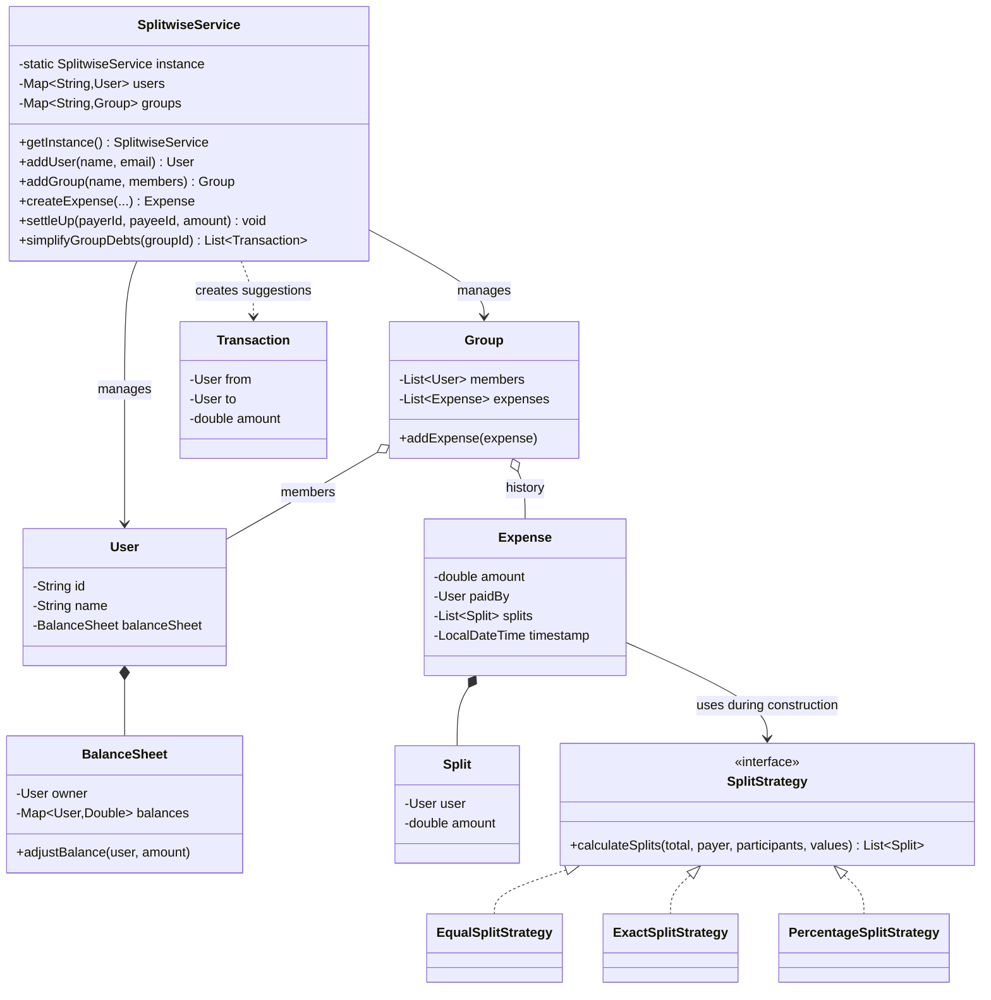
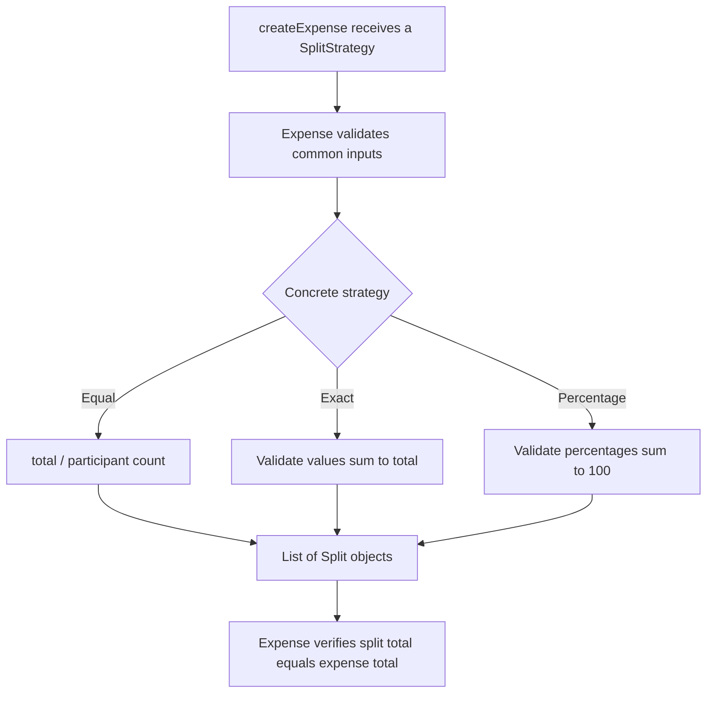
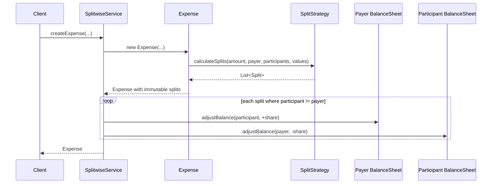
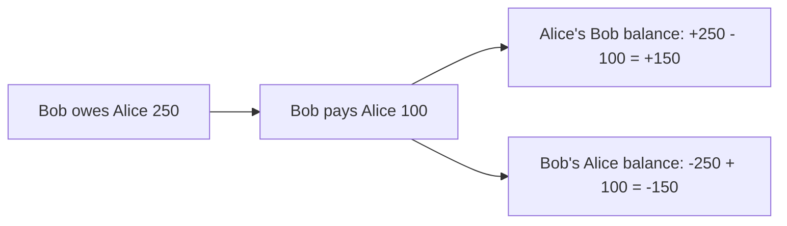
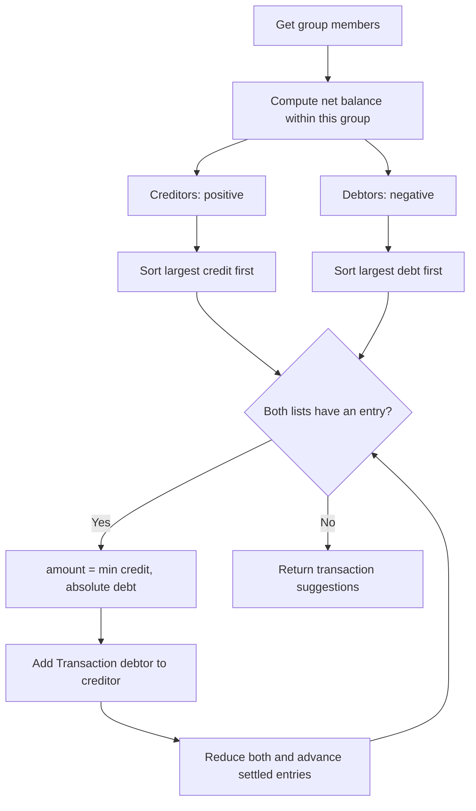

# Splitwise — Low-Level Design Interview Guide

> Scope: the implementation in this folder. This guide is written in simple, interview-style English for an SDE-2 LLD discussion.

---

## 1. How to open the interview (Problem Statement)

When the interviewer says *"Design Splitwise"*, restate the problem in your own words before writing any code. This shows you can convert an ambiguous prompt into concrete scope.

**In your own words, say something like:**

> "Splitwise is an expense-sharing app. A group of people (friends, roommates, colleagues) incur shared expenses. One person pays the bill, but the cost should be split among the participants — equally, by exact amounts, or by percentage. The system needs to track who owes whom how much, let two people settle up, and be able to simplify a tangled web of debts into the minimum number of payments."

Then **clarify scope with the interviewer** — this is the single most important signal in an LLD round.

### Functional Requirements (what I confirmed with the interviewer)
1. Users can be added to the system.
2. Users can be grouped (e.g., "Goa Trip", "Flatmates").
3. Any user can add an **expense**, specifying who paid and who the participants are.
4. An expense can be split in multiple ways:
    - **Equal** — split evenly among participants.
    - **Exact** — payer specifies the exact amount each participant owes.
    - **Percentage** — payer specifies what % each participant owes (must sum to 100).
5. The system maintains a running **balance** between every pair of users.
6. A user can view their own **balance sheet** — who owes them, and whom they owe.
7. Users can **settle up** (record a payment) to clear/reduce a balance.
8. Within a group, the system can **simplify debts** — reduce a chain of IOUs into the minimum number of transactions.

### Non-Functional Requirements
1. **Extensibility** — adding a new split type (e.g., "split by shares") shouldn't touch existing code.
2. **Consistency** — a balance update must be atomic; concurrent expense creation shouldn't corrupt balances.
3. **Single source of truth** — there should be one global service to talk to, not scattered state.

### Explicitly out of scope (say this out loud — it shows maturity)
- Real payment gateway integration (settleUp is just a ledger entry).
- Currency conversion / multi-currency.
- Notifications, auth, persistence (DB) — assume in-memory for the interview.

---

## 2. Requirements and public APIs

| Requirement | API |
|---|---|
| Add a user | `addUser(name, email)` |
| Add a group | `addGroup(name, members)` |
| Create an expense | `createExpense(description, amount, paidBy, participants, strategy, splitValues)` |
| Show a user's balances | `showBalanceSheet(userId)` |
| Record a settlement | `settleUp(payerId, payeeId, amount)` |
| Get group settlement suggestions | `simplifyGroupDebts(groupId)` |

The main design goal is extensibility: adding a new split type must not require changing the existing expense workflow.

## 3. Domain model

| Class | Responsibility |
|---|---|
| `User` | User identity and that user’s `BalanceSheet`. |
| `Group` | Named members and an expense history. |
| `Expense` | Immutable record of a paid bill and its calculated shares. |
| `Split` | One participant’s amount in one expense. |
| `BalanceSheet` | Net signed balances between its owner and other users. |
| `Transaction` | A suggested payment from one user to another. |
| `SplitStrategy` | Contract for calculating expense shares. |
| `SplitwiseService` | Coordinates all use cases. |


```mermaid
classDiagram
    class SplitwiseService {
        -static SplitwiseService instance
        -Map~String,User~ users
        -Map~String,Group~ groups
        +getInstance() SplitwiseService
        +addUser(name, email) User
        +addGroup(name, members) Group
        +createExpense(...) Expense
        +settleUp(payerId, payeeId, amount) void
        +simplifyGroupDebts(groupId) List~Transaction~
    }
    class User {
        -String id
        -String name
        -BalanceSheet balanceSheet
    }
    class BalanceSheet {
        -User owner
        -Map~User,Double~ balances
        +adjustBalance(user, amount)
    }
    class Group {
        -List~User~ members
        -List~Expense~ expenses
        +addExpense(expense)
    }
    class Expense {
        -double amount
        -User paidBy
        -List~Split~ splits
        -LocalDateTime timestamp
    }
    class Split {
        -User user
        -double amount
    }
    class Transaction {
        -User from
        -User to
        -double amount
    }
    class SplitStrategy {
        <<interface>>
        +calculateSplits(total, payer, participants, values) List~Split~
    }
    class EqualSplitStrategy
    class ExactSplitStrategy
    class PercentageSplitStrategy

    SplitwiseService --> User : manages
    SplitwiseService --> Group : manages
    User *-- BalanceSheet
    Group o-- User : members
    Group o-- Expense : history
    Expense *-- Split
    Expense --> SplitStrategy : uses during construction
    SplitStrategy <|.. EqualSplitStrategy
    SplitStrategy <|.. ExactSplitStrategy
    SplitStrategy <|.. PercentageSplitStrategy
    SplitwiseService ..> Transaction : creates suggestions
```

## 4. The key ledger decision: signed pairwise balances

Each user owns a `BalanceSheet`, implemented as `Map<User, Double>`. The key is the other user. The sign has one fixed meaning:

- Positive: the other user owes the owner.
- Negative: the owner owes the other user.
- No entry: those two users are settled.

If Alice pays `$1,000` for Alice, Bob, Charlie, and David, every share is `$250`:

```text
Alice's sheet:   Bob +250, Charlie +250, David +250
Bob's sheet:     Alice -250
Charlie's sheet: Alice -250
David's sheet:   Alice -250
```

For every non-payer share, `createExpense` updates both sides:

```java
paidBy.getBalanceSheet().adjustBalance(participant, share);
participant.getBalanceSheet().adjustBalance(paidBy, -share);
```

This symmetric update keeps the ledger consistent. `adjustBalance` merges an amount into the existing balance and removes entries within `0.01` of zero, avoiding tiny floating-point leftovers.

## 5. Splitting an expense: Strategy pattern

The changing part of this problem is the rule for dividing an amount. The code therefore uses `SplitStrategy`, not a large `if/else` chain.


```mermaid
flowchart TD
    A[createExpense receives a SplitStrategy] --> B[Expense validates common inputs]
    B --> C{Concrete strategy}
    C -->|Equal| D[total / participant count]
    C -->|Exact| E[Validate values sum to total]
    C -->|Percentage| F[Validate percentages sum to 100]
    D --> G[List of Split objects]
    E --> G
    F --> G
    G --> H[Expense verifies split total equals expense total]
```

### Equal split

`EqualSplitStrategy` gives every participant `totalAmount / participantCount`. Example: `$1,000 / 4 = $250` each.

### Exact split

`ExactSplitStrategy` accepts one amount per participant. It verifies count equality, non-negative amounts, and that their sum equals the total within `0.01`. Example: `$370` can be split as `[120, 250]`.

### Percentage split

`PercentageSplitStrategy` accepts one percentage per participant. It verifies each is between 0 and 100 and that the total is 100. It then calculates `total * percentage / 100`. Example: `$500` at `[40, 30, 30]` becomes `$200`, `$150`, `$150`.

How I would explain extensibility:

> “To support shares-based splitting, I would add `SharesSplitStrategy implements SplitStrategy`. It would calculate each share from `total × userShares / totalShares`. Existing expense and service code would not change.”

That is the Open/Closed Principle in practice.

## 6. Flow: create an expense

`SplitwiseService.createExpense` constructs an `Expense`, lets its strategy calculate shares, then applies each non-payer share to both balance sheets.


```mermaid
sequenceDiagram
    participant C as Client
    participant S as SplitwiseService
    participant E as Expense
    participant ST as SplitStrategy
    participant PB as Payer BalanceSheet
    participant UB as Participant BalanceSheet

    C->>S: createExpense(...)
    S->>E: new Expense(...)
    E->>ST: calculateSplits(amount, payer, participants, values)
    ST-->>E: List<Split>
    E-->>S: Expense with immutable splits
    loop each split where participant != payer
        S->>PB: adjustBalance(participant, +share)
        S->>UB: adjustBalance(payer, -share)
    end
    S-->>C: Expense
```

`Expense` validates description, positive amount, payer, participants, and strategy. It uses `List.copyOf` for its splits, so the calculated list cannot be changed through the returned reference.

## 7. Flow: settle up

If Bob owes Alice `$250` and pays `$100`, the debt should become `$150`.


```mermaid
flowchart LR
    A[Bob owes Alice 250] --> B[Bob pays Alice 100]
    B --> C[Alice's Bob balance: +250 - 100 = +150]
    B --> D[Bob's Alice balance: -250 + 100 = -150]
```

The method rejects a non-positive amount, same payer/payee, and a payment that exceeds the payer’s debt. Then it does:

```java
payer.getBalanceSheet().adjustBalance(payee, amount);
payee.getBalanceSheet().adjustBalance(payer, -amount);
```

This follows the sign convention: Bob’s negative balance moves toward zero by adding a positive amount; Alice’s positive balance moves toward zero by subtracting it.

## 8. Simplifying group debts

Pairwise balances can form unnecessary chains. For this group-only net position:

```text
Alice +300, David +50, Bob -200, Charlie -150
```

Positive members must receive money; negative members must pay it. The code:

1. Calculates every member’s net balance against **only other users in that group**.
2. Separates creditors (`> 0.01`) and debtors (`< -0.01`).
3. Sorts creditors by largest credit and debtors by largest debt.
4. Matches the largest debtor with the largest creditor for `min(credit, debt)`.
5. Advances the pointer for anyone now settled.


```mermaid
flowchart TD
    A[Get group members] --> B[Compute net balance within this group]
    B --> C[Creditors: positive]
    B --> D[Debtors: negative]
    C --> E[Sort largest credit first]
    D --> F[Sort largest debt first]
    E --> G{Both lists have an entry?}
    F --> G
    G -->|Yes| H[amount = min credit, absolute debt]
    H --> I[Add Transaction debtor to creditor]
    I --> J[Reduce both and advance settled entries]
    J --> G
    G -->|No| K[Return transaction suggestions]
```

The example gives:

```text
Bob pays Alice 200
Charlie pays Alice 100
Charlie pays David 50
```

Time complexity is `O(n log n)` for `n` group members, mainly because of sorting; matching is linear. The method is intentionally read-only: it returns recommended `Transaction` objects and does not modify the balance sheets.

Interview nuance: this greedy method is a strong practical simplification, but it is not a proof of the globally minimum number of transactions for every arbitrary debt graph. Strict global minimization is harder.

## 9. Patterns and principles actually present

| Pattern / principle | Where | Benefit |
|---|---|---|
| Strategy | `SplitStrategy` and three implementations | Split rules are interchangeable and extensible. |
| Singleton | Static eager `SplitwiseService` instance | One central in-memory application service. |
| Facade-like service | `SplitwiseService` | Clients call simple use-case methods instead of coordinating objects. |
| Single Responsibility | Balance sheet, expense, strategies, and service have focused jobs | Easier maintenance and testing. |
| Open/Closed | Strategy interface | Add split types by adding classes. |
| Dependency Inversion | `Expense` accepts `SplitStrategy` interface | It does not depend on a concrete split implementation. |
| Immutability | `Expense`, `Split`, `Transaction`, and user fields are final | Recorded values are protected from accidental change. |

Do not claim Factory, Observer, Repository, or Builder patterns: they are not implemented in this code.

## 10. Concurrency and production discussion

The implementation is safe enough for this in-memory demo:

- `users` and `groups` are `ConcurrentHashMap`s.
- `createExpense`, `settleUp`, and `simplifyGroupDebts` are synchronized on the service.
- `BalanceSheet` methods are synchronized and `getBalances` returns a defensive copy.

The trade-off is coarse locking: unrelated expense creation is serialized. In production, I would persist immutable expense/payment records and update materialized balances in one database transaction, using exact money values (`long` paise/cents or `BigDecimal`) instead of `double`.

## 11. Important current boundaries

- `createExpense` has no group parameter, so it cannot verify group membership. The caller later uses `group.addExpense(expense)`.
- `simplifyGroupDebts` filters pairwise balances to the selected group members, so outside-group balances do not affect its suggestions.
- Removing a group member does not validate outstanding balances.
- The service does not keep a global expense history; groups do when the caller attaches an expense.

Calling out these boundaries shows that you understand both the code and the product gaps.

## 12. Strong closing answer

> “I modelled users, groups, expenses, and per-user balance sheets. A balance sheet stores one signed net balance for every other user, and every expense updates both sides symmetrically. The variable part—how an amount is divided—is behind a `SplitStrategy` interface, so equal, exact, and percentage splits are interchangeable and new split types are easy to add. `SplitwiseService` exposes creation, balance viewing, settlement, and group-debt simplification. For simplification, I compute net balances within the group and greedily match the biggest debtor with the biggest creditor. For production I would use exact money types, persisted ledger records, and finer-grained transactions.”

## 13. File map

| File | Concept |
|---|---|
| `SplitwiseService.java` | Service orchestration, Singleton, settlement, debt simplification. |
| `entities/BalanceSheet.java` | Signed pairwise ledger. |
| `entities/Expense.java` | Validation and immutable calculated splits. |
| `entities/Group.java` | Membership and expense history. |
| `entities/User.java` | Identity and balance-sheet ownership. |
| `entities/Split.java` | One participant share. |
| `entities/Transaction.java` | Suggested payment. |
| `strategy/*.java` | Equal, exact, and percentage Strategy implementations. |
| `SplitwiseDemo.java` | End-to-end examples of all supported use cases. |
