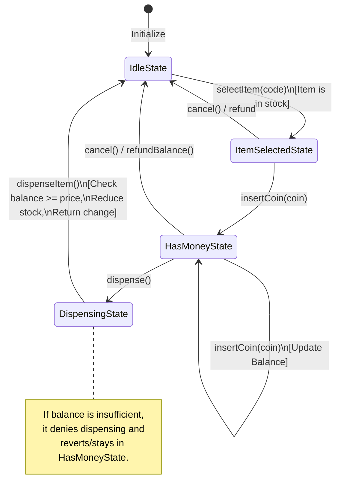
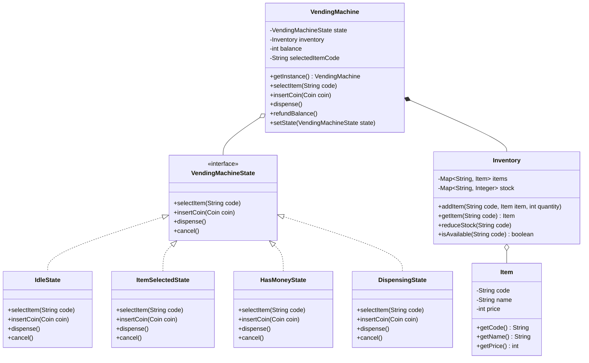

# Vending Machine - Low Level Design (LLD)

This guide provides a detailed, interview-ready explanation for the **Vending Machine Low-Level Design (LLD)** problem. It is structured to help you clearly articulate the problem, the core architecture, design patterns, and logical flow during an SDE-2 interview (e.g., at Microsoft).

---

## 1. Problem Statement

We need to design the software for a Vending Machine. The machine should allow users to purchase items by selecting a product and inserting coins.

**Core Requirements:**
- The vending machine contains an inventory of items (e.g., Coke, Pepsi, Water) with varying prices and stock quantities.
- A user can select an item by its code (e.g., "A1").
- A user can insert coins (Penny, Nickel, Dime, Quarter) to pay for the selected item.
- If the inserted amount is sufficient and the item is in stock, the machine dispenses the item.
- The machine must return the exact change if the user inserted more money than the item's price.
- The user can cancel the transaction and get a full refund before the item is dispensed.
- The machine must handle invalid actions gracefully (e.g., trying to dispense without paying, or selecting an item that is out of stock).

---

## 2. Interview Strategy & Approach

*When answering this in an interview, start by acknowledging the complexity of state management.*

**Your pitch:**
> "The biggest challenge in designing a Vending Machine is managing its states. A user shouldn't be able to insert money without selecting an item first, and they shouldn't be able to dispense an item without inserting enough money. If we use standard `if-else` or `switch` statements to validate every action against the machine's current status, the code will quickly become a monolithic, unmaintainable mess. 
> 
> To solve this elegantly, I will use the **State Design Pattern**. By representing each phase of the transaction as a distinct 'State' class, we enforce rules implicitly and make the system highly modular and open for extension."

---

## 3. Design Principles & Patterns Used

1. **State Design Pattern (Behavioral)**: 
   This is the backbone of our solution. The Vending Machine delegates all user actions (select item, insert coin, dispense, cancel) to its current State object. If an action is invalid for the current state, the state class throws an exception or handles it safely, avoiding complex conditional logic in the main Vending Machine class.
   
2. **Singleton Pattern (Creational)**:
   The `VendingMachine` itself is implemented as a Singleton (using a static instance). This makes sense because a physical vending machine is a single entity; we want a centralized point of truth for the inventory and current state.

3. **Single Responsibility Principle (SOLID)**:
   - The `Inventory` class only manages stock (adding, reducing, checking availability).
   - Each specific `State` class only governs the rules for that exact phase of the transaction.
   - The `VendingMachine` acts merely as a context holding the current state, balance, and inventory.

---

## 4. State Transitions & Flow Chart

The Vending Machine transitions through four primary states:
1. **IdleState**: The machine is waiting for a user to select an item.
2. **ItemSelectedState**: An item is chosen, waiting for the user to insert money.
3. **HasMoneyState**: The user has inserted coins. They can insert more coins or trigger the dispense action.
4. **DispensingState**: Temporary state where the system validates payment, drops the item, returns change, and then immediately resets back to `IdleState`.

### Logical Flow Diagram



### Class Diagram



---

## 5. Core Components & Implementation Walkthrough

### 1. `VendingMachineState` (Interface)
Defines the contract for all possible actions a user can take.
```java
public interface VendingMachineState {
    void selectItem(String code);
    void insertCoin(Coin coin);
    void dispense();
    void cancel();
}
```

### 2. State Implementations
- **`IdleState`**: 
  - `selectItem(code)`: Validates if the item exists and is in stock. If yes, sets the selected item in the context and transitions the machine to `ItemSelectedState`.
  - `insertCoin()`, `dispense()`: Throws an error (cannot do these in Idle state).
- **`ItemSelectedState`**:
  - `insertCoin(coin)`: Adds the coin value to the balance and transitions to `HasMoneyState`.
- **`HasMoneyState`**:
  - `insertCoin(coin)`: Simply adds to the ongoing balance.
  - `dispense()`: Transitions to `DispensingState`.
- **`DispensingState`**:
  - Automatically triggers the internal `dispenseItem()` logic. It checks if `balance >= item.getPrice()`. If true, it reduces stock, prints the dispensed item, calculates and returns `balance - price` as change, and resets the machine to `IdleState`.

### 3. `Inventory` and `Item`
- `Item`: A simple POJO holding `code` (e.g., "A1"), `name` (e.g., "Coke"), and `price`.
- `Inventory`: Uses a `Map<String, Item>` to map codes to items, and a `Map<String, Integer>` to map codes to their available quantity. It provides clean methods like `reduceStock(code)` and `isAvailable(code)`.

### 4. `VendingMachine` (The Context)
Holds the reference to the `currentVendingMachineState`, the `Inventory`, and tracks the ongoing `balance` and `selectedItemCode`. When a state wants to transition, it calls `vendingMachine.setState(new SomeOtherState(vendingMachine))`.

---

## 6. Interview Execution (How to drive the conversation)

1. **Start with the entities**: Mention `Item`, `Coin` (Enum), and `Inventory`. This shows you are thinking about data modeling first.
2. **Introduce the core problem**: Explain the state-transition complexity.
3. **Propose the State Pattern**: Draw or describe the 4 states (`Idle`, `ItemSelected`, `HasMoney`, `Dispense`). This is the "Aha!" moment for the interviewer.
4. **Walk through a happy path**: 
   > *"User is at `IdleState` -> selects 'A1' (Coke). Machine verifies `Inventory` and moves to `ItemSelectedState` -> User inserts a Dime. Machine moves to `HasMoneyState`. User inserts a Quarter. Machine stays in `HasMoneyState` and updates balance to 35 cents. -> User presses Dispense. Machine moves to `DispensingState`. Price is 25 cents. It dispenses Coke, returns 10 cents change, and resets to `IdleState`."*
5. **Discuss Edge Cases**:
   - *What if the item is out of stock?* -> `IdleState` will reject the `selectItem` call.
   - *What if they don't insert enough money?* -> `DispensingState` will check the balance, reject the dispense, and revert back to `HasMoneyState` allowing them to add more coins.
   - *What if they cancel?* -> If in `HasMoneyState`, the `cancel()` method triggers a full refund of the current balance and resets to `IdleState`.

## 7. Summary
By structuring your answer around the **State Design Pattern**, you demonstrate a deep understanding of object-oriented design, separation of concerns, and clean code principles—exactly what Microsoft and other top tech companies look for in an SDE-2 candidate.
