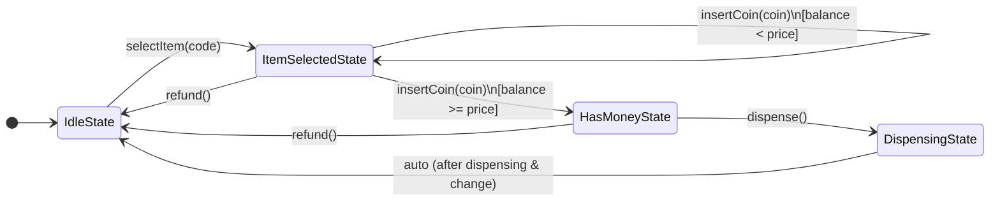

# Vending Machine Low-Level Design (LLD)

This document provides a comprehensive, interview-ready guide for the Vending Machine Low-Level Design (LLD) problem. It is tailored for a Microsoft SDE-2 interview, focusing on clarity, design principles, and effective communication.

---

## 1. Problem Statement

Design a software system for a Vending Machine. The machine should allow users to:
1. View available items and their prices.
2. Select an item.
3. Insert money (coins/notes) to pay for the selected item.
4. Dispense the item if the inserted amount is sufficient.
5. Return any extra change after dispensing.
6. Cancel the transaction and request a full refund at any point before dispensing.

---

## 2. Requirements & Clarifications (Interview Style)

*When asked this question, start by confirming the scope with the interviewer. It shows product thinking and clarity.*

- **Interviewer/User actions:** Can the user select multiple items in one transaction? *(Assumption: No, one item per transaction for simplicity).*
- **Inventory:** Does the machine hold multiple quantities of different items? *(Yes, we need an Inventory manager).*
- **Currency:** What denominations are supported? *(Assumption: Coins like Nickel, Dime, Quarter).*
- **Concurrency:** Do we need to handle multiple simultaneous transactions? *(No, a physical vending machine handles one user at a time).*

---

## 3. Design Patterns Used

*This is the most critical part of your SDE-2 interview. Explicitly mention these patterns before writing code.*

1. **State Design Pattern (Behavioral):** 
   - **Why?** A vending machine behaves differently based on its current phase (e.g., you can't dispense an item if you haven't inserted money; you can't insert money if no item is selected). 
   - Using the State pattern encapsulates state-specific behavior into separate classes. This avoids massive, unmaintainable `if-else` or `switch` blocks in the main class and adheres strictly to the **Open-Closed Principle (OCP)**.
2. **Singleton Pattern (Creational):** 
   - **Why?** The `VendingMachine` acts as the central coordinator for the physical hardware. There should only be one instance of the machine system running at any given time.

---

## 4. System Architecture & Flow

### State Transition Diagram

*Draw or explain this flow to the interviewer to show you have visualized the system lifecycle.*

---

## 5. Core Components & Classes

1. **`VendingMachine` (Context Class):** 
   - Acts as a Singleton.
   - Holds references to the `Inventory`, the current `balance`, the `selectedItemCode`, and the `currentVendingMachineState`.
   - Delegates all user actions (like `insertCoin()`, `dispense()`) to the current state object.

2. **`Inventory`:**
   - Manages the stock. Uses Maps (HashMaps) to store Item details and their corresponding quantities.

3. **`VendingMachineState` (Abstract Class / Interface):**
   - Defines the operations: `insertCoin()`, `selectItem()`, `dispense()`, and `refund()`.

4. **Concrete States:**
   - `IdleState`
   - `ItemSelectedState`
   - `HasMoneyState`
   - `DispensingState`

---

## 6. Detailed Walkthrough of States

### 1. `IdleState`
- **Purpose:** The machine is waiting for a user to start a transaction.
- **Behavior:** 
  - If a user tries to insert a coin or dispense, it prints an error ("Please select an item first").
  - `selectItem(code)`: Checks if the item is in the `Inventory`. If available, it transitions the machine to `ItemSelectedState`.

### 2. `ItemSelectedState`
- **Purpose:** An item is selected, and the machine is waiting for sufficient payment.
- **Behavior:**
  - `insertCoin()`: Adds money to the temporary balance. If the `balance >= item.price`, it automatically transitions to `HasMoneyState`.
  - `refund()`: Refunds any inserted coins, resets the balance, and goes back to `IdleState`.
  
### 3. `HasMoneyState`
- **Purpose:** Sufficient payment has been received, ready to dispense.
- **Behavior:**
  - `dispense()`: Transitions to `DispensingState` and triggers the dispensing mechanism.
  - `refund()`: The user changes their mind at the last second. Returns full balance and goes to `IdleState`.

### 4. `DispensingState`
- **Purpose:** The physical mechanism of dispensing the product and returning change.
- **Behavior:**
  - Blocks any user inputs (insert coin, select item, refund are not allowed while the motor is spinning).
  - Deducts the item price from the balance, drops the item, returns the remaining balance as change, and automatically transitions back to `IdleState`.

---

## 7. The "Interview Pitch" (How to explain it verbally)

*Use this narrative script during your interview:*

> "To design the Vending Machine, I'll start by defining the core entities: `Item`, `Inventory`, and `Coin`. 
>
> When considering the core logic, I notice that the machine's behavior heavily depends on what phase of the transaction we are in. For example, the `dispense` button does nothing if no money is inserted. If I use simple `if-else` blocks for this, the code will become extremely complex and hard to maintain as new features are added.
> 
> Therefore, my primary architectural choice is the **State Design Pattern**. I'll define a `VendingMachineState` interface with actions like `insertCoin`, `selectItem`, `dispense`, and `refund`. 
> Then, I'll create four concrete states: `IdleState`, `ItemSelectedState`, `HasMoneyState`, and `DispensingState`. 
>
> The main `VendingMachine` class will just be a Context class that delegates the user's actions to its current state object. It will also be a **Singleton** because we only want one central controller managing the hardware inventory and state."

---

## 8. Extensibility (Bonus points for SDE-2)

If the interviewer asks: *"How would you extend this?"*
- **Adding Card Payments:** Create a PaymentStrategy interface (Strategy Pattern) to support Coins, Cash, and Credit Cards.
- **Multiple item selections:** Change the `selectedItemCode` to a `List<String>` or a shopping cart object, and update the target price in the `ItemSelectedState`.
